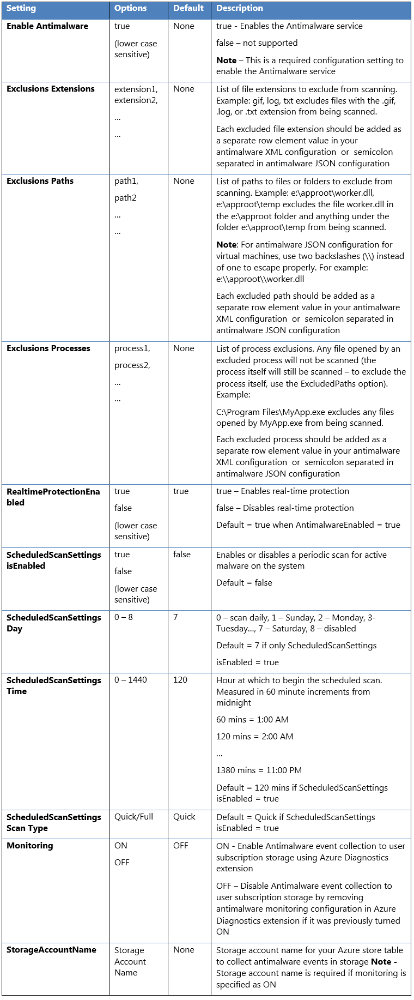
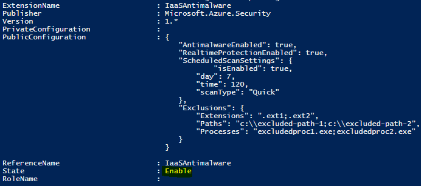
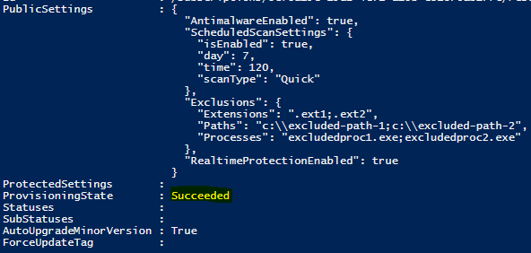
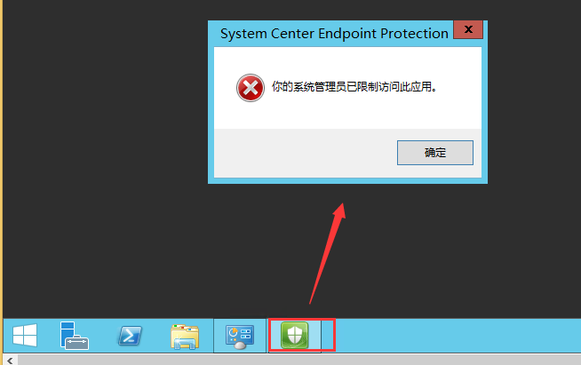

<properties
    pageTitle="为订阅内虚拟机批量安装并配置 Microsoft Anti-Malware 扩展"
    description="为订阅内虚拟机批量安装并配置 Microsoft Anti-Malware 扩展"
    service=""
    resource=""
    authors="Steve Shi"
    displayOrder=""
    selfHelpType=""
    supportTopicIds=""
    productPesIds=""
    resourceTags="Virtual Machines Windows, Anti-Malware, PowerShell"
    cloudEnvironments="MoonCake" />
<tags
    ms.service="virtual-machines-windows-aog"
    ms.date=""
    wacn.date="05/25/2017" />

# 为订阅内虚拟机批量安装并配置 Microsoft Anti-Malware 扩展

本文提供了对订阅内的 Windows 经典部署虚拟机和资源管理器部署虚拟机执行批量安装并配置 Microsoft Anti-Malware 扩展的 PowerShell 脚本。

关于安装 Windows 虚拟机扩展的先决条件，请参考 [适用于 Windows 的虚拟机扩展和功能](/documentation/articles/virtual-machines-windows-extensions-features/)。

## 准备扩展的配置

请将配置根据格式储存成 .json 文件或 .xml 文件。如需更改配置内容，请参照后文的配置字段说明。

### Json 格式样例

    {
        "AntimalwareEnabled": true,
        "RealtimeProtectionEnabled": true,
        "ScheduledScanSettings": {
        "isEnabled": true,
                    "day": 7,
                    "time": 120,
                    "scanType": "Quick"
        },
        "Exclusions": {
                    "Extensions": ".ext1;.ext2",
                    "Paths": "c:\\excluded-path-1;c:\\excluded-path-2",
                    "Processes": "excludedproc1.exe;excludedproc2.exe"
        }
    }

### XML 格式样例

    <AntimalwareConfig>
        <AntimalwareEnabled>true</AntimalwareEnabled> 
        <RealtimeProtectionEnabled>true</RealtimeProtectionEnabled>     
        <ScheduledScanSettings isEnabled="true" day="7" time="120" scanType="Quick"/> 
        <Exclusions>
            <Extensions>
                <Extension>.ext1</Extension>
                <Extension>.ext2</Extension>
            </Extensions>
            <Paths>
                <Path>c:\excluded-path-1</Path>
                <Path>c:\excluded-path-2</Path>
            </Paths>
            <Processes>
                <Process>excludedproc1.exe</Process>
                <Process>excludedproc2.exe</Process>
            </Processes>
        </Exclusions>
        <Monitoring>ON</Monitoring>
        <StorageAccountName>contosostorage</StorageAccountName>
    </AntimalwareConfig>

## 配置字段说明

## PowerShell 脚本

预定义订阅号、储存 Anti-Malware 扩展日志的存储账号和本地电脑上 .json 配置文件的存放位置。以下信息按实际环境配置。

    $subscriptionid = "xxxxxxx-xxxx-xxxx-xxxx-xxxxxxxxxxxx"
    $diagstorageaccountname = "xxxxxxxxx"
    $configPath = "C:\Users\Desktop\antimalware.json"

## 通过 PowerShell 登陆 Azure

    $cred = Get-Credential
    Import-Module azure
    Import-Module azurerm.profile
    Add-AzureAccount -Environment azurechinacloud -Credential $cred
    Login-AzureRmAccount -EnvironmentName azurechinacloud -Credential $cred
    Get-AzureSubscription -SubscriptionId $subscriptionid | Select-AzureSubscription
    Get-AzureRmSubscription -SubscriptionId $subscriptionid | Select-AzureRmSubscription

## 抓取经典部署 Windows 虚拟机并安装扩展

    #Grab all classic VMs from subscription
    $classicVM = Get-AzureVM
    $classicVMnum = $classicVM.count
    #specify storage context to store monitoring events
    $StorageContext = New-AzureStorageContext -StorageAccountName $diagstorageaccountname -StorageAccountKey (Get-AzureStorageKey -StorageAccountName $diagstorageaccountname).Primary
    #Install antimalware extension for all classic Windows VMs that are in started status
    For ($i=0; $i -lt $classicVMnum; $i++) {
        if (($classicVM[$i].Status -eq "ReadyRole") -and ($classicvm[$i].VM.OSVirtualHardDisk.OS -eq "Windows")) {
            $ifinstalled = $null;
            $ifinstalled = Get-AzureVMMicrosoftAntimalwareExtension -vm $classicvm[$i];
            if ($ifinstalled -eq $null) {
                $result = Set-AzureVMMicrosoftAntimalwareExtension -VM $classicVM[$i] -AntimalwareConfigFile $configPath -Monitoring ON -StorageContext $StorageContext | Update-AzureVM
                Write-Host "The installation of anti-malware for VM" $classicVM[$i].InstanceName "in cloud service" $classicVM[$i].ServiceName $result.OperationStatus
            } else {
                Write-Host "VM" $classicVM[$i].InstanceName "in cloud service" $classicVM[$i].ServiceName "already has anti-malware plugin installed"
            }
        }
    }

## 抓取资源管理器部署 Windows 虚拟机并安装扩展

    #Grab all ARM VMs
    $ARMVM = Get-AzureRmVM
    $ARMVMnum = $ARMVM.Count
    #read configuration string from json file
    $settingString = [IO.File]::ReadAllText($configPath);

    #get latest version from extension info
    $allversions = @((Get-AzureRmVMExtensionImage -Location "chinaeast" -PublisherName "Microsoft.Azure.Security" -Type "IaaSAntimalware").Version)
    $versionstring = $allVersions[($allVersions.count)-1].Split(".")[0] + "." + $allVersions[($allVersions.count)-1].Split(".")[1]

    #Install antimalware extension for all ARM Windows VMs that are in started status, except windows2016.
    For ($j = 0; $j -lt $ARMVMnum; $j++) {
        $VMstatus = Get-azurermvm -Name $ARMVM[$j].Name -ResourceGroupName $ARMVM[$j].ResourceGroupName -status
        if (($VMstatus.Statuses[1].Code -eq "PowerState/running") -and ($ARMVM[$j].StorageProfile.OsDisk.OsType -eq "Windows") -and ($ARMVM[$j].StorageProfile.ImageReference.Sku -notlike "2016-*")) {
            $ifinstalled = $null;
            $ifinstalled = Get-AzureRmVMExtension -ResourceGroupName $ARMVM[$j].ResourceGroupName -VMName $ARMVM[$j].Name -Name "IaaSAntimalware" -ErrorAction SilentlyContinue
            if ($ifinstalled -eq $null) {
                $result = Set-AzureRmVMExtension -ResourceGroupName $ARMVM[$j].ResourceGroupName -VMName $ARMVM[$j].Name -Location $ARMVM[$j].Location -Name "IaaSAntimalware" -Publisher "Microsoft.Azure.Security" -ExtensionType "IaaSAntimalware" -TypeHandlerVersion $versionstring -SettingString $settingString
                Write-Host "The installation of anti-malware for VM" $ARMVM[$j].Name "in resource group" $ARMVM[$j].ResourceGroupName "was" $result.StatusCode "with reason" $result.ReasonPhrase
            } else {
                Write-Host "VM" $ARMVM[$j].Name "in resource group" $ARMVM[$j].ResourceGroupName "already has anti-malware plugin installed"
            }
        }
    }

## 此示例脚本的限制

1. 请用户先在非生产环境中测试此脚本，确认可用且无其他问题后再部署到生产环境中。
2. Anti-Malware 扩展不兼容 Windows Server 2016，原因是新一代系统自带 Windows Defender，功能与 Anti-Malware 扩展冲突，导致安装失败。
3. 由于 Azure VM 磁盘属性的限制，经典部署模式的命令无法判别虚拟机的操作系统是否是 Windows Server 2016，所以经典部署下的 Windows Server 2016 执行此脚本时会报错。
4. 如果虚拟机曾经做过从经典部署模式迁移到资源管理器部署模式的操作，由于迁移后资源管理器虚拟机磁盘属性仍然会继承之前经典部署虚拟机的磁盘属性，资源管理器部署部分的脚本无法判别迁移后虚拟机的磁盘属性。
5. 经典部署模式的命令支持将 Anti-Malware 扩展扫描时生成的 Windows Event Log 转存到 Azure 存储账户中，而资源管理器部署模式的命令不含此配置，所以无法做到 Event Log 的转存。

## 查询 Anti-Malware 扩展的安装状态

可以使用以下命令来查询 Anti-Malware 扩展的状态和配置：

- 经典部署模式

        Get-AzureVM -ServiceName "ServiceName" -Name "VMname" | Get-AzureVMMicrosoftAntimalwareExtension

    输出：

    

- 资源管理器部署模式

        Get-AzureRmVMExtension -ResourceGroupName "ResourceGroupName" -VMName "VMName" -Name "IaaSAntimalware"

    输出：

    

## System Center Endpoint Protection 错误解决方法

在虚拟机内打开 System Center Endpoint Protection 时会弹出 “你的系统管理员已限制访问此应用” 的错误：

进入指定目录执行以下命令 :

    C:\Program Files\Microsoft Security Client> ConfigSecurityPolicy.exe cleanuppolicy.xml
