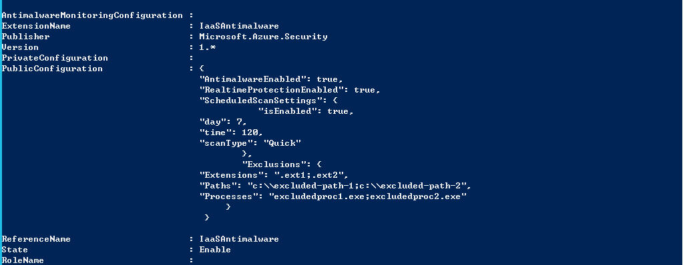
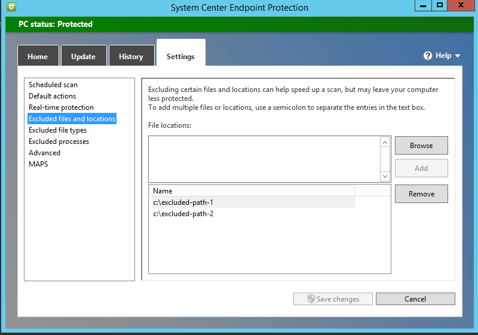
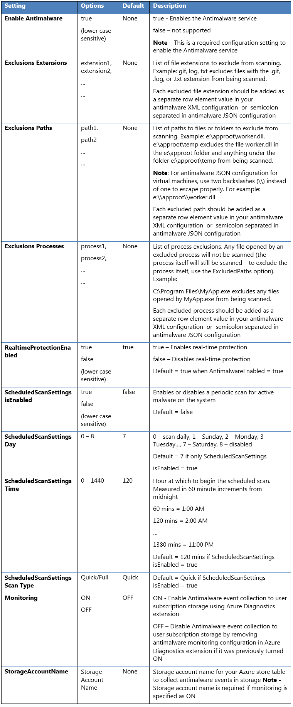
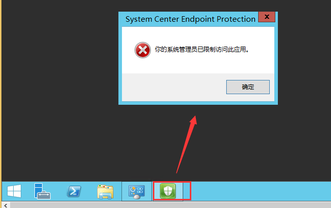
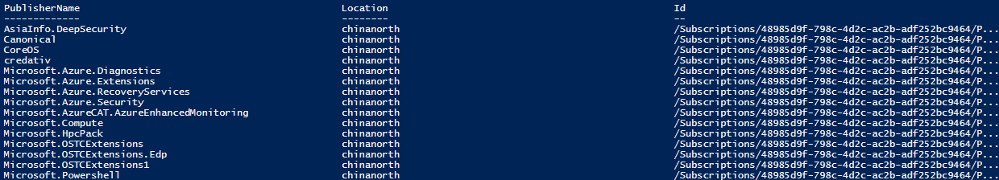
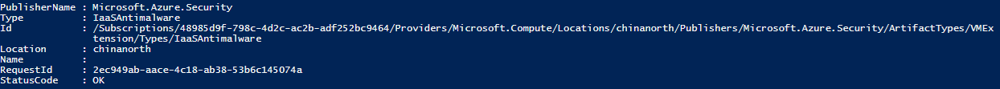
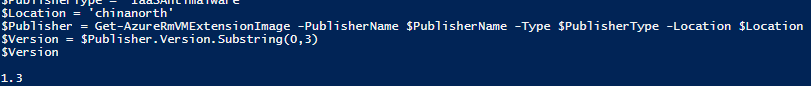

<properties
    pageTitle="Azure 虚拟机如何配置 AntiMalware"
    description="本文仅演示通过 PowerShell 方式安装并配置 AntiMalware 的过程"
    service=""
    resource="virtual-machines"
    authors=""
    displayOrder=""
    selfHelpType=""
    supportTopicIds=""
    productPesIds=""
    resourceTags="Virtual Machines, PowerShell, AntiMalware, ASM, ARM"
    cloudEnvironments="MoonCake" />
<tags
    ms.service="virtual-machines-aog"
    ms.date=""
    wacn.date="02/21/2017" />

# Azure 虚拟机如何配置 AntiMalware

本文仅演示通过 PowerShell 方式安装并配置 AntiMalware 的过程。

## 经典虚拟机

- 加载 Antimalware 扩展 :

        $vm = Get-AzureVM -ServiceName yourservicename -Name yourvmname
        Set-AzureVMExtension -Publisher Microsoft.Azure.Security -ExtensionName IaaSAntimalware -Version 1.3 -VM $vm.VM |Update-AzureVM

    此时虚拟机已经安装过 Antimalware 扩展，官方推荐使用配置文件的方式进行配置（更多的配置定义请参考后续的“[配置字段说明](#configuration)”）

- 配置样例 :

    Json:

        {
            "AntimalwareEnabled": true,
            "RealtimeProtectionEnabled": true,
            "ScheduledScanSettings": {
                    "isEnabled": true,
            "day": 7,
            "time": 120,
            "scanType": "Quick"
                    },
                    "Exclusions": {
            "Extensions": ".ext1;.ext2",
            "Paths": "c:\\excluded-path-1;c:\\excluded-path-2",
            "Processes": "excludedproc1.exe;excludedproc2.exe"
                }
        }

    XML:

        <AntimalwareConfig>
            <AntimalwareEnabled>true</AntimalwareEnabled> 
            <RealtimeProtectionEnabled>true</RealtimeProtectionEnabled>     
            <ScheduledScanSettings isEnabled="true" day="7" time="120" scanType="Quick"/> 
            <Exclusions>
                <Extensions>
                    <Extension>.ext1</Extension>
                    <Extension>.ext2</Extension>
                </Extensions>
                <Paths>
                    <Path>c:\excluded-path-1</Path>
                    <Path>c:\excluded-path-2</Path>
                </Paths>
                <Processes>
                    <Process>excludedproc1.exe</Process>
                    <Process>excludedproc2.exe</Process>
                </Processes>
            </Exclusions>
            <Monitoring>ON</Monitoring>
            <StorageAccountName>contosostorage</StorageAccountName>
        </AntimalwareConfig>

- 操作步骤：

1. 创建一个配置文件 `D:\anti.json`（本文以 Json 为例）。

2. 执行 PowerShell 命令 :

    	Get-AzureVM -ServiceName yourservicename -Name yourvmname | Set-AzureVMMicrosoftAntimalwareExtension -AntimalwareConfigFile 'D:\anti.json' | Update-AzureVM

3. 执行成功后，可以获取一下当前虚拟机的 Antimalware 的配置 :

    	Get-AzureVM -ServiceName yourservicename -Name yourvmname | get-AzureVMMicrosoftAntimalwareExtension

    

    或通过登录到虚拟机内部查看配置 :

    

## ARM虚拟机

- 加载 Antimalware 扩展

        #通过 PowerShell 加载 Antimalware 扩展，应该至少先定义一个 Antimalware 启动的配置否则无法加载成功
        ############################################################################
        $SettingsString=@{"AntimalwareEnabled" = "true"}

        Set-AzureRmVMExtension -Publisher Microsoft.Azure.Security -ExtensionType IaaSAntimalware -ResourceGroupName yourgroupname  -VMName youvmname -Name IaaSAntimalware -TypeHandlerVersion 1.3 -Location chinanorth -Settings $SettingsString

## 配置字段说明

## 关于无法在虚拟机内部打开 System Center Endpoint Protection 界面并报错 :

进入指定目录执行以下命令 :

    C:\Program Files\Microsoft Security Client>ConfigSecurityPolicy.exe cleanuppolicy.xml

## 关于如何获取最新的 ARM 虚拟机 Antimalware 镜像扩展信息的方法 : 

    #确认最新的 Antimalware 服务发布者的名称（有的时候这个名字会因为平台的更新改变）
    ####################################################
    Get-AzureRmVMImagePublisher -Location chinanorth

    #获取镜像类型信息
    ###################################################
    Get-AzureRmVMExtensionImageType -PublisherName Microsoft.Azure.Security -Location chinanorth 

    #获取镜像版本信息
    ####################################################
    $PublisherName = 'Microsoft.Azure.Security'
    $PublisherType = 'IaaSAntimalware'
    $Location = 'chinanorth'
    $Publisher = Get-AzureRmVMExtensionImage -PublisherName $PublisherName -Type $PublisherType -Location $Location 
    $Version = $Publisher.Version.Substring(0,3) 
    $Version

