<properties
                pageTitle="如何在 Azure 虚拟机里配置条带化"
                description="在 Windows Server 2012 R2 Datacenter 中配置条带化"
                services="virtual-machines"
                documentationCenter=""
                authors=""
                manager=""
                editor=""
                tags="虚拟机,Windows Server 2012 R2 Datacenter,条带化,striping"/>

<tags
                ms.service="virtual-machines-aog"
                ms.date="12/15/2016"
                wacn.date="12/15/2016"/>

# 如何在 Azure 虚拟机里配置条带化

## 什么是条带化（striping）

条带 (strip) 是把连续的数据分割成相同大小的数据块，把每段数据分别写入到阵列中的不同磁盘上的方法。简单的说，条带是一种将多个磁盘驱动器合并为一个卷的方法。 许多情况下，这是通过硬件控制器来完成的。

当多个进程同时访问一个磁盘时，可能会出现磁盘冲突。大多数磁盘系统都对访问次数（每秒的 I/O 操作，IOPS）和数据传输率（每秒传输的数据量，TPS）有限制。当达到这些限制时，后面需要访问磁盘的进程就需要等待，这时就是所谓的磁盘冲突。避免磁盘冲突是优化 I/O 性能的一个重要目标，而 I/O 性能的优化与其他资源（如 CPU 和内存）的优化有着很大的区别 ,I/O 优化最有效的手段是将 I/O 最大限度的进行平衡。  

条带化技术就是一种自动的将 I/O 的负载均衡到多个物理磁盘上的技术，条带化技术就是将一块连续的数据分成很多小部分并把他们分别存储到不同磁盘上去。这就能使多个进程同时访问数据的多个不同部分而不会造成磁盘冲突，而且在需要对这种数据进行顺序访问的时候可以获得最大程度上的 I/O 并行能力，从而获得非常好的性能。由于条带化在 I/O 性能问题上的优越表现，以致于在应用系统所在的计算环境中的多个层次或平台都涉及到了条带化的技术，如操作系统和存储系统这两个层次中都可能使用条带化技术。

**操作步骤：**  

>[AZURE.NOTE]
1.本案例基于 Windows Server 2012 R2 Datacenter。
2.请不要将临时盘( D 盘)用作条带化。  

1. 通过 Azure 门户管理新建 Windows 虚拟机。
2. 创建完毕后, 附加空白磁盘,本范例新增两块 1GB 大小的空白磁盘。 

    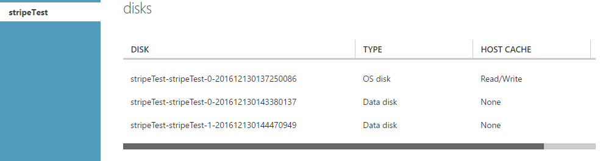

3. 附加磁盘结束以后, 通过 RDP 方式登陆虚拟机。
4. 打开磁盘管理: 开始->运行->`diskmgmt.msc`。  

    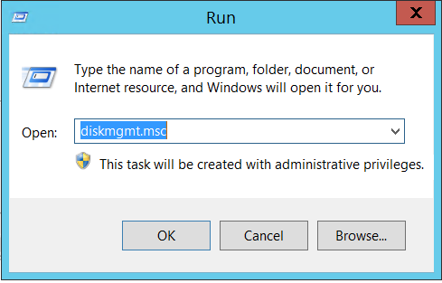  

5. 在磁盘管理界面可以看到附加的两块空白磁盘: Disk 2 和Disk 3。

    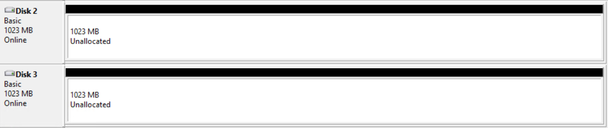

6. 选中 Disk 2, 右键选择 `New Striped Volume`,打开向导。

    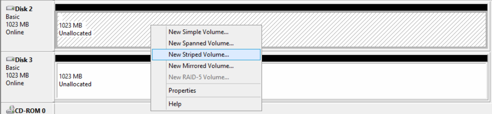
    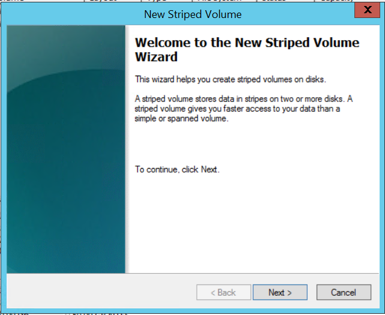

7. 点击下一步。
8. 选择左侧可用磁盘,点击添加。

    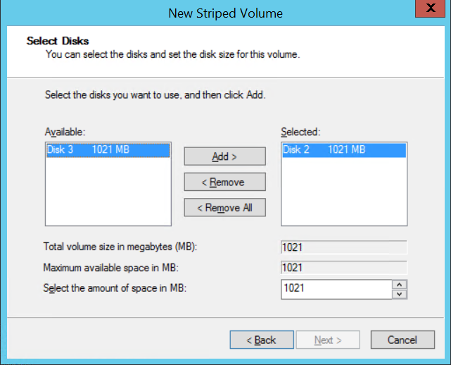
    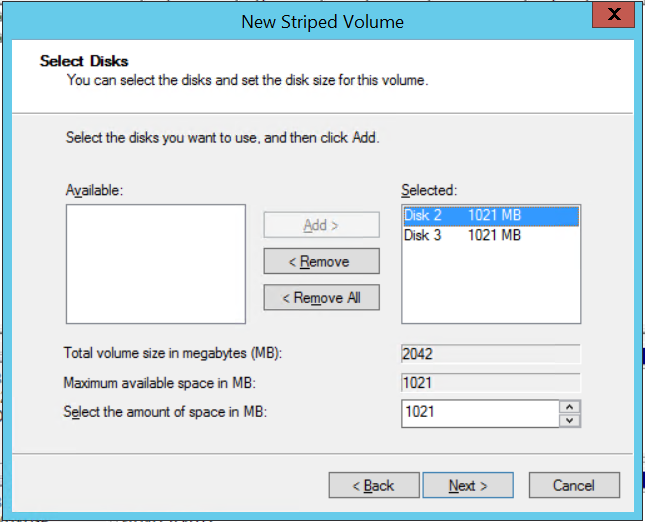

9. 点击下一步。
10. 设置盘符。

    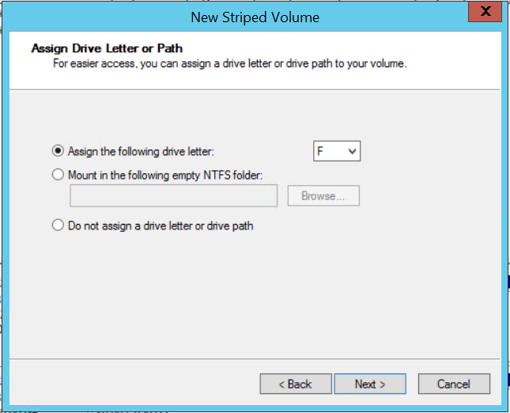

11. 设置卷标。

    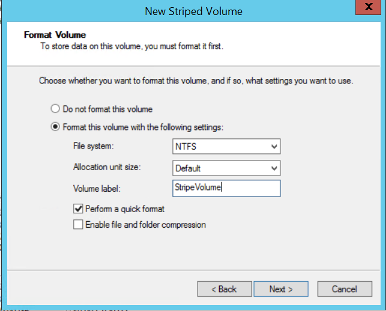

12. 格式化,完成。

    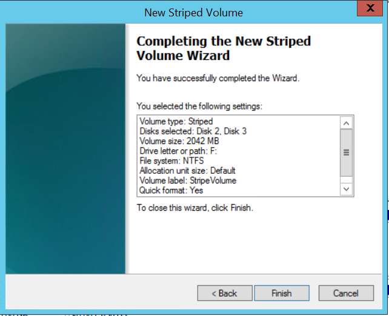

13. 打开我的电脑, 确认 F 盘是否可读写。

    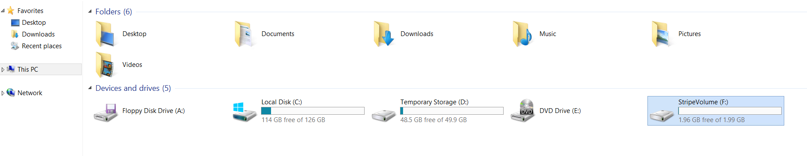

