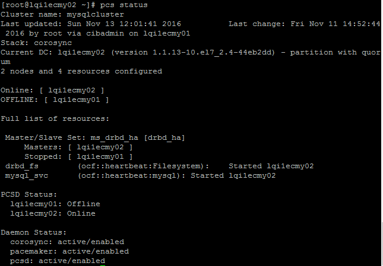

<properties
                pageTitle="使用 Load Balancer,Corosync,Pacemaker 搭建 Linux 高可用集群"
                description="使用 LB-corosync-pacemaker 搭建 Linux 高可用集群的详细步骤与测试 "
                services="virtual-machines"
                documentationCenter=""
                authors=""
                manager=""
                editor=""
                tags="Azure VM,HA,Azure LB,DRBD,MariaDB,Corosync,Pacemaker,PowerShell"/>

<tags
                ms.service="virtual-machines-aog"
                ms.date="12/23/2016"
                wacn.date="12/23/2016"/>

# 使用 Load Balancer,Corosync,Pacemaker 搭建 Linux 高可用集群

由于网络架构的原因，在一般虚拟机或物理环境中常见的用 VIP 来实现双机高可用方案，无法照搬到 Azure 平台。但利用 Azure 平台提供的负载均衡或者内部负载均衡功能，可以达到类似的效果。

本文介绍如何基于 Azure Load Balancer (LB), 结合 Linux 开源的产品 DRBD，Pacemaker 和 Corosync 实现 MariaDB 的双机高可用，并且搭建了一个 web 环境用户演示 HA 的故障转移。

>[AZURE.NOTE]
>在实际生产中，用户请根据自己的需求在此架构上进行扩展改进。

基本架构如下：

## 前提

此处使用已经存在的一个存储账号存储所有的虚拟机磁盘。

虚拟网络中至少两个子网，一个用于后端数据库，一个用于前端 web。  
如下图，此处使用 lqihavnet 中 subnet-2 作为后端数据库子网；subnet-3 作为前端 web 子网。

## 创建虚拟机、可用性集和负载均衡

### ASM 模式

在 Powershell 中执行如下命令。

	add-azureaccount -e azurechinacloud
	$stor="lqihastor"
	$vnet="lqihavnet"
	$svc="lqi1eha02"
	$vmname1="lqi1ecmy01"
	$vmname2="lqi1ecmy02"
	$av1="mysqlav"
	$av2="webav"
	$vmname3="lqi1ecmy03"
	$vmname4="lqi1ecmy04"
	$sub1="Subnet-2"
	$ip1="10.0.1.4"
	$ip2="10.0.1.5"
	$sub2="Subnet-3"
	$ip3="10.0.2.4"
	$ip4="10.0.2.5"
	$loc="china east"
	$imagename="f1179221e23b4dbb89e39d70e5bc9e72__OpenLogic-CentOS-72-20161027"
	$vmsize="Small"
	$vmuser="azureuser"
	$vmpassword="P@ssw0rd01"
	$datadisksize="5"
	$ilb="lqilbmysql"
	$epname1="MySQL"
	$prot1="TCP"
	$locport1="3306"
	$pubport1="3306"
	$ilbdist="SourceIP"
	$ilbip="10.0.1.10"
	$lb="lqilbweb"
	$epname2="HTTP"
	$prot2="TCP"
	$locport2="80"
	$pubport2="80"
	$probeport="80"
	$lbdist="SourceIP"

	Set-AzureSubscription -SubscriptionId 9ef8a15c-15a2-4ef1-a19b-e31876ab177c -CurrentStorageAccountName $stor

创建后端数据库虚拟机：设置网络，静态内网 IP，添加数据磁盘。

	New-AzureVMConfig -Name "$vmname1" -InstanceSize $vmsize  -ImageName $imagename -AvailabilitySetName $av1 | 
	Add-AzureProvisioningConfig -Linux -LinuxUser $vmuser -Password $vmpassword | 
	Set-AzureSubnet -SubnetNames $sub1 | 
	Set-AzureStaticVNetIP -IPAddress $ip1 | 
	Add-AzureDataDisk -CreateNew -DiskSizeInGB $datadisksize -DiskLabel "DataDisk" -LUN 0 | 
	New-AzureVM -ServiceName $svc -vNetName $vnet  -Location $loc 

	New-AzureVMConfig -Name "$vmname2" -InstanceSize $vmsize  -ImageName $imagename -AvailabilitySetName $av1 | 
	Add-AzureProvisioningConfig -Linux -LinuxUser $vmuser -Password $vmpassword | 
	Set-AzureSubnet -SubnetNames $sub1 | 
	Set-AzureStaticVNetIP -IPAddress $ip2 | 
	Add-AzureDataDisk -CreateNew -DiskSizeInGB $datadisksize -DiskLabel "DataDisk" -LUN 0 | 
	New-AzureVM -ServiceName $svc -vNetName $vnet  -Location $loc 

创建内部负载均衡，并将虚拟机加入负载均衡。

	Add-AzureInternalLoadBalancer -ServiceName $svc -InternalLoadBalancerName $ilb –SubnetName $sub1 –StaticVNetIPAddress $ilbip
	Get-AzureVM –ServiceName $svc –Name $vmname1 | Add-AzureEndpoint -Name $epname1 -Protocol $prot1 -LocalPort $locport1 -PublicPort $pubport1 -LoadBalancerDistribution $ilbdist –DefaultProbe -InternalLoadBalancerName $ilb | update-AzureVM
	Get-AzureVM –ServiceName $svc –Name $vmname2 | Add-AzureEndpoint -Name $epname1 -Protocol $prot1 -LocalPort $locport1 -PublicPort $pubport1 -LoadBalancerDistribution $ilbdist –DefaultProbe -InternalLoadBalancerName $ilb | update-AzureVM

创建前端 web 虚拟机：设置网络，静态内网 IP，加入可用性集，配置负载均衡。

	New-AzureVMConfig -Name "$vmname3" -InstanceSize $vmsize  -ImageName $imagename -AvailabilitySetName $av2 | 
	Add-AzureProvisioningConfig -Linux -LinuxUser $vmuser -Password $vmpassword | 
	Set-AzureSubnet -SubnetNames $sub2 | 
	Set-AzureStaticVNetIP -IPAddress $ip3 |  
	Add-AzureEndpoint -Name $epname2 -Protocol $prot2 -PublicPort $pubport2 -LocalPort $locport2 -LBSetName $lb -ProbePort $probeport -ProbeProtocol $prot2 -ProbeIntervalInSeconds 10 |
	New-AzureVM -ServiceName $svc -vNetName $vnet  -Location $loc 

	New-AzureVMConfig -Name "$vmname4" -InstanceSize $vmsize  -ImageName $imagename -AvailabilitySetName $av2 | 
	Add-AzureProvisioningConfig -Linux -LinuxUser $vmuser -Password $vmpassword | 
	Set-AzureSubnet -SubnetNames $sub2 | 
	Set-AzureStaticVNetIP -IPAddress $ip4 |  
	Add-AzureEndpoint -Name $epname2 -Protocol $prot2 -PublicPort $pubport2 -LocalPort $locport2 -LBSetName $lb -ProbePort $probeport -ProbeProtocol $prot2 -ProbeIntervalInSeconds 10 |
	New-AzureVM -ServiceName $svc -vNetName $vnet  -Location $loc

### ARM 模式

从该 GitHub Repo : [Azure-Customized-Resources](https://github.com/Lickkylee/Azure-Customized-Resources/tree/master/4-nodes-vm-loadbalancers-internalloadbalancer) 中部署。 

## 配置后端数据库 HA

后端数据库使用 DRBD + Pacemake + Corosync 实现 MariaDB 主备集群。  
其中，DRBD 实现数据的复制。管理工具 drbdadm。更多参考点击 [drbd 介绍、工作原理及脑裂故障处理](http://blog.itpub.net/28371090/viewspace-1083567/)。  

Corosync 是集群引擎，管理消息和成员。Pacemaker 是集群资源管理器，管理工具 pcs。  
CentOS 7 中，将原来的管理工具进行了改进集成，现在仅需要使用 pcs 即可管理引擎和资源，进行配置同步。  
如果您使用 CentOS 6，配置流程一样，但配置使用的命令参数需要调整。  
CentOS 7 开始，由于 license 问题，mysql 数据库改成了开源的 MariaDB。  
CentOS 7默认开启了 SeLinux 增强安全功能，为方便 demo，这里关闭该功能，生产环境中如果需要开启，在配置 DRDB 等时需要额外配置一些 SeLinux 规则，这里省略介绍。  

## 配置前准备工作

在两个节点上分别执行如下命令：

在两节点上编辑 `/etc/selinux/config`，将 `SELINUX` 改为 `disabled` ，保存文件，重启服务器。

用全盘做一个主分区 `/dev/sdc`, 不需要格式化成任何文件系统，该分区将由 DRBD 接管，文件系统将建立在 DRBD 设备上。

	# fdisk /dev/sdc

  
配置 yum 仓库以及后续需要使用的安装包。

	# wget http://www.elrepo.org/elrepo-release-7.0-2.el7.elrepo.noarch.rpm
	# rpm -ivh elrepo-release-7.0-2.el7.elrepo.noarch.rpm
	# rpm --import /etc/pki/rpm-gpg/RPM-GPG-KEY-elrepo.org
	# yum repolist

## 配置DRBD

在两个节点上分别执行如下命令。

安装 DRBD 模块，安装完成后，重启服务器。

	# yum install kmod-drbd84 drbd84-utils

加载 DRBD 内核模块，使用 lsmod 查看是否加载成功。

	# modprobe drbd
	# lsmod | grep drbd

在两个节点上，新建一个DRBD 资源。  
命令中的 `mysqlr0`,`lqi1ecmy01`,`10.0.1.4`,`lqilecmy02`,`10.0.1.5` 部分根据自己的环境替换。

	# vi /etc/drbd.d/mysqlr0.res
	resource mysqlr0 {
	protocol C;
	        on lqi1ecmy01 {
	                device /dev/drbd1;
	                disk /dev/sdc;
	                address 10.0.1.4:7788;
	                meta-disk internal;
	        }
	        on lqi1ecmy02 {
	                device /dev/drbd1;
	                disk /dev/sdc;
	                address 10.0.1.5:7788;
	                meta-disk internal;
	        }
	}

初始化 DRBD 资源，在两个节点上分别执行：

	# drbdadm create-md mysqlr0

启动 DRBD 服务，一个节点上执行 start 命令后，立刻在另一个节点同步执行，两条命令执行完毕，DRDB 服务将成功启动。使用 status 命令查看服务状态，使用 enable 命令设置开机自启动。  

	# systemctl start drbd
	# systemctl status drbd
	# systemctl enable drbd

选择其中一个节点执行下面命令。命令执行成功，该节点将成为 DRBD 主节点，另一节点成为备用节点，并开始第一次状态和数据同步。

	# drbdadm primary mysqlr0 --force

使用下面命令查看同步状态，你可能看到 DRBD 处于 sync 状态。等待 sync 成功，两节点都变成 UptoDate 状态，再进行下一步操作。

	# cat /proc/drbd 

或者   

	# drbd-overview

在创建的 DRBD 资源上创建文件系统并挂载。在主节点上执行：

	# mkfs.ext3 /dev/drbd1
	# mkdir /var/lib/mysql
	# mount /dev/drbd1 /var/lib/mysql/

DRBD 配置完成，接下来安装 MariaDB 服务器。

## 安装 MariaDB 数据库

在主节点上执行如下命令，并初始化 mysql 安装选项。

	# yum -y install mariadb-server mariadb
	# service mariadb start
	# /usr/bin/mysql_secure_installation

接着在备用节点上安装数据库。首先停止主节点上相关服务：

	# systemctl stop mariadb.service
	# umount /var/lib/mysql/
	# drbdadm secondary mysqlr0

在另一节点上：

	# drbdadm primary mysqlr0
	# mount /dev/drbd1 /var/lib/mysql
	# yum install mariadb-server
	# service mariadb start

然后在该节点上登录数据库，创建 web 应用需要的数据库和用户。

	# mysql -u root -p
	MariaDB [(none)]> create database wordpress;
	Query OK, 1 row affected (0.04 sec)

	MariaDB [(none)]> create user 'wpuser'@'%' identified by 'wppassword';
	Query OK, 0 rows affected (0.00 sec)
	MariaDB [(none)]> grant all privileges on wordpress.* to 'wpuser'@'%';
	Query OK, 0 rows affected (0.00 sec)
	MariaDB [(none)]> flush privileges;
	Query OK, 0 rows affected (0.00 sec)
	MariaDB [(none)]> exit
	Bye

### 配置 Pacemaker + Corosync

在两个节点上分别执行如下命令。

	# yum install corosync pacemaker pcs
	# systemctl start pcsd.service
	# systemctl enable pcsd.service

为集群用户设置密码，该用户将用来在集群节点间通信，进行数据同步。

	# passwd hacluster

该步骤仅需要在某一节点上执行。  

	# pcs cluster auth lqi1ecmy01 lqi1ecmy02

创建集群，启动集群，查看集群状态。

	# pcs cluster setup --name mysqlcluster lqi1ecmy01 lqi1ecmy02
	# pcs cluster start –all
	# pcs status

因为虚拟机没有真正的 fence 设备，所以需要禁用 fence 功能。

	# pcs property set stonith-enabled=false

因为两节点集群不需要在 vote 功能，所以禁用 quorum。

	# pcs property set no-quorum-policy=ignore

添加集群资源，将 DRBD，文件系统和MariaDB服务纳入集群管理，并设置彼此之间的依赖关系。

	# pcs -f drbd_cfg resource create drbd_ha ocf:linbit:drbd drbd_resource=mysqlr0 op monitor interval=60s
	# pcs -f drbd_cfg resource master  ms_drbd_ha drbd_ha master-max=1 master-node-max=1 clone-max=2 clone-node-max=1 notify=true
	# pcs -f drbd_cfg resource create drbd_fs Filesystem device="/dev/drbd1" directory="/var/lib/mysql" fstype="ext3"
	# pcs -f drbd_cfg resource constraint colocation add drbd_fs with ms_drbd_ha INFINITY with-rsc-role=Master
	# pcs -f drbd_cfg constraint colocation add drbd_fs with ms_drbd_ha INFINITY with-rsc-role=Master
	# pcs -f drbd_cfg constraint order promote ms_drbd_ha then start drbd_fs
	# pcs -f drbd_cfg resource create mysql_svc ocf:heartbeat:mysql binary="/usr/bin/mysqld_safe" config="/etc/my.cnf" datadir="/var/lib/mysql" pid="/var/run/mariadb/mariadb.pid" socket="/var/lib/mysql/mysql.sock"  additional_parameters="--bind-address=0.0.0.0" op start timeout=60s op stop timeout=60s op monitor interval=20s timeout=30s
	# pcs -f drbd_cfg constraint colocation add mysql_svc with drbd_fs INFINITY
	# pcs -f drbd_cfg constraint order drbd_fs then mysql_svc
	# pcs cluster cib-push drbd_cfg

配置好之后，查看集群运行状态。正常状态如下，若有异常，请根据错误信息进行故障排除。日志文件在 `/var/log/` 下。

	# pcs status

在两边节点上，执行下面命令设置 Corosync，Pacemaker 开机自启动。MariaDB 不需要设置，集群会根据 DRBD 主备关系自动判断在哪个节点启动该服务。

	# systemctl enable corosync pacemaker

## 配置前端 web LB

同样，我们需要在系统中禁用 Selinux，步骤参考前面配置 MariaDB 部分。在实际生产环境中，建议开启，因为 web 服务器和端口是曝露在公网环境中的。  

此处通过安装 Nginx + Wordpress 来演示负载均衡。下面步骤需要在两个节点上分别执行。

### 安装 nginx, PHP, mariaDB 客户端。

首先配置 yum 仓库。

	# vi /etc/yum.repos.d/nginx.repo
	[nginx]
	name=nginx repo
	baseurl=http://nginx.org/packages/mainline/rhel/7/$basearch/
	gpgcheck=0
	enabled=1
	# yum install mariadb nginx php php-fpm php-mysql

配置 nginx，同样根据自己的环境替换 `lqi1eha02`,`wordpress`,`wpuser`,`wppassword`,`10.0.1.10` 部分内容。

	# vi /etc/nginx/conf.d/default.conf
	server {
	    listen 80;
	    server_name lqi1eha02.chinacloudapp.cn;
	    access_log /usr/share/nginx/lqi1eha02.chinacloudapp.cn/logs/access.log;
	    error_log /usr/share/nginx/lqi1eha02.chinacloudapp.cn/logs/error.log;
	    location / {
	        root /usr/share/nginx/lqi1eha02.chinacloudapp.cn;
	        index index.php index.html index.htm;
	        if (-f $request_filename) {
	            expires 30d;
	            break;
	        }
	        if (!-e $request_filename) {
	        rewrite ^(.+)$ /index.php?q=$1 last;
	        }
	    }
	    location ~ .php$ {
	    fastcgi_pass   localhost:9000;  # port where FastCGI processes were spawned
	    fastcgi_index  index.php;
	    fastcgi_param  SCRIPT_FILENAME   /usr/share/nginx/lqi1eha02.chinacloudapp.cn$fastcgi_script_name;  # same path as above
	    fastcgi_param PATH_INFO               $fastcgi_script_name;
	    include /etc/nginx/fastcgi_params;
	    }
	}
	# vi /etc/php.ini
	cgi.fix_pathinfo=0
	# mkdir /usr/share/nginx/lqi1eha02.chinacloudapp.cn/
	# mkdir /usr/share/nginx/lqi1eha02.chinacloudapp.cn/logs

安装 wordpress。配置数据库连接信息。两节点上分别执行。

	# wget http://wordpress.org/latest.tar.gz
	# tar zxvf wordpress-4.6.1.tar.gz
	# mv wordpress/* /usr/share/nginx/lqi1eha02.chinacloudapp.cn/
	# cp /usr/share/nginx/lqi1eha02.chinacloudapp.cn/wp-config-sample.php /usr/share/nginx/lqi1eha02.chinacloudapp.cn/wp-config.php
	# vi wp-config.php
	// ** MySQL settings - You can get this info from your web host ** //
	/** The name of the database for WordPress */
	define('DB_NAME', 'wordpress');

	/** MySQL database username */
	define('DB_USER', 'wpuser');

	/** MySQL database password */
	define('DB_PASSWORD', 'wppassword');

	/** MySQL hostname */
	define('DB_HOST', '10.0.1.10');
	# chown +R nginx:nginx /usr/share/nginx/lqi1eha02.chinacloudapp.cn/
	# chmod +R 777 /usr/share/nginx/lqi1eha02.chinacloudapp.cn/

重启服务，使配置生效，并设置开机自启动。

	# systemctl restart nginx php-fpm
	# systemctl enable nginx php-fpm

通过浏览器访问 web 域名，初始化 wordpress。

这样，一个简单的 web 环境就设置好了。下面进行测试。

## 故障转移测试

我们模拟每个节点宕机的情况下，看能否正常使用 wordpress。顺序分别为：

1. mysql slave 宕机
2. master 宕机
3. nginx 中任何一个宕机

在每个节点宕机后，更新一篇帖子，再将服务集群恢复，看是否能正确更新到数据库，并显示出来。

### 数据库备用节点宕机

备用节点宕机完全不影响服务正常使用，但重新启用备用节点后，要注意观察集群服务是否恢复正常，如 pcs status, /proc/drbd。

下图显示备用节点宕机。我们更新一篇帖子：This is my second blog…(详细看最后 wordpress 截图)

启动备用节点后，注意观察节点状态。

### 主节点宕机

如下图所示，服务自动切换到备用节点。我们更新一篇帖子：this is my third blog…

重新启动故障节点，注意观察集群状态和 DRBD 同步状态。

### 任一前端 web 宕机

前端 web 采用了负载均衡，因此不论那一台宕机，服务会自动全部转移到另一节点。我们分别在每一条宕机后更新一篇帖子：This is my fourth/fifth blog….

最后，当所有节点全部启动，我们来看看是否所有帖子都能显示，如下图。

