<properties
	pageTitle="使 Azure 虚拟机可 Ping 的方法"
	description="开启实例级公共 IP 使 Azure 虚拟机开放 Ping 功能"
	service=""
	resource="virtualmachines"
	authors=""
	displayOrder=""
	selfHelpType=""
    supportTopicIds=""
    productPesIds=""
    resourceTags="Azure, Ping, NSG, PIP, ILPIP"
    cloudEnvironments="MoonCake" />
<tags
	ms.service="virtual-machines-aog"
	ms.date=""
	wacn.date="1/20/2016" />
# 如何开放 Azure 虚拟机 Ping 功能

## 前言

文章[《使用 PsPing & PaPing 进行 TCP 端口连通性测试》](/documentation/articles/aog-virtual-network-tcp-psping-paping-connectivity/)中提到，ICMP 协议的数据包无法通过 Azure 的防火墙和负载均衡器，所以不能直接使用 Ping 来测试 Azure 中的虚拟机和服务的连通性。实际上，我们仍然能够通过一些特殊设置，使 ICMP 协议的数据包能够进出 Azure 中的虚拟机，来完成 Ping 测试。针对 Azure 云服务管理器 (ASM) 和 Azure 资源管理器 (ARM) 中的部署，设置方法有所不同，下文将分别进行介绍。

## ASM 虚拟机的设置方法

ASM 中的虚拟机开放 Ping 功能的方法就是为其添加 ILPIP（Instance-Level Public IP，实例级公共 IP）。开启 ILPIP 后，访问虚拟机的流量不经过云服务和负载均衡器。虚拟机所有的端口都是直接暴露在公网上的，因此也就解开了对 ICMP 包传递的限制。

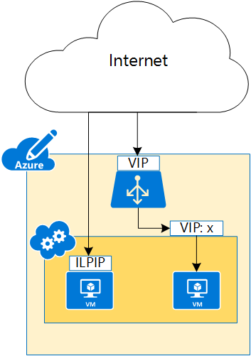

ASM 中的虚拟机设置 ILPIP 的途径有两种。

您可以使用 Powershell 命令，为虚拟机添加 ILPIP。具体步骤请参考：[实例级公共 IP（经典）概述](/documentation/articles/virtual-networks-instance-level-public-ip/)

您也可以在 Azure 门户预览中，通过页面中的选项来开启虚拟机的 ILPIP 功能。大致步骤是在 Azure 门户预览中选择 **虚拟机（经典）**，紧接着选择要设置 ILPIP 的虚拟机，然后再选择 **IP 地址** 选项，最后在 **实例 IP 地址** 功能中点击 **开**，并保存。具体位置见下图。

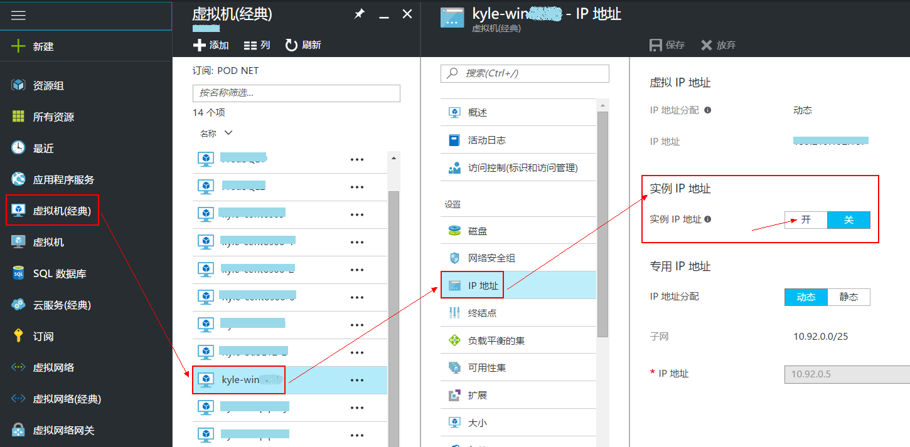

保存并更新需要2~3分钟。完成后重新点击 **IP 地址** 选项，即可在右边看到新设置的实例 IP 地址。

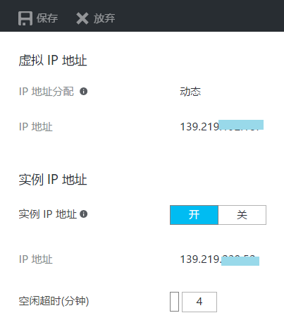

这样设置虽然简便，但是虚拟机的所有端口通过 ILPIP 直接面向公网，所以有一定的安全隐患。您需要在虚拟机中配置相应的防火墙规则，来增强对虚拟机的安全防护。您也可以参考后文对 NSG 的相关介绍来配置安全规则。

在默认情况下，每个订阅能够设置 5 个 ILPIP。如果需要更多，您可以与支持人员联系，请求增加 ILPIP 的配额。当然，我们更推荐部署 ARM 模式下的虚拟机。ARM 模式下每个订阅的每个区域的能获得的公共 IP 数量更多。详见：[Azure 订阅和服务限制、配额和约束](/documentation/articles/azure-subscription-service-limits/#networking-limits), **网络限制 - Azure Resource Manager**。

## ARM 虚拟机的设置方法

ARM 中的虚拟机开放 Ping 功能有两个配置步骤。其一是虚拟机配有公共 IP。如果只是从 Azure 中的虚拟机向外 Ping，那么只配置这一步即可。如果需要从外部网络来 Ping Azure 中的虚拟机，则需要配置虚拟机对应的 NSG 规则，使其允许 ICMP 协议包传输。

### 配置公共 IP

公共 IP 可以在 Azure 门户预览中创建虚拟机时，同时创建。如果创建虚拟机时没有配置公共 IP，您也可以在虚拟机创建好以后，再为其添加。
在创建虚拟机的第 3 步，配置可选功能中，可以新建公共 IP，或者选择已有并且可用的公共 IP。

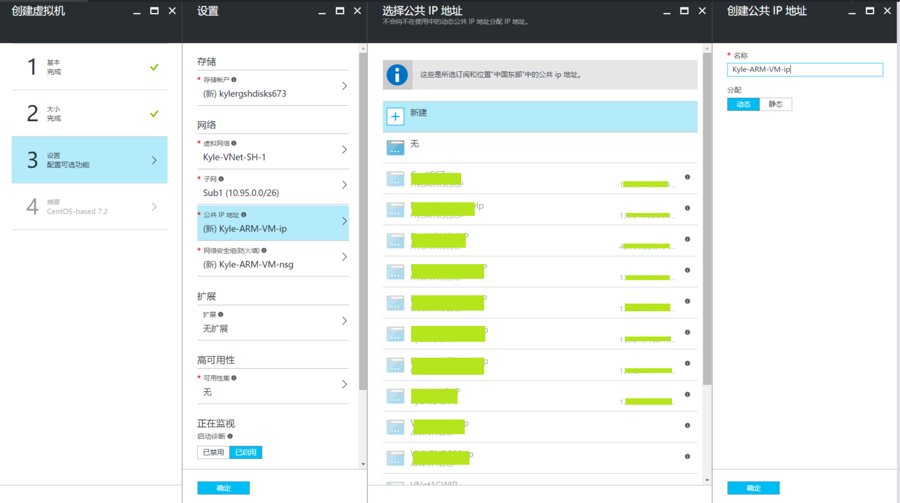

如果虚拟机创建时没有配置公共 IP，那么在虚拟机的概述页面中，公共 IP 地址会显示 " **-** "，如下图：

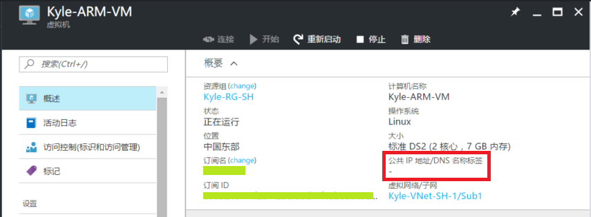

此时，我们可以为其添加公共 IP。 
在虚拟机视图中，选择 **网络接口**，并在右侧选择要配置公共 IP 的接口。

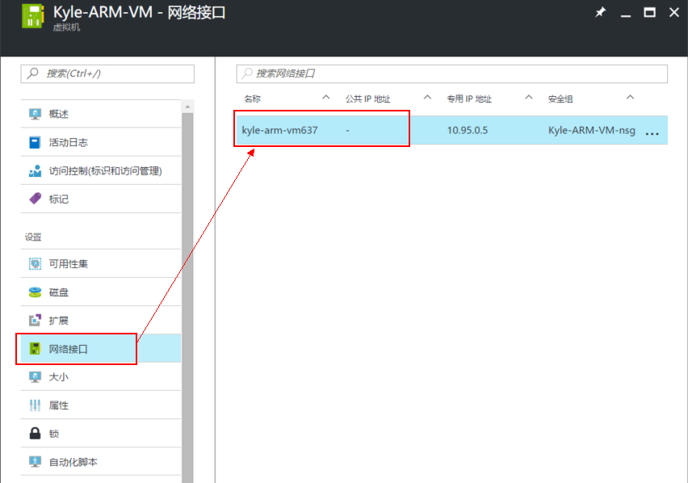

在网络接口视图中，选择 **IP配置**，并在右侧选择要求改的 IP 配置。此时在 IP 配置的修改页面就能看到 **公共 IP 地址设置** 了。

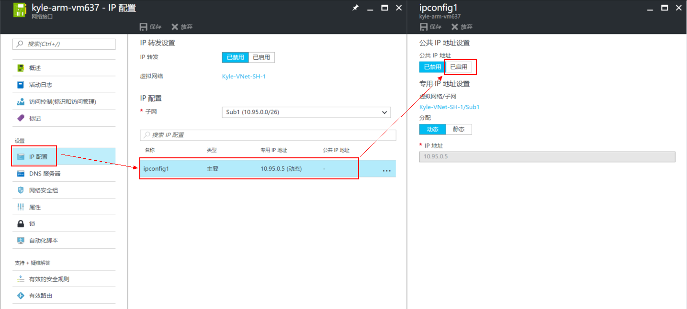

在 **公共 IP 地址设置** 中，点击 **已启用**，随后的步骤就与创建虚拟机同时创建公共 IP 一样了。您可以新建公共 IP，或者选择已有并且可用的公共 IP。如果是新建，还可以选择公共 IP 的 **分配** 方式，**动态** 或 **静态**。

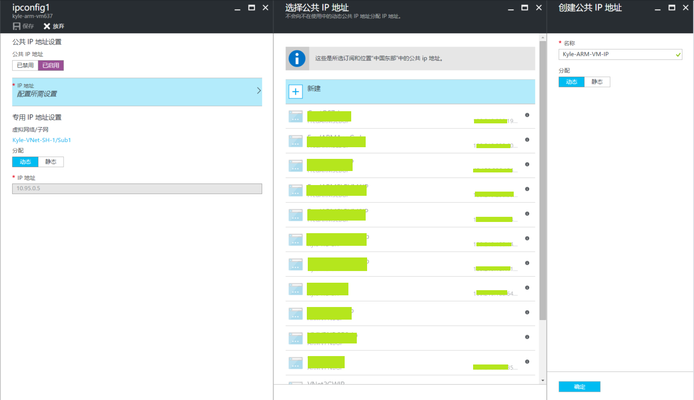

最后点击 **确定**，并 **保存**，配置公共 IP 的任务就在 Azure 的任务队列中运行了。 
任务完成后，就能在 IP 配置中看见获取到的公共 IP 地址了。

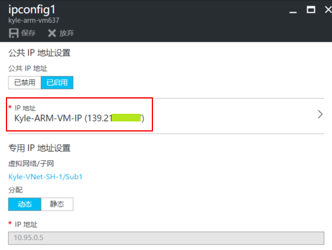

在虚拟机的概述中，也能看到 **公共 IP 地址/DNS 名称标签** 的值了。

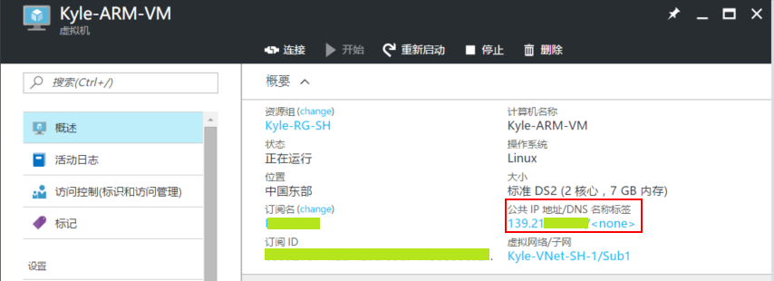

## 配置 NSG 规则

NSG 规则同样可以在创建虚拟机时配置，也可以为已经部署的虚拟机配置。这里用为已部署的虚拟机配置 NSG 规则为例。 
在虚拟机网络接口视图中，选择 **网络安全组**，并点击要配置的网络安全组。

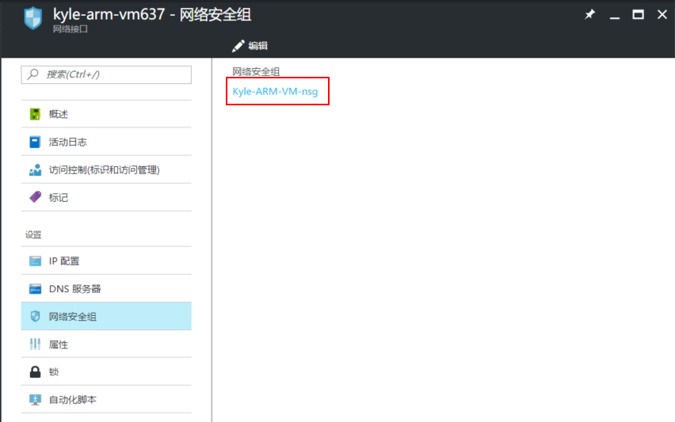

在网络安全组视图中，点击 **入站安全规则**，并点击右侧的 **添加**。

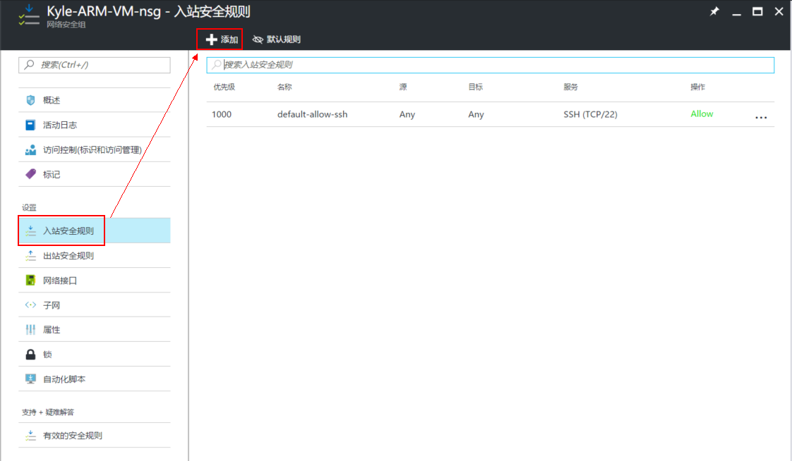

此处添加了一个名为 **AllowAll**，优先级为 **4096**（最低优先级），源和协议都是 **Any**，端口范围是 **" \* "**，操作为 **允许** 的 NSG 规则, 完成后点击 **确定**。

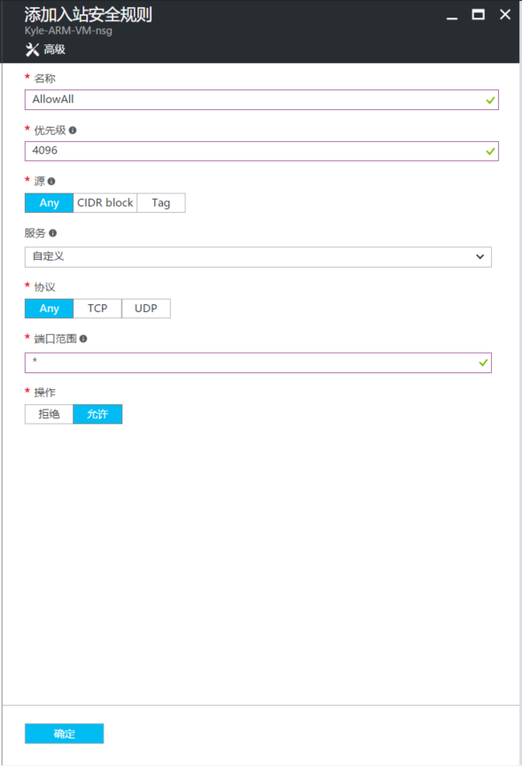

Azure 后台任务完成后，我们就能看到这条新添加的规则了。

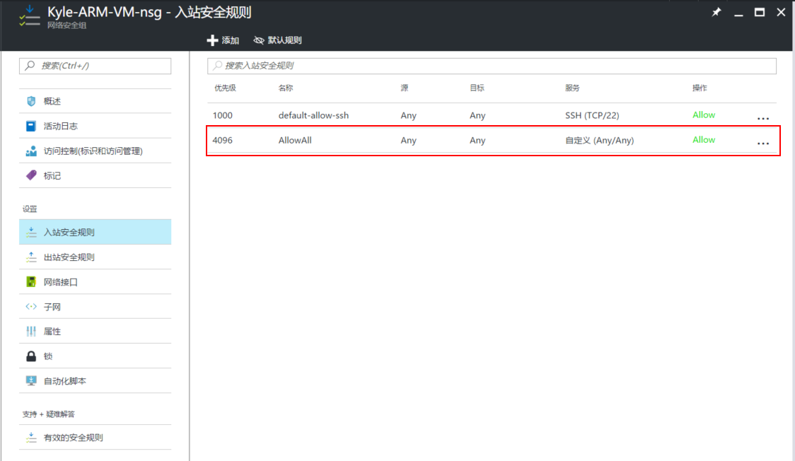

此时，我们就可以用 Ping 来测试这台虚拟机了。

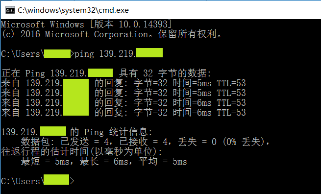

>[AZURE.NOTE]这样配置 NSG 虽然开放了 ICMP 协议的通信，但是实际上这台虚拟机所有 TCP、UDP 的端口也都暴露在了公网上，有安全隐患。

## 更安全的 NSG 配置

更安全的做法是，分别配置两条针对 TCP 和 UDP 的 DenyAll 的规则，优先级采用 4094 和 4095 ，然后为虚拟网络和 Azure 负载均衡器分别添加两条 AllowAll 的规则，优先级采用 4092 和 4093。最后为需要开放的端口配置更高优先级的规则。 
这样既开放了需要的端口和 ICMP 规则，也又避免了其他端口被攻击的危险。如下图所示，我开放了 TCP-22 端口和 ICMP，同时允许虚拟网络和 Azure 负载均衡器与虚拟机的内部通信，其他所有访问都被 NSG 规则拒绝。如果还要添加新的端口，新建优先级高于 4092 的规则就可以了。

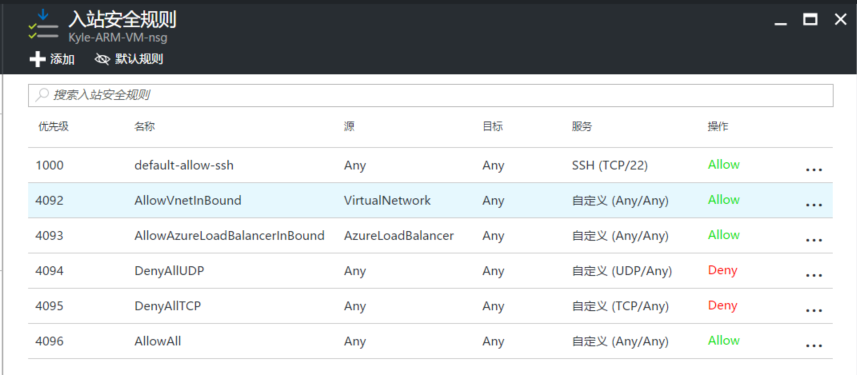

其实虚拟网络和 Azure 负载均衡器的规则已经在默认规则（点击 **默认规则** 可以查看）里自动创建了，只不过优先级很低，分别为 65000 和 65001。所以我们需要再为它们创建优先级高于 DenyAllTCP 和 DenyAllUDP 的规则。

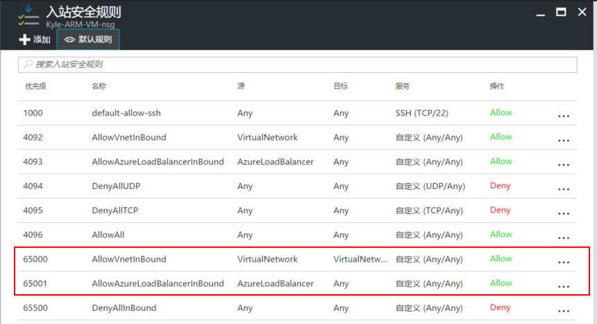

以上介绍的是为虚拟机添加 NSG 规则。其实虚拟网络子网也可以添加 NSG 规则，这里不赘述。如果您测试时发现在虚拟机的NSG中配置的规则没有生效，您可以检查一下虚拟网络子网对应的 NSG 规则是否对其有影响。当然，虚拟机内部通常也有防火墙。例如 Windows Server 虚拟机，默认入站的 ICMP 包也是被禁止的，所以在 Ping 测试虚拟机时，也要检查一下虚拟机内部的防火墙有没有创建对应的规则。
