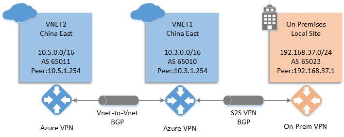
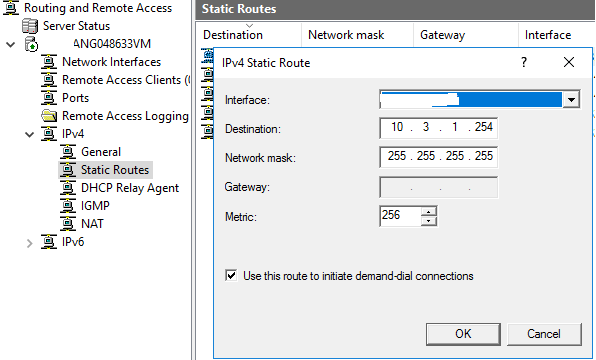

<properties
                pageTitle="如何使用 Windows Server 2016 与 Azure 搭建支持 BGP 协议的 VPN 通道"
                description="在 Windows Server 2016 中搭建支持 BGP 协议的 VPN 通道"
                services="vpn-gateway"
                documentationCenter=""
                authors=""
                manager=""
                editor=""
                tags="虚拟机,Windows Server 2016,PowerShell,BGP, RRAS, VPN, VNET"/>

<tags
                ms.service="vpn-gateway-aog"
                ms.date="12/15/2016"
                wacn.date="12/15/2016"/>

# 如何使用 Windows Server 2016 与 Azure 搭建支持 BGP 协议的 VPN 通道
 
### 关于 Windows Server 2016 的 BGP 功能 ###

从 Windows Server 2012 R2 开始，Windows Server 的 RRAS 已经能够支持 BGP 协议，但是 Windows Server 2012 R2 的 BGP 需要和  Multitenant Gateway 一起使用，要想跟 Azure 搭建支持 BGP 的 VPN 通道所需步骤相对繁琐。从 Windows Server 2016 开始，RRAS 不需要搭建 Multitenant Gateway 也能支持 BGP 协议，我们可以使用 Windows Server 2016 的 RRAS 功能很方便的跟 Azure 搭建支持 BGP 的 VPN。

### 使用 Windows Server 搭建 VPN 的前提 ###

- 一台安装 Windows Server 2016 的服务器并且激活成功。
- 服务器配置有双网卡，一个用于配置公网 IP，一个用于配置内网 IP。
- 配置公网 IP 的网卡不得位于 NAT 设备之后，配置内网 IP 的网卡用于连接公司内部网络。

### 网络架构说明 ###

本文所搭建的支持 BGP 的 VPN 架构如上图所示，Azure 搭建两个虚拟网络并建立支持 BGP 的 `VNET to VNET` 连接，VNET1 与本地再打通支持 BGP 的 `site to site` VPN 连接。  
本地 VPN 所设置的 AS 号为 `65023`，Peer 地址为 `192.168.37.1`，本地网段为 `192.168.37.0/24`。  
VNET1 所对应的 VPN gateway AS 号为 `65010`，Peer 地址为 `10.3.1.254`，网络空间为 `10.3.0.0/16`。  
VNET2 所对应的 VPN gateway AS 号为 `65011`，Peer 地址为 `10.5.1.254`，网络空间为 `10.5.0.0/16`。  
建立这样的支持 BGP 的 VPN 通道后，VNET2 可以与 On Premises 直接互通，而不需要再进行额外的配置。

### Azure 端配置 ###

由于我们已经有现有的文章来讲述如何在 Azure 端进行配置，所以本文不再赘述。具体的配置细节请参考下面的文档：  
[如何使用 Azure 资源管理器 和 PowerShell 在 Azure VPN 网关上配置 BGP](/documentation/articles/vpn-gateway-bgp-resource-manager-ps)。  
这里仅提一下两个需要注意的地方：  

1. VNET1 的 VPN gateway AS 号是自定义的，但是 Peer 地址是通过命令获取的，需要通过 BgpSettingsText 字段进行获取。对于 VNET2 也是同样的道理。

    需要执行的命令如下：

    
	    $vnet1gw = Get-AzureRmVirtualNetworkGateway -Name $GWName1 -ResourceGroupName $RG1
	    $vnet1gw.BgpSettingsText
    

    从 BgpSettingsText 字段的 BgpPeeringAddress 参数中可以获取 Peer 地址为 10.3.1.254。

	    $vnet1gw.BgpSettingsText
	    {
	        "Asn": 65010,
	        "BgpPeeringAddress": "10.3.1.254",
	        "PeerWeight": 0
	    }

2. 在执行下面的命令创建本地网关时，需要注意三个参数：

    AddressPrefix 只需填写 Peer 地址的 /32 前缀，不需要填写本地网络地址空间。
    Asn 为 Server 2016 所配置的 AS 号，并不是 VNET1 VPN gateway 的 AS 号。
    BgpPeeringAddress 为 Server 2016 所配置的 Peer 地址，而不是 VNET1 VPN gateway 的 Peer 地址。

    	New-AzureRmLocalNetworkGateway -Name $LNGName5 -ResourceGroupName $RG5 -Location $Location5 -GatewayIpAddress $LNGIP5 -AddressPrefix $LNGPrefix50 -Asn $LNGASN5 -BgpPeeringAddress $BGPPeerIP5

### Server 2016 配置 ###

1. 打开 Server 2016 的 PowerShell ISE，运行下面的 PowerShell  Script 命令配置 RRAS。

    请将脚本中的 1.2.3.4 全部替换成您的实际环境中 VNET1 VPN gateway 的 IP 地址。
    如果需要修改共享密钥，请修改 Add-VpnS2SInterface 命令中的 SharedSecret 参数的值。

		Function Invoke-WindowsApi( 
		    [string] $dllName,  
		    [Type] $returnType,  
		    [string] $methodName, 
		    [Type[]] $parameterTypes, 
		    [Object[]] $parameters 
		    )
		{
		  ## Begin to build the dynamic assembly 
		  $domain = [AppDomain]::CurrentDomain 
		  $name = New-Object Reflection.AssemblyName 'PInvokeAssembly' 
		  $assembly = $domain.DefineDynamicAssembly($name, 'Run') 
		  $module = $assembly.DefineDynamicModule('PInvokeModule') 
		  $type = $module.DefineType('PInvokeType', "Public,BeforeFieldInit") 
	
		  $inputParameters = @() 
	
		  for($counter = 1; $counter -le $parameterTypes.Length; $counter++) 
		  { 
		     $inputParameters += $parameters[$counter - 1] 
		  } 
	
		  $method = $type.DefineMethod($methodName, 'Public,HideBySig,Static,PinvokeImpl',$returnType, $parameterTypes) 
	
		  ## Apply the P/Invoke constructor 
		  $ctor = [Runtime.InteropServices.DllImportAttribute].GetConstructor([string]) 
		  $attr = New-Object Reflection.Emit.CustomAttributeBuilder $ctor, $dllName 
		  $method.SetCustomAttribute($attr) 
	
		  ## Create the temporary type, and invoke the method. 
		  $realType = $type.CreateType() 
	
		  $ret = $realType.InvokeMember($methodName, 'Public,Static,InvokeMethod', $null, $null, $inputParameters) 
	
		  return $ret
		}
	
		Function Set-PrivateProfileString( 
		    $file, 
		    $category, 
		    $key, 
		    $value) 
		{
		  ## Prepare the parameter types and parameter values for the Invoke-WindowsApi script 
		  $parameterTypes = [string], [string], [string], [string] 
		  $parameters = [string] $category, [string] $key, [string] $value, [string] $file 
	
		  ## Invoke the API 
		  [void] (Invoke-WindowsApi "kernel32.dll" ([UInt32]) "WritePrivateProfileString" $parameterTypes $parameters)
		}
	
		# Add and configure S2S VPN interface
		Add-VpnS2SInterface -Protocol IKEv2 -AuthenticationMethod PSKOnly -NumberOfTries 3 -ResponderAuthenticationMethod PSKOnly -Name 1.2.3.4 -Destination 1.2.3.4 -IPv4Subnet @() -SharedSecret AzureA1b2C3
	
		Set-VpnServerIPsecConfiguration -EncryptionType MaximumEncryption
	
		Set-VpnS2Sinterface -Name 1.2.3.4 -InitiateConfigPayload $false -Force
	
		# Set S2S VPN connection to be persistent by editing the router.pbk file (required admin priveleges)
		Set-PrivateProfileString $env:windir\System32\ras\router.pbk "1.2.3.4" "IdleDisconnectSeconds" "0"
		Set-PrivateProfileString $env:windir\System32\ras\router.pbk "1.2.3.4" "RedialOnLinkFailure" "1"
	
		# Restart the RRAS service
		Restart-Service RemoteAccess
	
		# Dial-in to Azure gateway
		Connect-VpnS2SInterface -Name 1.2.3.4

2. PowerShell 配置本地 BGP。

		#建立BGP Peer，192.168.37.1是我这边测试环境的内网网卡地址
		Add-BgpRouter -BgpIdentifier "192.168.37.1" -LocalASN 65032
		#指定Azure端的BGP参数，PeerName可以自行定义，PeerIPAddress为VNET1 VPN gateway peer 地址，PeerASN为VNET1 VPN gateway AS号，LocalIPAddress为本地VPN peer地址
		Add-bgppeer -PeerName "AzureS2S" -PeerIPAddress "10.3.1.254" -PeerASN 65010 -LocalIPAddress 192.168.37.1
		#将内网网卡的路由进行BGP发布，网卡的名字需要根据实际情况修改
		Add-BgpCustomRoute -Interface LAN

3. 配置静态路由将 Azure VNET1 VPN gateway 的 Peer 地址指向步骤 1 中建立的 VPN tunnel。

    

4. 查看 BGP Peer 连接状态。

    从下面的结果可以看到 BGP 是连接状态（connected）。

		PS C:\Users\Administrator> Get-BGPPeer
		
		PeerName LocalIPAddress PeerIPAddress PeerASN OperationMode ConnectivityStatus
		-------- -------------- ------------- ------- ------------- ------------------
		AzureS2S 192.168.37.1   10.3.1.254    65010   Mixed         Connected         

5. 查看本地获取的路由信息。
 
    从下面的结果可以看到 VPN 设备一共收到了三条路由：  
    `10.3.0.0/16` 是 VNET1 的网络地址空间；  
    `10.5.0.0/16` 是 VNET2 的网络地址空间；  
    `10.5.1.254/32` 是 VNET2 的 VPN gateway peer 地址。

		PS C:\Users\Administrator> Get-BgpRouteInformation
		DestinationNetwork NextHop    LearnedFromPeer State LocalPref MED
		------------------ -------    --------------- ----- --------- ---
		10.3.0.0/16        10.3.1.254 AzureS2S        Best               
		10.5.0.0/16        10.3.1.254 AzureS2S        Best               
		10.5.1.254/32      10.3.1.254 AzureS2S        Best               

6. 测试连通性。

    `10.3.0.4` 是 VNET1 内的一台 Azure 虚拟机的内网 IP；  
    `10.5.0.4` 是 VNET2 内的一台 Azure 虚拟机的内网 IP。  
    从本地的测试机发起的 PING 测试可以看到互通没有问题。

		C:\Windows\system32>ping 10.3.0.4
		
		Pinging 10.3.0.4 with 32 bytes of data:
		Reply from 10.3.0.4: bytes=32 time=4ms TTL=126
		Reply from 10.3.0.4: bytes=32 time=4ms TTL=126
		Reply from 10.3.0.4: bytes=32 time=4ms TTL=126
		Reply from 10.3.0.4: bytes=32 time=6ms TTL=126
		
		Ping statistics for 10.3.0.4:
		    Packets: Sent = 4, Received = 4, Lost = 0 (0% loss),
		Approximate round trip times in milli-seconds:
		Minimum = 4ms, Maximum = 6ms, Average = 4ms
		
		
		C:\Windows\system32>ping 10.5.0.4
		
		Pinging 10.5.0.4 with 32 bytes of data:
		Reply from 10.5.0.4: bytes=32 time=6ms TTL=61
		Reply from 10.5.0.4: bytes=32 time=6ms TTL=61
		Reply from 10.5.0.4: bytes=32 time=10ms TTL=61
		Reply from 10.5.0.4: bytes=32 time=6ms TTL=61
		
		Ping statistics for 10.5.0.4:
		    Packets: Sent = 4, Received = 4, Lost = 0 (0% loss),
		Approximate round trip times in milli-seconds:
		    Minimum = 6ms, Maximum = 10ms, Average = 7ms
