<properties 
	pageTitle="使用Azure CLI在Azure China Cloud云平台上手动部署一套Cloud Foundry" 
	description="这篇文章将介绍如何使用Azure CLI在Azure China Cloud云平台上手动部署一套Cloud Foundry" 
	services="virtual machine" 
	documentationCenter="" 
	authors=""
	manager="" 
	editor=""/>
<tags ms.service="virtual-machines-aog" ms.date="" wacn.date="08/31/2016"/>
# 使用Azure CLI在Azure China Cloud云平台上手动部署一套Cloud Foundry

这篇文章将介绍如何使用Azure CLI在Azure China Cloud云平台上手动部署一套Cloud Foundry。本文的目的在于：

1.	了解作为PaaS的Cloud Foundry其底层IaaS平台的架构。通过本文，你将明白一个简单的CF所需的最低的IaaS配置，以及如何按实际需求自定义CF的IaaS平台。
2.	了解用于管理Cloud Foundry的分布式系统生命周期管理软件的Bosh的搭建和使用。通过本文，你将明白如何通过bosh-init工具安装bosh虚拟机，如果通过bosh CLI命令部署和管理deployment。
3.	让读者熟悉Azure CLI命令集，Bosh CLI命令集和CF CLI命令集。

 
任何PaaS都必须依附于底层的IaaS环境，这里我们使用Azure云平台。下图中显示了CF与IaaS，及其管理软件的关系。

而我们安装CF的步骤，将从左至右进行。主要分为以下步骤：

1.	在Azure上创建CF所需IaaS环境。该过程包括创建各种资源，如存储账号，网卡，IP，虚拟网络及子网，网络安全组等，并将其集中放置在一个资源组下。配置好操作员用于管理bosh和CF的跳板机。
2.	通过跳板机，安装配置bosh。该过程会新建一台虚拟机，bosh的各个组件将通过bosh-init安装在该虚拟机上。
3.	通过跳板机，使用bosh cli操作bosh director部署CF。根据manifest文件，该过程将会创建一台或多台虚拟机，cloud Foundry的各个组件将会安装在虚拟机上。
4.	使用CF进行应用软件开发管理。到这一步，说明CF环境已经准备妥当，用户可以在该PaaS环境中进行应用软件的管理。

## IaaS环境准备

1. [为跳板虚拟机准备ssh-key](#prepare_ssh)
2. [为bosh准备服务主体](#prepare_bosh)
3. [Bosh和CF所需资源准备](#prepare-ready)

### 为跳板虚拟机准备ssh-key

从这一步开始，到跳板机安装完成，所有操作将在Azure CLI中完成。关于如何安装Azure CLI请参见[链接](https://www.azure.cn/documentation/articles/xplat-cli-install/)。

打开Azure CLI，将CLI切换到ARM模式。

	azure config mode arm
 
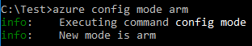

登录Azure:

	azure login -e AzureChinaCloud

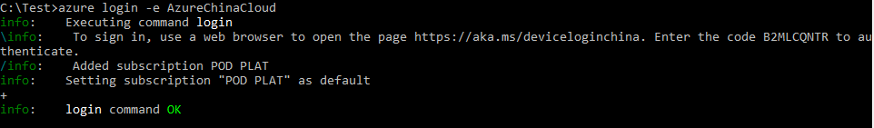

根据开启浏览器，输入URL，填写代码。代码匹配成功后，将会转到Azure 认证界面，请输入订阅的服务管理员和密码。验证成功后，命令行界面将会出现登录成功信息。之后，可安全关闭浏览器，浏览器操作部分如下图。

输入CLI中的Code：

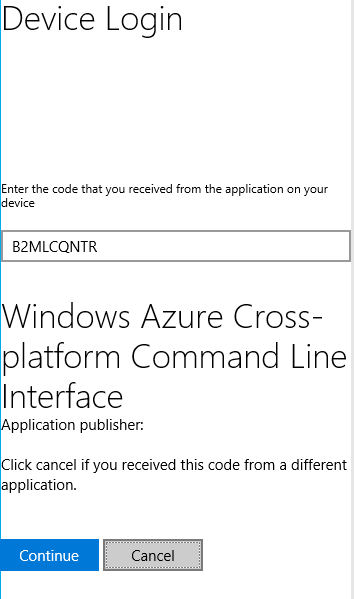
 
输入账号密码登陆：

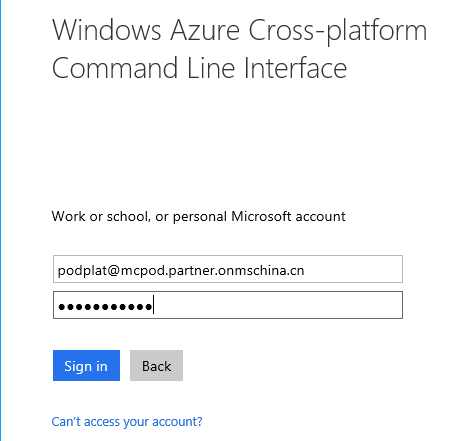 

接下来使用命令查询账号的基本信息，如果一个账号下有多个订阅，使用account set命令选中其中一个。

 
查询该订阅的详细信息，并用变量记录下订阅号和租户号，后续命令中会使用。

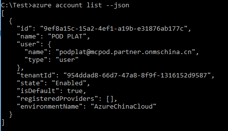

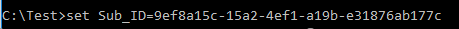
 
 
###  为bosh准备服务主体

接下来我们将为bosh创建一个AAD账号，该账号将用于bosh与Azure订阅之间的认证授权。

	azure ad app create --name lqicfad01 --password Lq1cfAD01 --home-page "https://lqicf01" --identifier-uris "https://lqicf01"
 
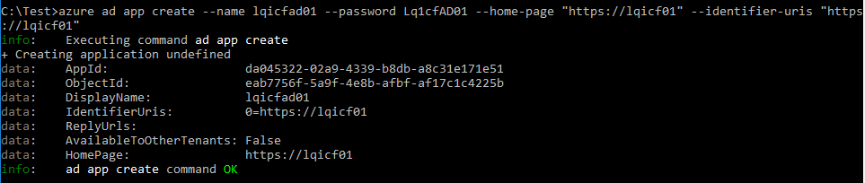

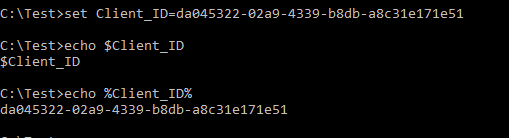

 
为该账号创建服务主体。

	azure ad sp create -a %Client_ID%
 
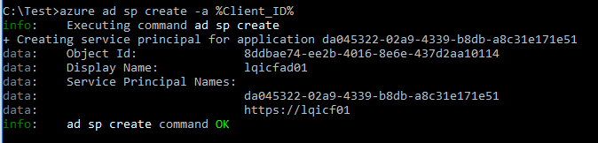

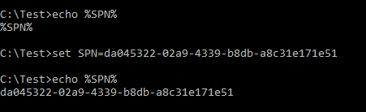
 
并赋予其对应权限，使其拥有在Azure平台上对授权的订阅有进行资源创建管理的权限，如创建或删除虚拟机，创建或删除网卡等。

	azure role assignment create --spn %SPN% --roleName "Virtual Machine Contributor" --subscription %Sub_ID%

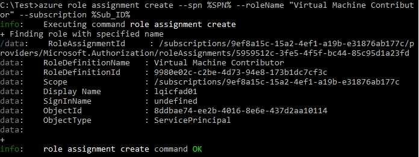

	azure role assignment create --spn %SPN% --roleName "Network Contributor" --subscription %Sub_ID%

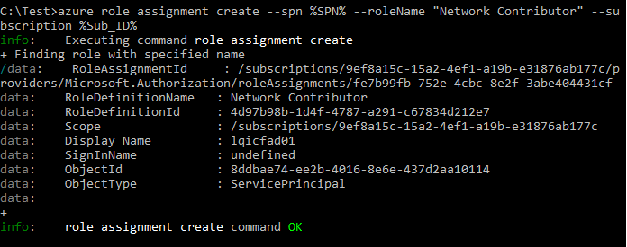
 
查看以确认授权成功。

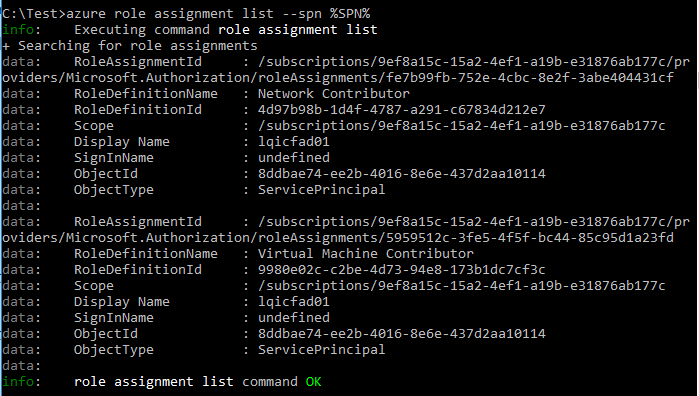
 
###  Bosh和CF所需资源准备

接下来，我们要为bosh和CF准备一个IaaS平台。包括：

1. ARM模式下的[一个资源组](#ready_arm)。
2. [一个存储账号](#ready_account)。该账号下包含两个容器，分别用于存放bosh虚拟机和stemcell镜像文件。
3. [一个静态公网IP](#ready_ip)，在部署Cloud Foundry将会使用。
4. [一个虚拟网络](#ready_vnet)。该网络下属三个子网，分别用于bosh，cf和diego。
5. [两个网络安全组](#ready_subvnet)。分别用于限制bosh和cf子网的网络端口。
6. [一台虚拟机，及其对应的网卡和公网IP](#ready_nic)。该虚拟机将作为用户的跳板机。
7. [配置跳板机](#ready_config)。在进项bosh安装前，需要更新虚拟机到最新版本，并安装bosh-init，bosh cli等工具。通过这些工具才能安装bosh director及其他bosh组件。Bosh安装好之后，用户也会使用这台机器与bosh director通行，来部署和管理Cloud Foundry。

#### 资源组

	azure group create --name lqicfrg01 --location "China East"

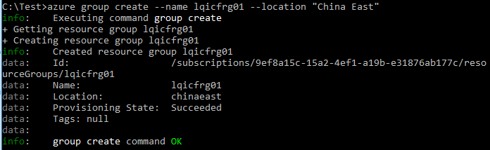
 
#### 存储账号

	azure storage account create --location "China East" --type GRS --resource-group lqicfrg01 lqicfsa01

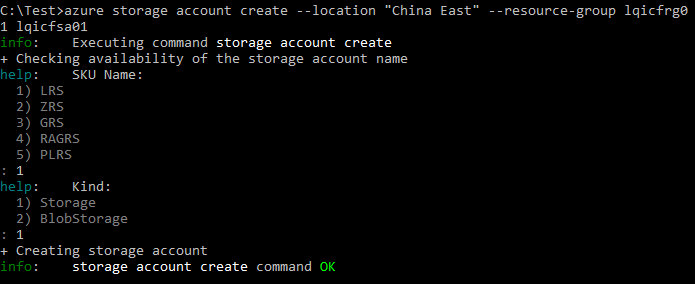
 
创建完成后，可以查看存储账号信息。

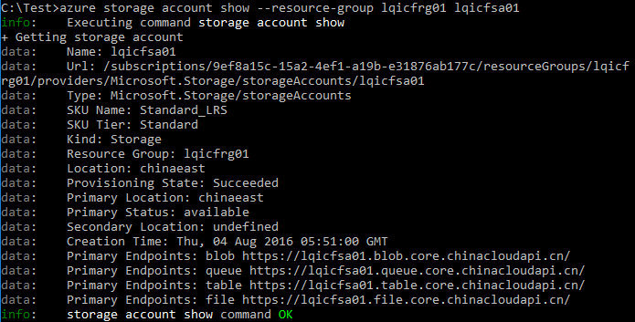
 
将存储账号的密钥保存下来，以备后续使用。

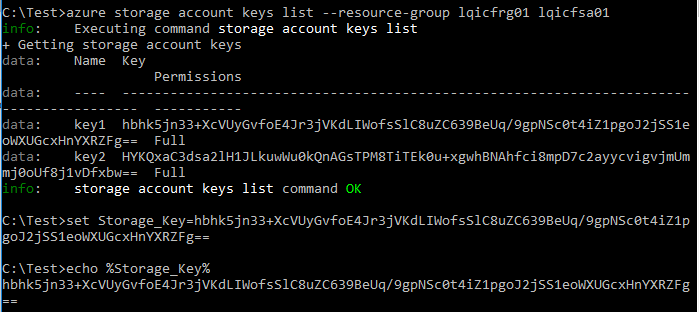
 
接下里要在存储里创建两个容器，bosh和stemcell。Bosh用于存放bosh director虚拟机的磁盘等数据；stemcell用于存放下载的stemcell镜像文件。这两个容器名字不能更改。

	azure storage container create --account-name lqicfsa01 --account-key %Storage_Key% --container bosh

	azure storage container create --account-name lqicfsa01 --account-key %Storage_Key% permission Blob --container stemcell

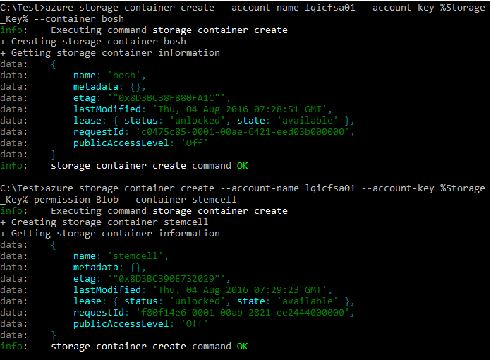

#### CF公网IP

CF公网IP是最后一步中部署CF环境中需要使用的。需要给CF分配一个公网IP，这样应用可以通过该IP从外网被访问到。

	azure network create --resource-group lqicfrg01 --location "China East" --allocation-meth Static --name lqicfip01-cf

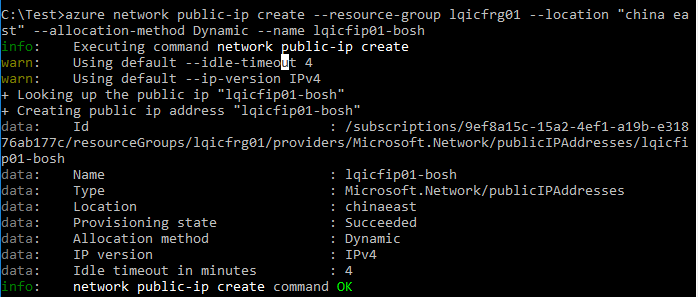
 

#### 虚拟网络及其子网

为整套环境创建一个虚拟网络。该网络包含三个子网，分别用户bosh director环境，CF环境和Diego环境。

	azure network vnet create --resource-group lqicfrg01 --name lqicfvnet01 --location "china East" --address-prefixes 10.0.0.0/16

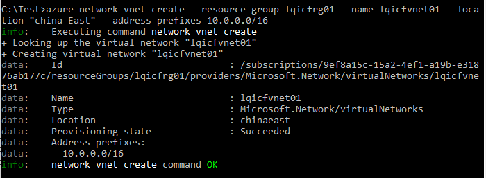	 

	azure network vnet subnet create --resource-group lqicfrg01 --vnet-name lqicfvnet01 --name lqicfvnet01-bosh --address-prefixes 10.0.1.0/24
	azure network vnet subnet create --resource-group lqicfrg01 --vnet-name lqicfvnet01 --name lqicfvnet01-cf --address-prefix 10.0.2.0/24
	azure network vnet subnet create --resource-group lqicfrg01 --vnet-name lqicfvnet01 --name lqicfvnet01-diego --address-prefix 10.0.3.0/24

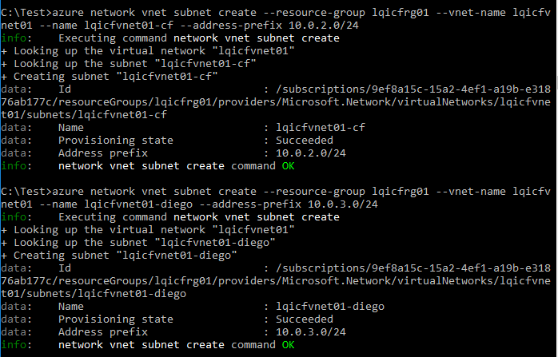	 
 
#### 网络安全组

为防止不必要的网络流量以及考虑到各个子网的安全性，为bosh和CF分别创建了网络安全组。

	azure network nsg create --resource-group lqicfrg01 --location "China East" --name lqicfnsg01-bosh
	azure network nsg create --resource-group lqicfrg01 --location "China East" --name lqicfnsg01-cf

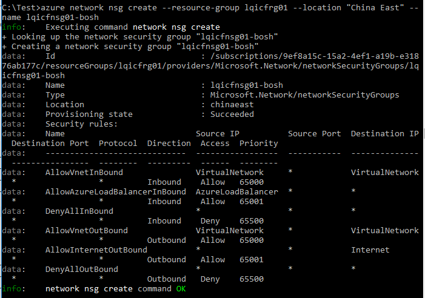	 
 
为不同安全组设置规则。
	
	azure network nsg rule create --resource-group lqicfrg01 --nsg-name lqicfnsg01-bosh --access Allow --protocol Tcp --direction Inbound --priority 200 --source-address-prefix Internet --source-port-range * --destination-address-prefix * --name ssh --destination-port-range 22
	azure network nsg rule create --resource-group lqicfrg01 --nsg-name lqicfnsg01-bosh --access Allow --protocol Tcp --direction Inbound --priority 201 --source-address-prefix Internet --source-port-range * --destination-address-prefix * --name bosh-agent --destination-port-range 6868
	azure network nsg rule create --resource-group lqicfrg01 --nsg-name lqicfnsg01-bosh --access Allow --protocol Tcp --direction Inbound --priority 202 --source-address-prefix Internet --source-port-range * --destination-address-prefix * --name bosh-director --destination-port-range 25555
	azure network nsg rule create --resource-group lqicfrg01 --nsg-name lqicfnsg01-bosh --access Allow --protocol * --direction Inbound --priority 203 --source-address-prefix Internet --source-port-range * --destination-address-prefix * --name dns --destination-port-range 53
	azure network nsg rule create --resource-group lqicfrg01 --nsg-name lqicfnsg01-cf --access Allow --protocol Tcp --direction Inbound --priority 201 source-address-prefix Internet --source-port-range * --destination-address-prefix * --name cf-https --destination-port-range 443
	azure network nsg rule create --resource-group lqicfrg01 --nsg-name lqicfnsg01-cf --access Allow --protocol Tcp --direction Inbound --priority 202 source-address-prefix Internet --source-port-range * --destination-address-prefix * --name cf-log --destination-port-range 4443

	

#### bosh跳板机

接下来需要手动创建一个bosh跳板机，这台跳板机将用于部署bosh director, CF 及用来访问bosh director和CF环境。

首先创建获取IP，并将IP绑定到网卡。

	azure network public-ip create --resource-group lqicfrg01 --location "china east" --allocation-method Dynamic --name lqicfip01-bosh
	azure network nic create --resource-group lqicfrg01 --location "china East" --name lqicfnic01-bosh --public-ip-name lqicfip01-bosh --private-ip-address 10.0.1.10 --subnet-vnet-name lqicfvnet01 --subnet-name lqicfvnet01-bosh

	 

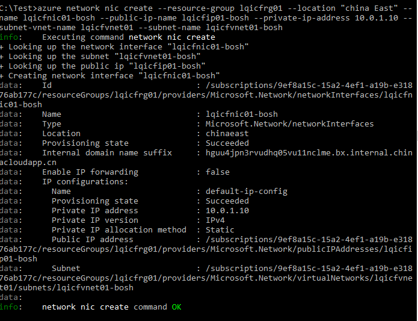	
 
查询并选择需要的镜像文件用于创建VM:

	azure vm image list --location "china east" --publisher canonical --offer UbuntuServer

 
创建VM:

	azure vm create --resource-group lqicfrg01 --name lqicfvm01-bosh --location "China East" --os-type linux --nic-name lqicfnic01-bosh --vnet-name lqicfvnet01 --vnet-subnet-name lqicfvnet01-bosh --storage-account-name lqicfsa01 --image-urn canonical:UbuntuServer:14.04.3-LTS:14.04.201606270 --ssh-publickey-file C:\Test\lqicfvm01-bosh.pub --admin-username boshuser

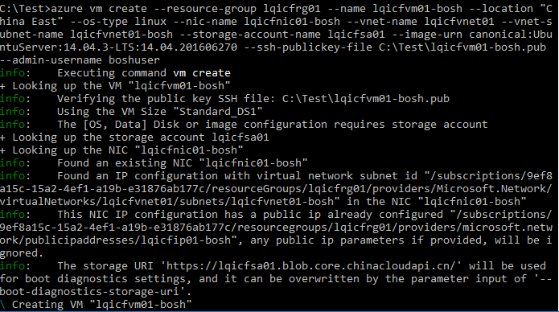	
	 
创建完成后，用户将可以使用ssh密钥通过putty登录到跳板机上。

#### 配置跳板机

通过putty导入ssh 密钥，输入用户名，就可以成功登录到跳板机。

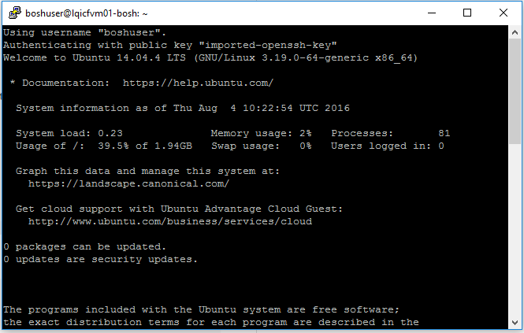
 
更新OS到最新版本。

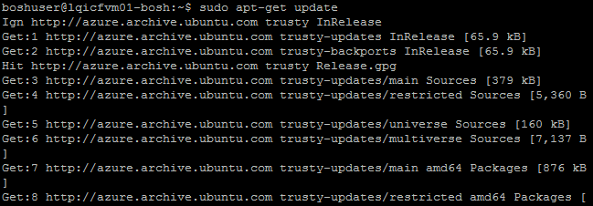

 
安装Bosh和CF需要的软件包。

	sudo apt-get install -y build-essential ruby2.0 ruby2.0-dev libxml2-dev libsqlite3-dev libxslt1-dev libpq-dev libmysqlclient-dev zlibc zlib1g-dev openssl libxstl-dev libssl-dev libreadline6 libreadline6-dev libyam                                                                                                                                                             l-dev sqlite3 libffi-dev

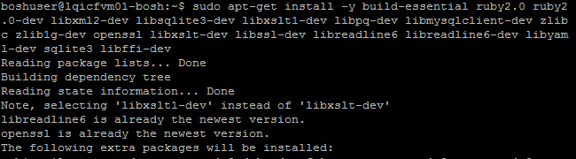
	 
将命令指向最新的软件版本。

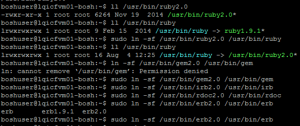
 
配置使用于中国区域的gem。Gem是用于管理ruby开发环境的。

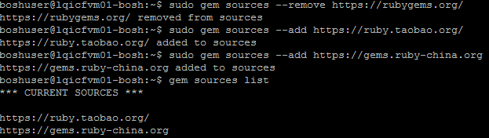
 
通过gem更新ruby环境。
 
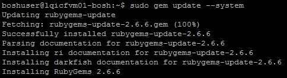

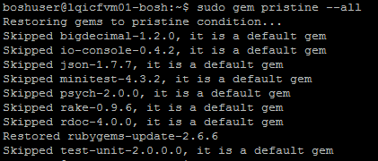

 
下载安装bosh-init。该工具用于部署安装bosh director。

	wget -O bosh-init https://s3.amazonaws.com/bosh-init-artifacts/bosh-init-0.0.51-linux-amd64
 
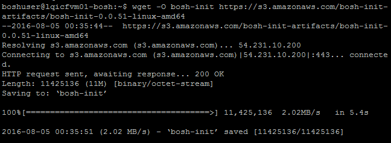

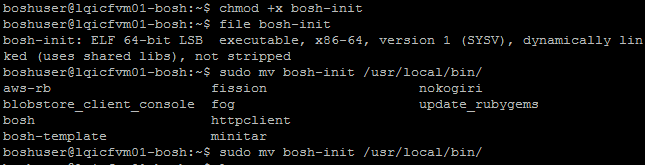

## 使用bosh-init安装bosh 

为了解bosh-init在安装bosh过程中，IaaS层的作用，建议将现有的资源组中的资源及其状态都记录下来。你可以看到的是，网络安全组尚未关联任何网络或虚拟机；cf的公网IP没有分配给任何虚拟机；资源组中只有一台虚拟机；存储账户中，stemcell和bosh容器下没有任何内容。

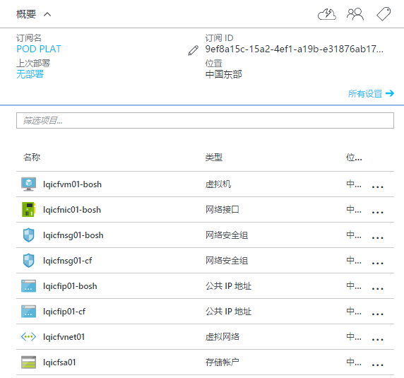

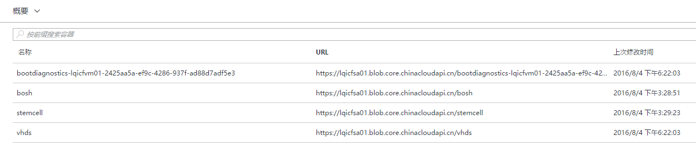
 
首先，我们要创建一堆ssh密钥对，用于bosh跳板机与即将创建的bosh director之间的登录认证。公钥放在配置文件bosh.yml中，私钥放在当前目录下，命名为bosh（也可以命名为其他名字，但需要同时在bosh.yml中更改）。具体方式可以参见本文“[为跳板虚拟机准备ssh-key](#prepare_ssh)”这一节.
 
其次，下载或编写bosh的manifest文件bosh.yml。你需要参考一下链接，以获得你要安装的bosh的版本及其验证码：

[https://bosh.cloudfoundry.org/releases/github.com/cloudfoundry/bosh?all=1](https://bosh.cloudfoundry.org/releases/github.com/cloudfoundry/bosh?all=1)

你要安装的bosh azure cpi的版本及其验证码：

[https://bosh.io/releases/github.com/cloudfoundry-incubator/bosh-azure-cpi-release?all=1](https://bosh.io/releases/github.com/cloudfoundry-incubator/bosh-azure-cpi-release?all=1) 

安装bosh使用的镜像文件及其验证码

[http://bosh.cloudfoundry.org/stemcells/](http://bosh.cloudfoundry.org/stemcells/)

[http://bosh.cloudfoundry.org/stemcells/bosh-azure-hyperv-ubuntu-trusty-go_agent](http://bosh.cloudfoundry.org/stemcells/bosh-azure-hyperv-ubuntu-trusty-go_agent)

设置安装日志存储位置

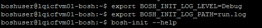
 
安装bosh

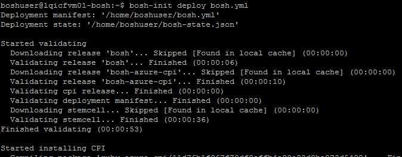
 
安装完成后，使用bosh cli命令查看bosh状态:

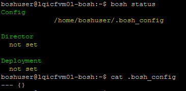
 
上图显示bosh目前没有关联到任何director；.bosh_config中为没有任何内容。使用bosh target命令为当前会话指定bosh director。Target 后跟的IP为bosh.yml中定义的director IP。指定target后，.bosh_config中会记录下当前target的详细信息。Status显示也有所不同。

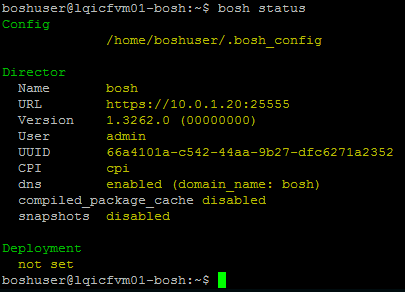 
 
可以使用releases 查看是否有上传的release；deployments查看该director下的部署。因为是新环境，所以没有任何release和部署。

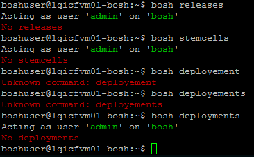 
 
同时，你也可以登录到bosh director上去查看信息。

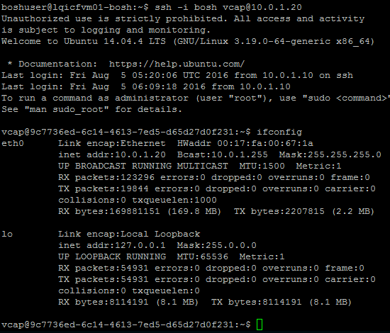 
 
在azure portal中，你也能看到变化。

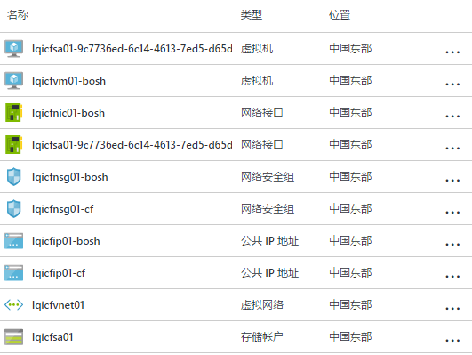 

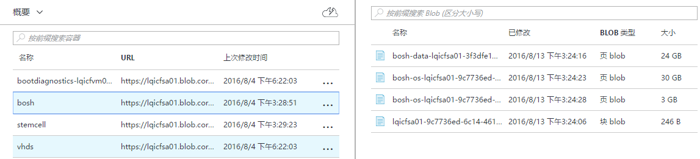 
 

## 部署CF

本小节包含

- [创建CF的manifest](#create_manifest)
- [上传stemcell和release](#upload)
- [指定当前部署](#specific_deploy)
- [部署CF](#deploy_cf)

因为没有注册域名，这里使用xip.io作为CF实验环境的域名；该域名解析会将域名直接解析为前面添加的IP地址。
接下来我们将通过命令bosh命令行操作Bosh Director来管理deployment。首先是要创建一个deployment。基本步骤为

### 创建CF的manifest

创建一个deployment的manifest，说明该deployment需要什么stemcell来创建VM，使用哪些releases来进行VM上的配置，并列出要安装的应用或软件，使用的网络，VM大小等资源，需要创建的用户名密码等等等等详尽的信息。Manifest可以自己手动创建，也可以从github上下载现成的模板再进行自定义。

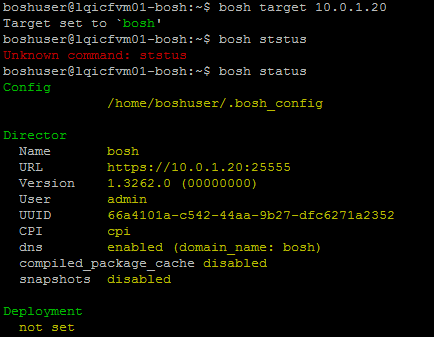 
 
从github上下载对应的cf manifest文件，并将里面的变量设置成自定义的值。

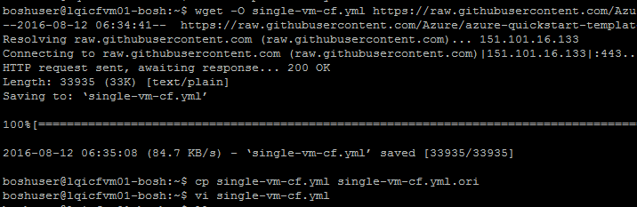 
 
### 上传stemcell和release

上传该manifest要使用的stemcell和release。一个特定的deployment需要一个或多个stemcell作为其基本镜像，以及一个或多个release说明其应该安装的软件包，组件或者配置信息。在使用Director开始部署deployment前，需要完成以下两个步骤：

1. 在director上为每个resource pool指定一个stemcell,下面为manifest文件的部分截屏，显示的是stemcell的信息。

	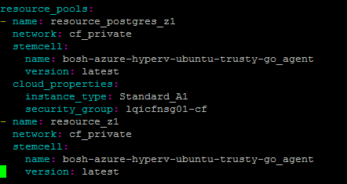 
 
	将stemcell从网站上下载下来，并上传到bosh director指定的存储账号中，这里是我们之前创建的容器stemcell。

	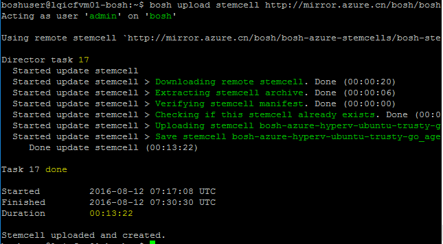 

 
2. 将该deployment需要的所有release上传到director。需要的release已经定义在manifest文件中，请确保所有release已经传到director。

	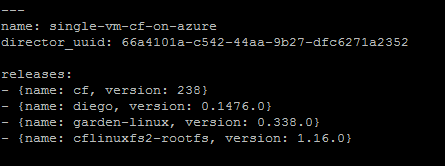 
 
> 两种方式：URL或者本地。如果网络不好，URL方式有可能会上传失败，因此可以通过先下载到本地再上传的方式。
 
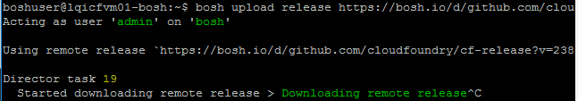 

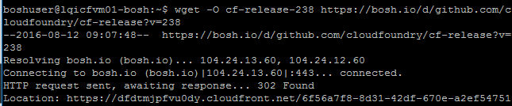 

 

 

 
 
 
 
 
### 指定当前部署

 
 
如果yml文件格式有误，将会提示错误，请根据错误修正文件。

### 部署CF

部署过程中可能出现错误，可以通过bosh task <task id> --debug查看具体信息，再进行修复。
 
 

 

如此，CF搭建完成。你可以在Azure 新portal上看到该资源组中会新增几台虚拟机等资源。使用CF需要安装Cloud Foundry CLI。使用wget下载（该命令可能会失败，请再次运行）。

	wget -O cf.deb http://go-cli.s3-website-us-east-1.amazonaws.com/releases/v6.14.1/cf-cli-installer_6.14.1_x86-64.deb

 
 
如此，CF环境搭建成功。使用cf --help命令可以查看cf的操作有哪些。
首先找到配置好的CF的公网IP。在该家目录下的setting文件中，记录了BOSH环境的相关信息，可以在此查到cf的IP地址。
接下来，用户可以使用该环境进行应用的管理了。

