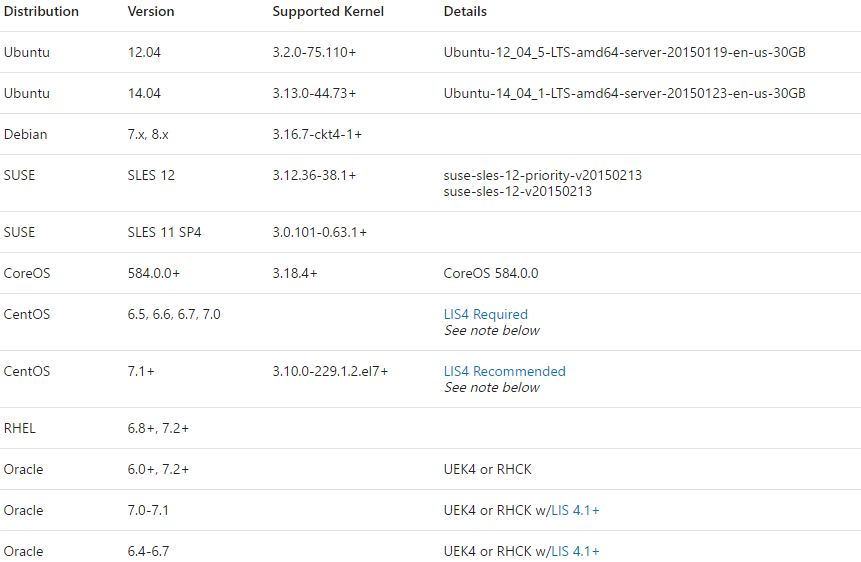
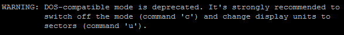
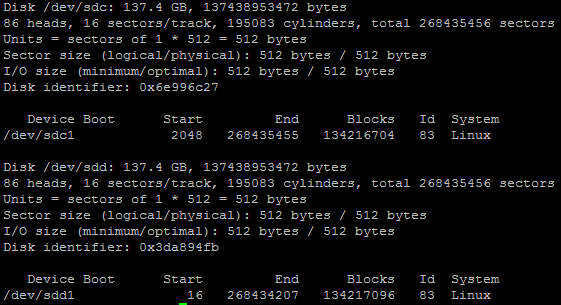

<properties
	pageTitle="在 Linux 中使用 Azure Premium 存储的基本优化指南"
	description="在 Linux 中使用 Azure Premium 存储的基本优化指南"
	service=""
	resource="virtualmachines"
	authors=""
	displayOrder=""
	selfHelpType=""
	supportTopicIds=""
	productPesIds=""
	resourceTags="Virtual Machines, CentOS, Premium Storage ,LIS"
	cloudEnvironments="MoonCake" />
<tags 
	ms.service="virtual-machines-linux-aog"
	ms.date=""
	wacn.date="02/07/2017" />
# 在 Linux 中使用 Azure Premium 存储的基本优化指南

>[AZURE.NOTE] 以下测试和结果都是基于 CentOS 6.5。对于其他版本，请参考本文档，并自行进行相关测试。

1.	建议使用最新的内核版本

	一般情况下，新的内核版本能解决老版本中存在的问题，添加对新出现硬件的支持，以及改进对硬件的支持程度。 
	建议使用你当前 Linux 发行版本中最新的内核版本；如有可能，定期更新到大版本中最新的补丁版本。

2.	更新 Linux LIS 驱动

	官方文档中提到，CentOS 和 Oracle 特定的发行版本，需要更新 LIS 以支持 Premium storage。具体如下图所示：

	

	[高级存储：适用于 Azure 虚拟机工作负荷的高性能存储](/documentation/articles/storage-premium-storage/)

3.	在磁盘分区时，与设备的页大小对齐

	在 `2.6.32-431.29.2.el6.x86_64` 的内核中，`fdisk` 默认还是使用柱面为边界来分区；如果柱面与 SSD 磁盘的页大小没有对齐，文件系统层面的一个 IO，可能会在设备层产生额外的开销，影响读写响应时间。
	
	以下是 CentOS 6.5 执行 `fdisk` 不带参数时的警告信息。
	
	
	
	以下是通过不同参数进行磁盘分区后，使用 `fdisk -u -c -l` 的结果。`/dev/sdc1` 是从磁盘的第二个 1024k 开始的，`/dev/sdd1` 则是从第二个 8k 开始的。一般来讲，这个边界对齐最好是 128K 的偶数倍。
	
		#fdisk -u -c /dev/sdc
		#fdisk /dev/sdd
	
	
	
	在 CentOS 7 以后，`fdisk` 默认就使用了以 512Bytes 的 Sector 大小为单位来显示，分区时也默认从第 2048 个 sector 开始划第一个分区。所以不必担心 SSD 还会有边界对齐问题，使用默认命令 `fdisk` 即可。
	
	参考该文档：[Improving performance/Storage devices](https://wiki.archlinux.org/index.php/Improving_performance#Storage_devices)

4.	文件系统格式

	在 CentOS 7 以后，默认使用 `XFS` 作为文件系统格式。在 CentOS 6 中，推荐使用 `ext4` 或者 `XFS`。

5.	挂载选项

	`Write barrier` 是用来保证内存中数据以正确顺序写入磁盘，以防止突然断电而引起的数据不一致问题。如果在新建磁盘时设置的 cache 规则为 `none` 或者 `readonly`, 完全可以禁用该功能，因为数据会不经过 cache 直接写入 Azure Premium Storage 底层的磁盘。
	
	`noatime/relatime : atime` 是文件属性中的访问时间。每次文件被访问，该时间就会被更改。如果文件被频繁访问，那花费在记录该时间上的时间也很可观，会影响 IO 的效率。
	
	如果应用不需要比较文件访问时间，建议将其禁止；若因为某些原因要保持 `atime` 更新，可以设置 `relatime`，将 `atime` 设置成和 `mtime` 一起更新。
	
	>[AZURE.NOTE] 在 Azure 提供的 CentOS 7 版本以后，默认挂载选项已经设置成 `relatime`。
	
	**操作方法：**
	
	命令行中使用
	
		#mount -o noatime,barrier=0 /dev/sdxn /mount/point
	
	或者
	
		#mount -o relatime,barrier=0 /dev/sdxn /mount/point
	
	在挂载配置文件中更改
	
		#vi /etc/fstab
		/dev/sdxn	/mount/point	 ext4	noatime,barrier=0 	0 0 
	
	或者
	
		/dev/sdxn	/mount/point	ext4	relatime,barrier=0	0 0 
	
	`Discard` : 用来决定是否在有数据被删除时对 SSD block 进行整理，以备后续数据写入时提高速度；但如果小文件删除频繁，`discard` 本身可能引起性能下降。慎用之。
	
	参考：
	
	[Impact of ext4’s discard option on my SSD](https://patrick-nagel.net/blog/archives/337 )  
	[Performance of TRIM command on ext4 filesystem](http://people.redhat.com/lczerner/discard/ext4_discard.html )

6.	IO调度算法

	`CFQ` : CentOS 6 中的默认 IO 算法。特点是对所有有 IO 请求的进程，提供公平的磁盘 IO 带宽。 
	`NOOP` : 即 `none operation`。对所有的 IO 请求，不做任何操作，直接发给磁盘控制器。 
	`Deadline` : CentOS 7 中默认 IO 算法。其特点在于尽量将所有的 IO 请求的延迟保持在一定范围内，避免有的 IO 一直等待无法获取响应时间。
	
	根据应用的 IO 类型，选择合适的 IO 调度算法，能在一定程度上提供应用性能。这里讲的 IO 调度算法的主要目的是为了节省磁盘寻道时间。而 SSD 磁盘和 HDD 最大的不同，在于它没有寻道时间和旋转延迟。因此对于 HDD 性能有极大帮助的 `CFQ` 和 `Deadline`，以及 `nr_requests/queue_depth` 参数，对于 SSD 来讲意义不大；相反，使用 `noop` 或 `deadline` 这种基本不排序 IO 的算法，反倒能提升 SSD 的响应时间。
	
	`Deadline` 和 `noop` 的算法还是有所不同的，建议两种分别测试比较一下，择优而用。另外，IO 调度算法是根据底层磁盘来的，如果有多个磁盘，要分别进行设置。
	
	查看 IO 算法 ：
	
		#cat /sys/block/sdx/queue/scheduler 
	
	在线更改算法 :
	
		#echo noop > /sys/block/sdx/queue/scheduler 
	
	将算法更新到启动参数中（CentOS 6）:
	
		#vi /etc/grub.conf
		kernel /boot/vmlinuz-2.6.32-431.29.2.el6.x86_64 ro root=UUID=8fc4d768-29cd-462c-a7ab-5bf4bcfa9fa2 rd_NO_LUKS  KEYBOARDTYPE=pc KEYTABLE=us LANG=en_US.UTF-8 numa=off console=ttyS0,115200n8 earlyprintk=ttyS0,115200 rootdelay=300 rd_NO_MD SYSFONT=latarcyrheb-sun16 rd_NO_LVM rd_NO_DM elevator=deadline
	
	使用 `sysbench 0.5`，在 `1 core, 3.5 GB memory` 的 DS1 型号的 CentOS 6.5 中进行了文件读写测试。经过比较，使用了 `noatime` 和 `barrier=0`，且使用了边界对齐分区方法的 `ext4` 文件系统，在使用 `deadline` 或者 `noop` IO 算法时，平均 IO 时间和最大 IO 时间都有所下降，文件读写 IO 综合情况表现较好。
	
	上述情况仅从基本操作上进行了一些优化。在实际环境中，各个参数的调整，都需要进行反复测试，以求达到最佳状态。

## 更多参考

[Azure Storage secrets and Linux I/O optimizations](https://blogs.msdn.microsoft.com/igorpag/2014/10/23/azure-storage-secrets-and-linux-io-optimizations/)  
[优化 Azure Linux VM 上的 MySQL 性能](/documentation/articles/virtual-machines-linux-classic-optimize-mysql/)  
[高级存储：适用于 Azure 虚拟机工作负荷的高性能存储](/documentation/articles/storage-premium-storage/)  
[Using the Deadline IO Scheduler](https://access.redhat.com/solutions/32376) 

