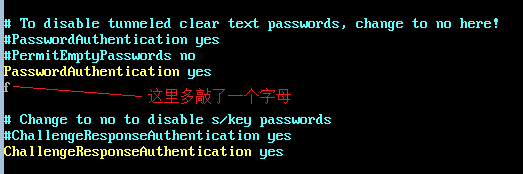
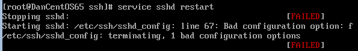
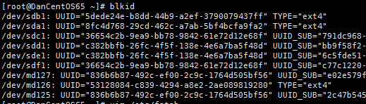
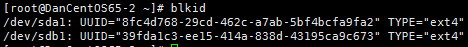
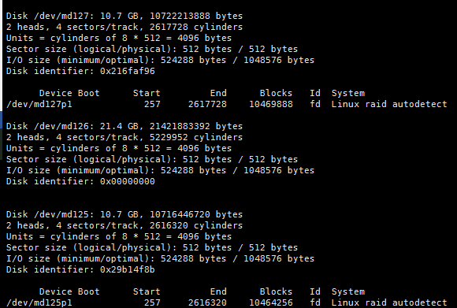

<properties 
	pageTitle="Azure linux虚拟机常见导致无法远程的操作" 
	description="对Azure虚拟机的一些操作可能会导致无法远程连接，本文罗列了些常见的场景。" 
	services="virtual machine" 
	documentationCenter="" 
	authors=""
	manager="" 
	editor=""/>
<tags ms.service="virtual-machines-aog" ms.date="" wacn.date="07/26/2016"/>

# Azure Linux 虚拟机常见导致无法远程的操作

###对Azure虚拟机的一些操作可能会导致无法远程连接，本文罗列了以下导致不能远程连接的场景：

- [场景1 - 在虚拟机配置IP地址或MAC地址](#scenario01)
- [场景2 - 错误地修改服务的配置文件](#scenario02)
- [场景3 - 误设置防火墙规则](#scenario03)
- [场景4 - 挂载UUID相同的系统盘](#scenario04)
- [场景5 - 使用device名称挂载软raid的device，名称发生变化引起启动失败](#scenario05)

##场景1 
在配置文件（/etc/sysconfig/network-scripts/ifcfg-eth0）中配置固定的IP地址或MAC地址：

	DHCP_HOSTNAME=DanCentOS65
	DEVICE=eth0
	ONBOOT=yes
	BOOTPROTO=static
	IPADDR=10.0.0.36
	NETMASK=255.255.255.224
	GATEWAY=10.0.0.33
	HWADDR=00:0C:29:13:5D:74
	TYPE=Ethernet
	USERCTL=no
	PEERDNS=yes
	IPV6INIT=no

修改后，在界面上关机后再开机，虚拟机会无法ssh登陆。（针对固定IP的情况，如果配置文件中写入的IP与虚拟机启动后DHCP获取到的IP恰巧一致，这种情况下可以链接，但是如果再次重启的时候，DHCP获取到的IP可能会变化，所以仍然存在风险）

注：本场景测试环境为CentOS 6.5, 如果您当前使用的非该版本, 请注意版本的差异性。
 
##场景2 
错误地修改服务的配置文件/etc/ssh/sshd_config（语法错误或者配置错误），导致sshd服务无法启动失败：

由于针对该文件的修改方法多种多样，所以这里只举例说明，例如我们在修改sshd配置文件的时候，在某一行手误多输入了一个字母：

 
 
结果sshd服务就无法正常启动了：

  
 
 注：本场景测试环境为CentOS 6.5, 如果您当前使用的非该版本, 请注意版本的差异性。
 
##场景3
错误地配置了虚拟机的防火墙（firewalld），iptables等等：
出于安全角度考虑，很多用户会针对ssh的客户端ip进行限制，或者配置其他安全策略，这种情况下，如果出现配置不当或者错误配置，会导致客户端不能正常ssh连接。
关于iptables的使用说明，请阅读[这篇文章](https://wiki.centos.org/HowTos/Network/IPTables)
关于firewalld的使用说明，请阅读[这篇文章](https://access.redhat.com/documentation/zh-CN/Red_Hat_Enterprise_Linux/7/html/Security_Guide/sec-Using_Firewalls.html#sec-Introduction_to_firewalld)
 
##场景4 
同一个版本的Linux映像创建出来的虚拟机的系统盘UUID相同，例如使用平台映像创建两台CentOS6.5的虚拟机，系统盘UUID都为8fc4d768-29cd-462c-a7ab-5bf4bcfa9fa2：

   

   
 
因此如果将虚拟机的系统盘挂载到用相同平台映像创建其他机器上作为数据盘，不要使用UUID挂载（可以使用device名称来挂载），否则可能因为UUID相同导致挂载错误的系统盘引起启动失败，导致无法连接（如果这种情况发生，分离磁盘可能会将正常的系统盘分离下来）。

注：本场景测试环境为CentOS 6.5, 如果您当前使用的非该版本, 请注意版本的差异性。
 
##场景5 
虚拟机做软raid后，使用device名称挂载而非UUID挂载，重启后软raid的device名称发生变化，导致无法正常挂载，虚拟机启动失败从而无法正常ssh：
例如，在创建raid的时候，使用md0，md1，md2作为名称进行创建（[参考链接](/documentation/articles/virtual-machines-linux-configure-raid/)）：

`mdadm --create /dev/md0 --level 0 --raid-devices 2 /dev/sdc1 /dev/sdd1`

`mdadm --create /dev/md1 --level 0 --raid-devices 2 /dev/sde1 /dev/sdf1`

`mdadm --create /dev/md2 --level 0 --raid-devices 2 /dev/md0 /dev/md1`

创建完成后，如果虚拟机重启，device名称会发生变化，从127开始向前递减：
 
   

如果在fstab文件中使用device名称进行挂载，会导致重启后，系统找不到/dev/md0，/dev/md1，/dev/md2，从而挂载失败无法启动。所以建议使用UUID进行挂载。

注：本场景测试环境为CentOS 6.5, 如果您当前使用的非该版本, 请注意版本的差异性。
 

 

