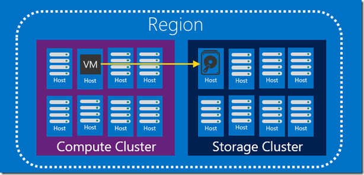
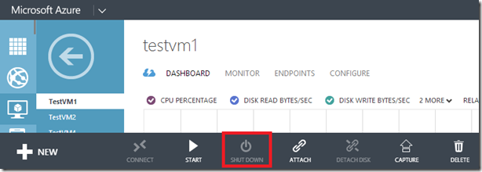
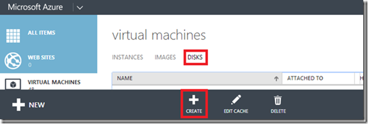
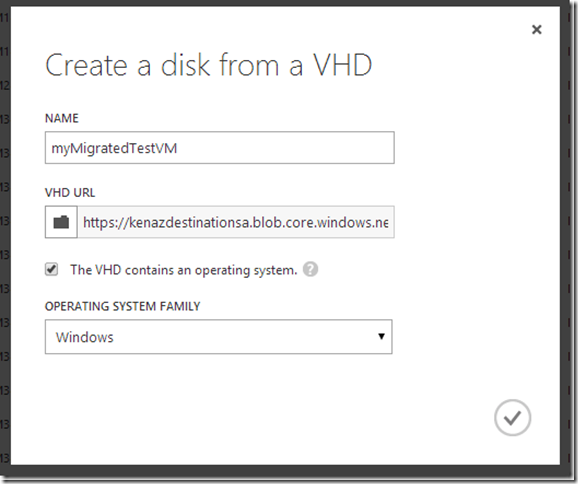
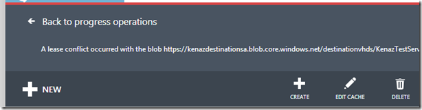
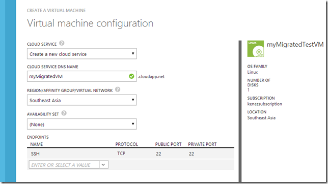

<properties 
	pageTitle="存储账户之间转移虚拟机" 
	description="存储账户之间转移虚拟机" 
	services="virtual machine" 
	documentationCenter="" 
	authors=""
	manager="" 
	editor=""/>
<tags ms.service="virtual-machine-aog" ms.date="" wacn.date="12/05/2016"/>
# 存储账户之间转移虚拟机 #

Azure 中一个常见的任务就是将虚拟机从一个存储账号转移到另一个。在我们深入了解这些步骤之前，简要的回顾一下 Azure 虚拟机是如何被创建的。当您在创建一台 Azure 虚拟机时，有两个服务会协同工作来创建该虚拟机：计算和存储。在存储方面，Azure 存储服务会在您的一个账户中创建一个 VHD。该 VHD 的物理节点是存储在您指定用于放置虚拟机的区域。在计算方面，我们在第二个群集中找到一个物理节点用于放置您的虚拟机。当 VM 在该群集中启动时，它会和存储服务创建连接并且从该 VHD 启动。当创建一个虚拟机时，我们要求您创建该 VM 时的 VHD 所位于的存储账户在同一区域，这是为了确保当虚拟机和存储账户通讯时能够保持性能一致性。

有了这个背景之后，让我们通过以下步骤将虚拟机从一个区域转移到另一个：

1. 停止虚拟机
2. 将 VHD blob 从源区域的存储账户复制到目标区域的存储账户
3. 通过该 blob 创建虚拟机磁盘
4. 从该磁盘启动虚拟机

## 停止虚拟机 ##

在管理门户界面，选择您需要转移的虚拟机，在控制菜单中选择 关闭。

或者使用 Azure PowerShell cmdlet 来完成相同的操作：

	$servicename = "KenazTestService"
	$vmname = "TestVM1"
	Get-AzureVM -ServiceName $servicename -Name $vmname | Stop-AzureVM

当您进行复制操作时，一个必要的步骤是关闭虚拟机以保证文件系统的一致性。Azure 目前还不支持虚拟机的实时转移。该操作意味着您在将一个专用的 VM 从一个区域转移到另一个 。如果您想要通过一个通用的映像创建 VM ，在虚拟机停止之前使用系统准备工具（sys-prep）对映像进行一般化处理。 

## 复制 VHD blob ##

Azure 存储服务提供了将 Blob 从一个存储账户移动到另一个的功能，我们需要执行以下步骤来完成该操作：

1. 确定源存储账户信息；
2. 确定目标存储账户信息；
3. 确保目标存储账户中存在目标容器；
4. 执行 Blob 复制操作。

>注意：在位于不同区域的存储账户之间复制 blob 时，根据该 blob 的大小会出现花费一个小时或更长的时间的情况。执行该操作最便捷的方式是通过 Azure PowerShell： 

	Select-AzureSubscription "kenazsubscription" 
	
	# VHD blob to copy #
	$blobName = "KenazTestService-TestVM1-2014-8-26-15-1-55-658-0.vhd" 
	
	# Source Storage Account Information #
	$sourceStorageAccountName = "kenazsa"
	$sourceKey = "MySourceStorageAccountKey"
	$sourceContext = New-AzureStorageContext –StorageAccountName $sourceStorageAccountName -StorageAccountKey $sourceKey  
	$sourceContainer = "vhds"
	
	# Destination Storage Account Information #
	$destinationStorageAccountName = "kenazdestinationsa"
	$destinationKey = "MyDestinationStorageAccountKey"
	$destinationContext = New-AzureStorageContext –StorageAccountName $destinationStorageAccountName -StorageAccountKey $destinationKey  
	
	# Create the destination container #
	$destinationContainerName = "destinationvhds"
	New-AzureStorageContainer -Name $destinationContainerName -Context $destinationContext 
	
	# Copy the blob # 
	$blobCopy = Start-AzureStorageBlobCopy -DestContainer $destinationContainerName `
	                        -DestContext $destinationContext `
	                        -SrcBlob $blobName `
	                        -Context $sourceContext `
	                        -SrcContainer $sourceContainer

执行以上命令将会开始从您的源账户向目标账户进行 blob 的复制操作，此时，您可能需要稍作等待以确保 blob 能够完全的复制。如您需要查看该操作的状态，您可以使用以下命令。

	while(($blobCopy | Get-AzureStorageBlobCopyState).Status -eq "Pending")
	{
	    Start-Sleep -s 30
	    $blobCopy | Get-AzureStorageBlobCopyState
	}

}

当完成 blob 复制操作后，该状态将变为“成功”。更详细的 VHD 拷贝操作示例可以参考  “[Azure 虚拟机: 跨存储账户拷贝 VHDS](https://gallery.technet.microsoft.com/scriptcenter/Azure-Virtual-Machine-Copy-1041199c)” 。

## 使用 AzCopy 复制 blob ##

另一种方式可以使用 AzCopy 工具（[下载地址](http://aka.ms/downloadazcopy)）,下面同样是存储账户间 blob 复制的命令：

	AzCopy https://sourceaccount.blob.core.chinacloudapi.cn/mycontainer1 https://destaccount.blob.core.chinacloudapi.cn/mycontainer2 /sourcekey:key1 /destkey:key2 abc.txt

关于如何在不同场景使用 AzCopy 工具更详细的信息，请查看“[使用 AzCopy 命令行工具入门](/documentation/articles/storage-use-azcopy/)”。

## 创建虚拟机磁盘 ##

此时，您复制到目标存储账户中的 blob 仍然只是一个 blob， 为了可以从该 blob 启动，您需要通过该 blob 创建一个虚拟机磁盘。导航至虚拟机 磁盘 部分并且选择 创建。

>注意：以上指令是特定的用于专用的 VMs，如您想要使该 VHD 作为映像来加载，您需要重启 VM， 使用 sysperp 工具一般化处理，复制 blob，然后作为映像添加（而非磁盘）。

在 VHD URL 选项处选择目标容器中复制的 blob，勾选选项“ VHD 包含操作系统”，这向 Azure 表明您所创建的磁盘对象是用作 OS 磁盘使用的，而非作为数据磁盘使用。

>注意：如果遇到该错误提示“ Blob 发生租约冲突….”，返回上一步确认该 blob 复制操作已经完成。

或者，您可以通过 执行 PowerShell 命令来进行相同的操作。

	Add-AzureDisk -DiskName "myMigratedTestVM" `
	            -OS Linux `
	            -MediaLocation "https://kenazdestinationsa.blob.core.chinacloudapi.cn/destinationvhds/KenazTestService-TestVM1-2014-8-26-16-16-48-522-0.vhd" `
	            -Verbose

以上步骤完成后，该磁盘将出现在虚拟机 磁盘 部分。

## 创建虚拟机 ##

此时，您可以使用之前创建好的磁盘来创建虚拟机，在经典管理门户中，选择从库中创建虚拟机并且在我的磁盘下选择您创建好的磁盘。

>注意：如果您转移的虚拟机有一个已经配置好的存储池（或者需要磁盘驱动器的字母排序保持不变），记录下 VHD 映射到源 VM 的 LUN 编号，并且确保数据磁盘在目标虚拟机上被附加到了同样的 LUN 编号上。

现在虚拟机已经在目标存储账户中运行了。

