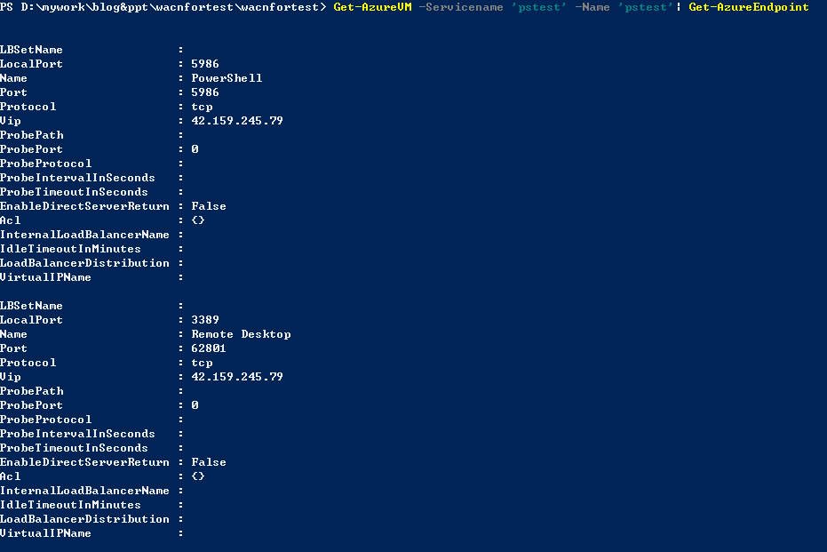
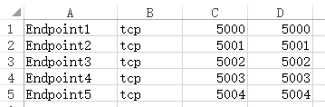
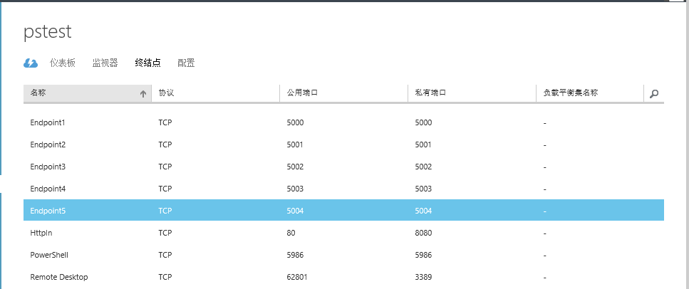

<properties 
	pageTitle="通过 PowerShell 的方式增加虚拟机终结点" 
	description="如何通过 ps 为虚拟机增加终结点" 
	services="virtual machine" 
	documentationCenter="" 
	authors=""
	manager="" 
	editor=""/>
<tags ms.service="virtual-machine-aog" ms.date="" wacn.date="02/01/2016"/>

#通过 PowerShell 的方式增加虚拟机终结点

关于虚拟机终结点的概念请阅读：[如何设置虚拟机的终结点](/documentation/articles/virtual-machines-windows-classic-setup-endpoints/)

本文包含以下内容（本文在名称为"pstest"的虚拟机做测试）：

- 通过 PowerShell 的方式增加终结点
- 通过 PowerShell 脚本批量的增加终结点

##通过 PowerShell 的方式增加终结点

>使用 Powershell 前有关 Azure PowerShell 的安装、配置和连接到订阅请阅读[这篇文章](/documentation/articles/powershell-install-configure/)

####查看当前虚拟机终结点

相关指令：[Get-AzureVM](https://msdn.microsoft.com/zh-cn/library/azure/dn495236.aspx)、[Get-AzureEndpoint](https://msdn.microsoft.com/zh-cn/library/azure/dn495158.aspx)

	#servicename 为虚拟机对应的云服务的名称
	#name 为虚拟机的名称
	Get-AzureVM -Servicename 'pstest' -Name 'pstest'| Get-AzureEndpoint
	

从上面信息可以看到目前虚拟机上拥有两个终结点：PowerShell 和 Remote Desktop。现在通过 PowerShell 增加终结点。

####添加虚拟机终结点

相关指令：[Add-AzureEndpoint](https://msdn.microsoft.com/zh-cn/library/azure/dn495300.aspx)、[Update-AzureVM](https://msdn.microsoft.com/zh-cn/library/azure/dn495230.aspx)

	Get-AzureVM -ServiceName "pstest" -Name "pstest" | Add-AzureEndpoint -Name "HttpIn" -Protocol "tcp" -PublicPort 80 -LocalPort 8080 | Update-AzureVM

该指令在虚拟机上增加了一个终结点，名称 HttpIn,协议 tcp，公用端口 80，私有端口 8080。可以通过 Get-AzureEndpoint 查看结果。

**注意**：增加终结点的操作不会引起虚拟机重启，也不需要虚拟机重启。

##通过 PowerShell 脚本批量的增加终结点

首先在 Excel 输入需要一次性添加的终结点，然后以 csv 文件格式导出。关于在 PowerShell 中导入 .csv 文件请阅读[这篇文章](https://technet.microsoft.com/zh-cn/library/ee176874.aspx).

	$vm = Get-AzureVM -Servicename 'pstest' -Name 'pstest'
	$csvFile = 'D:\endpoint.csv'
	$endpoints = Import-Csv $csvFile -header Name,Protocol,PublicPort,LocalPort | foreach {
        New-Object PSObject -prop @{
            Name = $_.Name;
            Protocol = $_.Protocol;
            PublicPort = [int32]$_.PublicPort;
            LocalPort = [int32]$_.LocalPort;
        }
    }
	Foreach ($endpoint in $endpoints)
    {
    Add-AzureEndpoint -VM $vm -Name $endpoint.Name -Protocol $endpoint.Protocol.ToLower() -PublicPort $endpoint.PublicPort -LocalPort $endpoint.LocalPort | Update-AzureVM
    }

在经典管理门户网站上可以看到最终结果：

