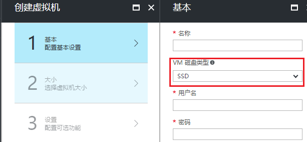
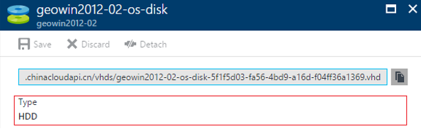
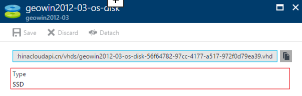

<properties
    pageTitle="Java 创建 ARM 虚拟机磁盘类型选择的问题"
    description="Java 创建 ARM 虚拟机磁盘类型选择的问题"
    service=""
    resource="virtualmachines"
    authors="Chen Rui"
    displayOrder=""
    selfHelpType=""
    supportTopicIds=""
    productPesIds=""
    resourceTags="Virtual Machines, ARM, Java, Disk Type"
    cloudEnvironments="MoonCake" />
<tags
    ms.service="virtual-machines-aog"
    ms.date=""
    wacn.date="04/18/2017" />

# Java 创建 ARM 虚拟机磁盘类型选择的问题

## **问题描述**

在[Azure 门户](https://portal.azure.cn/)创建 ARM 虚拟机时，我们直接可以选择虚拟机的磁盘类型，但是在 [Azure Management Libraries for Java](https://github.com/Azure/azure-sdk-for-java) 的 API 中我们无法找到直接设置磁盘类型的 API.默认创建的磁盘类型是 HDD，如何通过 API 设置磁盘类型？

## **问题分析**

系统磁盘或数据磁盘的类型取决于使用的存储账户类型，如果是基于普通存储账户创建的磁盘，则磁盘类型为 HDD；如果是基于高级存储创建的磁盘，则磁盘类型为 SDD。更多信息参考：

- [关于 Azure Windows VM 的磁盘和 VHD（磁盘类型小节）](/documentation/articles/storage-about-disks-and-vhds-windows/)
- [高性能高级存储以及非托管 Azure VM 磁盘](/documentation/articles/storage-premium-storage/)

## **解决方法**

### 认证凭据

在使用 Azure Management Libraries for Java 时，我们需要通过 AD Application 进行授权认证。建议使用最新版 Powershell 按以下脚本操作：

    # 1.在 PowerShell 中，登录 Azure 账户
    Login-AzureRmAccount -EnvironmentName AzureChinaCloud

    # 2.选择当前订阅 ID
    Set-AzureRmContext -SubscriptionId "订阅 ID"

    # 3.创建 AD Application
    $azureAdApplication = New-AzureRmADApplication -DisplayName "georgeapp" -HomePage "https://www.georgeapp.org" -IdentifierUris "https://www.georgeapp.org/example" -Password "1QAZxsw2"
    $azureAdApplication

    # 4.为你的 AD 应用创建服务凭证
    New-AzureRmADServicePrincipal -ApplicationId $azureAdApplication.ApplicationId

    # 5.为服务凭证授权。如果想了解更多内容，请参考：https://azure.microsoft.com/en-us/documentation/articles/role-based-access-control-what-is/
    New-AzureRmRoleAssignment -RoleDefinitionName Contributor -ServicePrincipalName $azureAdApplication.ApplicationId

执行上述操作后，就可以获取可用的认证凭据信息：

- tentant-id：第二步执行完成后返回
- application-id：第三步执行完成后返回
- application-password：第三步中设置的 Password

### 代码实现

    public void createWindows(
    String resourceGroupName,
    String vmName,
    String vmStorageAccountName,
    String vmUserName,
    String vmPassword,
    KnownWindowsVirtualMachineImage vmImage,
    Region vmRegion,
    VirtualMachineSizeTypes vmSize) throws Exception {

    if (azure == null) {
        return;
    }

    StorageAccount storageAccount =azure
    .storageAccounts()
    .getByGroup(resourceGroupName, vmStorageAccountName);
    VirtualMachine windowsVM = azure
    .virtualMachines()
    .define(vmName)
    .withRegion(vmRegion)
    .withNewResourceGroup(resourceGroupName)
    .withNewPrimaryNetwork("10.0.0.0/28")
    .withPrimaryPrivateIpAddressDynamic()
    .withoutPrimaryPublicIpAddress()
    .withPopularWindowsImage(vmImage)
    .withAdminUserName(vmUserName)
    .withPassword(vmPassword)
    .withNewDataDisk(10)
    .withExistingStorageAccount(storageAccount)
    .withSize(vmSize).create();
    }

    @org.junit.Test
    public void test() throws Exception {
    VmOperation vmOp = new VmOperation(
    "tentant-id",
    "application-id",
    "application-password",
    "subId");

    vmOp.createWindows(
    "资源组",
    "虚拟机名称",
    "存储账户名称",
    "虚拟机 RDP 用户名",
    "虚拟机 RDP 密码",
    "虚拟机 Image",
    "虚拟机 Region",
    "虚拟机 Size");

### 测试结果

- 设定为普通存储账户

    

- 设定为高级存储账户

    