<properties
    pageTitle="如何解决虚拟机频繁分离和附加磁盘导致的识别错误"
    description="如何解决 Linux（CentOS 6.5）频繁分离和附加磁盘导致识别错误的现象"
    service=""
    resource="virtualmachines"
    authors="Qi Li"
    displayOrder=""
    selfHelpType=""
    supportTopicIds=""
    productPesIds=""
    resourceTags="Virtual Machines, CentOS, Disk"
    cloudEnvironments="MoonCake" />
<tags
    ms.service="virtual-machines-linux-aog"
    ms.date=""
    wacn.date="04/27/2017" />

# 如何解决虚拟机频繁分离和附加磁盘导致的识别错误

## **问题描述**

CentOS 6.5 （2.6.32-431.29.2.el6.x86_64）中正常启动时附带两块数据磁盘 A 和 B，大小为 10G 和 50G，分别对应 OS 中的 sdc 和 sdd。开机状态下，在很短时间内先后将磁盘 A 和 B 分离，再将磁盘 B 附加上去。此时系统中使用 fdisk，看到磁盘 B（50G）已经映射为盘符 sdc，但磁盘信息还是磁盘 A（10G）的信息。且无法对 B 磁盘的文件系统进行正常操作，如 mount。

### 操作前

从平台层面观察数据磁盘信息，注意磁盘名，LUN ID 和 Disk size 的对应。

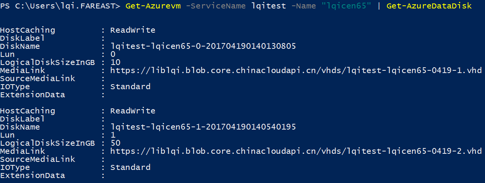

    #fdisk -l

系统层面扫描到的磁盘信息

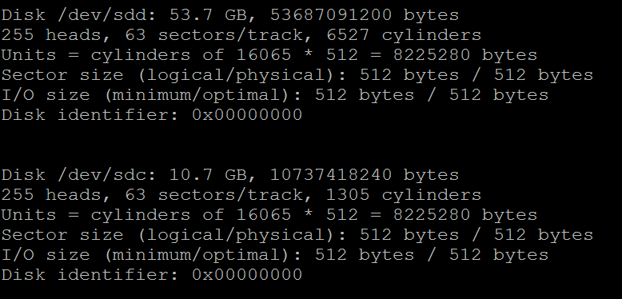

    #dumpe2fs

文件系统信息。

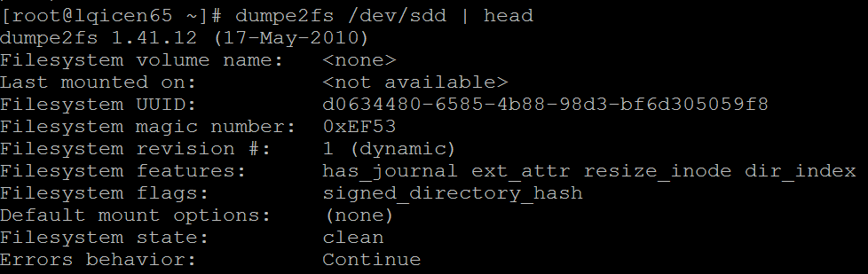

    #lsblk

查看块设备。注意 MAJ:MIN 和 SIZE 代表的主要：次要驱动号和磁盘尺寸。

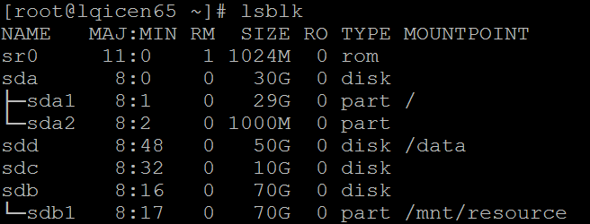

### 操作后

在门户中连续执行分离磁盘 A 和 B，再附加磁盘 B 的操作。

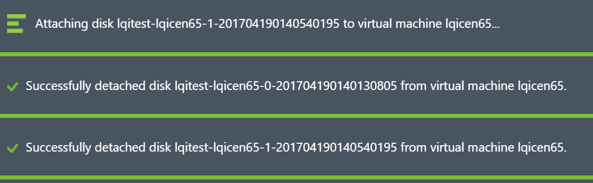

从平台层面观察数据磁盘信息，注意磁盘名，LUN ID 和 Disk size 的变化，这表示该虚拟机只有一块 50GB 的数据磁盘。

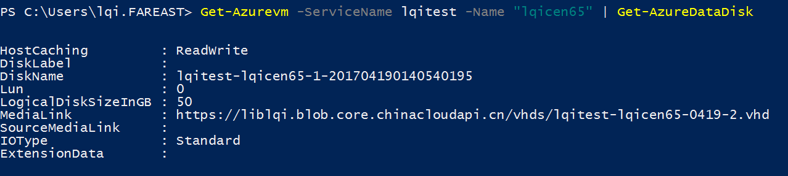

系统内运行 `mount` 和 `fdisk` 查看挂载和磁盘信息。

sdd 还挂载在 /data 上。但已经无法正常工作，任何操作会报 IO 错误。

`fdisk` 显示数据磁盘 sdc 的大小还是磁盘 A 的信息（我们挂载的是磁盘 B）。

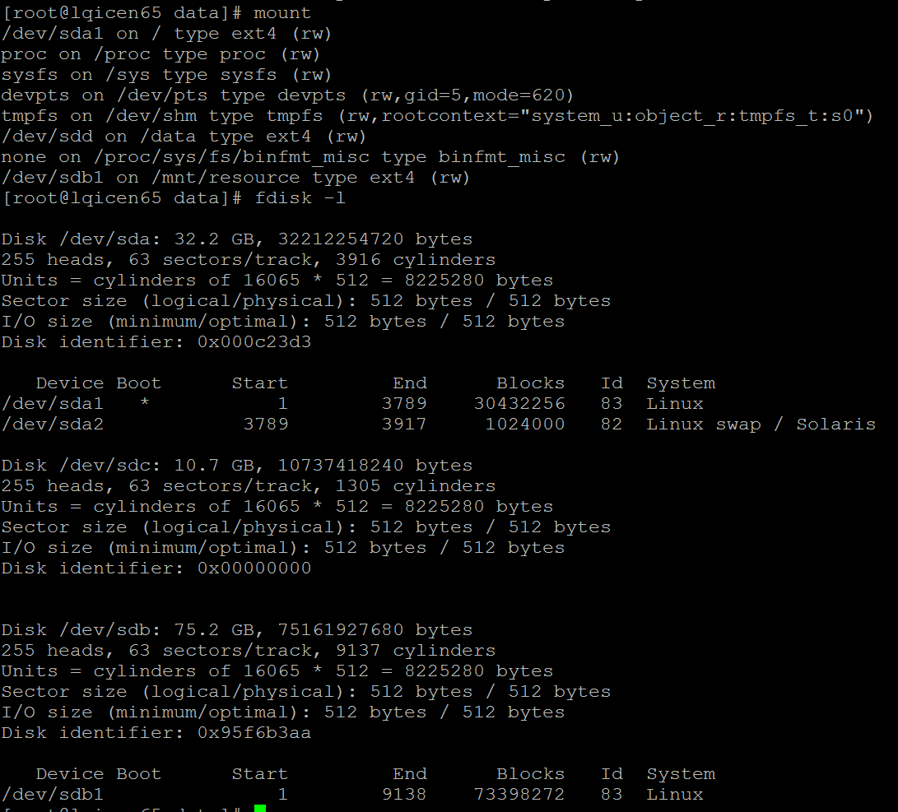

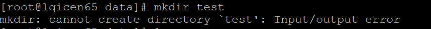

而对应该成为 sdc 的 B 磁盘进行挂载会发现读取不到文件系统信息。

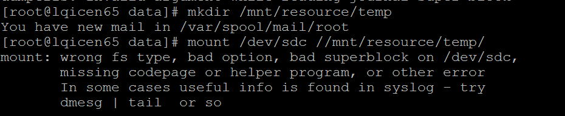

`#lsblk` 信息也未更正。

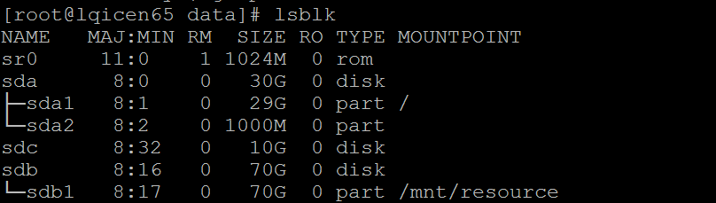

## **问题分析**

对磁盘进行分离和附加的操作间隔时间太小，该案例中 3 分钟内完成了三次操作；导致内核对磁盘的信息未得到及时更新。误认为被附加回的磁盘还是原来的磁盘，但因为磁盘的几何构造发生了变化，因此导致冲突。文件系统也无法正确识别出来。

## **解决方法**

通过下面命令强制对该设备进行刷新，使内核重新读取其构造信息。

    echo 1 > /sys/class/scsi_device/<device>/device/rescan

[AZURE.NOTE]device 为磁盘的 SCSI 地址。

这里我们的测试结果。

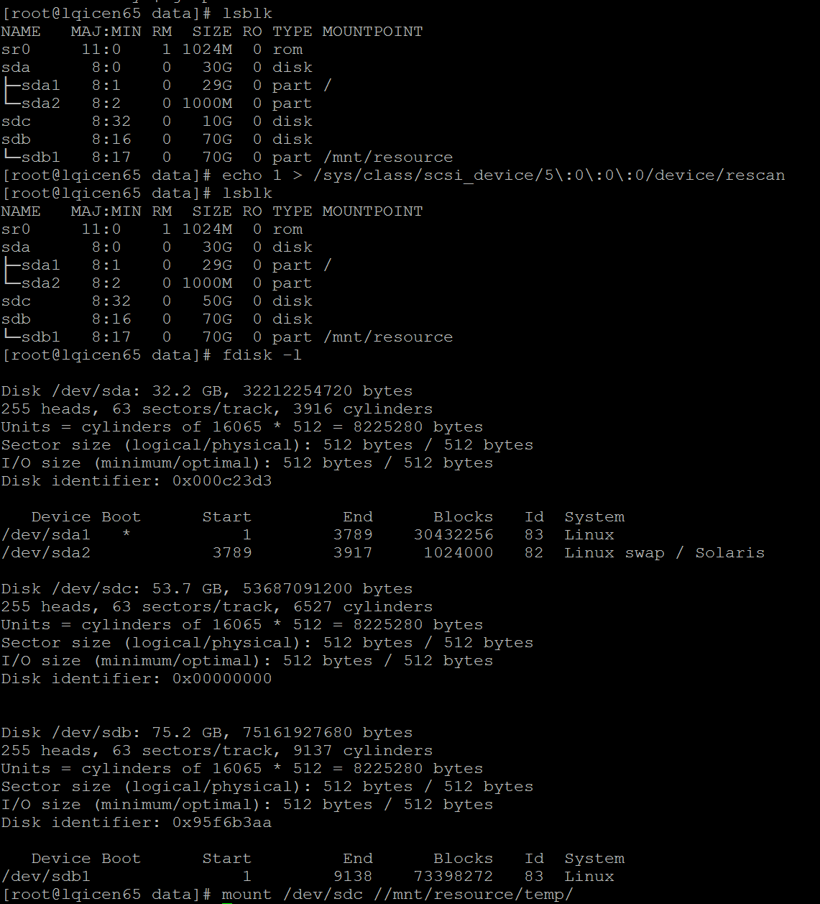

