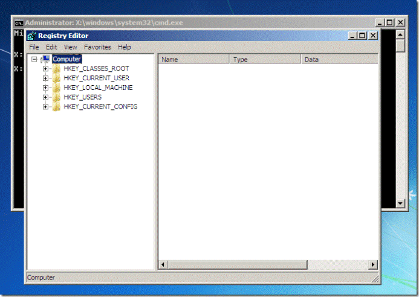
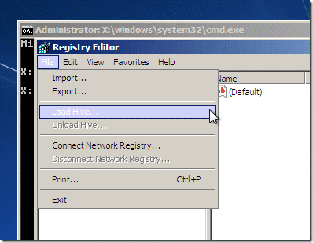
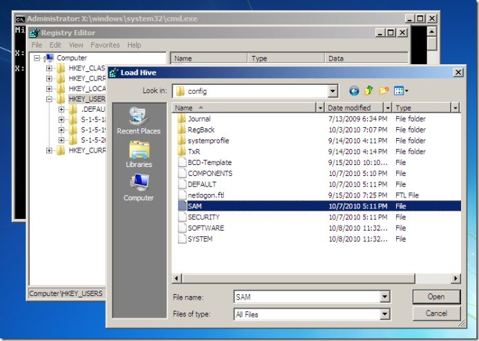
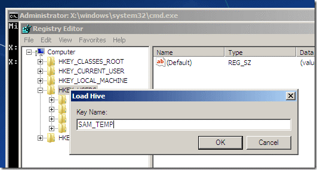
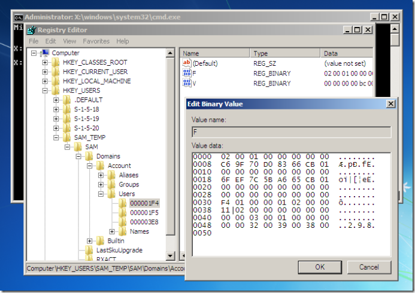
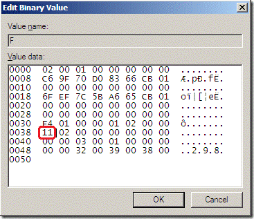
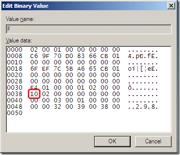

<properties
	pageTitle="如何通过修改注册表的方式解锁被锁定的用户"
	description="通过修改注册表的方式修复意外操作导致用户的锁定"
	services="virtual-machines"
	documentationCenter=""
	authors=""
	manager=""
	editor=""
	tags="虚拟机,regedit,SAM"/>

<tags
    ms.service="virtual-machines-aog"
    ms.date="12/08/2016"
    wacn.date="12/08/2016"/>

# 如何通过修改注册表的方式解锁被锁定的用户 #

### 问题描述 ###

在很多情况下，由于意外操作或者本地安全组策略，将管理员或其他用户锁定，导致无法正确访问 windows 虚拟机。

### 解决方法 ###

以下方案为通过修改注册表的方式，解锁上述被锁定的用户：

1. 删除 windows 虚拟机，保留磁盘；
2. 将系统盘挂载到临时虚拟机，假定挂载点为临时虚拟机上的 F 盘；
3. 以管理员身份登陆临时虚拟机；
4. 打开注册表编辑器；

	

6. 选择 HKEY_USERS，然后点击左上角 FILE 菜单，选择 Load Hive；

	

8. 在打开的窗口里，进入目录 F:\Windows\System32\Config，选择 SAM 文件，并点击打开；

	

10. 在键值输入框里输入 SAM_TEMP (或者其他任意名称)，点击 OK；

	

12. 展开 SAM 注册表键值 `SAM_TEMP\SAM\Domains\Account\Users\000001F4`，双击”F”键值；

	

14. 修改 0038 行的值 11 为 10，然后点击 OK；

	
	

16. 返回选择 SAM_TEMP，点击左上角 FILE 菜单,选择 Unload Hive，点击 Yes 确认；
17. 分离磁盘，并基于该磁盘新建虚拟机，再次尝试用相同的用户登陆该虚拟机。
