<properties
	pageTitle="Windows RDP 证书问题导致无法远程了连接解决方案"
	description="Windows RDP 证书问题导致无法远程了连接解决方案"
	service=""
	resource="virtualmachines"
	authors=""
	displayOrder=""
	selfHelpType=""
	supportTopicIds=""
	productPesIds=""
	resourceTags="Virtual Machines, Windows, RDP"
	cloudEnvironments="MoonCake" />
<tags 
	ms.service="virtual-machines-windows-aog"
	ms.date=""
	wacn.date="02/07/2017" />
# Windows RDP 证书问题导致无法远程了连接解决方案

## **问题描述**

虚拟机无法 RDP 连接。 
客户截图现象如下：

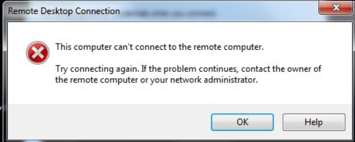

## **问题分析**

1.	Azure 平台查看状态健康，并已经启动。

	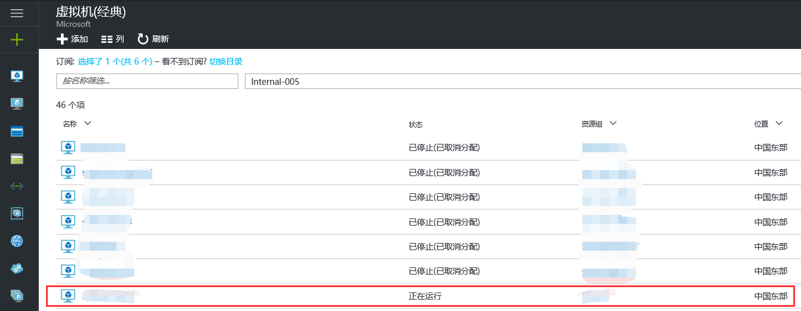

2.	测试网络虚拟机网卡 3389 端口可以通讯，所有端口正常。

	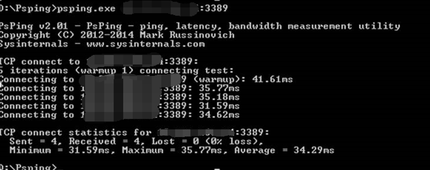

3.	后台抓取虚拟机截图，发现虚拟机已经启动。

	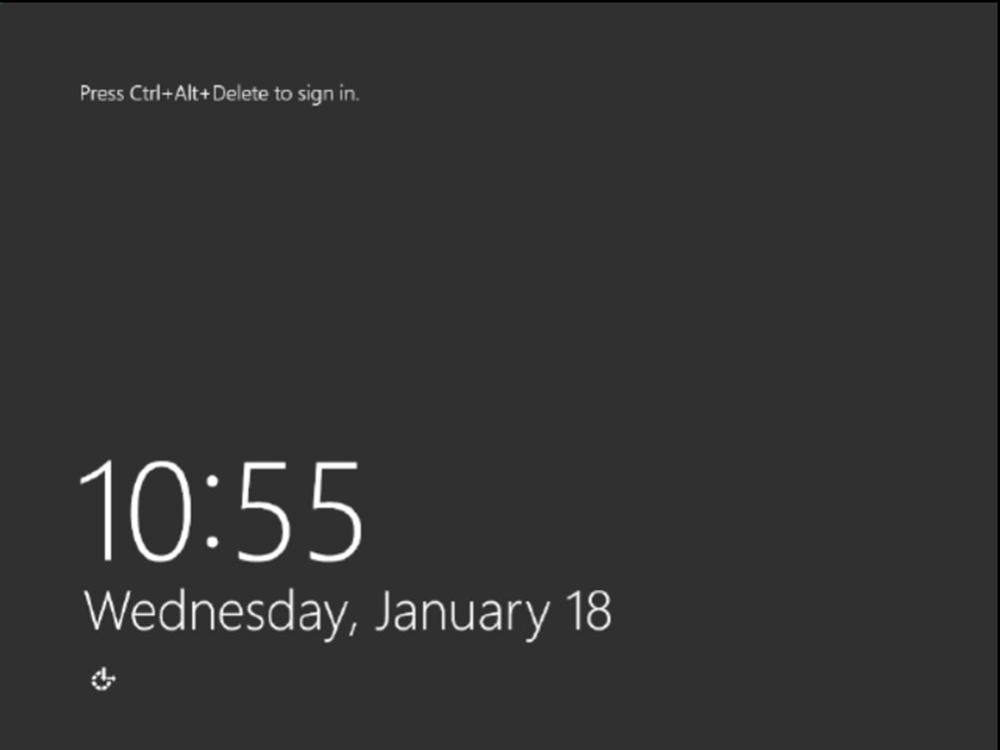

以上初步排查看上去毫无问题。 
但依然无法 RDP 连接。

后续步骤：检查系统配置，软件等，重启 RDP 服务，网卡，重启虚拟机，依然无法解决。

`Netstat -ano` 发现很多 `CLOSE-WAIT`:

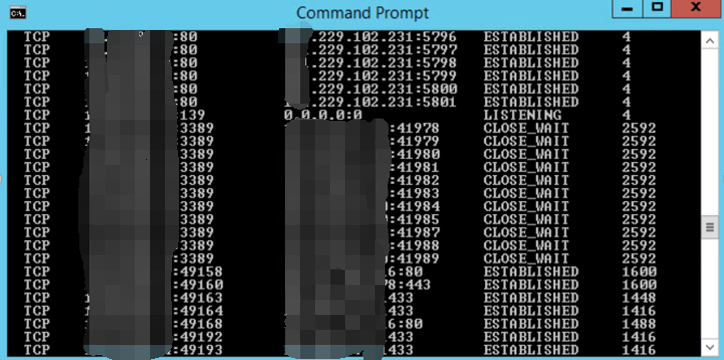

系统日志很多报错 :

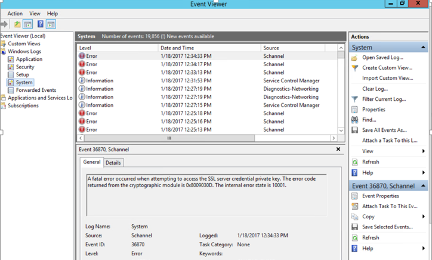

## **解决方法**

微软官网问题原因 参考链接：[https://technet.microsoft.com/zh-cn/library/dn786445(v=ws.11).aspx#BKMK_36870](https://technet.microsoft.com/zh-cn/library/dn786445(v=ws.11).aspx#BKMK_36870)

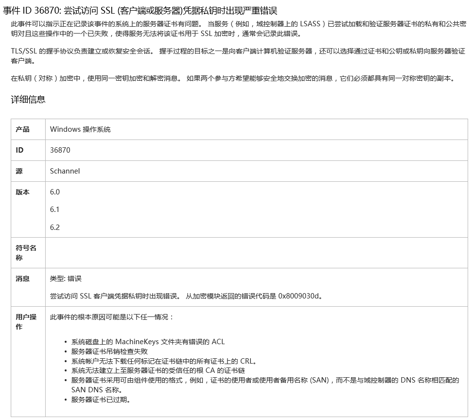

经排查系统日志发现: 
RDP 证书异常,每次使用 RDP 连接后,系统日志中就会自动生产如下 Error 日志:

可以通过将 VHD 下载到本地挂载 Hpyer-V 自行解决，也可以联系微软 Azure 技术支持团队 console 后台进入虚拟机。

**操作步骤如下：** 

在问题虚拟机中打开 MMC 控制台，

	Go to file/ add remove snap-in
	Select certificates 
	Select computer account
	Select local computer
	Click on finish
	Click on OK

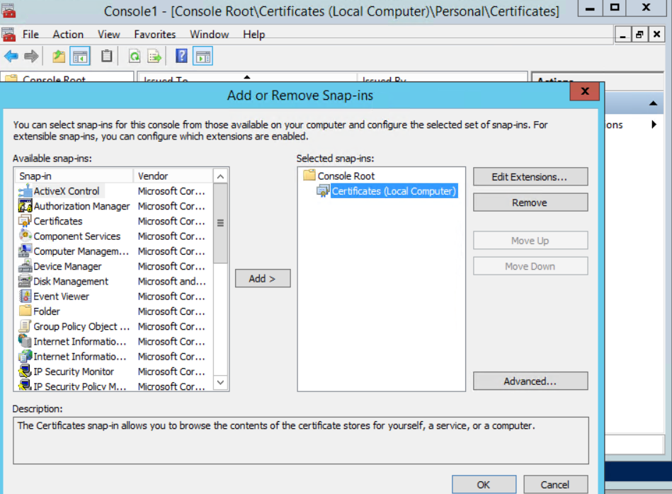

复制 RDP 证书，如图： 
展开 / Personal / Certificates 复制 RDP 证书 :

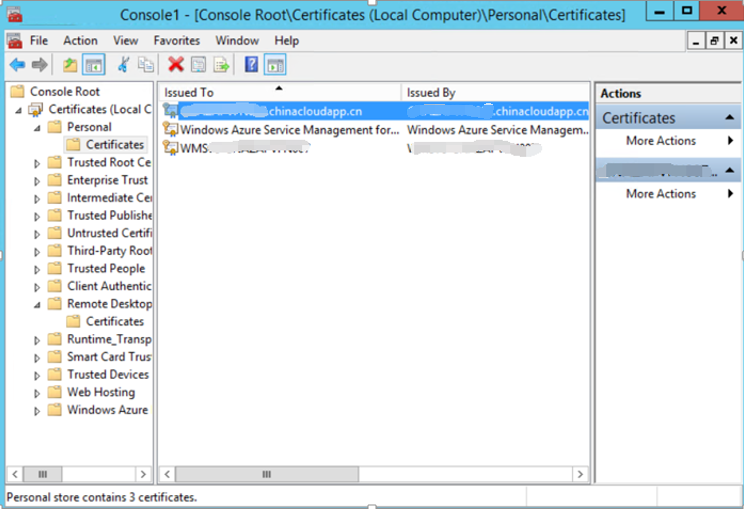

粘贴到 Remote Desktop 下 :

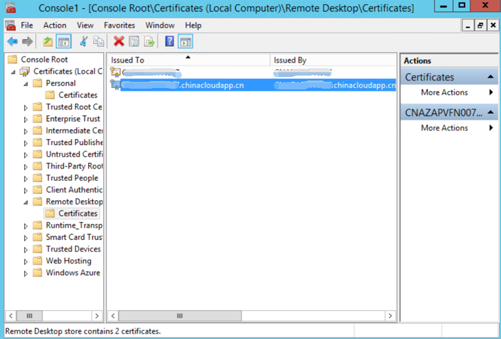

双击打开证书，选择 Details 下 Thumbprint 复制其中数值 :

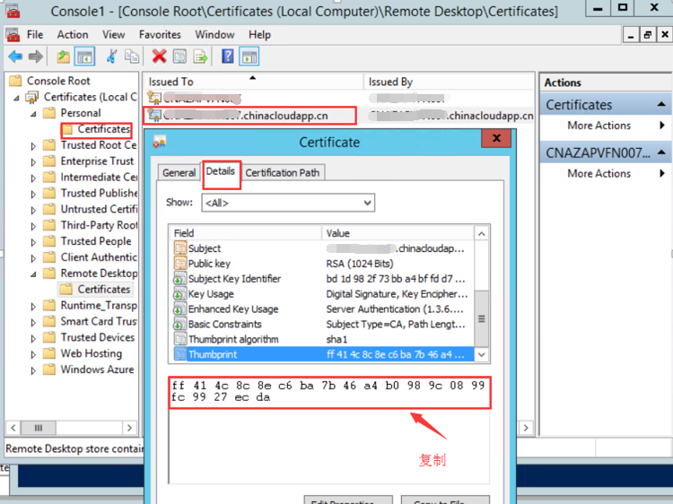

以管理员身份运行 PowerShell :

	$hash = read-host "Enter Certificate thumbprint: "
	wmic /namespace:\\root\cimv2\TerminalServices PATH Win32_TSGeneralSetting Set SSLCertificateSHA1Hash="$hash"

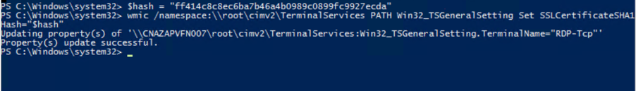

更新 RDP 证书后，可以成功连接虚拟机 RDP 服务。

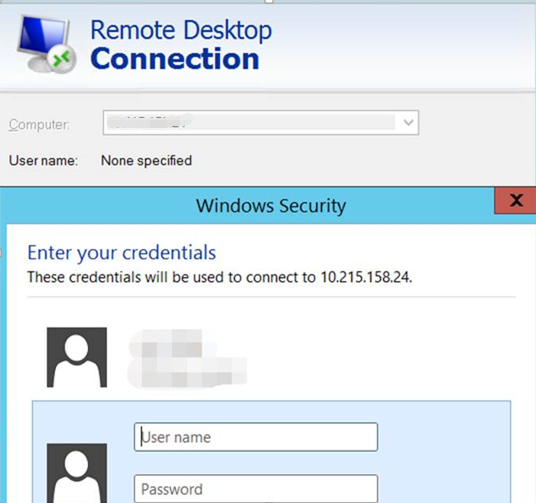