<properties
    pageTitle="Azure 中快速搭建 FTPS 服务"
    description="Azure 中快速搭建 FTPS 服务"
    service=""
    resource="virtualmachines"
    authors="Kyle Fu"
    displayOrder=""
    selfHelpType=""
    supportTopicIds=""
    productPesIds=""
    resourceTags="Virtual machines, FTP, FTPS, SFTP"
    cloudEnvironments="MoonCake" />
<tags
    ms.service="virtual-machines-aog"
    ms.date=""
    wacn.date="03/16/2017" />
# Azure 中快速搭建 FTPS 服务

## FTP，FTPS 与 SFTP 的区别

FTP （File Transfer Protocol）是一种常用的文件传输协议，在日常工作中被广泛应用。不过，FTP 协议使用明文传输。如果文件传输发生在公网，会将所有密码凭据、操作指令，以及传输的文件内容，都以明文的方式暴露出来，特别是在公有云广泛应用的今天，这种传输方式对数据安全有极大的隐患。

针对这种情况，FTPS 和 SFTP 应运而生。虽然这两种传输方式都基于 FTP，而且名字非常相近。即便它们的目的都是为了使文件传输更安全，它们的实现原理也有很大的差别。

FTPS 全称是 File Transfer Protocol over SSL。SSL 是一个用来在安全连接中对数据进行加密和解密的协议。FTPS 使用 SSL 来加密、解密所有的数据连接，所以它的安全性比明文传输的 FTP 协议要高很多。

SFTP 全称是 Secure File Transfer Protocol，是 SSH 内嵌的协议。它借助 Linux/Unix 的 SSH 协议来加密文件传输过程。使用 SFTP 时，不需要启动 FTP 服务，只要在 SSHD 中开启了 SFTP 的相关配置，并启动 SSHD 服务即可运行。

下文中，我将介绍如何在 Azure 中快速搭建 FTPS 服务。

## 搭建步骤

### 在 Azure 中部署 Windows Server 2016 Datacenter

本文的介绍中，我在 Azure 门户预览里使用 Windows Server 2016 Datacenter 来部署承载 FTPS 服务的虚拟机。如果您使用 Windows Server 2008 或者 2012，也可以参考本文来搭建 FTPS 服务。配置过程基本一致。

虚拟机创建的过程中需要注意的是，创建公共 IP 地址时，需要使用静态 IP。这样可以确保虚拟机重启后，IP 不会改变。在后面的步骤里，这个 IP 还需要配置到 FTPS 服务的防火墙中。如果因重启而改变了， 会导致 FTPS 服务无法访问。

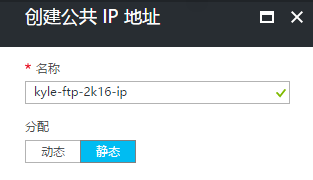

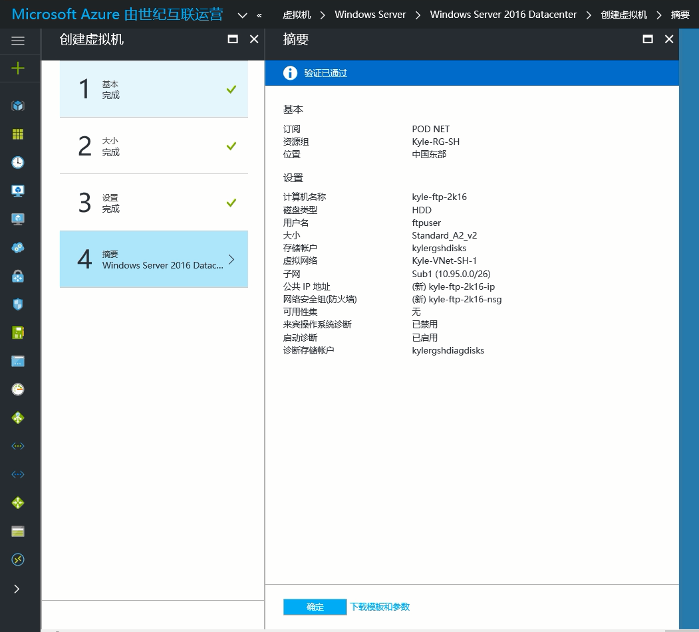

## 配置服务器角色和功能

虚拟机部署好后，使用远程桌面连接登录到这台虚拟机。
在服务器角色配置中选择 **Web Server ( IIS )**。

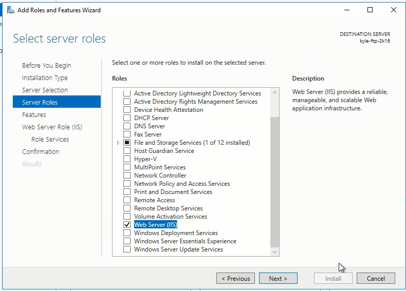

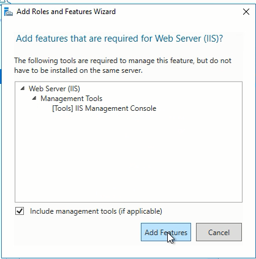

在 IIS 的角色服务配置中选择 **FTP Server**，并确保选中了 **FTP Service**。

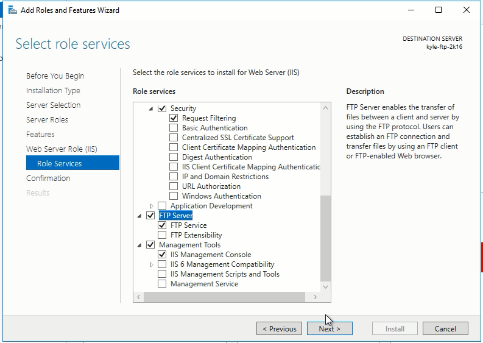

然后确认安装，并等待安装完成。

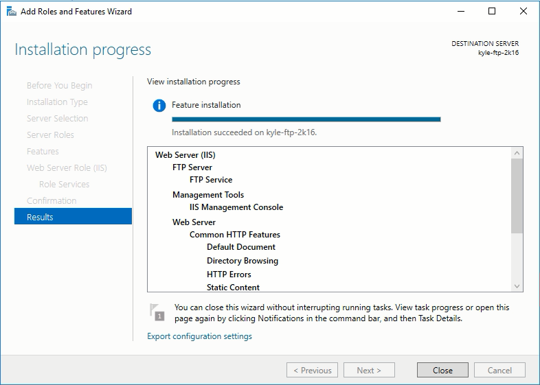

## 配置全局 FTP 防火墙规则

打开 Internet Information Services (IIS) Manager。

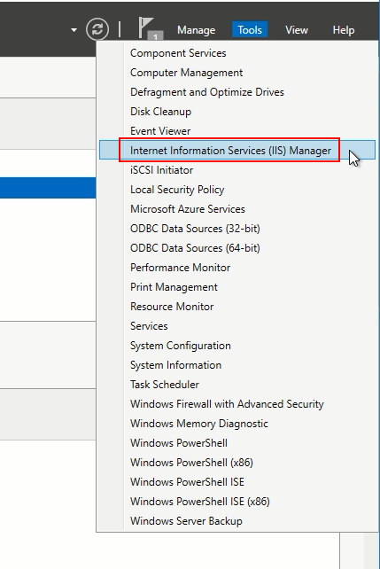

双击 **FTP Firewall Support**，打开全局 FTP 防火墙配置。在数据通道端口范围中，填入 **55000-55004**。这些端口将在 FTP 被动连接中用来传输数据。另外，将虚拟机的 **公共 IP** 地址填入外部 IP 地址框内。完成后，点击右侧的 **Apply**。弹出的对话中不用理会，直接点击 **OK** 即可。

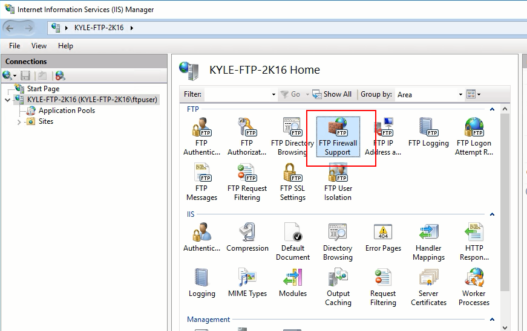

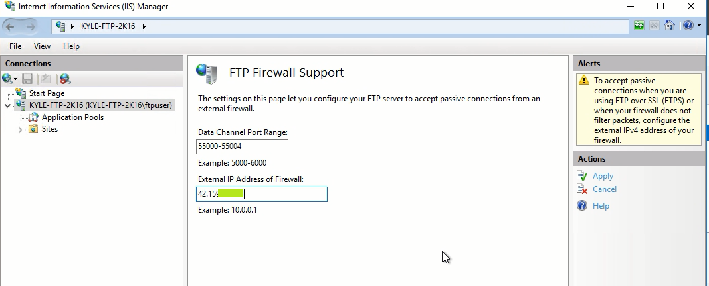

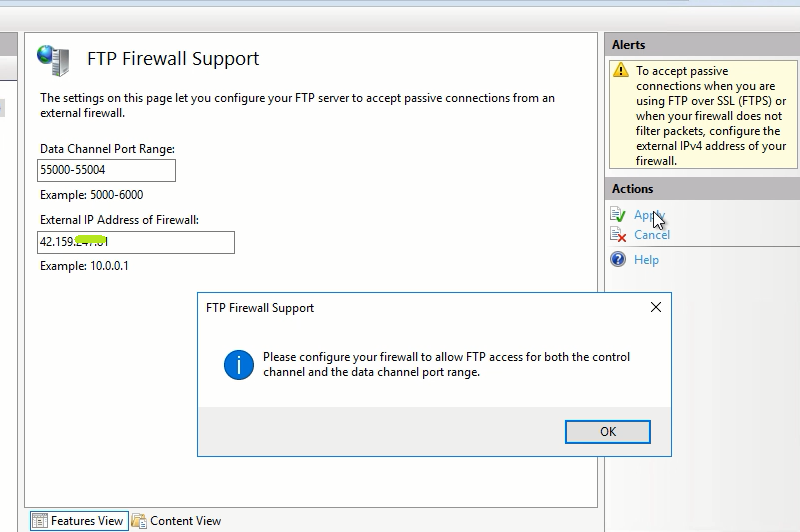

## 创建自签名证书

还是在 Internet Information Services (IIS) Manager 窗口中，双击 **Server Certificate**。然后在打开的窗口右侧点击 **Create Self-Signed Certificate…**。

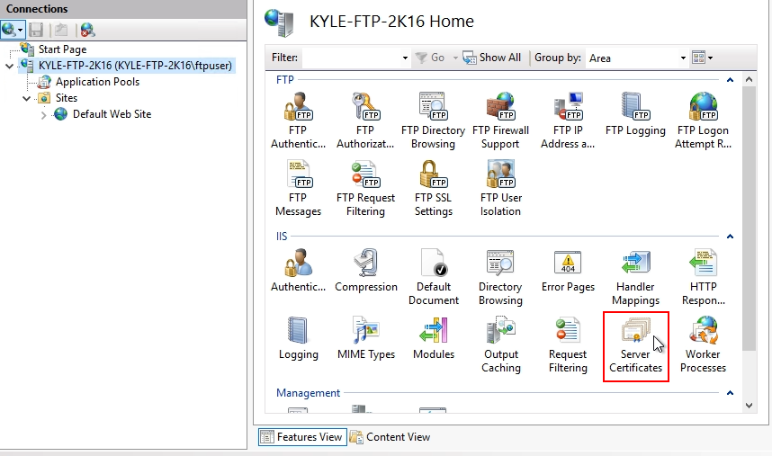

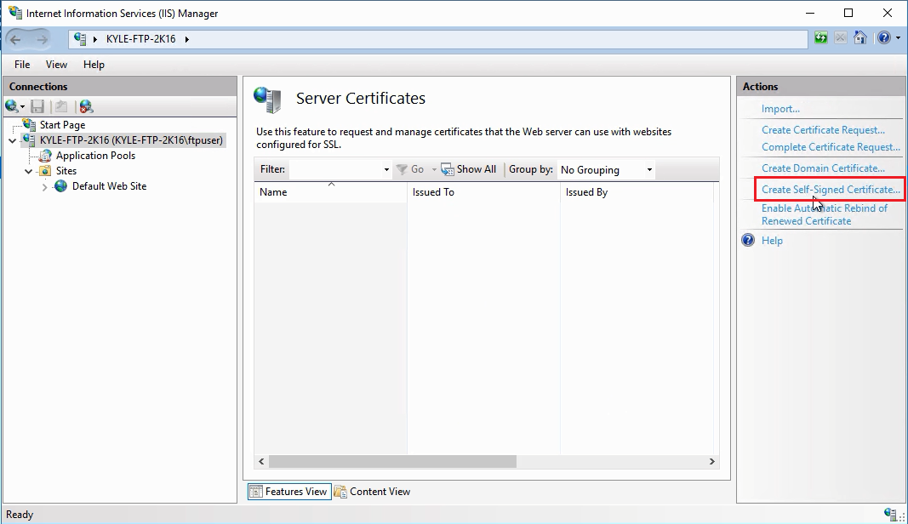

在弹出的创建证书窗口中，输入证书的名字，然后点击 OK。创建好后能在窗口中看到刚创建的自签名证书。

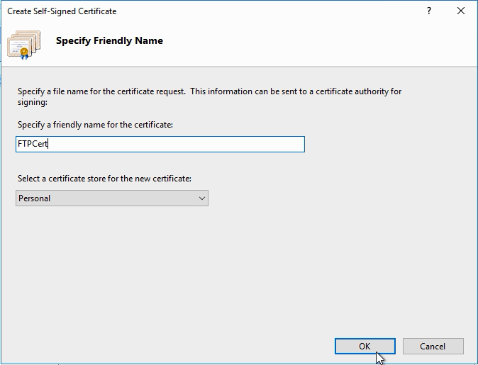

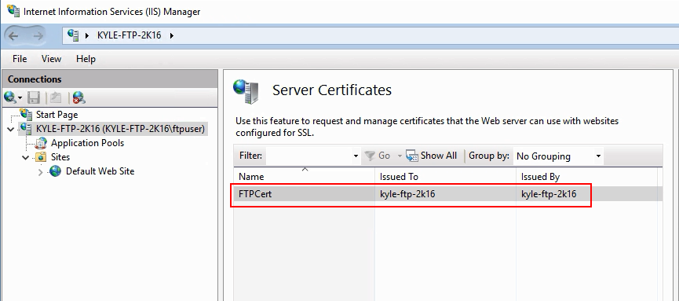

## 创建 FTP 站点

继续在 Internet Information Services (IIS) Manager 窗口中，选中 **Site**。然后在右键菜单中，点击 **Add FTP Site…**。

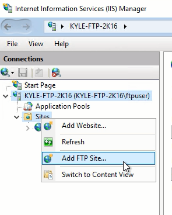

在 Add FTP Site 向导中，为 FTP 站点起个名字，并选择物理路径。
这里有两点需要注意。一是**不要将 FTP 目录放置在 D 盘**。因为 D 盘是临时盘，机器重启后，里面的文件会被全部移除。二是**所选的路径需要对 FTP 账号开放读写权限**。这里我使用登录虚拟机的管理员账号来访问 FTP。如果您使用新建的账号来登录 FTP，务必确认该账号对您配置的 FTP 目录有读写权限。

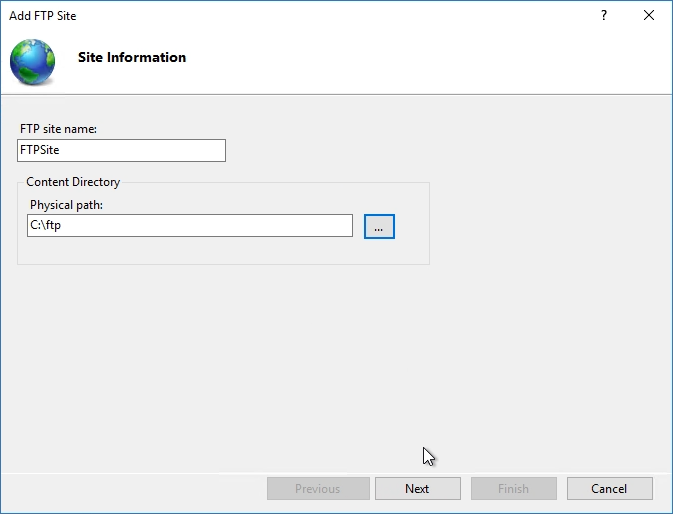

Binding and SSL Settings 步骤里，在 SSL Certificate 的下拉菜单中，选中刚才创建的自签名证书。其他配置保持不变。

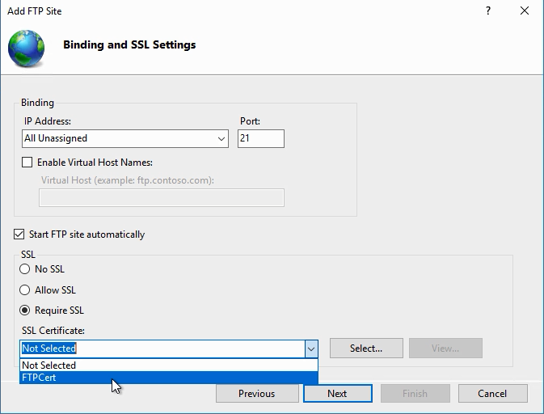

Authentication and Authorization Information 步骤中，Authentication 选择 **Basic**，这样可以使用用户名和密码来登录。Authorization 中，Allow access to 选择 **All users**, Permissions 选择 **Read** 和 **Write**。完成后点击 **Finish**。

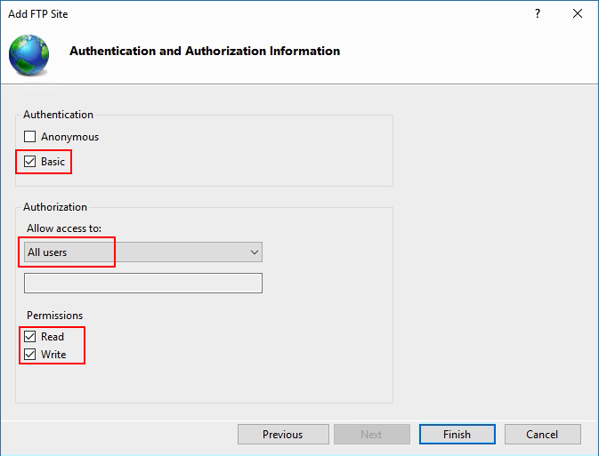

## 重启 FTP 服务

在左下角的 Windows 徽标点击右键，开启管理员模式的命令提示符窗口。

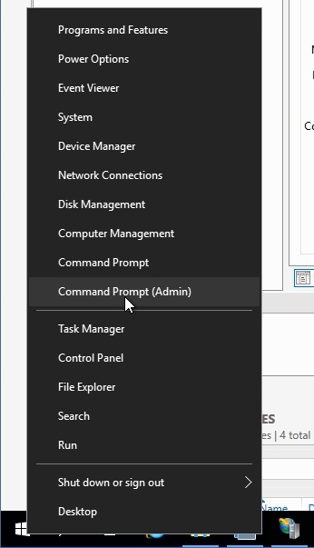

然后在命令提示符中，输入以下命令来重启 FTP 服务。重启的目的在于使之前的配置生效，特别是防火墙配置。

        net stop ftpsvc
        net start ftpsvc

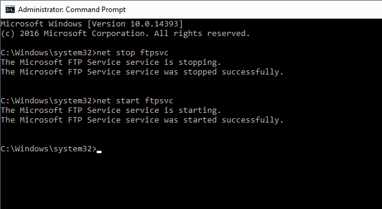

## 配置网络安全组（NSG）

回到 Azure 门户预览页面，找到虚拟机对应的网络安全组，然后为 FTP 服务所需的端口添加对应的入站安全规则。这里需要添加的有两个规则。一是 FTP 控制命令所需的 TCP 21 端口，二是之前在虚拟机中，为 FTP 服务添加的数据通道端口，TCP 55000 至 55004。添加完成后，如下图所示。

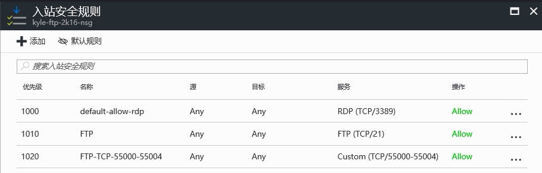

## FTP 客户端配置

以上步骤完成后，FTPS 服务器就搭建好了。下一步就可以使用客户端来实现对 FTPS 服务的访问了。
这里有一点需要注意，使用 IIS 管理器创建的自签名证书，与 FileZilla Client 3.24 不兼容。所以如果您要使用 FileZilla Client，可以使用低一点的版本，或者别的 FTP 客户端，例如 Flash FXP。下文中我以 FileZilla Client 3.21 版为例。
在客户端运行 FileZilla，新建一个 FTP 站点。其中主机填入之前创建的虚拟机的公共 IP。端口可以不填，因为在下面的协议中，默认选择了 FTP，所以这里端口会默认使用 TCP 21。
登录类型选择正常，并输入用户名和密码。这里用户名和密码就是我之前用来登录 FTPS 服务器的用户名和密码。当然，您也可以填入您在服务器中单独为 FTP 服务创建的账号和密码。

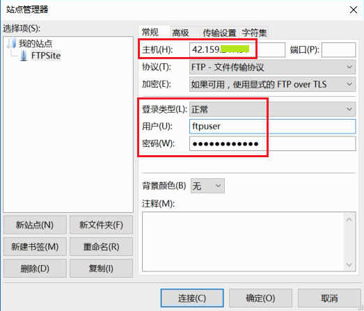

在**传输设置**标签下，选择**被动**传输模式。

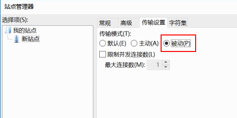

设置完成后，点击连接。

FileZilla Client 第一次连接到 FTPS 服务器时，因为我们的证书为自签名证书，客户端无法确认其有效性，所以会弹出未知证书的警告。直接点击**确定**即可。

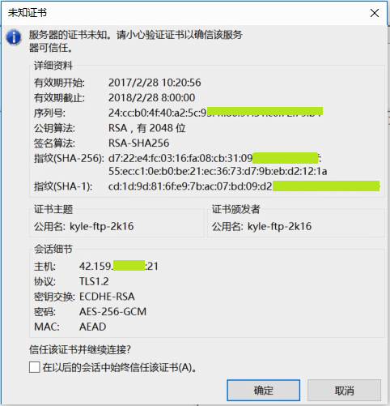

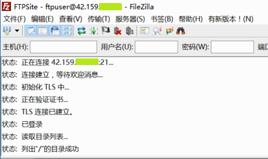

这样，客户端就连接到 FTPS 服务了。

##小结
本文的配置步骤非常简单，不到 30 分钟就能完成包括虚拟机创建在内的所有步骤。整个 FTPS 服务的搭建有以下几个关键点，我为大家总结一下：

- 虚拟机配置静态公共 IP；
- FTP 服务防火墙中配置被动模式的数据端口；
- 网络安全组（NSG）创建对应的入站规则；
- FTP 客户端使用被动模式传输数据。

本文中使用的是 IIS 自带的 FTP 服务搭建的 FTPS 站点。如果您要在 Azure 的虚拟机中使用其他 FTP Server 软件来部署，也需要确保完成以上几个关键步骤。

