<properties
    pageTitle="Azure 经典模式中虚拟机证书指纹的生成和作用"
    description="Azure 经典模式中虚拟机证书指纹的生成和作用"
    service=""
    resource="virtualmachines"
    authors="Qi Li"
    displayOrder=""
    selfHelpType=""
    supportTopicIds=""
    productPesIds=""
    resourceTags="Power BI Embedded, REST API"
    cloudEnvironments="MoonCake" />
<tags
    ms.service="virtual-machines-aog"
    ms.date=""
    wacn.date="03/28/2017" />

# Azure 经典模式中虚拟机证书指纹的生成和作用

用户在使用经典虚拟机时，经常会有如下疑问：门户主板页面中的 SSH/RDP 证书指纹这项信息是怎么来的？用途是什么？为什么有的时候为空？有没有对虚拟机使用有什么影响？以下我们进行一些基本的介绍：

## 证书指纹的用途

证书是 Windows/Linux 远程连接时使用的为验证虚拟机身份的证书。对于 Linux 来讲，即为 SSH 配置的证书；对于 Windows 来讲，即为 RDP 配置的证书。指纹是根据证书生成的唯一识别证书的标识。

用户在通过 RDP 或者 Putty 等 SSH 工具第一次远程访问虚拟机时，该工具会获取到远程服务器的证书指纹，并弹出一个窗口询问是否确认这台虚拟机就是你要访问的。通过对比指纹，能够识别远程访问的主机就是您在 Azure 中创建的虚拟机，避免连接或者管理上的错误。

## 指纹的生成

细心的用户会发现，如果通过标准镜像或者一般化镜像创建的虚拟机，门户中会显示指纹；而通过磁盘或者未一般化的镜像创建的虚拟机，指纹会显示为空。

指纹信息是在分配系统（provisioning）的过程中，由虚拟机上的代理获取并发送给 Azure Fabric。Fabric 获取到该信息后，显示到门户中。

我们通过下面情况来看看 Linux 中该证书指纹的使用和产生过程：

### Linux

从发布镜像创建的虚拟机

门户中信息显示：

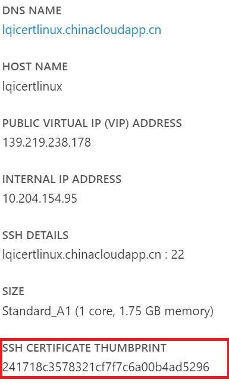

使用 putty 第一次 SSH 登录时的提示：

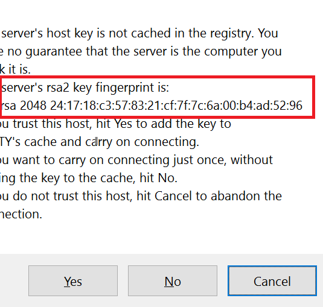

虚拟机系统中 Key 的位置 /etc/ssh/ 以及 fingerprint:

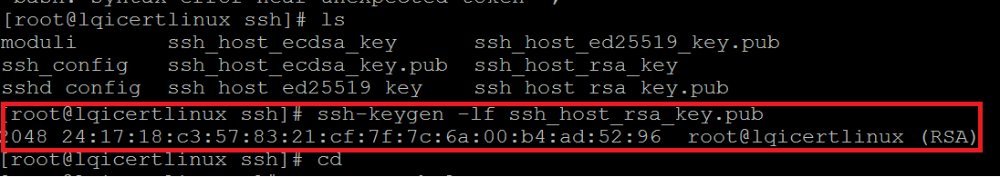

结论：这三个地方的指纹是完全匹配的。

再来看看虚拟机的日志中相关的记录。

/var/log/message 中记录了虚拟机开机后，生成 host key 的日志。/var/log/waagent.log 中也记录了config SSH 的日志。说明创建虚拟机的过程包含了配置证书这个步骤。

/var/log/message:

    Mar  9 05:28:13 localhost sshd-keygen: Generating SSH2 RSA host key: [  OK  ]
    Mar  9 05:28:13 localhost sshd-keygen: Generating SSH2 ECDSA host key: [  OK  ]
    Mar  9 05:28:13 localhost sshd-keygen: Generating SSH2 ED25519 host key: [  OK  ]
    Mar  9 05:28:13 localhost systemd: Started OpenSSH Server Key Generation.
    Mar  9 05:28:37 localhost python: 2017/03/09 05:28:37.865062 INFO Create user account if not exists
    Mar  9 05:28:39 localhost python: 2017/03/09 05:28:39.056154 INFO Set user password.
    Mar  9 05:28:39 localhost python: 2017/03/09 05:28:39.414142 INFO Configure sudoer
    Mar  9 05:28:39 localhost python: 2017/03/09 05:28:39.441285 INFO Configure sshd
    Mar  9 05:28:39 localhost python: 2017/03/09 05:28:39.445257 INFO Enabled SSH password-based authentication methods.
    Mar  9 05:28:39 localhost python: 2017/03/09 05:28:39.449218 INFO Configured SSH client probing to keep connections alive.
    Mar  9 05:28:39 localhost systemd: Time has been changed
    Mar  9 05:28:39 localhost systemd: Stopping OpenSSH server daemon...
    Mar  9 05:28:39 localhost systemd: Stopping OpenSSH Server Key Generation...
    Mar  9 05:28:39 localhost systemd: Starting OpenSSH Server Key Generation...
    Mar  9 05:28:39 localhost sshd-keygen: Generating SSH2 ECDSA host key: [  OK  ]
    Mar  9 05:28:39 localhost sshd-keygen: Generating SSH2 ED25519 host key: [  OK  ]
    Mar  9 05:28:39 localhost systemd: Started OpenSSH Server Key Generation.
    Mar  9 05:28:39 localhost systemd: Started OpenSSH server daemon.
    Mar  9 05:28:39 localhost systemd: Starting OpenSSH server daemon...

/var/log/waagent.log :

    2017/03/09 05:28:37.865062 INFO Create user account if not exists
    2017/03/09 05:28:39.056154 INFO Set user password.
    2017/03/09 05:28:39.414142 INFO Configure sudoer
    2017/03/09 05:28:39.441285 INFO Configure sshd
    2017/03/09 05:28:39.445257 INFO Enabled SSH password-based authentication methods.
    2017/03/09 05:28:39.449218 INFO Configured SSH client probing to keep connections alive.
    2017/03/09 05:28:39.906654 INFO Event: name=WALA, op=Provision, message=Provision succeed
    2017/03/09 05:28:41.818551 INFO Provisioning complete

**捕获的 Specialized 镜像**

大家会发现，specialized 的镜像在创建VM的过程中不会要求指定用户名、密码等信息，是因为虚拟机会使用原有磁盘和系统中的信息，而不需要重新生成，即不会有 provisioning 的部分过程。

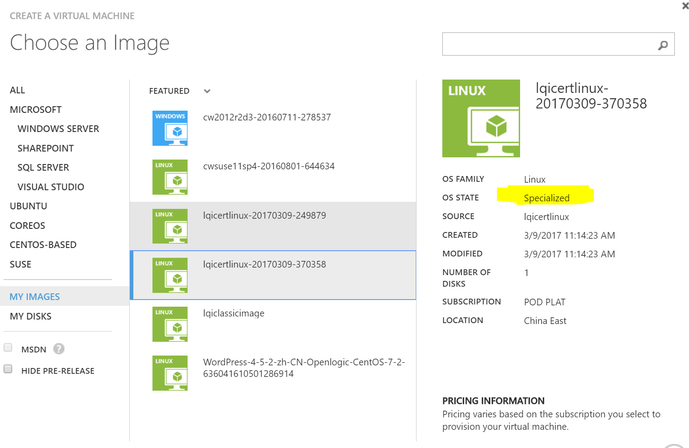

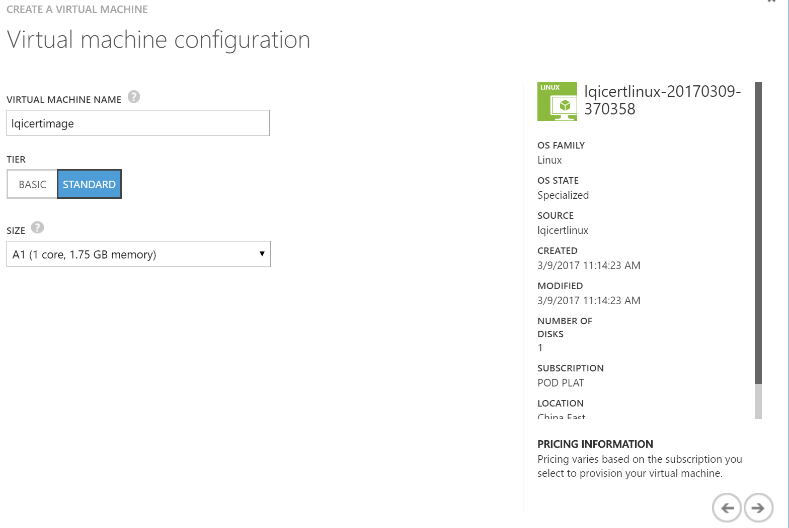

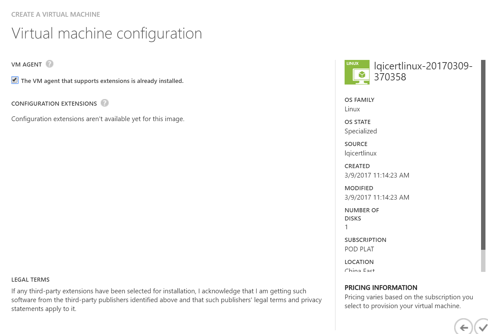

创建后，虚拟机在门户中的显示：

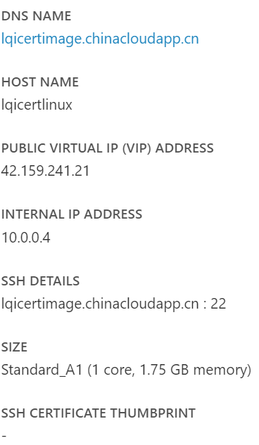

第一次 SSH 登录时的提示：

这里的镜像是第一个实验中在线捕获的虚拟机，其使用了和原有系统一样的证书，因此，指纹也是一样的。

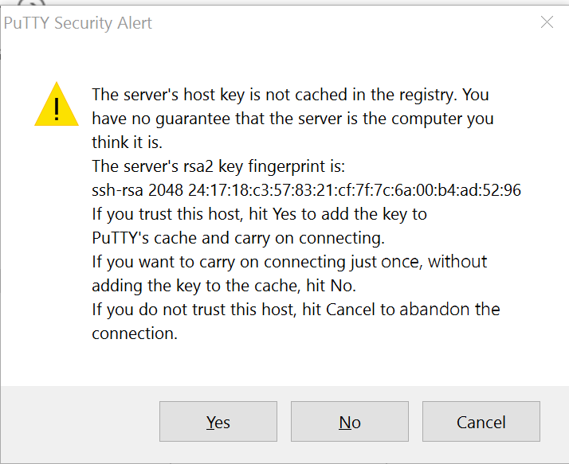

系统日志中提示 provisioning 会被忽略，使用已有的配置。

    /var/log/waagent.log中也一样。
    /var/log/waagent.log
    2017/03/09 06:25:43.786494 INFO Resource disk /dev/sdb is mounted at /mnt/resource with ext4
    2017/03/09 06:25:43.797982 INFO Clean protocol
    2017/03/09 06:25:43.809387 INFO Provisioning already completed, skipping.

### Windows

我们再来看看 Windows 中相关的信息存放在哪里：

门户中信息：

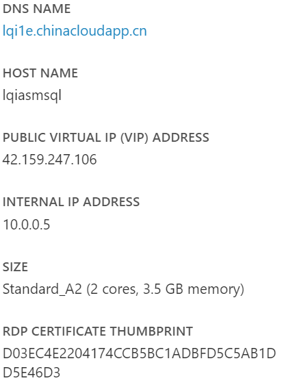

RDP连接信息：

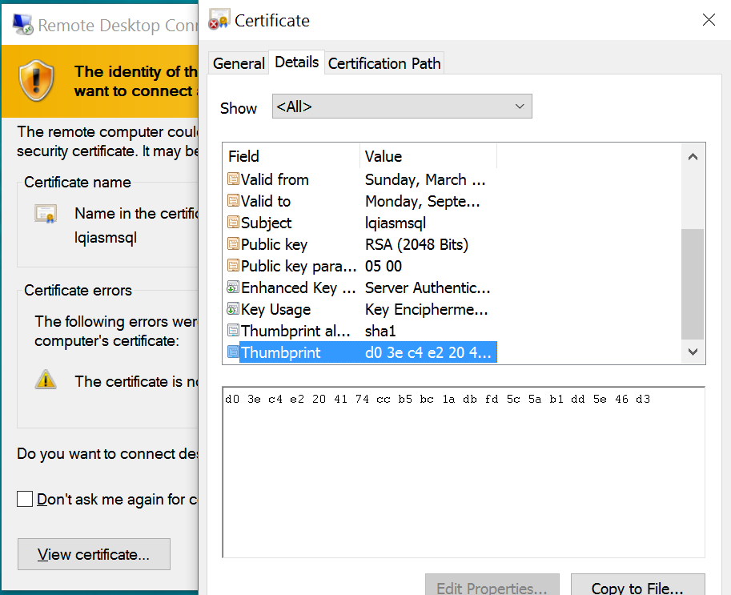

Windows 中 Remote Desktop 的信息：

CMD 窗口中输入 `mmc | File | Add/Remove Snapshot in | Certificate(Local Computer) | Computer` 打开证书管理面板；点击 Remote Desktop | Certificate，双击证书查看 Details 中的 Thumbprint。

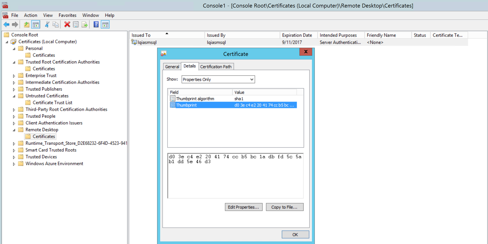

## 指纹为何为空？

前面提到，该信息是在 VM provisioning 过程中发送给 Azure Fabric 的。而通过磁盘或者为一般化的镜像创建的虚拟机，默认是没有分配系统（Provisioning）这个阶段的，因此，fabric 无法获得这个信息，当然就无法显示。

由于这是个仅运行一次的服务，如果创建好的虚拟机，在运行过程中变更了证书，那这里的指纹和证书实际的指纹很可能对应不上，请管理员注意。

## 有没有对虚拟机使用有什么影响？

该指纹的显示，能在一定程度上帮助客户识别虚拟机的身份。但对虚拟机本身的使用，不会有影响，但建议管理员和用户需要有较高的安全意识，对云上虚拟机进行合理的管理，避免因通过未一般化镜像创建了身份和密码都一样的虚拟机，造成管理上的混乱。