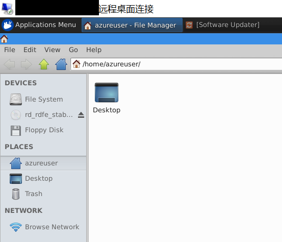

<properties 
	pageTitle="远程桌面到 Ubuntu 虚拟机" 
	description="介绍如何远程桌面到 Ubuntu 虚拟机" 
	services="virtual machine" 
	documentationCenter="" 
	authors=""
	manager="" 
	editor=""/>
<tags ms.service="virtual-machine-aog" ms.date="" wacn.date="10/28/2016"/>

# 远程桌面到 Ubuntu 虚拟机 #

1. 安装 Ubuntu 虚拟机，创建端口号为 3389 的 Endpoint.

	

2. 安装 Gnome 桌面

		sudo apt-get update
		sudo apt-get install ubuntu-desktop

3. 安装 xrdp 和 xubuntu-desktop

		sudo apt-get install xrdp
		sudo apt-get install xubuntu-desktop

4. 修改配置文件 /etc/xrdp/startwm.sh，添加 xfce4-session 行

	

5. 添加 xfce4-session
		echo “xfce4-session” >~/.xsession

6. RDP 连接到 ubuntu

	