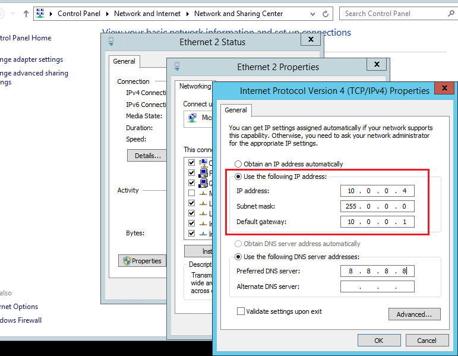
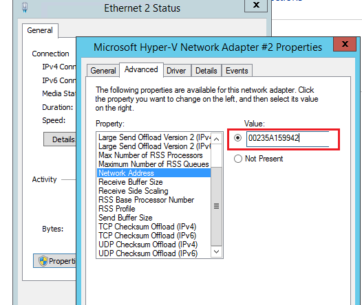
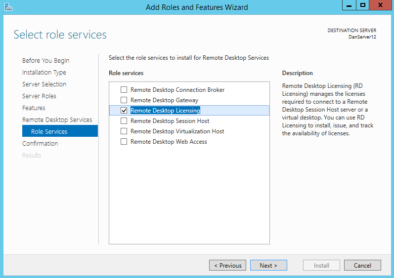
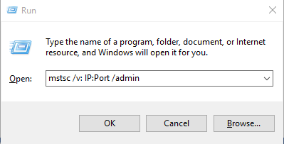
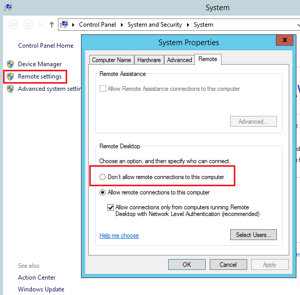
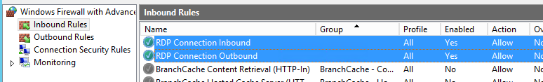
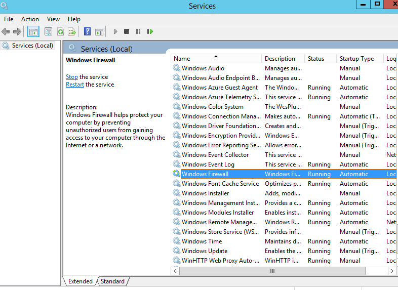
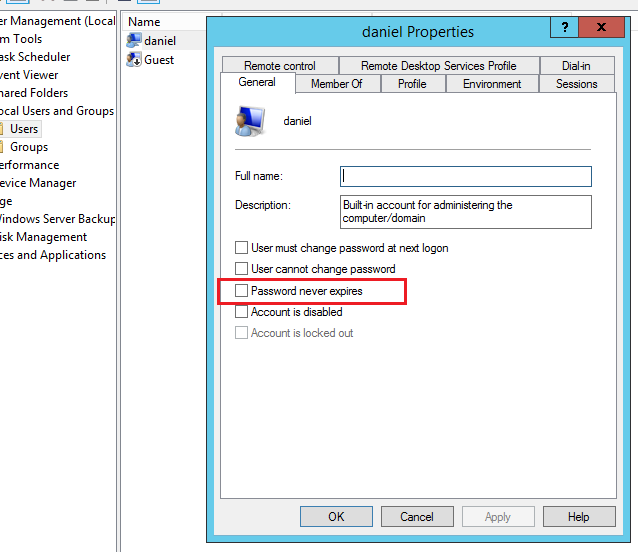
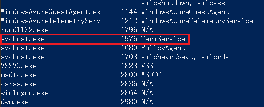
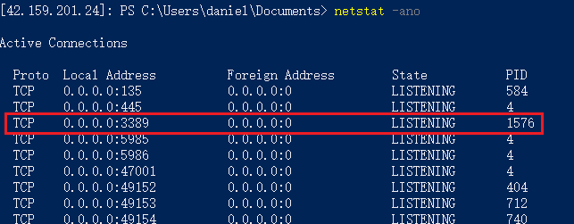

<properties 
	pageTitle="Azure Windows虚拟机常见导致无法远程的操作" 
	description="对Azure虚拟机的一些操作可能会导致无法远程连接，本文罗列了常见的几种场景。" 
	services="virtual machine" 
	documentationCenter="" 
	authors=""
	manager="" 
	editor=""/>
<tags ms.service="virtual-machines-aog" ms.date="" wacn.date="07/26/2016"/>

# Azure Windows 虚拟机常见导致无法远程的操作

###对Azure虚拟机的一些操作可能会导致无法远程连接，本文罗列了以下导致不能远程连接的场景：

- [场景1 - 在虚拟机网卡配置中配置IP地址或MAC地址](#scenario01)
- [场景2 - 远程桌面授权过期](#scenario02)
- [场景3 - 误设置“不允许连接到这台计算机”](#scenario03)
- [场景4 - 误设置防火墙规则](#scenario04)
- [场景5 - 误关闭核心服务](#scenario05)
- [场景6 - 用户账户过期](#scenario06)
- [场景7 - 使用三方软件误修改RDP侦听端口](#scenario07)

##场景1
在虚拟机的网卡配置中配置IP地址或MAC地址，导致重新启动后，虚拟机可能无法远程连接。
 
 
 
 

##场景2
虚拟机启用了Remote Desktop Licensing（远程桌面授权）功能，试用期120天到期后，虚拟机无法正常RDP。
 
 

这个功能安装后，可以允许多于2个用户同时访问Windows Server，但是这个是付费功能，默认有120天的试用期，试用期到期后，会遇到无法正常RDP到虚拟机的问题。关于更多详细内容请参考[这篇文章](https://technet.microsoft.com/zh-cn/library/cc725933%28v=ws.11%29.aspx?f=255&MSPPError=-2147217396)。

解决方法：在运行中使用命令`mstsc /v: IP:Port /admin`登陆虚拟机

 
 
##场景3
虚拟机的“远程设置”（Remote settings）选项，被选成了“不允许连接到这台计算机”（Don’t allow remote connection to this computer），这个选项可能并非用户修改，有可能是一些第三方的安全软件设置：

  
 
##场景4
错误配置了防火墙规则，导致禁止RDP端口通信或者屏蔽了IP地址。
例如禁用了默认的Inbound或Outbound规则：

  

由于防火墙规则的配置方法多种多样，所以这里不具体举例。关于Windows防火墙规则设置，请参考[这篇文章](https://technet.microsoft.com/zh-cn/library/cc753558%28v=ws.11%29.aspx)

 
##场景5
误关闭了一些核心服务。常见的如Windows Firewall服务。 

  

停止Windows Firewall后会直接导致无法远程连接虚拟机。
此外，一些关键的系统服务停止也会导致无法远程（例如Remote Desktop Services），所以在关闭系统服务前，请确保不会影响虚拟机的远程连接。
 
##场景6
用户账户过期。
默认虚拟机创建的时候配置的管理员账号是会过期的：

   

所以，如果过期不及时配置，密码过期后只能重置密码。
 
##场景7
一些第三方的安全软件会修改RDP的侦听端口。
由于第三方软件种类比较多，这里不具体举例。
解决此类问题的方法：
首先通过Powershell（5986端口）连接到服务器中：

	Enter-Pssession -ComputerName [VM's VIP] -port [The Port of PowerShell] -Authentication Negotiate -Credential [Username] -UseSSL -SessionOption (New-PSSessionOption -SkipCACheck -SkipCNCheck)

连接成功后，使用`tasklist /svc`查看TermService的PID：
 
  

使用`netstat -ano`查看TermService侦听的端口：

  
 
如果发现是非3389端口，则在终结点（Endpoint）处将RDP的本地端口（Local Port）修改为对应端口号即可。
