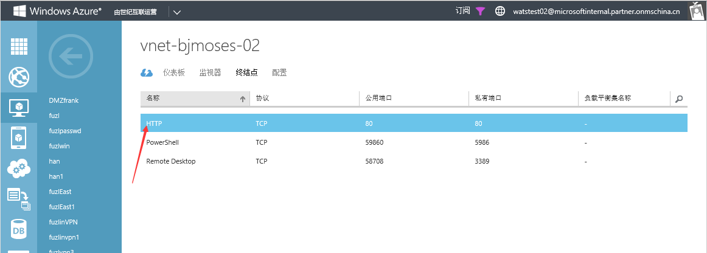
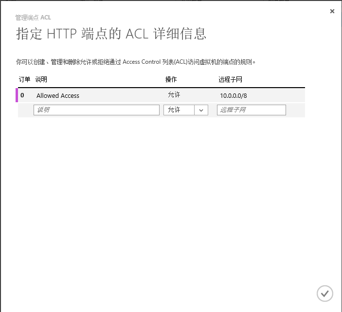

<properties 
	pageTitle="虚拟机添加相应端口并配置 ACL" 
	description="本页介绍如何为虚拟机添加相应端口并配置 ACL。" 
	services="virtual network" 
	documentationCenter="" 
	authors=""
	manager="" 
	editor=""/>
<tags ms.service="virtual-network-aog" ms.date="" wacn.date="06/08/2016"/>

#虚拟机添加相应端口并配置 ACL

###本文包含以下内容
- [相关概念](#concept)
- [详细步骤](#detail)
- [相关参考资料](#resource)
 
## 相关概念

添加端口时我们需要输入公用端口和私有端口，下面是它们的相关概念。

**公用端口**：Azure 负载平衡器使用公用端口侦听从 Internet 传入的虚拟机流量

**私有端口**：虚拟机使用私有端口侦听通常发送到虚拟机上运行的应用程序或服务的传入流量。

举个简单例子，配置数据库服务器，使的我们可以通过 Internet 连接到 SQL Server 数据库引擎，我们需要配置 1433 端口，假如我们设置公用端口为 57500，私有端口为 1433，在SSMS连接是我们需要 mycloudservice.chinacloudapp.cn,57500，但是真正是通过私有端口 1433 访问的数据库服务器。

**ACL**：我们可以创建、管理和删除允许或拒绝通过 Access Control 列表(ACL)访问虚拟机的端点的规则

还以上面为例，如果我们为了保证数据库的安全，我们可以以CIDR 格式来指定 IP 地址范围，这样可以使得只有在允许的IP范围的用户来访问，可以有效的避免数据的泄露。
 
## 详细步骤

###创建端口

1.	终结点-添加

	

2.	添加独立终结点

	 
 
3.	名称（添加协议），其他默认即可 
 
	
 
4.	添加的相应端口已在列表中
 
	

###配置 ACL

1.	管理 ACL
 
	

2. 添加允许或拒绝的远程子网

	

## 相关参考资料

- [如何设置虚拟机的终结点](/documentation/articles/virtual-machines-windows-classic-setup-endpoints/)
