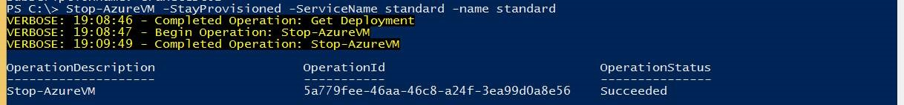

<properties 
	pageTitle="使用Powershell设置VNET中的静态IP" 
	description="本页介绍如何使用PowerShell来使用静态IP。" 
	services="virtual network" 
	documentationCenter="" 
	authors=""
	manager="" 
	editor=""/>
<tags ms.service="virtual-network" ms.date="" wacn.date="01/21/2016"/>

#使用Powershell设置VNET中的静态IP 

###本文包含以下内容

- [对已有虚机设置静态Internal IP](#exist)
- [取消对对已有虚机设置的静态Internal IP](#cancle)
- [创建静态Internal IP的虚机](#create)
- [使用中的注意点](#note)
 
**请注意**：以下操作需要下载最新版本的 Azure PowerShell（版本 0.8.5 及更高版本），请按照[此处](/documentation/articles/powershell-install-configure)的说明进行安装。

## 对已有虚机设置静态Internal IP

完成后，启动 PowerShell 提示并执行以下操作。

	PS C:\> $vm2=Get-AzureVM -servicename 'dnstest01' -name 'dnstest1'
	PS C:\> $vmchange=Set-AzureStaticVNetIP -vm $vm2 -IPAddress 10.0.1.4
	PS C:\> $vmchange |Update-AzureVM

或者：

	PS C:\> $VM2=Get-AzureVM -ServiceName 'dnstest01' -name 'test12' 
	PS C:\> Set-AzureStaticVNetIP -vm $vm2 -IPAddress 10.0.1.9 | Update-AzureVM
 
## 取消对对已有虚机设置的静态Internal IP 

	PS C:\> $VM2=Get-AzureVM -ServiceName 'dnstest01' -name 'test12'
	PS C:\> Remove-AzureStaticVNetIP $vm2 |Update-AzureVM
 
## 创建静态Internal IP的虚机

先设置存储账户：

	PS C:\> Set-AzureSubscription -SubscriptionName cranetest02 -CurrentStorageAccountName portalvhdszls6kbzqlcpdn

然后创建虚机：

	PS C:\> $imagename='f1179221e23b4dbb89e39d70e5bc9e72__OpenLogic-CentOS-65-20140121'	
	PS C:\> $vm1=New-AzureVMConfig -Name 'test12' -ImageName $imagename -InstanceSize Small |Add-AzureProvisioningConfig -Linux -LinuxUser 'crane' -Password 'abcd1234!'; Set-AzureSubnet -VM $vm1 -SubnetNames 'testtest1'; Set-AzureStaticVNetIP -IPAddress 10.0.1.10 -VM $vm1; New-AzureVM -ServiceName 'test11' -vm $vm1 -VNetName 'test001'

## 使用中的注意点

1. Azure平台默认是关闭固定内网IP功能的。如果您需要开启固定虚拟机内网IP的功能，需要将新建的虚拟机建立在虚拟机网络内，通过Azure Powershell 命令语句设置静态IP，参见相关链接： [如何设置静态内部专用 IP](/documentation/articles/virtual-networks-reserved-private-ip)  
2. 请您最好对您在虚拟机网络下的所有虚拟机均设置该功能。尽量不要混合使用该功能：比如对有些虚拟机设置了固定DIP，而有些则没有设置固定DIP功能。
3. 当您在管理Portal中对虚拟机进行停机后，由于该虚拟机的资源被释放，该虚拟机的DIP地址可能会重新分配给您在该虚拟网络中新建的虚拟机。
   - 如果您希望对虚拟机停机后，依然保留该虚拟机的DIP地址，请您在Azure PowerShell 中使用`Stop-AzureVM -StayProvisioned –ServiceName`（注释：ServiceName指虚拟机所在的云服务的名称） `standard –name`（注释：name指该虚拟机的名称） standard2”命令对该虚拟机停机。如下图：
 		
		停机后该虚拟机的状态在管理Portal上将显示为如下状态：
		
 
		**请注意**：由于资源不被释放，用这种方式停机将会对虚拟机继续收费。
   - 如果您希望释放该虚拟机的DIP资源，您可以在Azure PowerShell 中使用`Stop-AzureVM –ServiceName`（注释：ServiceName指虚拟机所在的云服务的名称） `standard –name`（注释：name指该虚拟机的名称） standard2”命令；或者在管理Portal,“虚拟机—仪表板”页面底部的“关闭”按钮，如下图所示：
 		
		关闭后，该虚拟机在管理Portal上将显示为如下状态：
		
		该虚拟机的资源将被释放。
