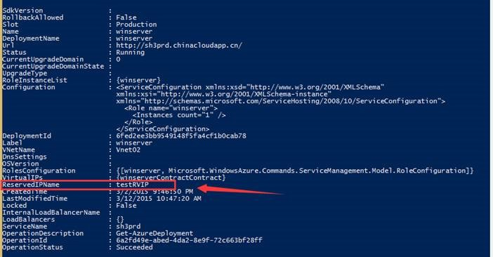

<properties 
	pageTitle="保留正在使用的VIP" 
	description="本页介绍如何使用PowerShell来使用保留IP。" 
	services="virtual network" 
	documentationCenter="" 
	authors=""
	manager="" 
	editor=""/>
<tags ms.service="virtual-network" ms.date="" wacn.date="01/21/2016"/>

#保留正在使用的VIP
###本文包含以下内容
* [适用场景](#prep)
* [操作步骤](#operation)
* [保留IP的费用](#price)
 
## 适用场景
* 我们希望云服务有一个固定的IP，即使虚拟机以deallocated的方式关闭。
* 用户忘记先保留VIP 而直接完成了部署。 希望不做任何服务调整的情况下保留正在使用的VIP资源。
* 使用虚拟网络和没有使用虚拟网络均适用。

## 操作步骤
1. 下载并安装最新版的Azure PowerShell，配置Azure 管理账户。参考链接：[如何安装和配置 Azure PowerShell](/documentation/articles/powershell-install-configure) 
2.	查看需要固定VIP的云服务信息

	命令行：`PS C:\> get-azuredeployment -ServiceName` 其中sh3prd为云服务名称，可以看到当前的云服务ReservedIPName 为空。
 
 	
 
3.	保留VIP

	命令行：	`PS C:\> New-AzureReservedIP -ServiceName sh3prd -ReservedIPName testRVIP -Location "China East"`

 	
 
4.	保留完成后检查一下是否是当前正在使用的VIP地址。 

	命令行：`PS C:\> Get-AzureReservedIP -ReservedIPName testRVIP`

	
 
5.	再检查一下是否该云服务有保留VIP。

	`PS C:\> Get-AzureDeployment -ServiceName sh3prd`

	
 
6.	在azure管理界面上关闭虚拟机后IP地址均不再显示在仪表板上。 但启动虚拟机后， VIP依旧是原来的地址。 
 
## 保留IP的费用
### 定价详细信息
*以下价格均为含税价格。

*每月价格的估算基于每个月 744 小时的使用量。

 <table cellspacing="1" cellpadding="2">
    <tbody>
    <tr align="left" valign="top">
		<td></td>
		<td><b>价格</b></td>
    </tr>
    <tr align="left" valign="top">
		<td>前 5 个保留的 IP 地址（使用中）</td>
		<td>免费
	</td>
    </tr> 
 <tr align="left" valign="top">
		<td>附加的保留 IP 地址</td>
		<td>¥0.04每个IP每小时（(~¥30每个 IP 每月)
	</td>
    </tr> 
 <tr align="left" valign="top">
		<td>未使用的保留 IP 地址</td>
		<td>¥0.04每个IP每小时（(~¥30每个 IP 每月)
	</td>
    </tr>    
    </tbody>
    </table>

**注意**：

* 适用每个订阅 20 个保留 IP 地址这一限额。如果您有与由世纪互联运营的 Azure 的企业协议，则可以保留最多 100 个 IP 地址。如果您需要增加此限额，请联系世纪互联的技术支持。
* 前5个保留的IP如果在使用中则为免费，如果只保留了IP而没有使用则将被计费。
 
更多详细请阅读：[IP 地址定价](/pricing/details/reserved-ip-addresses/)

