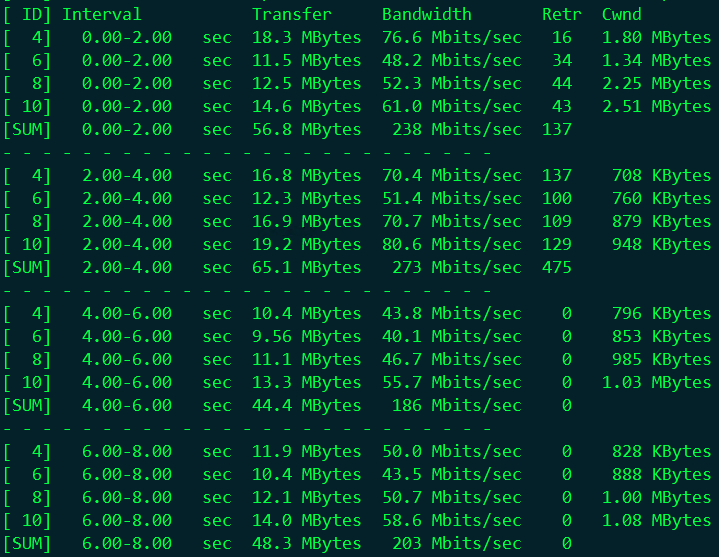

<properties
	pageTitle="Azure中使用iPerf进行网络带宽测试"
	description="了解Azure中使用iPerf进行网络带宽测试。"
	services="virtual-network"
	documentationCenter=""
	authors="Kyle Fu"
	manager=""
	editor=""
	tags="Azure,iPerf,带宽,网络"/>

<tags
	ms.service="virtual-network-aog"
	ms.date="11/03/2016"
	wacn.date="11/03/2016"/>

#Azure中使用iPerf进行网络带宽测试

##iPerf 简介

网络带宽是衡量两个网络节点之间通信性能的重要的指标之一。在评估云服务的时候，要充分考虑网络带宽对所承载的网路服务的影响。若已经部署的网络服务出现了故障，有时候可以考虑从网络实时带宽的角度来进行故障排查。

网络带宽测试的工具有很多，测试方法也多种多样。针对Azure的虚拟机和云服务，我们推荐使用iPerf来进行网络带宽测试。iPerf 是专业的网络测试工具，它基于 TCP/IP 和 UDP/IP 协议，用以测量两个网络节点之间 TCP 和 UDP 端口的网络带宽，还能提供网络延迟、丢包率等统计信息。

iPerf 常用的版本有 iPerf2 和 iPerf3。 iPerf3 在 iPerf2 的基础上新增了一些功能，例如发送方/接收方角色互换，以 JSON 格式输出结果，零拷贝方式传输数据等等。也去掉了 iPerf2 中所支持少许功能，例如双向测试，以逗号为分隔符输出结果等。iPerf3 和 iPerf2 所执行的命令名字也不一样，iPerf3 为 iperf3，iPerf2 为 iperf。大家可以根据实际需要来选择安装的版本。下文中的测试都以 iPerf3 为例。

iPerf在工作时，测试的两端一方作为Server，另一方为 Client。程序启动的命令相同，通过不同的参数来区别以哪种工作方式运行。通常情况下先启动Server端，使 iPerf 监听在某个固定端口。然后在 Client 端执行相应的命令开始测试。

##iPerf 下载和安装

iPerf支持大多数主流的操作系统，例如 Windows，Ubuntu，Fedora，openSUSE 和 Mac OS 等等。甚至在 Android 和 iPhone/iPad 的应用商店中，也有一款名为 HE.NET Network Tools 的 App 集成了 iPerf 工具。iPerf [下载网址](https://iperf.fr/iperf-download.php)。这个网页上列出了所有支持的操作系统的iPerf下载链接。最新的版本为 iPerf 3.1.3（不同操作系统所支持的最高版本可能不同）。如果要使用 iPerf2，可以下载2.0.X的版本。

Windows 版的 iPerf 下载、解压后可以直接在命令提示符下运行。Windows 版的 iPerf 还有 UWP 版本，可以从 Microsoft Store 的 Windows App 中下载。针对不同发行版本的 Linux，iPerf 提供了 RPM 、DEB 等格式的安装包，直接用 rpm、dpkg 等命令安装即可。

当然，在没有找到合适的安装包时，大家也可以选择源码包编译安装。以下是在 SuSE12.1 中使用源码包安装 iPerf3 的安装步骤，供参考。

1.	确保 gcc 和 make 已安装。

		#zypper in gcc
		#zypper in make

2.	下载并解压 iperf 源码包

		#cd /tmp
		#wget http://downloads.es.net/pub/iperf/iperf-3-current.tar.gz
		#tar zxvf iperf-3-current.tar.gz

3.	安装 iperf

		#cd iperf-3.1.2/
		#./configure
		#make
		#make install

完成后，iperf3 被安装至`/usr/local/bin/`下，在系统的任意路径都可以执行。

若iperf运行报以下错误：

	iperf3: error while loading shared libraries: libiperf.so.0: cannot open shared object file: No such file or directory

通常运行 ldconfig 命令可以解决此问题。

##iPerf 工作模式和参数

如前文所述，iPerf 的工作时需要指定 Server 模式或 Client 模式，通过不同的参数来区别（-s和-c）。iPerf3 所支持的功能也都通过设置不同的参数来实现。iPerf 的参数分为3类：通用参数，Server 端参数，Client 端参数。通用参数为 Server 端和 Client 端都可以使用的参数。以下是 iPerf 3.1.2支持的所有参数：

- 通用参数：
  - -p, --port #，Server 端监听、Client 端连接的端口号；
  - -f, --format [kmgKMG]，报告中所用的数据单位，Kbits, Mbits, KBytes, Mbytes；
  - -i, --interval #，每次报告的间隔，单位为秒；
  - -F, --file name，测试所用文件的文件名。如果使用在 Client 端，发送该文件用作测试；如果使用在 Server 端，则是将数据写入该文件，而不是丢弃；
  - -A, --affinity n/n,m，设置 CPU 亲和力；
  - -B, --bind <host>，绑定指定的网卡接口；
  - -V, --verbose，运行时输出更多细节；
  - -J, --json，运行时以 JSON 格式输出结果；
  - --logfile f，输出到文件；
  - -d, --debug，以 debug 模式输出结果；
  - -v, --version，显示版本信息并退出； 
  - -h, --help，显示帮助信息并退出。
- Server端参数：
  - -s, --server，以 Server 模式运行；
  - -D, --daemon，在后台以守护进程运行；
  - -I, --pidfile file，指定 pid 文件；
  - -1, --one-off，只接受1次来自 Client 端的测试，然后退出。
- Client端参数
  - -c, --client <host>，以 Client 模式运行，并指定 Server 端的地址；
  - -u, --udp，以 UDP 协议进行测试；
  - -b, --bandwidth #[KMG][/#]，限制测试带宽。UDP 默认为1Mbit/秒，TCP默认无限制；
  - -t, --time #，以时间为测试结束条件进行测试，默认为10秒；
  - -n, --bytes #[KMG]，以数据传输大小为测试结束条件进行测试；
  - -k, --blockcount #[KMG]，以传输数据包数量为测试结束条件进行测试；
  - -l, --len #[KMG]，读写缓冲区的长度，TCP 默认为128K，UDP 默认为8K；
  - --cport <port>，指定 Client 端运行所使用的 TCP 或 UDP 端口，默认为临时端口；
  - -P, --parallel #，测试数据流并发数量；
  - -R, --reverse，反向模式运行（Server 端发送，Client 端接收）；
  - -w, --window #[KMG]，设置套接字缓冲区大小，TCP 模式下为窗口大小；
  - -C, --congestion <algo>，设置 TCP 拥塞控制算法（仅支持 Linux 和 FreeBSD ）；
  - -M, --set-mss #，设置 TCP/SCTP 最大分段长度（MSS，MTU 减40字节）；
  - -N, --no-delay，设置 TCP/SCTP no delay，屏蔽 Nagle 算法；
  - -4, --version4，仅使用IPv4；
  - -6, --version6，仅使用IPv6；
  - -S, --tos N，设置IP服务类型（TOS，Type Of Service）；
  - -L, --flowlabel N，设置IPv6流标签（仅支持Linux）；
  - -Z, --zerocopy，使用 “zero copy”（零拷贝）方法发送数据；
  - -O, --omit N，忽略前n秒的测试；
  - -T, --title str，设置每行测试结果的前缀；
  - --get-server-output，从 Server 端获取测试结果；
  - --udp-counters-64bit，在 UDP 测试包中使用64位计数器（防止计数器溢出）。
  
iPerf 功能十分强大，支持的参数特别多。但是在实际使用中，并不需要同时使用这么多参数。使用时，根据实际需求来设置关键参数就可以了。

##Azure中使用iPerf

### 前期准备

开始测试之前，需要先弄清测试对象所处网络位置。如果测试对象之间有防火墙阻隔，则需要先设置防火墙规则，使其允许测试两端的 iPerf 进行通信。通常情况下，测试时我们会指定 iPerf Server 端监听的端口，比如设为 TCP-5001，那么在防火墙上就需要开启对应的 TCP-5001 端口的访问规则。如果 Server 端部署在 Azure 的经典模式下，需要设定对应虚拟机或云服务的终结点；如果是资源管理器模式下部署的虚拟机，则需要设置 NSG 规则，见下图。

终结点（Endpoint，经典模式）：

 
网络安全组（NSG，资源管理器模式）：

 
>需要说明的是，iPerf 测试不可避免产生数据流量。如果测试时有进出 Azure 的数据流量，很可能会产生相对应的费用。所以测试前务必做好测试计划，以免不必要的数据流量造成计划外的支出。

###开始测试

首先在 Server 端，我们运行以下命令使 iPerf 监听5001端口，每2秒输出一次结果。
	
	#iperf3 -s -p 5001 -i 2

 
当终端显示 Server listening on 5001时，就表示 Server 已经正常运行，等待测试了。
然后在 Client 端，我们并发4个数据流，测试总时长为30秒，每2秒输出一次结果。以下为测试所使用的命令。

	#iperf3 -c 139.219.2XX.XXX -P 4 -t 30 -i 2 -p 5001

当Client端的命令执行后，测试就开始了。

 
终端会每隔2秒滚动显示测试的结果，最后还有整个测试的总结。

测试完成后，再次用以下命令测试并发8个数据流的情况，对比结果将在结果解读中展现。

	#iperf3 -c 139.219.2XX.XXX -P 8 -t 30 -i 2 -p 5001

 
###结果解读

测试时，iPerf 的 Server 端和 Client 端都会输出测试结果。测试过程中，根据报告间隔时间的参数，终端会不断地显示当前时间间隔内测试结果。当测试结束后，iPerf 将测试结果汇总，输出最终测试结果。

###过程输出

下图是第一次4个数据流测试过程中 Server 端的部分输出。

 
可以看到 iPerf 在不同的时间间隔内，都完整的显示了每个数据流传送的数据大小以及带宽。然后在第5行显示当前时间间隔内的传送的总数据大小和总带宽。

下图是第一次4个数据流测试过程中 Client 端的部分输出。

 
Client 端的数据除了传输的数据大小和实时带宽，还有 TCP 重传次数（Retr）和窗口大小（Cwnd）。

###最终结果

下图是 Server 端第一次测试的最终结果。

 
这里可以看到4个数据流接收到的数据大小和平均带宽，还有接收到的总数据和总带宽。

我们再看一下8个数据流并发测试的结果，见下图。

 
对比这两个结果，我们能看出来4个数据流并发时，总带宽是163Mb/s。8个数据流并发时，总带宽达到了248Mb/s。这说明4个数据流并发时，并没有测试出最大带宽。所以在实际测试时，可以通过多次调整并发数据流数量，来获取真实的最大带宽值。

除了并发数据流数量，TCP 窗口大小、最大分段长度、拥塞算法等等都会影响到应用程序实际能获取到的网络带宽。有经验的网络工程师也会通过数据计算，然后设置这些相关的参数进行测试，来获取到最大网络带宽。

###延伸阅读

本文针对 iPerf3 在 TCP 协议下的网络带宽测试进行了简单的介绍。推荐大家阅读官方的用户手册来了解更多测试方法，查询参数的细节，或者对比iPerf2 和 iPerf3 的区别。[用户手册网址](https://iperf.fr/iperf-doc.php)。
