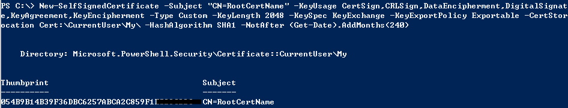
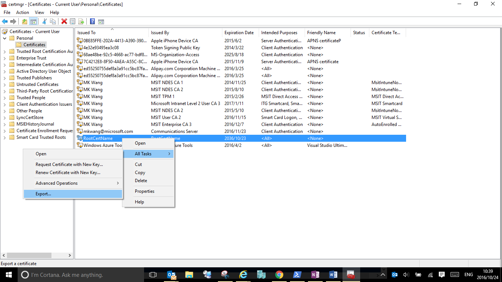
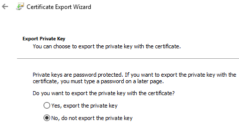
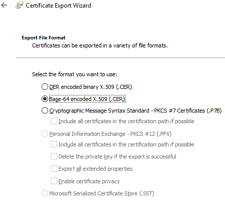
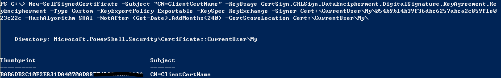

<properties
	pageTitle="本文讲解如何使用 Powershell 来生成点到站点连接所使用的自签名证书"
	description="本文讲解如何使用 Powershell 来生成点到站点连接所使用的自签名证书"
	services="virtual-network"
	documentationCenter=""
	authors=""
	manager=""
	editor=""
	tags=""/>

<tags
	ms.service="virtual-network-aog"
	ms.date="10/27/2016"
	wacn.date="11/03/2016"/>

# 本文讲解如何使用 Powershell 来生成点到站点连接所使用的自签名证书。

使用点到站点 ( P2S ) 配置可以创建从单个客户端计算机到虚拟网络的安全连接。关于如何逐步配置 P2S 连接，可以参阅：[配置与 VNet 的点到站点连接](/documentation/articles/vpn-gateway-howto-point-to-site-classic-azure-portal/)。

在 P2S 接连的配置过程中，其中一个步骤是创建用于身份验证的证书。证书用于对点到站点 VPN 的 VPN 客户端进行身份验证。可以使用企业证书解决方案生成的证书，或使用自签名证书。要使用 `Makecert.exe` 创建自签名证书，可以参阅：[为点到站点连接使用自签名证书](/documentation/articles/vpn-gateway-certificates-point-to-site/)。除此之后，还可以用 Powershell 命令 `New-SelfSignedCertificate` 来生成自签名证书。

###创建自签名根证书

1.	确认当前安装的 Powershell 为最新版本。

2.	打开 Powershell，以管理员身份运行以下命令。将 RootCertName 替换为要使用的根证书名称：

		$root=New-SelfSignedCertificate -Subject "CN=RootCertName" -KeyUsage CertSign,CRLSign,DataEncipherment,DigitalSignature,KeyAgreement,KeyEncipherment -Type Custom -KeyLength 2048 -KeySpec KeyExchange -KeyExportPolicy Exportable -CertStoreLocation Cert:\CurrentUser\My\ -HashAlgorithm SHA1 -NotAfter (Get-Date).AddMonths(240)

	

### 获取公钥

3.	在创建自签名根证书第 2 步中生成的根证书位于“证书”-`当前用户\个人\证书`中。根证书的公钥作为点到站点连接 VPN 网关配置的一部分上载到 Azure。请打开 certmgr.msc。右键单击自签名根证书，单击“所有任务”，然后单击“导出”。此操作将打开“证书导出向导”。

	 

4.	在向导中，单击“下一步”，选择“否，不导出私钥”，然后单击“下一步”。

	
 	 

5.	在“导出文件格式”页上，选择“Base-64 编码的 X.509 (.CER)”。 然后，单击“下一步”。
 
 	

6.	在“要导出的文件”中，单击“浏览”并选择要导出证书的位置。在“文件名”中，为证书文件命名。单击“完成”以导出证书。

###上传证书

将根证书 .cer 文件上载到 Azure 经典管理门户，请参照[配置与 VNet 的点到站点连接](/documentation/articles/vpn-gateway-howto-point-to-site-classic-azure-portal/)。

### 创建客户端证书

8.	打开 Powershell，以管理员身份运行以下命令。将 ClientCertName 替换为要使用的根证书名称：

		New-SelfSignedCertificate -Subject "CN=ClientCertName" -KeyUsage CertSign,CRLSign,DataEncipherment,DigitalSignature,KeyAgreement,KeyEncipherment -Type Custom -KeyExportPolicy Exportable -KeySpec KeyExchange -Signer $root -HashAlgorithm SHA1 -NotAfter (Get-Date).AddMonths(240) -CertStoreLocation Cert:\CurrentUser\My\

 	

	其中变量$root 为创建自签名根证书小节中第 2 步创建的自签名根证书。如果第未将根证书对象传入某个对象，也可以为用根证书的绝对路径作为 -Signer 的值，如 `Cert:\CurrentUser\My\<GUID>`。

### 导出并安装客户端证书

以上步骤完成以后，生成客户端证书的计算机已经默认安装这张证书。对于其他要连接到虚拟网络的计算机，需要手动导出和安装客户端证书。

9.	若要导出客户端证书，可以使用 certmgr.msc 。右键单击要导出的客户端证书，即第 8 步中创建的 ClientCertName，单击“所有任务”，然后单击“导出”。
导出包含私钥的客户端证书。这是一个 .pfx 文件。请确保记录或记住为此证书设置的密码（密钥）。

10.	将 .pfx 文件复制到客户端计算机。在客户端计算机上，双击 .pfx 文件，安装该证书。系统请求你输入密码时，请输入相应的密码。请勿修改安装位置。

###后续步骤

证书配置完成之后，完成 P2S 连接还需配置 VPN 客户端，可以参阅：[配置与 VNet 的点到站点连接](/documentation/articles/vpn-gateway-howto-point-to-site-classic-azure-portal/)。

