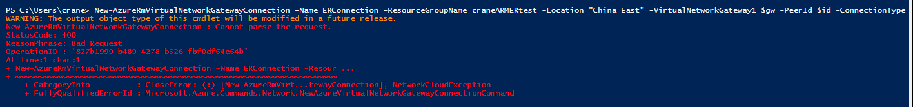

<properties
	pageTitle="将不同订阅中的虚拟网络连接到 ExpressRoute 线路时收到报错'Cannot parse the request'"
	description="通过 PowerShell 将不同订阅中的虚拟网络连接到 ExpressRoute"
	services="virtual-network"
	documentationCenter=""
	authors=""
	manager=""
	editor=""
	tags="Azure,PowerShell,VNet,ExpressRoute,Subscriptions"/>

<tags
    ms.service="virtual-network-aog"
    ms.date="12/08/2016"
    wacn.date="12/08/2016"/>

# 将不同订阅中的虚拟网络连接到 ExpressRoute 线路时收到报错“Cannot parse the request” #

### 问题描述 ###

将不同订阅中的 虚拟网络（VNET） 连接到 ExpressRoute 线路时收到报错 “Cannot parse the request” 。

### 问题现象 ###

跨订阅连接 VNET 到 ExpressRoute 时报错如下：

	PS C:\Users\crane> New-AzureRmVirtualNetworkGatewayConnection -Name ERConnection -ResourceGroupName craneARMERtest -Location "China East" -VirtualNetworkGateway1 $gw -PeerId $id -ConnectionType ExpressRoute -AuthorizationKey "d3d7375f-aa95-4a97-97bf-cd4a68278189" 
	WARNING: The output object type of this cmdlet will be modified in a future release.
	New-AzureRmVirtualNetworkGatewayConnection : Cannot parse the request.
	StatusCode: 400
	ReasonPhrase: Bad Request
	OperationID : '827b1999-b489-4278-b526-fbf0df64e64b'
	At line:1 char:1
	+ New-AzureRmVirtualNetworkGatewayConnection -Name ERConnection -Resour ...
	+ ~~~~~~~~~~~~~~~~~~~~~~~~~~~~~~~~~~~~~~~~~~~~~~~~~~~~~~~~~~~~~~~~~~~~~
	    + CategoryInfo          : CloseError: (:) [New-AzureRmVirt...tewayConnection], NetworkCloudException
	    + FullyQualifiedErrorId : Microsoft.Azure.Commands.Network.NewAzureVirtualNetworkGatewayConnectionCommand

### 解决方法 ###

首先，需要了解跨订阅连接 VNET 到 ExpressRoute 的操作过程：

**登录订阅**

	Login-AzureRmAccount -EnvironmentName AzureChinaCloud

**创建授权**

	$circuit=Get-AzureRmExpressRouteCircuit -Name "21VDemoSH" -ResourceGroupName "CraneER"
	Add-AzureRmExpressRouteCircuitAuthorization -ExpressRouteCircuit $circuit -Name "MyAuthorization"
	Set-AzureRmExpressRouteCircuit -ExpressRouteCircuit $circuit
	$auth1=Get-AzureRmExpressRouteCircuitAuthorization -ExpressRouteCircuit $circuit -Name MyAuthorization 
 
**获取授权ID**

`$ID=(Get-AzureRmExpressRouteCircuit -Name "21VDemoSH" -ResourceGroupName "CraneER").id`
 或 `/subscriptions/8775dxxxxxxxxxxxxxxxxxxxxxxxxx518/resourceGroups/CraneER/providers/Microsoft.Network/expressRouteCircuits/21VDemoSH` （在如下 Get 命令的输出中，将 ID 对应的条目下参数值 Copy 后赋值给 $ID
`Get-AzureRmExpressRouteCircuit -Name "21VDemoSH" -ResourceGroupName "CraneER"`）

**登录到另外一个订阅 WATSTEST02**

    Login-AzureRmAccount -EnvironmentName AzureChinaCloud
 
**兑现授权**

	$gw=Get-AzureRmVirtualNetworkGateway -Name CraneARMERtestGW -ResourceGroupName craneARMERtest 
	New-AzureRmVirtualNetworkGatewayConnection -Name ERConnection -ResourceGroupName craneARMERtest -Location "China East" -VirtualNetworkGateway1 $gw -PeerId $ID -ConnectionType ExpressRoute -AuthorizationKey "d3d7375f-aa95-4a97-97bf-cd4a68278189" 

> 注意：

> `$ID=(Get-AzureRmExpressRouteCircuit -Name "21VDemoSH" -ResourceGroupName "CraneER").id`
> 即：`"/subscriptions/8775dxxxxxxxxxxxxxxxxxxxxxxxxx518/resourceGroups/CraneER/providers/Microsoft.Network/expressRouteCircuits/21VDemoSH"`
> 
> 而不是：
>`$ID=(Get-AzureRmExpressRouteCircuit -Name "21VDemoSH" -ResourceGroupName "CraneER").Authorizations.id`
>即：>`"/subscriptions/8775dxxxxxxxxxxxxxxxxxxxxxxxxx518/resourceGroups/CraneER/providers/Microsoft.Network/expressRouteCircuits/21VDemoSH/authorizations/MyAuthorization"`

“Cannot parse the request”， 该错误的原因是因为 `$ID` 赋错值了。在（`Get-AzureRmExpressRouteCircuit -Name "21VDemoSH" -ResourceGroupName "CraneER"`）的输出中会有如下两个参数：
 `id` 及 `Authorizations.id` 。
此处需要给 `$ID` 赋值的参数是 `.id`，而不是 `Authorizations.id`，至此问题即可解决。

### 其它资源 ###

[将虚拟网络链接到 ExpressRoute 线路](/documentation/articles/expressroute-howto-linkvnet-arm/)

 

