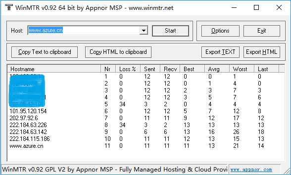
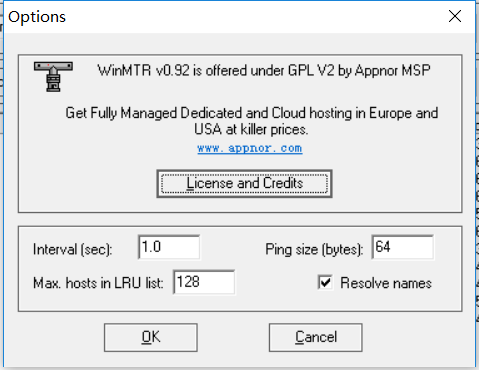
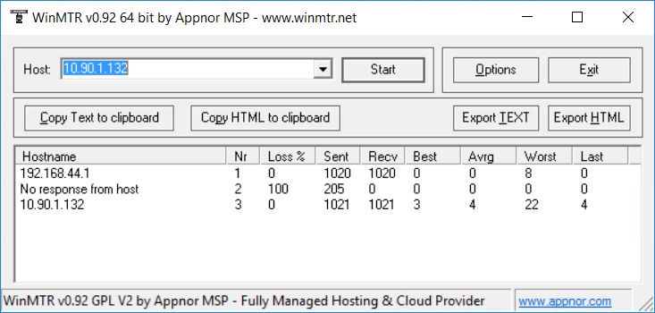
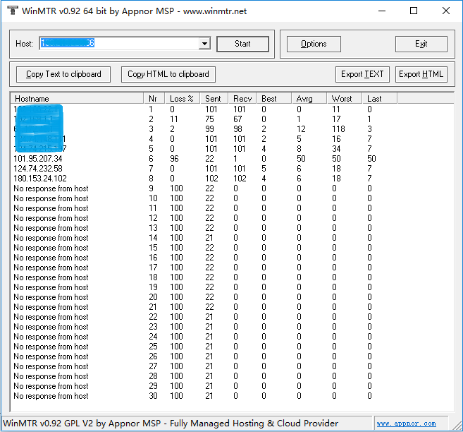
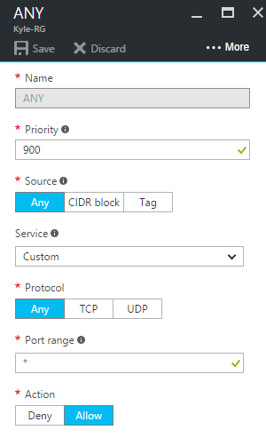
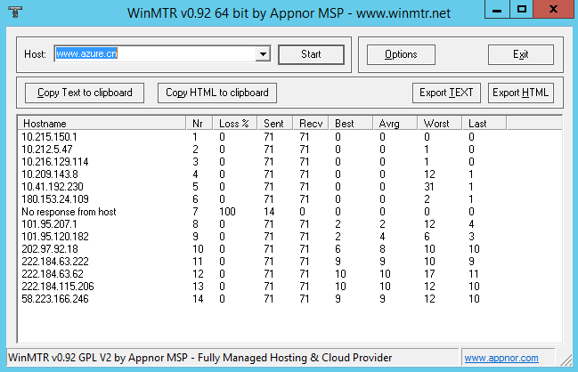
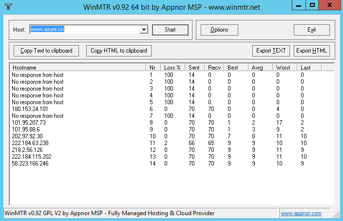

<properties
    pageTitle="Azure中使用MTR进行网络故障排查"
    description="Azure中使用MTR进行网络故障排查。"
    services="virtual-network"
    documentationCenter=""
    authors="Kyle Fu"
    manager=""
    editor=""
    tags="Azure,MTR,WinMTR,ICMP,网络"/>

<tags
    ms.service="virtual-network-aog"
    ms.date="10/20/2016"
    wacn.date="11/03/2016"/>

#Azure中使用MTR进行网络故障排查

##MTR介绍

相信很多人都使用过 ping 、 traceroute（ Windows 中为 tracert ）来诊断网络故障。使用 ping 时，只能测试两个节点之间的连通性，以及响应延迟。使用 traceroute 时，能获得测试所途径的节点信息，但是测试结果不能持续显示每个节点的连接状态，也不能显示每个节点的丢包率。 MTR 弥补了 ping 和 traceroute 功能上的不足，集二者的优点于一身，并且将二者的测试结果整合在一起，让大家能够更直观的查看到网络状态。 MTR 和 ping 、 traceroute 一样，都是通过发送 ICMP 包来测试网络上两个节点之间的网路连接状态。

在 Linux 、 Unix 平台，可以直接使用 mtr 命令来进行 MTR 测试。若发现没有 mtr 命令，则需要安装。在 Linux 、Unix 中安装 MTR 方法比较简单，请大家自行搜索安装方法。 

在 Windows 中，可以使用 WinMTR 来进行 MTR 测试。WinMTR 有图形界面，相比 Linux 、 Unix 中的 mtr 命令更加友好。 WinMTR 下载地址：[http://winmtr.net/download-winmtr/](http://winmtr.net/download-winmtr/)。下文的介绍及测试都基于 WinMTR。

##WinMTR界面介绍

WinMTR的界面非常简洁，如下图。

 
一般情况下，测试时只需要在 Host 后面的文本框中输入目的端 IP 或者主机域名，然后点击 Start 即可。 测试完成后，可以点击 Stop 停止测试。下面的4个按钮可以将测试结果以 Text 或 Html 的格式复制到粘贴板，或者导出成文件。

若有需要，可以点击 Options ，对测试进行简单配置。
 

其中，Interval 表示持续测试时，每次测试的间隔，默认为1秒。Ping size 表示 ICMP 包的大小，默认为64字节。Max. hosts in LRU list 表示 LRU 列表支持的最大主机数，默认值为 128。勾中 Resolve names 表示将测试过程中的 IP反向解析成域名显示出来，如果解析不到，则仍以 IP 显示。

在测试结果中，一共有9列数据。分别代表以下含义：

- Hostname：到目的端经过的每个主机的 IP 或主机名。
-	Nr：经过节点的数量。以上图测试 www.azure.cn 为例，一共经过了11个节点。
-	Loss%：对应节点的 ICMP 包回复失败的百分比。
-	Sent：已传送的 ICMP 包数量。
-	Recv：成功接收的 ICMP 包数量。
-	Best：回应时间的最小值。
-	Avrg：回应时间的平均值。
-	Worst：回应时间的最大值。
-	Last：最后一个 ICMP 包的回应时间。

其中，Best，Avrg，Worst，Last 的单位都为毫秒。

##Azure中使用MTR

###使用WinMTR测试虚拟网络链路 

这里所说的虚拟网络，是指Azure所支持的点到站点（ P2S ），站点到站点（ S2S ），VNet 到 VNet，以及ExpressRoute 在内的通信网络。下图为站点到站点 VPN 的 WinMTR 测试结果。

 
其中，第一跳为 VPN 设备的内网 IP，第二跳为 Azure VPN 网关，第三跳就到达了 Azure 中虚拟机。由于 Azure VPN 网关禁止 ICMP 包探测，所以显示为 No response from host。这种情况下可以直接查看后续节点的测试结果。本例中的测试结果显示VPN通道正常，1000多个 ICMP 测试包全部都有响应，没有丢包。

###使用WinMTR测试公网链路

此处所描述的公网链路测试，是指从公网中的一台测试机向Azure中的服务或虚拟机发起测试，或者从Azure中的一台虚拟机向公网中的某个IP或主机发起测试。

####从公网测Azure

当我们从公网向Azure发起测试时，WinMTR 只能显示到 Azure 的核心网络设备的 IP，后续全部显示为 No response from host（见下图）。出现这种结果的原因是，是因为通过 VIP 访问虚拟机时，网络通讯需要通过 Azure Load Balancer。Azure Load Balancer 目前不开放 ICMP 协议。而 MTR 使用 ICMP 包来进行测试，因此无法通过 Load Balancer。ILPIP（PIP）虽然能够不经过 VIP 来直接访问虚拟机，但是对于这种访问 Azure 依旧不开放 ICMP 协议。所以出现相同的结果。不过从结果中，我们仍然能看到测试发起端所在的本地网络，以及相连接的运营商网络到 Azure 的网络状况。这对分析测试机所在网络到 Azure 网络的质量具有一定帮助。
 

####从Azure测公网

除了从公网到 Azure 的测试，我们还能从 Azure 内部发起到公网的 IP 或主机的测试。正如前文提到的，Azure Load Balancer 不开放 ICMP 协议。所以通常情况下，此类测试无法完成。但是，我们可以通过一定方法来避开 Azure Load Balancer 对 ICMP 的限制。

在经典模式下部署的虚拟机中，我们可以通过设置 ILPIP 来实现。具体设置方法请参考：[https://www.azure.cn/documentation/articles/virtual-networks-instance-level-public-ip](/documentation/articles/virtual-networks-instance-level-public-ip/)。

在资源管理器模式下，创建的虚拟机默认会配置 Public IP 和 NSG。而 NSG 在通常情况下，也不允许 ICMP 包的传输。所以要在资源管理器模式下的虚拟机中使用 WinMTR，则需要将 NSG 从虚拟机所使用的网卡中移除（设置对应网卡的 NSG 为“无”），或者添加一个优先级最高，协议为 Any，端口范围为*，动作为 Allow 的 NSG 规则（见下图）。

 
>请注意，以上这些设置对都会增加虚拟机的安全隐患。若非用作测试，或其他特殊需求，请不要长期使用这些工作方式。同时，配置ILPIP和网络测试数据传输都会产生相对应的费用。所以测试前务必做好测试计划，以免造成计划外的支出。

当上述操作完成后，我们就可以在 Azure 的虚拟机中对公网主机的 MTR 测试了。下面两张图分别来自经典和资源管理器模式中虚拟机对 www.azure.cn 进行的 MTR 测试结果。可以发现在前5跳中，经典模式下的虚拟机能够完整显示内网各个节点的IP，但是资源管理器中的虚拟机则无法显示。这是由于资源管理器模式下，Azure 网络对 ICMP 包的限制导致。另外，在第7跳都出现了 No response from host，而后续节点的状态都基本正常，这是由于运营商网络的此节点也对 ICMP 有限制导致。这种情况在延伸阅读章节推荐的文章中有详细介绍。

 
 

##延伸阅读

MTR 测试会得出各式各样的结果。当网络有故障时，不同的结果通常都需要有丰富的经验才能做出正确的判断。这里推荐一篇文章供大家阅读，帮助大家能够尽可能正确解读 MTR 测试的结果。

[使用 MTR 诊断网络问题（中文）](http://www.tuicool.com/articles/emINv2v)

[Diagnosing Network Issues with MTR（上一个链接的英文原版）](https://www.linode.com/docs/networking/diagnostics/diagnosing-network-issues-with-mtr/)

