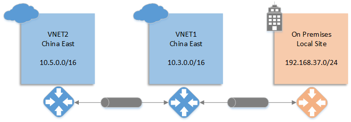
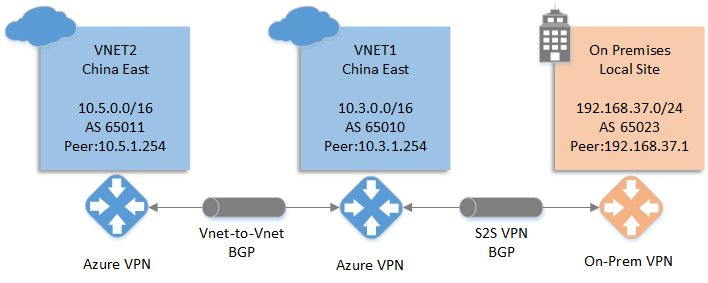
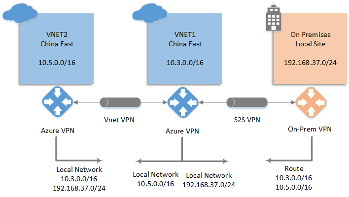
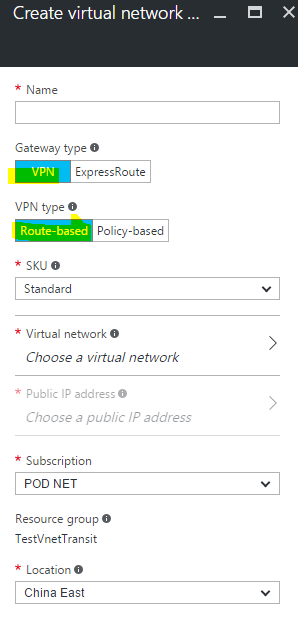
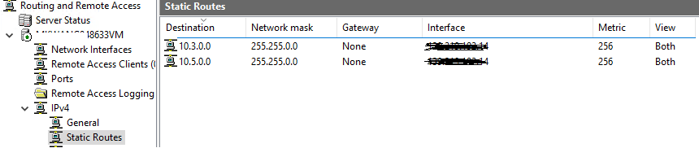
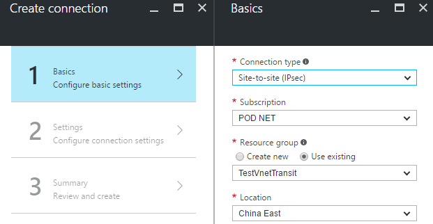
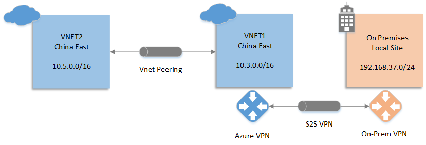
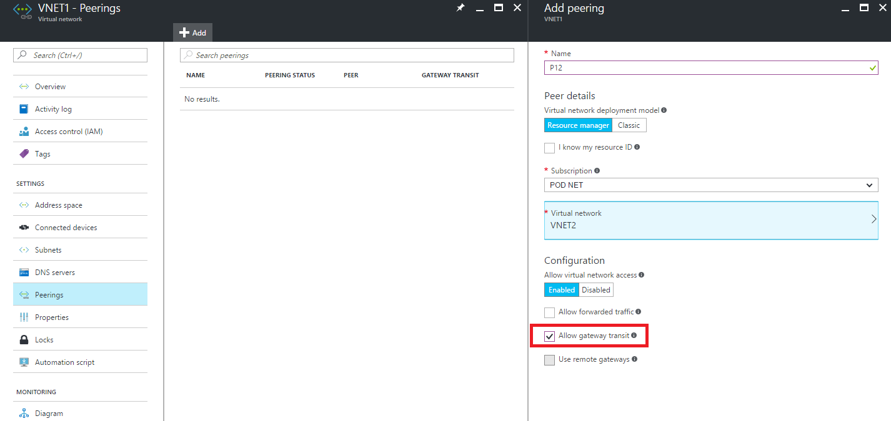
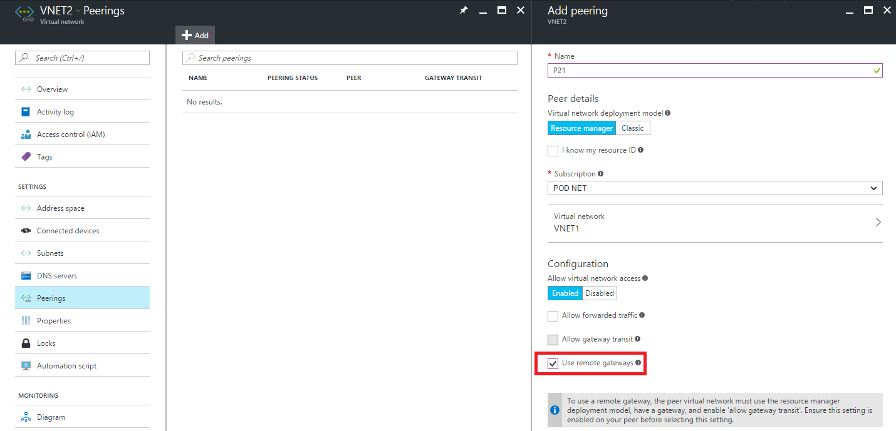
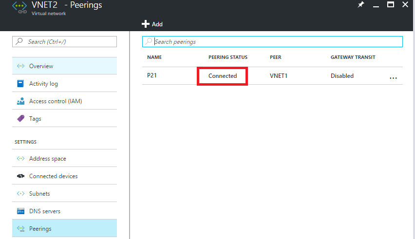

<properties
	pageTitle="如何在 Azure VPN 网关上实现网络透传"
	description="如何在 Azure VPN 网关上实现网络透传"
	service=""
	resource="vpngateway"
	authors=""
	displayOrder=""
	selfHelpType=""
    supportTopicIds=""
    productPesIds=""
    resourceTags="VPN, BGP, Local Network, VNET Peering"
    cloudEnvironments="MoonCake" />
<tags
	ms.service="vpn-gateway-aog"
	ms.date=""
	wacn.date="02/13/2017" />
# 如何在 Azure VPN 网关上实现网络透传

## 背景介绍

在一些使用 Azure 的较复杂的网络架构中，会存在多个虚拟网络和本地网络。鉴于某些特殊的使用场景或需求，需要实现某一个虚拟网络透过跟其相连的虚拟网络网关去跟其后端的虚拟网络或者本地网络进行通讯。

比如在下面的应用场景中，虚拟网络 VNET1 已经跟本地 On Premises Local Site 打通了 VPN，客户在 Azure 又创建了虚拟网络 VNET2 也需要跟本地进行通信。为了降低成本以及维护方便，客户不希望跟本地打通多个 VPN 通道，VNET2 需要通过 VNET1 的 VPN 网关作为跳板来访问本地网络。这是一个比较典型的需要使用 VPN 网关网络透传功能的场景，本文也将以这个场景为例来描述搭建这样的环境的具体方法。

## 实现方法

目前实现 VPN 网关的网络透传主要有以下三种方案：

1.	<a href="#vpn-bgp">使用 VPN 网关的 BGP 功能</a>

	BGP 作为动态路由协议，可以用来在多个节点之间传递路由。当我们在所有的虚拟网络网关和本地 VPN 设备上都启用 BGP 功能并打通 VPN 连接后，可以轻松的实现各个虚拟网络和本地网络之间的互通而不需要进行额外配置。并且由于 BGP 动态路由的特性，当网络架构需要调整时我们需要进行的配置修改也相对较少。比如在上图所示的应用场景中，当我们又创建了虚拟网络 VNET2 需要透过 VNET1 的 VPN 网关来访问本地，我们甚至不需要对本地设备进行任何的操作就能实现本地与 VNET2 的互通。

2.	<a href="#local-network">自定义本地网络（Local Network）地址空间</a>

	对于 Azure 虚拟网络的 VPN 连接，我们都需要配置一个本地网络来告知 VPN 网关对方所使用的地址空间，我们可以利用这个特性用一些“小技巧”来实现网络透传。(这里的**本地网络**是指在 Azure 上面配置的本地网络 Local Network，而不是指客户 On Premises Local Site 的网络)。 比如在上图所示的应用场景中，正常情况下 VNET1 和 VNET2 如果使用 VPN 的方式进行连接，我们只需要配置 VNET2 连接的本地网络地址空间为 VNET1 的地址空间，VNET1 连接的本地网络地址空间为 VNET2 的地址空间。如果要实现透传，需要将 VNET2 连接的本地网络地址空间改为 VNET1 的地址空间与 On Premises Local Site 地址空间的合集。同样的，在 On Premises Local Site 的 VPN 设备上，也要添加路由将走向 VNET2 的流量导向跟 VNET1 建立的 VPN 隧道上。由于 VNET1 的 VPN 网关已经有路由来传递这些目标地址不是自己虚拟网络内的流量并且 Azure VPN 网关本身是支持透传的，所以我们不需要在 VNET1 上再做额外的配置。由于这个方案需要根据当前的网络架构来修改本地网络的配置，如果用户不能真正了解 Azure 本地网络的作用往往容易出错，所以配置的时候要多加小心。

3.	<a href="#vnet-peering">使用虚拟网络对等互联（VNET Peering）</a>

	虚拟网络对等互联是 Azure 在 2016 年年底发布的最新功能，可以利用此功能在不创建 VPN 网关的前提下实现两个虚拟网络的互联。默认情况下虚拟网络对等互联就是支持网络透传的，但是目前虚拟网络对等互联只支持同一个数据中心的虚拟网络进行互联，所以按照上图所示的架构如果 VNET2 创建在中国北部，VNET1 创建在中国东部时，目前是没法使用虚拟网络对等互联来实现网络透传的。

下表将三种方案进行了对比，用户可以根据具体的需求进行选择

| 方案               	| 灵活性 	| 本地设备要求* 	| 是否支持跨区域 		| 操作复杂度 		|
|--------------------	|--------	|--------------	|----------------	|------------	|
| BGP                	| 高     	| 高           	| 是             	| 高         	|
| 自定义本地地址空间 		| 低     	| 一般         	| 是             	| 中         	|
| VNET Peering       	| 中     	| 一般         	| 否             	| 低         	|

>[AZURE.NOTE]*启用 BGP 的方案需要设备支持 BGP 功能，有些防火墙支持 VPN 功能但是并不支持 BGP 功能，在使用前需要了解设备是否支持 BGP 功能。而其他两种方案不需要设备支持 BGP 功能而只需要支持 VPN 功能。所以这里启用 BGP 的方案相对来说对设备的要求高一些。

下面介绍三种方案的具体配置方法 : 

## 使用 VPN 网关的 BGP 功能

如上图所示，VNET2 与 VNET1 的 VPN 网关需要开启 BGP 功能，并且在 VNET2 和 VNET1 之间建立支持 BGP 的连接。同样 VNET1 和 On Premises Local Site 也建立支持 BGP 的 VPN 连接。建立好这些支持 BGP 的连接之后不需要再进行额外的配置可以使得 VNET2 透过 VNET1 的 VPN 网关来访问 On Premises Local Site。

由于已经有文章来详细讲述如何配置这样的环境，本文不再赘述。读者可以参考下面的两篇文章进行配置：

[如何使用 Azure Resource Manager 和 PowerShell 在 Azure VPN 网关上配置 BGP](/documentation/articles/vpn-gateway-bgp-resource-manager-ps/) 
[如何使用 Windows Server 2016 与 Azure 搭建支持 BGP 协议的 VPN 通道](/documentation/articles/aog-virtual-machines-howto-windows-server-2016-bgp-vpn/)

## 自定义本地网络（Local Network）地址空间

如上图所示，VNET2 与 VNET1 使用 VPN 进行连接，VNET1 和 On Premises Local Site 也通过站点到站点 VPN 进行连接。该配置的关键地方是要将 VNET2 连接 VNET1 所对应的本地网络地址空间设置为 `10.3.0.0/16` 和 `192.168.37.0/24` 的合集。这样 VNET2 的 VPN 网关也会将目标地址为 `192.168.37.0/24` 的流量转发给 VNET1 的 VPN 网关，由于 VNET1 的 VPN 网关有去往本地 On Premises Local Site 的路由，所以会将 `192.168.37.0/24` 的流量转发到跟本地连接的 VPN 隧道，同时本地 VPN 设备也需要添加路由将去往 `10.5.0.0/16` 的流量指向 VPN 隧道。通过这样的配置就实现了 VNET2 和 On Premises Local Site 之间的流量通过 VNET1 的 VPN 网关进行透传。

下面详细介绍在 ARM 模式下如何进行配置：

1.	建立虚拟网络 VNET1，地址空间为 `10.3.0.0/16`，添加网关子网为 `10.3.1.0/24`。

2.	建立虚拟网络 VNET2，地址空间为 `10.5.0.0/16`，添加网关子网为 `10.5.1.0/24`。

3.	建立 VNET1 对应的 VPN 网关，Gateway 类型为 `VPN`， VPN 类型必须为 `Route-based`。

	

4.	建立 VNET2 对应的 VPN 网关，Gateway 类型为 `VPN`， VPN 类型为 `Route-based`。

5.	建立本地网关 LocalGW, IP 地址为本地 VPN 设备地址，地址空间为 `192.168.37.0/24`。

6.	建立连接，用于连接 VNET1 VPN 网关和 LocalGW（密钥自行指定，后续建立的连接都使用这个密钥）。

7.	按照下面的文档配置本地 VPN 设备。

	[关于站点到站点 VPN 网关连接的 VPN 设备](/documentation/articles/vpn-gateway-about-vpn-devices/)

	>[AZURE.NOTE]不仅需要把 VNET1 的地址空间指向 VPN tunnel 还需要把 VNET2 的地址空间指向 VPN tunnel。

	比如我这边使用的 Windows Server 2016 搭建的 VPN，需要建立静态路由把 `10.3.0.0/16` 和 `10.5.0.0/16` 两个地址空间的流量指向 VPN tunnel。

	

8.	建立 VNET1 和 VNET2 所对应的本地网络网关。

	假设 VPN 网关建立成功后 VNET1 对应的 Gateway IP 为 `VIP1`，VNET2 对应的 Gateway IP 为 `VIP2`。
	
	| 虚拟网络	| 地址空间		| Gateway IP	| 
	|---------	|------------	|-----------	|
	| VNET1		| 10.3.0.0/16	| VIP1 			|
	| VNET2		| 10.5.0.0/16	| VIP2 			|

	需要建立 VNET1 对应的本地网络网关 LocalVnet1，VPN 地址为 `VIP1`，地址空间为 `10.3.0.0/16`，`192.168.37.0/24` （这里一定要把 On premises Local Site 的地址空间加上）。

	还需要建立 VNET2 对应的本地网络网关 LocalVnet2，VPN 地址为 `VIP2`，地址空间为 `10.5.0.0/16`。

9.	建立 VNET1 VPN 网关到 `LocalVnet2` 的连接，同时建立 VNET2 VPN 网关到 `LocalVnet1` 的连接。建立连接的时候选择类型为 `Site-to-Site (IPsec)` 而不要选择 `VNET to VNET`。

	

10.	以上配置成功后，就可以在 VNET2 和 On Premises Local Site 之间进行访问了。

## 使用虚拟网络对等互联（VNET Peering）

使用虚拟网络对等互联从架构上来讲是最简单的，操作也相对比较容易，但是必须得注意的是目前 `VNET1` 和 `VNET2` 必须创建在同一个数据中心。

如上图所示，在这个架构中对于虚拟网络 VNET2 不再需要建立 VPN 网关，而利用 VNET Peering 所自带的网络透传功能进行配置。具体的操作步骤如下：

1.	参考下面的文章建立 VNET1 和 On Premises Local Site 之间的站点到站点 VPN 连接。

	[使用 Azure 门户预览创建具有站点到站点连接的 VNet](/documentation/articles/vpn-gateway-howto-site-to-site-resource-manager-portal/) 

2.	点击创建好的 VNET1 并找到 Peering，再次点击添加（Add）按钮。配置所连接的虚拟网络为 VNET2 并且在配置部分选择允许网络透传 allow gateway transit。

	

3.	点击 VNET2 并找到 Peering, 再次点击添加（Add）按钮。配置所连接的虚拟网络为 VNET1 并且在配置部分选择使用远程网关 use remote gateways。

	

4.	当 Peering 状态显示为已连接时 connected 表示虚拟网络对等互联建立成功。

	

5.	本地的 VPN 设备需要添加路由, 将去往 VNET2 `10.5.0.0/16`的流量指向 VPN tunnel。

6.	以上配置成功后，就可以在 VNET2 和 On Premises Local Site 之间进行访问。
