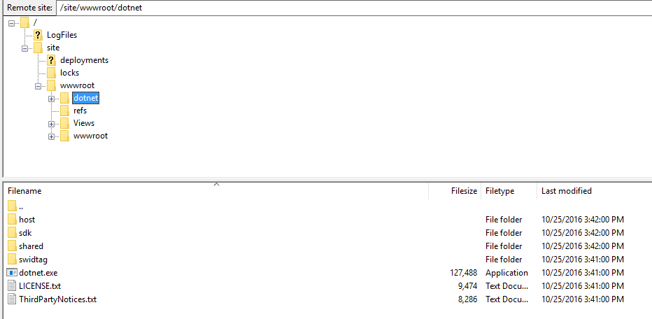

<properties
	pageTitle="在 Azure WebApps 中运行64位 Asp.net Core 应用"
	description="在 Azure WebApps 中运行64位 Asp.net Core 应用"
	services="app-service-web"
	documentationCenter=""
	authors=""
	manager=""
	editor=""
	tags=""/>

<tags
	ms.service="app-service-web-aog"
	ms.date="10/27/2016"
	wacn.date="11/10/2016"/>

#在 Azure WebApps 中运行64位 Asp.net Core 应用

作为微软下一代的开源的跨平台的开发框架， Asp.net core 正在吸引越来越多的开发者基于其构建现代 web 应用。 

目前， Azure App Service 也实现了对 asp.net core 的支持。 用户所开发的 ASP.NET Core Web 应用， 以与通常 Asp.net Web 应用同样的方式部署到云端后，便可以被顺利执行。

但是，目前 Azure App Service 尚只支持32位的 Asp.net Core 运行时，即用户的 Asp.net Core 应用在云端是以一个32位进程来运行。 在大多数情况下，它可以支持用户的 web 应用正常运行，但是，在某些场景下，用户会有使用64位 Asp.net Core 运行时的需求，例如应用需使用超过 2GB 的用户态虚拟内存空间，或应用需要加载64位的本地代码，等等。 在这种情况下，我们可以考虑使用自定义上传的 Asp.net Core 运行环境。 

具体实现如下：

1.	从微软的 .Net Core 站点（[https://www.microsoft.com/net/core#windows](https://www.microsoft.com/net/core#windows) ）下载 .Net Core SDK, 并安装到一个64位的 Windows 本地机器中。
2.	将安装后的 dotnet 文件夹（默认路径为C:\Program Files\dotnet ）通过 FTP 上传至 Azure App Service 目录。例如`/site/wwwroot/dotnet`

	
 
3.	打开站点web.config文件，在aspNetCore节中，将processPath改为新上传的dotnet.exe路径并保存。

		  <system.webServer>
		    <handlers>
		      <add name="aspNetCore" path="*" verb="*" modules="AspNetCoreModule" resourceType="Unspecified" />
		    </handlers>
		    <aspNetCore processPath="d:\home\site\wwwroot\dotnet\dotnet.exe" arguments=".\WebApplication1.dll" stdoutLogEnabled="false" stdoutLogFile=".\logs\stdout" forwardWindowsAuthToken="false" />
		  </system.webServer>
4.	重启站点。 

