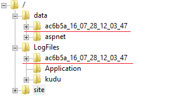
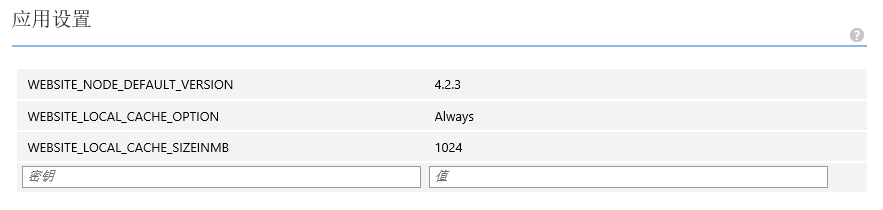
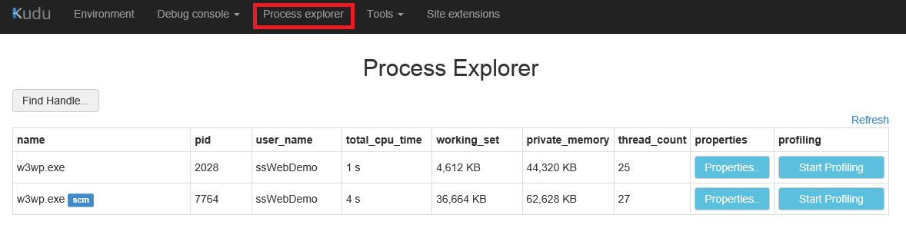
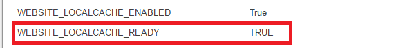

<properties 
	pageTitle="如何为Azure Web应用配置本地缓存" 
	description="如何为Azure Web应用配置本地缓存。" 
	services="app-service-web" 
	documentationCenter="" 
	authors=""
	manager="" 
	editor=""/>
<tags ms.service="app-service-web-aog" ms.date="" wacn.date="08/31/2016"/>
#如何为Azure Web应用配置本地缓存

##Azure Web应用内容的存储方式

Azure web 应用内容（包括代码文件，资源文件等）默认并不是存放在本地虚机的磁盘上，而是存放在远程的共享目录中。这样的设计有以下几个特点：

- 多个web应用的虚拟机实例共享同一个web应用目录。
- 内容是持久化存储，运行中的web应用可以修改共享目录下的内容。
- Web应用的日志文件也存放在相同的共享目录下。
- 新内容是直接发布到共享目录中，用户可以立即在SCM站点看到新发布的内容。并且基于ASP.NET的web应用在收到文件更改通知后，会触发重启获取最新内容。

##Web应用本地缓存介绍

除了使用默认的共享目录来存放web应用内容，用户可以为web应用开启本地缓存。开启本地缓存后，web应用内容会从共享目录复制到本地虚拟机实例的磁盘上。启用本地缓存有以下几点好处:

- 可以提高web 应用的效率，避免访问远程存储所带来的网络延时。
- 如果远程文件服务器发生任何故障，用户的web 应用将不受此影响。
- 减少由于远程文件服务器迁移而造成的web应用重启次数。

开启本地缓存后，web应用具有以下行为:

- 当web应用重启时，在虚拟机实例上创建 /site和/siteextensions文件夹的本地拷贝
- 本地缓存可以读写，但是当web应用的虚机发生迁移，或者web应用重启后，所有的改动将会丢失。因此不建议将重要的数据写到本地缓存中。
- 如果web应用开启了日志，日志会写入本地缓存中，并定期同步到远程的共享目录。
- 发布的新内容还是继续存放到远程共享目录中，用户需要重启web 应用将新内容同步到本地缓存。
- Data 和 LogFiles文件夹下面会生成额外的子文件（虚拟机标识+时间戳）来存放数据和日志。 

	

## 如何启用web应用本地缓存

1.	登录Portal，进入web应用的配置界面，为应用设置添加如下参数:

 	

	> 注：默认local cache大小为300MB，最大支持1G(1024MB)

2.	重启web应用后配置生效

## 验证Web应用是否已经切换到本地缓存

1.	登录web应用的SCM站点：https://yourwebsitename.scm.chinacloudsites.cn
2.	进入Process explorer 面板
 
	

3.	点击w3wp.exe进程的Properties按钮，进入Environment Variables 面板
4.	如果存在环境变量 WEBSITE_LOCALCACHE_READY = True，则说明web应用已经成功切换到本地缓存模式。

	

