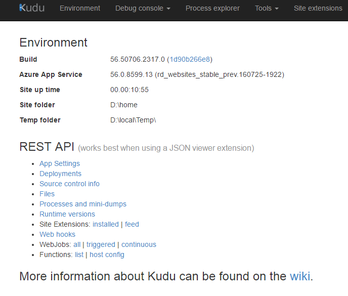
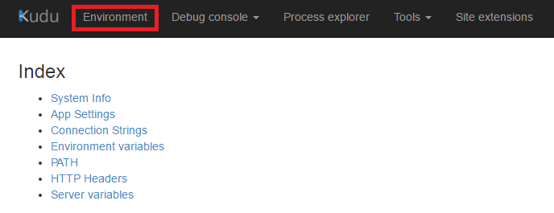
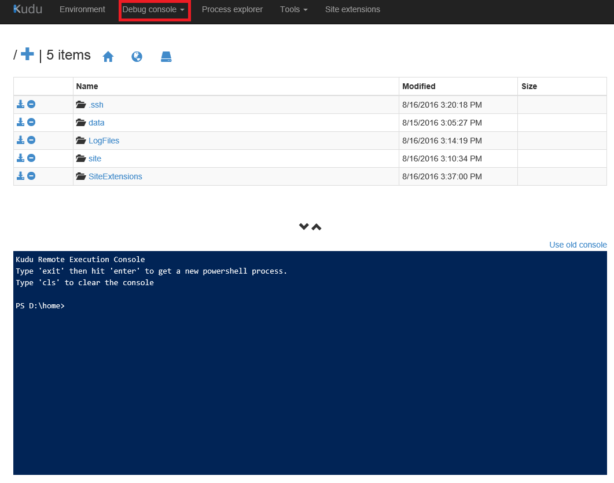
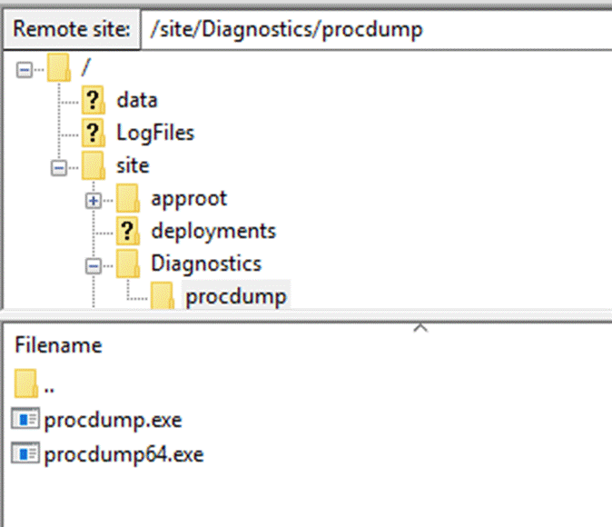
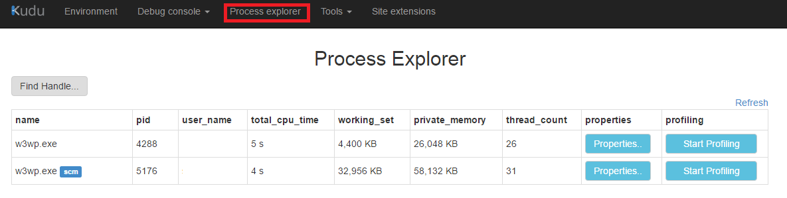
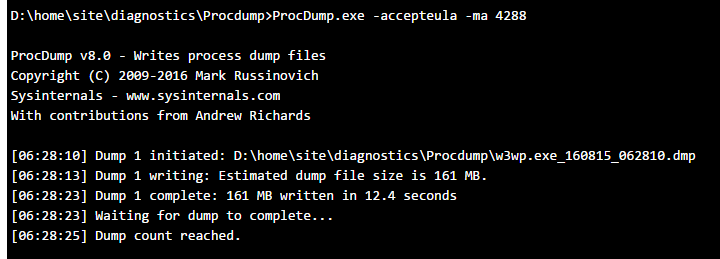
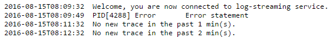
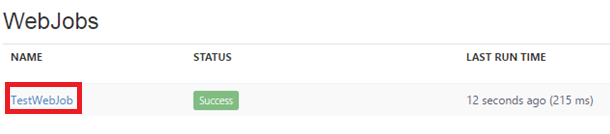
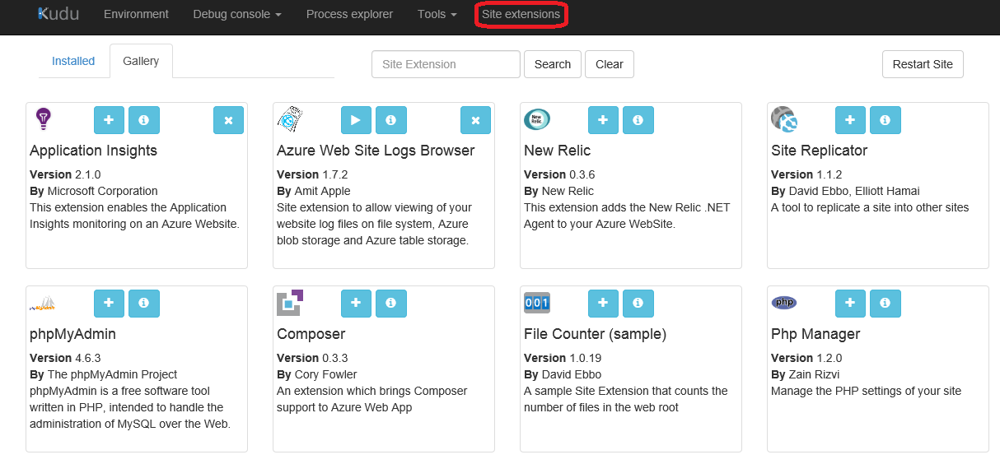

<properties 
	pageTitle="Kudu 管理和诊断 azure web 应用" 
	description="Kudu 管理和诊断 azure web 应用。" 
	services="app-service-web" 
	documentationCenter="" 
	authors=""
	manager="" 
	editor=""/>
<tags ms.service="app-service-web-aog" ms.date="" wacn.date="08/31/2016"/>
# Kudu 管理和诊断 azure web 应用

[Azure Kudu](https://github.com/projectkudu/kudu/wiki/Process-Threads-list-and-minidump-gcdump-diagsession)是 GitHub 上的一个开源项目，Kudu 站点 (也称为网站控制管理 SCM) 提供了一系列的在线工具，可以帮助用户查看 web 应用的设置，诊断 web 应用，以及安装 web 应用扩展。本文包含以下内容：

- [登陆 Azure Kudu 站点](#login)
- [查看 web 应用环境](#env)
- [调试控制台](#console)
- [场景举例](#scenario)
- [进程管理器](#process)
- [其它在线工具](#tool)
- [Web 应用扩展](#ext)

## 登陆 Azure Kudu 站点
在浏览器中输入[https://{sitename}.scm.chinacloudsites.cn](#),在弹出的认证窗口中输入web应用的部署账号和密码（关于如何访问 KUDU 请阅读[这篇文章](https://github.com/projectkudu/kudu/wiki/Accessing-the-kudu-service)），验证成功后进入 Kudu 首页，首页包含 Kudu 当前的版本信息以及 Kudu REST API 接口信息，如下图:

## 查看 web 应用环境

进入 Environment 页面，用户可以查看 web 应用的运行环境，包括系统信息，应用程序设置，连接设置，环境变量，运行时路径，服务器 HTTP headers 配置以及服务器变量。

## 调试控制台

提供文件管理器和远程终端两大核心功能。

* 用户可以通过文件管理器查看网站文件，修改，删除和下载文件，并支持拖拽方式上传文件。

	
* 提供远程终端Power Shell和 cmd窗口，用户可以远程在web应用实例上执行命令。

## 场景举例

当 web 应用出现性能问题，可以通过控制台抓取 web 应用的工作进程（w3wp.exe）的 hang dump 用于后续分析。

1. 下载 ProcDump 并上传到 /site/Dianostices/Procdump 位置。

	

2. 进入 Process explore 页面，获取网站工作进程 w3wp.exe 的进程 ID

	

3. 进入 /site/Dianostices/Procdump 文件夹，运行 procdump -ma -accepteula pid (pid 为具体的进程 ID)

	

4. 下载生成的 dump 文件，用 windows 调试工具如 windbg 进行后续分析。

## 进程管理器

用户可以通过进程管理器查看 web 应用实例上运行的进程的信息：

点击 Properties 按钮可以查看进程的具体信息
点击 Start Profiling 开始监控进程 CPU 使用情况，监控结束后自动生成报表。

## 其它在线工具
Tools选项卡下面提供了一些其他在线工具：

* Diagnostic Dump：

	单击此按钮可以下载 web 应用的重要日志文件。
* Log stream：
   
	输出实时日志到页面, 此功能也可以通过 curl 命令行 启动。

		curl -u {username} https://{sitename}.scm.chinacloudsites.cn/logstream

	页面打印如下格式的日志信息：

	

	>[AZURE.NOTE]如果通过 Kudu 站点启动 Log stream，由于浏览器会缓存响应数据，用户需要等到日志填满缓冲区后，才可以看到实时日志输出到页面。 Log stream 会持续 12 小时开启应用程序文件日志 (错误模式) ,用户可以在 Azure portal 上手动关闭。
    
* WebJobs dashboard： 

	进入 WebJobs dashboard 页面后，单击 WebJobs 的 NAME 链接，可以显示 web Job 历史运行情况。
	
	

* Download deployment script：
  
	如果 web 应用是通过 Git 部署，用户点击此按钮可以下载部署脚本。

## Web 应用扩展

Kudu 站点提供了 web 应用扩展界面，用户可以查看已经安装的扩展或者安装新的扩展。

