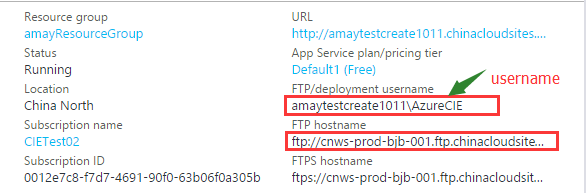

<properties
    pageTitle="本文详细介绍了登录 Azure web 应用 FTP 服务器和 Azure web 应用 Kudu 站点的几种方法"
    description="本文详细介绍了登录 Azure web 应用 FTP 服务器和 Azure web 应用 Kudu 站点的几种方法。"
    services="app-service-web"
    documentationCenter=""
    authors=""
    manager=""
    editor=""
    tags=""/>

<tags
    ms.service="app-service-web-aog"
    ms.date="10/27/2016"
    wacn.date="11/03/2016"/>

# 本文详细介绍了登录 Azure web 应用 FTP 服务器和 Azure web 应用 Kudu 站点的几种方法

## 登录 FTP 服务器:

### 使用 FTP 部署用户名和密码登录

>[AZURE.TIP]: 一个订阅下的所有网站的用户名和密码是同一个，如果更改用户名和密码其他网站登录时也要采用新的用户名和密码登录。

1.登录信息您可以在网站页面获取

>注意：FTP部署用户名格式应为【网站名\用户名】

 
2.在FTP中登录时，所填信息类似如下：

	Host：ftp://cnws-prod-bjb-001.ftp.chinacloudsites.chinacloudapi.cn
	Username；amaytestcreate1011\AzureCIE
	Password：XXXX[您自己的FTP密码]
  

### 使用发布配置文件进行FTP登录

>Tip：如果想要每个网站有独立的维护人时可以采取这种模式。

具体步骤如下：

1. 下载网站的发布配置文件

	
 
2. 使用文本编辑器打开该文件。在此文件中查找FTP的相关信息，如下截图信息：PublishProfileName, publishMethod, publishUrl, ftpPassiveMode, userName, userPWD.
其中 publishUrl, userName, userPWD 是在登录 FTP 时需要的信息。

	
 
3. 在第三方 ftp 客户端登录。
 
	

##登录Kudu站点：

>Tip:  Azure为每一个 web 应用都配置了 Kudu 站点，网站的 Kudu 站点可以方便对网站进行管理，kudu 的 URL为：https://[网站名].scm.chinacloudsites.cn 如:

https://amaydel1.scm.chinacloudsites.cn/ 

###使用FTP用户名和密码登录

具体步骤见下例：

1. 获取登录的必要信息

	Kudu URL：https://amaydel1.scm.chinacloudsites.cn/
	用户名：may （Kudu站点的用户名不包括网站名称）
	密码；xxxxx

	
 
2. 打开浏览器，输入Kudu URL地址，回车，输入用户名和密码。

	
 
3. 登录完成以后就可以看到 Kudu 站点了

	
 

### 使用部署配置文件登录

具体步骤参考事例如下：

1. 下载发布配置文件

	
 
2. 文本编辑器打开，获取必要信息

		Kudu URL: https://amaydel1.scm.chinacloudsites.cn 
		用户名：$amaydel1
		密码：YnuEwRDLr3P6X1vCdKe2dNYyYQf7TJmfryubADvCbXXXXX

	

 

3. 打开浏览器，输入 Kudu URL 地址，回车，输入用户名和密码。

	
 
4. 登录完成以后就可以看到 Kudu 站点了

	
 
##其他资源： 

[https://www.azure.cn/documentation/articles/aog-web-app-diagnostics-kudu/#login](/documentation/articles/aog-web-app-diagnostics-kudu/#login ) 

