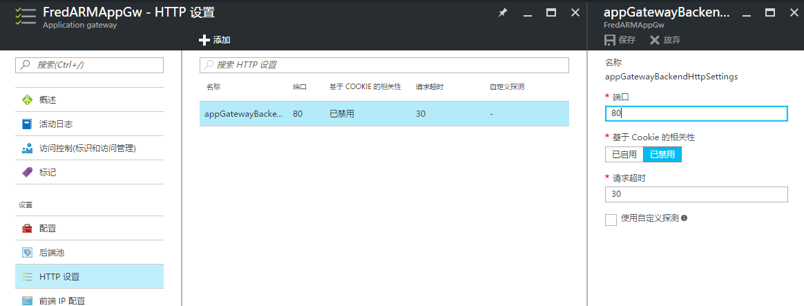

<properties
	pageTitle="使用应用程序网关网页载入超过 30 秒（错误代码 502）的解决方法"
	description="如何解决载入超过 30 秒出现 502 错误"
	services="app-service-web"
	documentationCenter=""
	authors=""
	manager=""
	editor=""
	tags=""/>

<tags
	ms.service="app-service-web-aog"
	ms.date="10/27/2016"
	wacn.date="11/03/2016"/>

#使用应用程序网关网页载入超过 30 秒（错误代码 502）的解决方法

###问题：

在使用应用程序网关时当网页的载入时间超过 30 秒时会返回 502 的报错

###现象：

问题发生时，网页会显示如下错误信息：
	
	502 - Web server received an invalid response while acting as a gateway or proxy server.
	There is a problem with the page you are looking for, and it cannot be displayed. When the Web server (while acting as a gateway or proxy) contacted the upstream content server, it received an invalid response from the content server.

###解决方法：

当一个用户对使用应用程序网关的网站发起请求时，应用程序网关会接收这些请求并会对后端池内的实例发起新的 HTTP 请求来获取数据。默认情况，应用程序网关会等待最多 30 秒来接收后端实例的 HTTP 响应；如果后端实例在 30 秒内没有响应的话，应用程序网关就会向客户端抛出 502 的报错。

在一些报表查询类网页中，由于需要执行后端的数据库检索，可能会导致实例对 HTTP 的响应超过 30 秒。如果无法从代码层面来解决该问题，可以考虑延长应用程序网关的请求超时时间来解决此问题。

对于使用经典模式创建的应用程序网关只能使用 PowerShell 来进行操作。

具体操作步骤如下：

1. 运行下面的 PowerShell 命令导出应用程序网关的配置信息。

		Get-AzureApplicationGatewayConfig -Name <application gateway name> -Exporttofile "<path to file>"

2. 打开导出的文件并找到 BackendHttpSettingsList 部分，修改 RequestTimeout 的值。该值的单位为秒，可以配置为 1 到 86400，可以根据实际的情况进行修改。
	
	    <BackendHttpSettingsList>
	        <BackendHttpSettings>
	            <Name>BackendSetting1</Name>
	            <Port>8180</Port>
	            <Protocol>Http</Protocol>
	            <CookieBasedAffinity>Enabled</CookieBasedAffinity>
	           <RequestTimeout>120</RequestTimeout>
	        </BackendHttpSettings>
	    </BackendHttpSettingsList>

3. 运行下面的命令对应用程序网关进行配置。

		Set-AzureApplicationGatewayConfig -Name <application gateway name> -Configfile "<path to file>"

>注意：请使用最新版本的 Azure PowerShell 来进行配置，如果使用的 PowerShell 版本较老可能会导致该操作不成功。

对于使用 ARM 模式创建的应用程序网关，我们可以直接在 Portal 直接进行配置。如下图所示，点击 HTTP 设置，选中某一条 HTTP 设置可以在请求超时部分进行配置。

 

