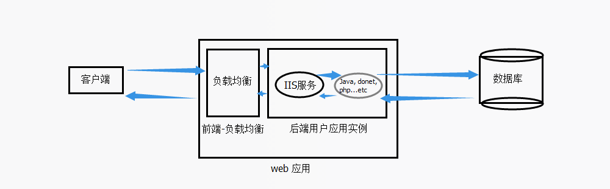

<properties
    pageTitle="关于 Azure Web 应用 4 分钟空闲连接的限制"
    description="关于 Azure Web 应用 4 分钟空闲连接的限制"
    service=""
    resource="webapps"
    authors="Zhang Hongmei"
    displayOrder=""
    selfHelpType=""
    supportTopicIds=""
    productPesIds=""
    resourceTags="Web Apps, Idle"
    cloudEnvironments="MoonCake" />
<tags
    ms.service="app-service-web-aog"
    ms.date=""
    wacn.date="04/29/2017" />

# 关于 Azure Web 应用 4 分钟空闲连接的限制

Azure Web 应用后台在处理耗时较长的请求时，并且在此期间，客户端和 Azure Web 应用没有数据交互，即 TCP 连接一直处于空闲状态，此种情况超过 4 分钟后，Azure Web 应用会强制断开于客户端的 TCP 连接，并且客户端如浏览器会收到请求错误。

Azure Web 应用的工作流如下：

根据上图所示，一个 Web 请求首先到 Azure 前端的负载均衡器，负载均衡器将请求转发到对应的实例进行处理，实例中运行的代码还有可能要连接后台数据库。当处理整个请求超过 4 分钟时，为了保证 Azure 后台的网络资源得到有效利用，Azure 服务端将会断开连接。

如果在处理请求期间，有持续的数据传输则不受此限制，比如客户端上传一个大文件，虽然耗时超过 4 分钟，但是在此期间客户端和 Azure 服务端是有持续的数据交互，此种情况不被认为是一个空闲连接。

目前这个空闲连接的时间(默认 4 分钟)是无法修改的。对于需要 4 分钟以上才能处理完毕的一些请求，建议采用异步处理。