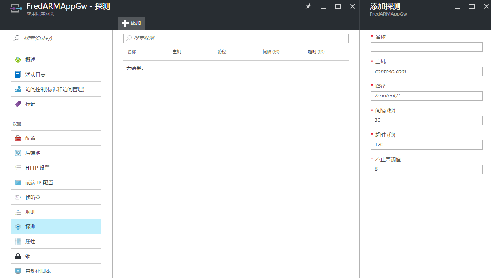

<properties
	pageTitle="如何解决当 Web 应用绑定了主机名而无法使用应用程序网关的问题"
	description="如何解决当 Web 应用绑定了主机名而无法使用应用程序网关的问题。"
	services="application-gateway"
	documentationCenter=""
	authors=""
	manager=""
	editor=""
	tags=""/>

<tags
	ms.service="application-gateway-aog"
	ms.date="12/05/2016"
	wacn.date="01/18/2017"/>
# 如何解决当 Web 应用绑定了主机名而无法使用应用程序网关的问题 #

### 问题描述 ###

当 Web 应用绑定了主机名并使用 Azure 应用程序网关作为负载均衡器的情形下，该网页可能无法正常访问。

### 问题分析 ###

访问网页时，浏览器会直接弹出下面的报错：

    502 - Web server received an invalid response while acting as a gateway or proxy server.
    There is a problem with the page you are looking for, and it cannot be displayed. When the Web server (while acting as a gateway or proxy) contacted the upstream content server, it received an invalid response from the content server.

### 解决方法 ###

Azure 应用程序网关会通过探测机制去了解后端服务器的健康状态，其默认会使用 HTTP 协议作为探测机制。如果我们没有配置自定义探针，应用程序网关会发送主机名为 127.0.0.1 路径为 “/ ” 的 HTTP GET 请求。当后端 Web 服务器绑定了主机名，这会导致 Web 服务器不会对应用程序网关的 HTTP 请求返回正确的 HTTP 响应，进而会导致应用程序网关向客户端抛出 502 的报错。

下面的网络数据报文显示了程序网关发送的默认探测包，可以看到请求路径为 “/ ”，请求主机名为 127.0.0.1。

    Frame: Number = 895, Captured Frame Length = 131, MediaType = ETHERNET
    + Ethernet: Etype = Internet IP (IPv4),DestinationAddress:[00-17-FA-00-64-54],SourceAddress:[F8-72-EA-E0-26-81]
    + Ipv4: Src = 10.30.0.56, Dest = 10.30.0.52, Next Protocol = TCP, Packet ID = 13920, Total IP Length = 117
    + Tcp: Flags=...AP..., SrcPort=64902, DstPort=HTTP(80), PayloadLen=77, Seq=2534951712 - 2534951789, Ack=3462157853, Win=4121 (scale factor 0x8) = 1054976
    - Http: Request, GET / 
      Command: GET
    - URI: /
      Location: / 
      ProtocolVersion: HTTP/1.1
      Connection:  Keep-Alive
      Host:  127.0.0.1
      Max-Forwards:  10
      HeaderEnd: CRLF

要解决该问题，我们需要对应用程序网关配置自定义探针。应用程序网关可以配置的自定义探针配置如下：

- Name - 自定义探测的引用名称。
- Protocol - 使用的协议（可能的值为 HTTP 或 HTTPS）。
- Host 和 Path - 应用程序网关为了确定实例运行状况而调用的完整 URL 路径。例如，如果网站为 [http://www.contoso.com/](http://www.contoso.com/)，则可以为 “[http://www.contoso.com/path/custompath.htm](http://www.contoso.com/path/custompath.htm)” 配置自定义探测，使探测检查能够获得成功的 HTTP 响应。
- Interval - 配置探测检查间隔，以秒为单位。
- Timeout - 定义 HTTP 响应检查的探测超时。
- UnhealthyThreshold - 将后端实例标记为不正常所需的失败 HTTP 响应数目。

对于使用经典模式创建的应用程序网关只能使用 PowerShell 来进行操作。具体操作步骤如下：

1. 运行下面的 PowerShell 命令导出应用程序网关的配置信息。

		Get-AzureApplicationGatewayConfig -Name <application gateway name> -Exporttofile "<path to file>"

2. 打开导出的文件并找到 FrontendPorts 部分，并在其之后添加 Probes 字段。Host 部分就填写 Web 服务器中所绑定的主机名，其他部分可以根据实际需求进行配置。

		<FrontendPorts>
		   <FrontendPort>
		       <Name>FrontendPort1</Name>
		       <Port>80</Port>
		   </FrontendPort>
		</FrontendPorts>
		   <Probes>
		       <Probe>
		       <Name>Probe01</Name>
		       <Protocol>Http</Protocol>
		       <Host>www.contoso.com</Host>
		       <Path>/</Path>
		       <Interval>15</Interval>
		       <Timeout>15</Timeout>
		       <UnhealthyThreshold>5</UnhealthyThreshold>
		   </Probe>
		</Probes>

3. 在 XML 的 backendHttpSettings 节中，添加字段 “<Probe>Probe01</Probe>” 启用在步骤 2 中创建的探针，示例如下：

		<BackendHttpSettings>
		   <Name>setting1</Name>
		   <Port>80</Port>
		   <Protocol>Http</Protocol>
		   <CookieBasedAffinity>Enabled</CookieBasedAffinity>
		   <RequestTimeout>30</RequestTimeout>
		   <Probe>Probe01</Probe>
		</BackendHttpSettings>

4. 运行下面的命令对应用程序网关进行配置。

		Set-AzureApplicationGatewayConfig -Name <application gateway name> -Configfile "<path to file>"

>注意：请使用最新版本的 Azure PowerShell 来进行配置，如果使用的 PowerShell 版本较老可能会导致该操作不成功。

对于使用 ARM 模式创建的应用程序网关，我们可以直接在 Portal 直接进行配置。如下图所示，点击探测，然后添加探测规则并进行配置即可。
 
