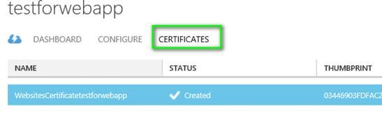
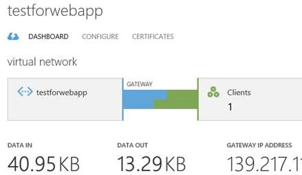

<properties
    pageTitle="如何将 Web 应用部署槽连接到 Azure 虚拟网络"
    description="如何将 Web 应用部署槽连接到 Azure 虚拟网络"
    service=""
    resource="webapps"
    authors="Stanley Huang"
    displayOrder=""
    selfHelpType=""
    supportTopicIds=""
    productPesIds=""
    resourceTags="Web Apps, VNET, PowerShell"
    cloudEnvironments="MoonCake" />
<tags
    ms.service="app-service-web-aog"
    ms.date=""
    wacn.date="04/29/2017" />

# 如何将 Web 应用部署槽连接到 Azure 虚拟网络

## 准备工作

- Web 应用处于标准或高级的定价层
- 具有点到站点连接配置网关的虚拟网络

## 操作步骤

通过以下步骤完成 Web 应用部署槽连接到虚拟网络：

1. 通过 PowerShell 配置相应的参数并生成证书。

        $Configuration = @{}
        $Configuration.WebAppResourceGroup = "[Your web app resource group]"
        $Configuration.WebAppName = "[websitename/slotname]"
        $Configuration.VnetSubscriptionId = "[Your vnet subscription id]"
        $Configuration.VnetResourceGroup = "[Your vnet resource group]"
        $Configuration.VnetName = "[Your vnet name]"
        $Configuration.WebAppLocation = "[Your web app Location]"、$Configuration.GeneratedCertificatePath = "[Your local path\Certificate.cer]"

        $vnet = New-AzureRmResource -Name "$($Configuration.WebAppName)/$($Configuration.VnetName)" -ResourceGroupName $Configuration.WebAppResourceGroup -ResourceType "Microsoft.Web/sites/virtualNetworkConnections" -PropertyObject @{"VnetResourceId" = "/subscriptions/$($Configuration.VnetSubscriptionId)/resourceGroups/$($Configuration.VnetResourceGroup)/providers/Microsoft.ClassicNetwork/virtualNetworks/$($Configuration.VnetName)"} -Location $Configuration.WebAppLocation -ApiVersion 2015-07-01

        #create certificate , run once befroe
        $certBytes = [System.Convert]::FromBase64String($vnet.Properties.certBlob)
        [System.IO.File]::WriteAllBytes("$($Configuration.GeneratedCertificatePath)", $certBytes)

2. 将上一步骤生成的证书上传到已经创建好的 VNET 中。

    

3. 获取点到站点包，并将其供给 Web 应用。将如下内容的 GetNetworkPackageUri.json 文件，保存到本地环境中，例如：D:\cert\GetNetworkPackageUri.json。

        {
            "$schema": "http://schema.management.azure.com/schemas/2014-04-01-preview/deploymentTemplate.json#",
            "contentVersion": "1.0.0.0",
            "parameters": {
                "certData": {
                    "type": "string"
                },
                "certThumbprint": {
                    "type": "string"
                },
                "networkName": {
                    "type": "string"
                }
            },
            "variables": {
                "legacyVnetName": "[concat('Group ', resourceGroup().name, ' ', parameters('networkName'))]"
                },
                "resources": [
                ],
            "outputs" : {
                "PackageUri" :
                {
                "value" : "[listPackage(resourceId('Microsoft.ClassicNetwork/virtualNetworks/gateways/clientRootCertificates', parameters('networkName'), 'primary', parameters('certThumbprint')), '2014-06-01').packageUri]", "type" : "string"
                }
            }
        }

    执行下面部署的脚本：

        $parameters = @{"certData" = $vnet.Properties.certBlob ;certThumbprint = $vnet.Properties.certThumbprint ;"networkName" = $Configuration.VnetName }
        $output = New-AzureRmResourceGroupDeployment -Name unused -ResourceGroupName $Configuration.VnetResourceGroup -TemplateParameterObject $parameters -TemplateFile  D:\cert\GetNetworkPackageUri.json

    将点到站点包上载到应用：

        $vnet = New-AzureRmResource -Name "$($Configuration.WebAppName)/$($Configuration.VnetName)/primary" -ResourceGroupName $Configuration.WebAppResourceGroup -ResourceType "Microsoft.Web/sites /virtualNetworkConnections/gateways" -ApiVersion 2015-07-01 -PropertyObject @{"VnetName" = $Configuration.VnetName ; "VpnPackageUri" = $($output.Outputs.packageUri).Value } -Location $Configuration.WebAppLocation

4. 执行成功后，等待几分钟，就可以通过 Portal 看到 VNET 中已经连接了一个客户端。

    