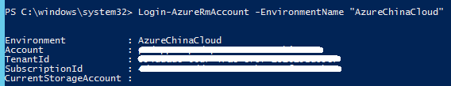

<properties
	pageTitle="如何将现有的 Azure Web 应用分离到不同的应用服务计划"
	description="通过管理门户及 PowerShell 将 Azure Web 应用分离到不同的应用服务计划"
	services="app-service-web"
	documentationCenter=""
	authors=""
	manager=""
	editor=""
	tags="Azure,Web 应用,应用服务计划,PowerShell,Portal"/>

<tags
    ms.service="app-service-web-aog"
    ms.date="12/08/2016"
    wacn.date="12/08/2016"/>

# 如何将现有的 Azure Web 应用分离到不同的应用服务计划 #

用户的多个 Web 应用可能使用同一个应用服务计划，那么这些 Web 应用会共享同一个应用服务计划下的资源，同时缩放应用服务计划将会影响到所有的 Web 应用。当用户想将某个 Web 应用分离出来进行独立管理时，可以考虑将 Web 应用迁移到另一个应用服务计划中，本文详细介绍了如何迁移 web 应用到新的应用服务计划中的方法：

### 方法一 ###

通过 Azure 门户预览(新 portal)进行更改:

1. 登录 Azure 门户预览（新 portal）；
2. 创建一个新的应用服务计划；
3. 选择要进行分离的 web 应用，在弹出的选项中点击 “更改应用服务计划”；
4. 在列表中选择之前创建好的应用服务计划进行更改。

### 方法二 ###

通过 PowerShell 命令将已有的 Web 应用迁移到新的应用服务计划：
 
1. 运行以下命令登录中国版 Azure；

    	Login-AzureRmAccount -EnvironmentName "AzureChinaCloud"

	

2. 运行以下命令创建新的应用服务计划；

    	New-AzureRmAppServicePlan -Location ChinaEast -Name <YourAppServicePlanName> -ResourceGroupName <YourResouceGroupName> -Tier Free

	>注: Location 参数可以选择 ChinaEast 或者 ChinaNorth。
	
	命令运行成功后返回以下结果，请将 Id 字段对应信息复制出来以备后续使用。
	
	

3. 运行以下命令将网站迁移到新的应用服务计划中;

		Set-AzureRmResource -ResourceName <YourWebSiteName> -ResourceType Microsoft.Web/sites -Properties @{"serverFarmId"="/subscriptions/<SubscirptionID>/resourceGroups/<ResourceGroupName1>/providers/Microsoft.Web/serverfarms/TestAppServicePlan"} -ResourceGroupName <ResourceGroupName2>

	>注: 
	>
	>1. 将 `Properties` 参数中的 `serverFarmID` 的值替换成步骤 2 中返回的 `Id` 值；	
	>2. 将参数`<ResourceGroupName1>`替换成应用服务计划所在的资源组名称，将参数`<ResourceGroupName2>`替换成 Web 应用所在的资源组名称。

4. 登录 Azure Portal 查看 Web 应用是否已经迁移到新的应用服务计划中。

