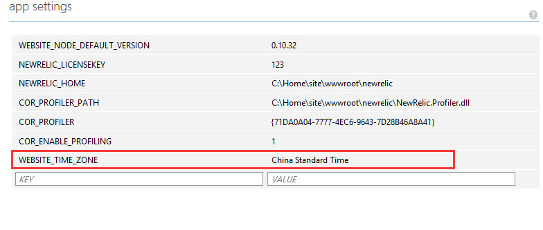

<properties
    pageTitle="如何修改网站默认时区"
    description="如何修改网站默认时区"
    service=""
    resource="webapps"
    authors="高手"
    displayOrder=""
    selfHelpType=""
    supportTopicIds=""
    productPesIds=""
    resourceTags="Web Apps, UTC"
    cloudEnvironments="MoonCake" />
<tags
    ms.service="web-apps-aog"
    ms.date=""
    wacn.date="03/16/2017" />
# 如何修改网站默认时区

Azure 上所有的服务时间都采用了 UTC 时间。UTC 时间比中国时间晚 8 个小时。想要使得网站的时间为中国时间。则在网站配置页面，“应用设置”节点，添加“WEBSITE_TIME_ZONE”，并将值设置为“China Standard Time”，网站的默认时区即成为北京时间。

## 参考链接

[Changing the server time zone on Azure Web Apps](https://blogs.msdn.microsoft.com/tomholl/2015/04/06/changing-the-server-time-zone-on-azure-web-apps/ )