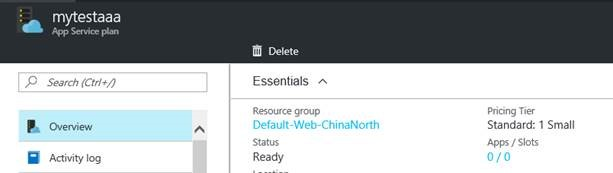

<properties
                pageTitle="Azure Web 应用重新配置应用服务计划时无法选择新创建的应用服务计划"
                description="Azure 应用服务计划由于不在同一区域或同一资源组，出现 Web 应用无法选择新创建的应用服务计划"
                services="app-service-web"
                documentationCenter=""
                authors=""
                manager=""
                editor=""
                tags="Web Apps,App Service Plan,Resource group"/>

<tags
                ms.service="app-service-web-aog"
                ms.date="12/23/2016"
                wacn.date="12/23/2016"/>

# Azure Web 应用重新配置应用服务计划时无法选择新创建的应用服务计划

### 问题描述

创建了 Azure 应用服务计划后，在[ Azure 门户预览](https://portal.azure.cn)上点击 “更改应用服务计划”选项，发现找不到新建的应用服务计划。

### 问题分析

将应用移动到其他应用服务计划首要条件是：应用和计划属于同一资源组和同一地理区域。所以创建 Azure 应用服务计划时请确保与需要移动的 Web 应用在同一地理区域以及同一资源组下，否则创建好的应用服务计划无法使用。

### 解决方法

1.	通过 Azure 门户预览查看 Web 应用使用应用服务计划所在的资源组信息。

	

2.	在同一个区域和资源组创建新的应用服务计划。

	

3.	转到需要移动的 Web 应用，在“设置”菜单上，选择“更改应用服务计划”以打开“应用服务计划”选择器。此时可以选取现有的应用服务计划，也可以在此新建一个。

	

4.	切换之后可以通过[经典管理门户](https://manage.windowsazure.cn)查看该 Web 应用是否已经独立存在于新应用服务计划中。

	

详细内容请参考：[Azure 应用服务计划深入概述](/documentation/articles/azure-web-sites-web-hosting-plans-in-depth-overview/)