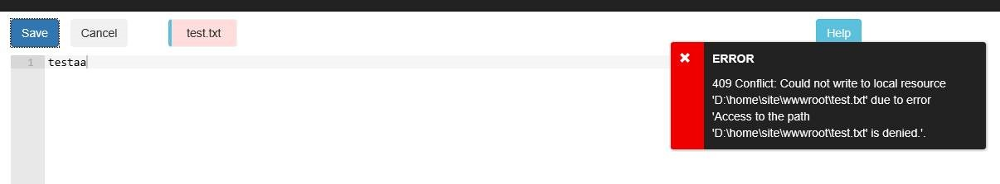
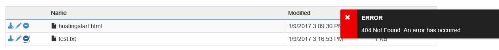

<properties
    pageTitle="通过 FTP 或者 Kudu 删除文件失败"
    description="通过 FTP 或者 Kudu 删除文件失败"
    service=""
    resource="webapps"
    authors="高手"
    displayOrder=""
    selfHelpType=""
    supportTopicIds=""
    productPesIds=""
    resourceTags="Web Apps, FTP, Kudu"
    cloudEnvironments="MoonCake" />
<tags
    ms.service="web-apps-aog"
    ms.date=""
    wacn.date="03/16/2017" />
# 通过 FTP 或者 Kudu 删除文件失败

## **问题描述**

部署的 Web Apps,发现某个文件无法通过 FTP 和 Kudu 模式修改或者删除，通过 Kudu 修改或者删除后报错如下：

## **问题分析**

这是因为使用的某些模版会将特定文件自动改为只读属性。

## **解决方法**

登录网站的 Kudu 模式后，通过命令行 `attrib xxx` 来查看文件是否有只读属性；若有只读属性，则可以通过 `attrib -R  filename` 来去掉文件的只读属性。