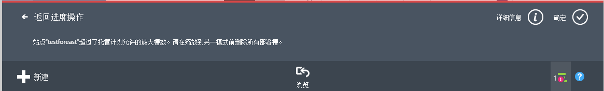
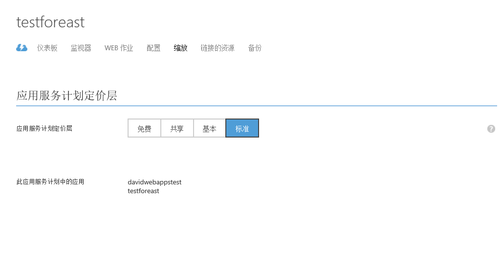
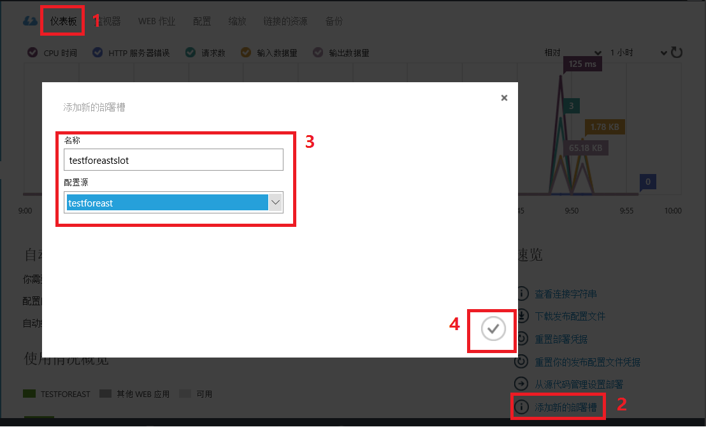
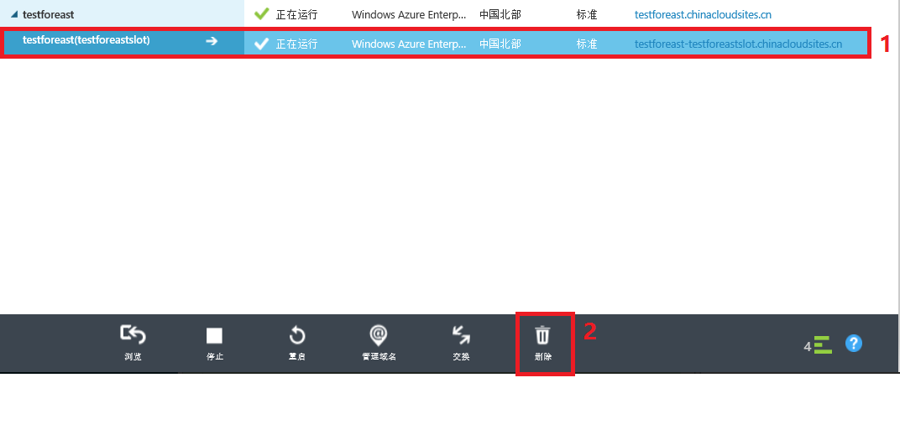
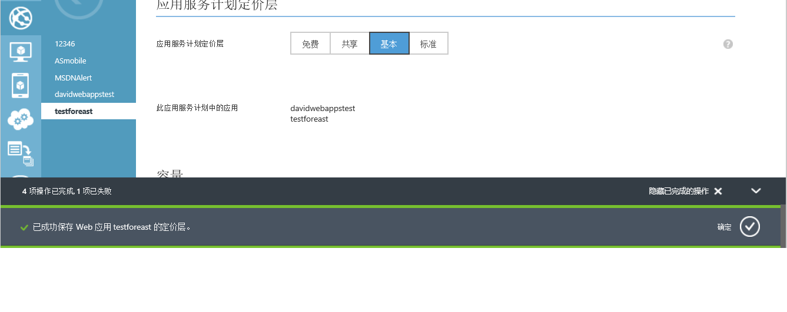

<properties
	pageTitle="含有部署槽的标准网站无法缩放到基本模式"
	description="Web 应用删除部署槽后从标准模式缩放到基本模式"
	services="app-service-web"
	documentationCenter=""
	authors=""
	manager=""
	editor=""
	tags="Azure,Web 应用,缩放,Portal"/>

<tags
    ms.service="app-service-web-aog"
    ms.date="12/08/2016"
    wacn.date="12/08/2016"/>

# 含有部署槽的标准网站无法缩放到基本模式 #

### 问题现象 ###

在缩放时，会出现如下错误“站点 ‘testforeast’ 超过了托管计划允许的最大槽数。请在缩放到另一模式前删除所有部署槽。”

>[AZURE.NOTE] 在向下缩放资源时，需要检查目前模式下的资源配置是否超过目标定价层的限制。例如：存储的大小、实例的部署槽等因素。

### 解决方法 ###

由于基本模式的网站不支持部署槽功能，需要删除部署槽才能成功缩放到基本模式。

>[AZURE.NOTE] 另外还需要注意存储的大小是否超过了限制。

经典管理门户中的具体操作步骤如下（其中步骤 1、2 为重现添加部署槽，如您的应用已有部署槽，即可跳至步骤 3 开始）：

1. 确保 Web 应用当前为标准模式（仅标准模式支持部署槽）；

	

2. 在仪表板标签页，选择添加新的部署槽；

	

3. 在 Web 应用列表处，选中相应槽，点击删除；

	

4. 删除部署槽后即可成功缩放至基本模式。

	
