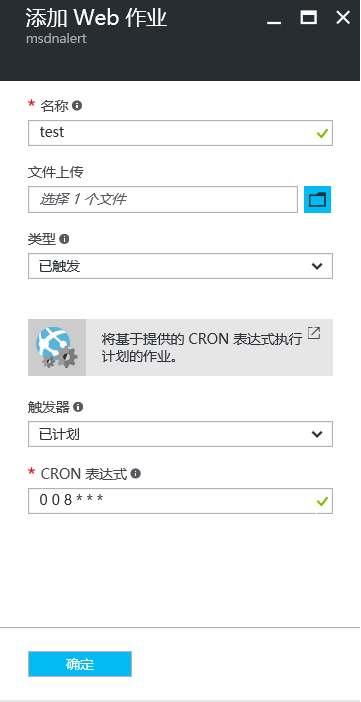

<properties
	pageTitle="创建的 WebJobs 无法按照 CRON 的设置来启动"
	description="设置中国 UTC 时间使 WebJobs 可以按照 CRON 启动"
	services="app-service-web"
	documentationCenter=""
	authors=""
	manager=""
	editor=""
	tags="Azure,Portal,Web Jobs,CRON,UTC"/>

<tags
    ms.service="app-service-web-aog"
    ms.date="12/08/2016"
    wacn.date="12/08/2016"/>

# 创建的 WebJobs 无法按照 CRON 的设置来启动 #

### 问题现象 ###

通过 `settings.job` 配置 WebJobs 的启动时间，发现没有在指定的时间启动，比如 "`0 0 0 * * *`" 并没有在每天的零点启动。

### 问题分析 ###

在分析该问题之前，需要先了解下 CRON 表达式相关规则。

使用 CRON 表达式创建计划的 WebJobs 可用于在基本、标准或高级模式下运行的 Web 应用，但需要应用上启用 “AlwaysOn”设置。

若要将按需 WebJobs 变成按计划的 WebJobs ，只需在 `WebJob.zip` 文件的根目录中包含 `settings.job` 文件。此 JSON 文件应包括 `schedule` 属性和 [CRON 表达式](https://zh.wikipedia.org/wiki/Cron)，如下例所示。

CRON 表达式由 6 个字段组成：`{second} {minute} {hour} {day} {month} {day of the week}`。

例如，若要每 15 分钟触发一次 WebJobs，`settings.job` 需要：

```
json
{
    "schedule": "0 */15 * * * *"
}
```

其他 CRON 计划示例：

- 每隔 1 小时（即每当分钟数为 0 时）：`0 0 * * * *`
- 从上午 9 点到下午 5 点每隔一小时：`0 0 9-17 * * *`
- 每天上午 `9:30：0 30 9 * * *`
- 各工作日的上午 `9:30：0 30 9 * * 1-5`

>[AZURE.NOTE] 从 Visual Studio 部署 WebJobs 时，请确保将 `settings.job` 文件属性标记为 “如果较新则复制”。

Azure 平台默认是 UTC 时间，所以如果要基于中国时间配置则需要转换：中国时间 = UTC+8。

### 解决方法 ###

在添加 Web 作业时，CRON 表达式中小时位（第三位）需要加 8，才可以使 Web 作业按时运行。

