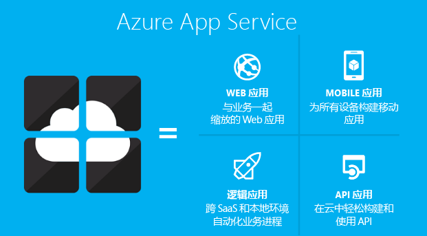
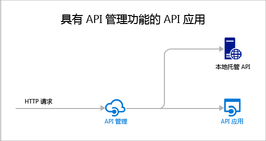

<properties 
	pageTitle="API 应用简介 | Azure" 
	description="了解 Azure 应用服务如何帮助开发、托管和使用 RESTful API。" 
	services="app-service\api" 
	documentationCenter=".net" 
	authors="tdykstra" 
	manager="wpickett" 
	editor=""/>

<tags
	ms.service="app-service-api"
	ms.date="05/03/2016"
	wacn.date="09/26/2016"/>

# API 应用概述

Azure 应用服务中的 API 应用提供各种功能，用于轻松在云中和本地开发、托管和使用 API。使用 API 应用可受益于企业级安全性、简单的访问控制、和自动 SDK 生成等功能。

[Azure 应用服务](/documentation/articles/app-service-value-prop-what-is/)是完全托管的平台，适用于 Web、移动和集成方案。API 应用是 [Azure 应用服务](/documentation/articles/app-service-value-prop-what-is/)提供的四种应用类型之一。

## 为何使用 API 应用？

下面是 API 应用的一些主要功能：

- **保留现有的 API** - 无需更改现有 API 的任何代码就能使用 API 应用，只需将代码部署到 API 应用即可。API 可以使用应用服务支持的任何语言或框架，包括 ASP.NET 和 C#、Java、PHP、Node.js 和 Python。

- **易于使用** - 通过 [Swagger API 元数据](http://swagger.io/)的集成支持，各种客户端都能轻松使用 API。使用各种语言（包括 C#、Java 和 Javascript）为 API 自动生成客户端代码。轻松配置 [CORS](/documentation/articles/app-service-api-cors-consume-javascript/) 而无需更改代码。有关详细信息，请参阅 [App Service API Apps metadata for API discovery and code generation](/documentation/articles/app-service-api-metadata/)（用于 API 发现和代码生成的应用服务 API 应用元数据）和 [Consume an API app from JavaScript using CORS](/documentation/articles/app-service-api-cors-consume-javascript/)（借助 CORS 从 JavaScript 使用 API 应用）。

- **简单的访问控制** - 可以保护 API 应用避免其遭到未经身份验证的访问，且无需更改代码。其他服务或代表用户的客户端访问 API 时，内置的身份验证服务将提供保护。支持的标识提供者包括 Azure Active Directory 和 Microsoft 帐户。客户端可以使用 Active Directory 身份验证库 (ADAL) 或移动应用 SDK。有关详细信息，请参阅 [Authentication and authorization for API Apps in Azure App Service](/documentation/articles/app-service-api-authentication/)（Azure 应用服务中 API 应用的身份验证和授权）。

- **Visual Studio 集成** - Visual Studio 中的专用工具可以简化创建、部署、使用、调试和管理 API 应用的工作。有关详细信息，请参阅 [Announcing the Azure SDK 2.8.1 for .NET](https://azure.microsoft.com/blog/announcing-azure-sdk-2-8-1-for-net/)（宣告推出用于 .NET 的 Azure SDK 2.8.1）。

此外，API 应用可以利用 [Web 应用](/documentation/articles/app-service-web-overview/)和[移动应用](/documentation/articles/app-service-mobile-value-prop/)提供的功能。反之亦然：如果使用某个 Web 应用或移动应用来托管 API，该应用可以利用 Swagger 元数据等 API 应用功能来生成客户端代码，以及使用 CORS 进行跨域浏览器访问。这三个应用程序类型（API、Web、移动）之间的唯一差别在于 Azure 门户预览中使用的名称和图标。

## API 应用与 Azure API 管理之间的差别是什么？

API 应用与 [Azure API 管理](/documentation/articles/api-management-key-concepts/)是互补的服务：

* API 管理与管理 API 相关。将 API 管理前端放在 API 上，监视和限制用量、操作输入和输出、将多个 API 合并为一个终结点等等。管理的 API 可以托管在于任何位置。
* API 应用与托管 API 相关。该服务包含的功能可方便开发和使用 API，但它不执行 API 管理所执行的监视、限制、操作或合并。如果不需要 API 管理功能，可以将 API 托管在 API 应用中，而不需要使用 API 管理。

下图演示了托管在 API 应用及其他位置的 API 使用的 API 管理。

API 管理与 API 应用的某些功能类似。例如，两者都可以自动化 CORS 支持。同时使用这两项服务时，可以使用 API 管理进行 CORS，因为它用作 API 应用的前端。

## 入门

若要通过将示例代码部署到其中一个应用以开始使用 API 应用，请参阅适用于所需框架的教程：

* [ASP.NET](/documentation/articles/app-service-api-dotnet-get-started/)
* [Node.js](/documentation/articles/app-service-api-nodejs-api-app/)
* [Java](/documentation/articles/app-service-api-java-api-app/)

若要咨询有关 API 应用的问题，请在 [API 应用论坛](https://social.msdn.microsoft.com/Forums/zh-cn/home?forum=AzureAPIApps)中发贴。

<!---HONumber=Mooncake_0919_2016-->