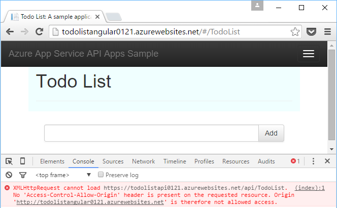

<properties
	pageTitle="应用服务中的 CORS 支持 | Azure"
	description="了解如何在 Azure 应用服务中使用 CORS 支持。"
	services="app-service\api"
	documentationCenter=".net"
	authors="tdykstra"
	manager="wpickett"
	editor=""/>

<tags
	ms.service="app-service-api"
	ms.workload="na"
	ms.tgt_pltfrm="dotnet"
	ms.devlang="na"
	ms.topic="get-started-article"
	ms.date="08/27/2016"
	wacn.date="11/25/2016"
	ms.author="rachelap"/>

# 借助 CORS 从 JavaScript 使用 API 应用

[AZURE.INCLUDE [azure-sdk-developer-differences](../../includes/azure-sdk-developer-differences.md)]

应用服务提供内置的[跨域资源共享 (CORS)](https://en.wikipedia.org/wiki/Cross-origin_resource_sharing) 支持，可让 JavaScript 客户端对 API 应用中托管的 API 进行跨域调用。应用服务允许配置对 API 的 CORS 访问，无需在 API 中编写任何代码。

本文包含两个部分：

* [如何配置 CORS](#corsconfig) 部分概述如何为任何 API 应用、Web 应用或移动应用配置 CORS。此部分适用于应用服务支持的所有框架，包括 .NET、Node.js 和 Java。

* 本文从[继续学习 .NET 入门教程](#tutorialstart)部分开始演示 CORS 支持，其内容基于[第一篇 API 应用入门教程](/documentation/articles/app-service-api-dotnet-get-started/)中完成的工作。

## 如何在 Azure 应用服务中配置 CORS

可以在 Azure 门户预览中或使用 [Azure Resource Manager](/documentation/articles/resource-group-overview/) 工具配置 CORS。

#### 在 Azure 门户预览中配置 CORS

8. 在浏览器中转到 [Azure 门户预览](https://portal.azure.cn/)。

2. 单击“应用程序服务”，然后单击 API 应用的名称。

	

10. 在“API 应用”右侧打开的“设置”边栏选项卡中，找到“API”部分，然后单击“CORS”。

	

11. 在文本框中，输入要允许的一个或多个 JavaScript 调用源 URL。

	例如，如果已将 JavaScript 应用程序部署到名为 todolistangular 的 Web 应用，请输入“https://todolistangular.chinacloudsites.cn”。或者，输入星号 (*) 指定接受所有原始域。

13. 单击“保存”。

	

	单击“保存”后，API 应用将接受来自指定 URL 的 JavaScript 调用。

#### 使用 Azure Resource Manager工具配置 CORS

也可以使用 [Azure PowerShell](https://docs.microsoft.com/powershell/azureps-cmdlets-docs) 和 [Azure CLI](/documentation/articles/xplat-cli-install/) 等命令行工具中的 [Azure Resource Manager 模板](/documentation/articles/resource-group-authoring-templates/)来配置 API 应用的 CORS。

有关可设置 CORS 属性的 Azure Resource Manager 模板的示例，请打开[本教程的示例应用程序存储库中的 azuredeploy.json 文件](https://github.com/azure-samples/app-service-api-dotnet-todo-list/blob/master/azuredeploy.json)。找到如以下示例中所示的模板部分：

		"cors": {
		    "allowedOrigins": [
		        "todolistangular.chinacloudsites.cn"
		    ]
		}

## 继续学习 .NET 入门教程

如果学习的是适用于 API 应用的 Node.js 或 Java 入门系列教程，则已经完成了入门系列教程。请跳到[后续步骤](#next-steps)部分查找有关进一步了解 API 应用的建议。

本文余下内容是 .NET 入门系列教程的延续，假设读者已成功完成[第一篇教程](/documentation/articles/app-service-api-dotnet-get-started/)。

## 将 ToDoListAngular 项目部署到新 Web 应用

在[第一篇教程](/documentation/articles/app-service-api-dotnet-get-started/)中，已创建中间层 API 应用和数据层 API 应用。在本教程中，将创建单页应用程序 (SPA) Web 应用来调用中间层 API 应用。为使 SPA 正常运行，必须在中间层 API 应用中启用 CORS。

在 [ToDoList 示例应用程序](https://github.com/Azure-Samples/app-service-api-dotnet-todo-list)中，ToDoListAngular 项目是一个简单的 AngularJS 客户端，它调用中间层 ToDoListAPI Web API 项目。*app/scripts/todoListSvc.js* 文件中的 JavaScript 代码使用 AngularJS HTTP 提供程序调用 API。

		angular.module('todoApp')
		.factory('todoListSvc', ['$http', function ($http) {

		    $http.defaults.useXDomain = true;
		    delete $http.defaults.headers.common['X-Requested-With']; 
		
		    return {
		        getItems : function(){
		            return $http.get(apiEndpoint + '/api/TodoList');
		        },

		        /* Get by ID, Put, and Delete methods not shown */

		        postItem : function(item){
		            return $http.post(apiEndpoint + '/api/TodoList', item);
		        }
		    };
		}]);

### 为 ToDoListAngular 项目创建新的 Web 应用

创建新应用服务 Web 应用并向其部署项目的过程，与在[本系列教程的第一篇教程中所述的创建和部署 API 应用](/documentation/articles/app-service-api-dotnet-get-started/#createapiapp)的过程类似。唯一的差别在于，应用类型是 **Web 应用**而不是 **API 应用**。有关对话框的屏幕截图，请参阅

1. 在“解决方案资源管理器”中，右键单击 ToDoListAngular 项目，然后单击“发布”。

3.  在“发布 Web”向导的“配置文件”选项卡中，单击“Azure 应用服务”。

5. 在“应用服务”对话框中，单击“新建”。

3. 在“创建应用服务”对话框的“托管”选项卡中输入 **Web 应用名称**，该名称在 *chinacloudsites.cn* 域中必须唯一。

5. 选择要使用的 Azure **订阅**。

6. 在“资源组”下拉列表中，选择前面创建的资源组。

4. 在“应用服务计划”下拉列表中，选择前面创建的同一个计划。

7. 单击“创建”。

	Visual Studio 将创建 Web 应用、创建其发布配置文件，并显示“发布 Web”向导的“连接”步骤。

	暂时不要单击“发布”。在下一部分将配置新 Web 应用来调用应用服务中运行的中间层 API 应用。

### 在 Web 应用设置中设置中间层 URL

1. 转到 [Azure 门户预览](https://portal.azure.cn/)，然后导航到为托管 TodoListAngular（前端）项目而创建的 Web 应用的“Web 应用”边栏选项卡。

2. 单击“设置”>“应用程序设置”。

3. 在“应用设置”部分中，添加以下键和值：

	|键|值|示例
	|---|---|---|
	|toDoListAPIURL|https://{your middle tier API app name}.chinacloudsites.cn|https://todolistapi0121.chinacloudsites.cn|

4. 单击“保存”。

	在 Azure 中运行代码时，此值将覆盖 *Web.config* 文件中的 localhost URL。

	用于获取设置值的代码位于 *index.cshtml* 中：

		
		

	*todoListSvc.js* 中的代码使用该设置：

		return {
		    getItems : function(){
		        return $http.get(apiEndpoint + '/api/TodoList');
		    },
		    getItem : function(id){
		        return $http.get(apiEndpoint + '/api/TodoList/' + id);
		    },
		    postItem : function(item){
		        return $http.post(apiEndpoint + '/api/TodoList', item);
		    },
		    putItem : function(item){
		        return $http.put(apiEndpoint + '/api/TodoList/', item);
		    },
		    deleteItem : function(id){
		        return $http({
		            method: 'DELETE',
		            url: apiEndpoint + '/api/TodoList/' + id
		        });
		    }
		};

### 将 ToDoListAngular Web 项目部署到新 Web 应用

*  在 Visual Studio 的“发布 Web”向导的“连接”步骤中，单击“发布”。

	Visual Studio 会将 ToDoListAngular 项目部署到新的 Web 应用，并在浏览器中打开该 Web 应用的 URL。

### 在不启用 CORS 的情况下测试应用程序 

2. 在浏览器开发人员工具中，打开“控制台”窗口。

3. 在显示 AngularJS UI 的浏览器窗口中，单击“待办事项列表”链接。

	JavaScript 代码会尝试调用中间层 API 应用，但调用失败，因为前端运行所在的域与后端不同。浏览器的“开发人员工具控制台”窗口将显示跨域错误消息。

	

## 为中间层 API 应用配置 CORS

本部分的步骤将在 Azure 中为中间层 ToDoListAPI API 应用配置 CORS 设置。此设置允许中间层 API 应用从针对 ToDoListAngular 项目创建的 Web 应用接收 JavaScript 调用。

8. 在浏览器中转到 [Azure 门户预览](https://portal.azure.cn/)。

2. 单击“应用程序服务”，然后单击 ToDoListAPI（中间层）API 应用。

	

10. 在“API 应用”右侧打开的“设置”边栏选项卡中，找到“API”部分，然后单击“CORS”。

	

12. 在文本框中输入 ToDoListAngular（前端）Web 应用的 URL。例如，如果将 ToDoListAngular 项目部署到名为 todolistangular0121 的 Web 应用，则允许来自 URL `https://todolistangular0121.chinacloudsites.cn` 的调用。

	或者，输入星号 (*) 指定接受所有原始域。

13. 单击“保存”。

	

	单击“保存”后，API 应用将接受来自指定 URL 的 JavaScript 调用。在此屏幕截图中，ToDoListAPI0223 API 应用将接受来自 ToDoListAngular Web 应用的 JavaScript 客户端调用。

### 在启用 CORS 的情况下测试应用程序

* 在浏览器中打开 Web 应用的 HTTPS URL。

	这一次，应用程序将允许查看、添加、编辑和删除待办事项。

	

## 应用服务 CORS 与 Web API CORS

在 Web API 项目中，可以安装 [Microsoft.AspNet.WebApi.Cors](https://www.nuget.org/packages/Microsoft.AspNet.WebApi.Cors/) NuGet 包，以便在代码中指定 API 接受来自哪些域的 JavaScript 调用。
 
Web API CORS 支持比应用服务 CORS 支持更有弹性。例如，在代码中可为不同操作方法指定不同的接受来源，但对于应用服务 CORS，只能为所有 API 应用的方法指定一组接受的来源。

> [AZURE.NOTE] 请不要尝试在一个 API 应用中同时使用 Web API CORS 和应用服务 CORS。否则，会优先使用应用服务 CORS，而 Web API CORS 不起作用。例如，如果在应用服务中启用一个来源域，同时在 Web API 代码中启用所有来源域，则 Azure API 应用仅接受来自 Azure 中指定的域的调用。

### 如何在 Web API 代码中启用 CORS

以下步骤汇总了启用 Web API CORS 支持的过程。有关详细信息，请参阅 [Enabling Cross-Origin Requests in ASP.NET Web API 2](http://www.asp.net/web-api/overview/security/enabling-cross-origin-requests-in-web-api)（在 ASP.NET Web API 2 中启用跨域请求）。

1. 在 Web API 项目中，安装 [Microsoft.AspNet.WebApi.Cors](https://www.nuget.org/packages/Microsoft.AspNet.WebApi.Cors/) NuGet 包。

1. 在 **WebApiConfig** 类的 **Register** 方法中添加 `config.EnableCors()` 代码行，如以下示例中所示。

		public static class WebApiConfig
		{
		    public static void Register(HttpConfiguration config)
		    {
		        // Web API configuration and services
	            
		        // The following line enables you to control CORS by using Web API code
		        config.EnableCors();
	
		        // Web API routes
		        config.MapHttpAttributeRoutes();
	
		        config.Routes.MapHttpRoute(
		            name: "DefaultApi",
		            routeTemplate: "api/{controller}/{id}",
		            defaults: new { id = RouteParameter.Optional }
		        );
		    }
		}

1. 在 Web API 控制器中，为 `System.Web.Http.Cors` 命名空间添加 `using` 语句，将 `EnableCors` 属性添加到控制器类或各个操作方法。在以下示例中，CORS 支持适用于整个控制器。

		namespace ToDoListAPI.Controllers 
		{
		    [HttpOperationExceptionFilterAttribute]
		    [EnableCors(origins:"https://todolistangular0121.chinacloudsites.cn", headers:"accept,content-type,origin,x-my-header", methods: "get,post")]
		    public class ToDoListController : ApiController
 
## 将 Azure API 管理与 API 应用配合使用

如果将 Azure API 管理与 API 应用配合使用，请在 API 管理而不是 API 应用中配置 CORS。有关详细信息，请参阅以下资源：

* [API Management cross domain policies](https://msdn.microsoft.com/zh-cn/library/azure/dn894084.aspx#CORS)（API 管理跨域策略）
 
## 故障排除

如果在学习本教程的过程中遇到问题，请参考下面列出的一些故障排除思路。

* 确保使用最新版本的[适用于 Visual Studio 2015 的用于 .NET 的 Azure SDK](http://go.microsoft.com/fwlink/?linkid=518003)。

* 确保在 CORS 设置中输入 `https`，并使用 `https` 运行前端 Web 应用。

* 确保在中间层 API 应用（而不是前端 Web 应用）中输入 CORS 设置。

* 如果同时在应用程序代码和 Azure 应用服务中配置 CORS，请注意应用服务的 CORS 设置会覆盖在应用程序代码中编写的任何内容。

## 后续步骤 

本文介绍了如何启用应用服务 CORS 支持，使客户端 JavaScript 代码可以调用不同域中的 API。有关 API 应用的详细信息，请阅读 [introduction to authentication in App Service](/documentation/articles/app-service-authentication-overview/)（应用服务中的身份验证简介），然后转到 [user authentication for API apps](/documentation/articles/app-service-api-dotnet-user-principal-auth/)（API 应用的用户身份验证）教程。

<!---HONumber=Mooncake_0919_2016-->