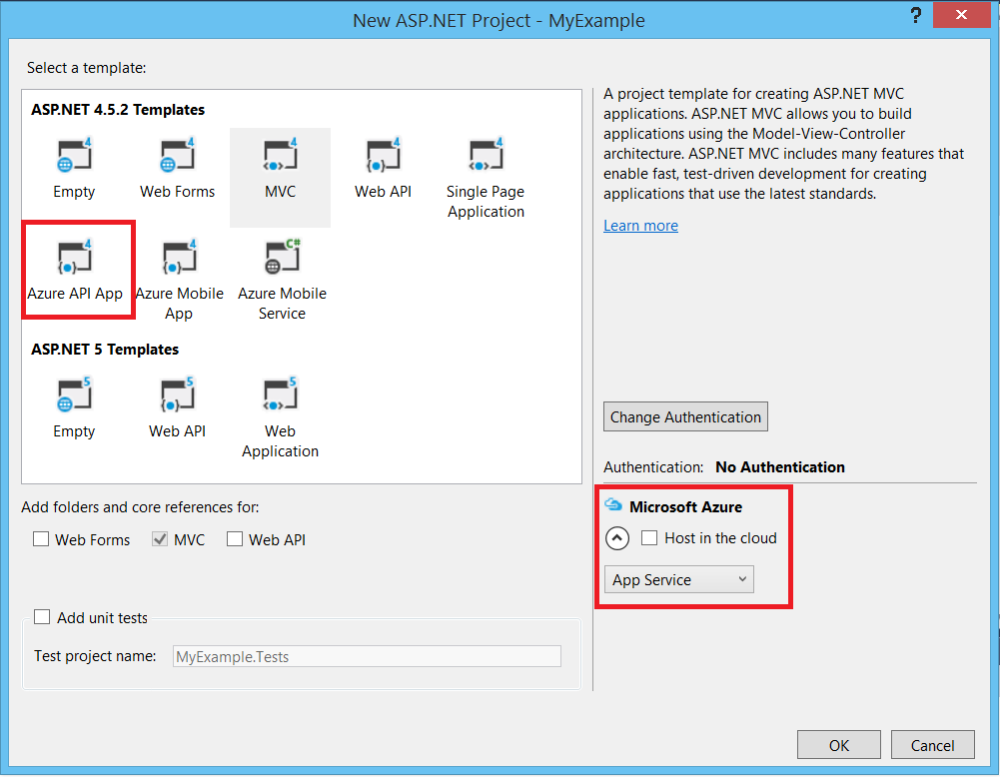

<properties
	pageTitle="Azure 应用服务和 ASP.NET Web API 2 入门 | Azure"
	description="了解如何在 Visual Studio 中创建 ASP.NET Web API 2 项目，并将其部署到 Azure 应用服务中的新 API 应用。"
	services="app-service\api"
	documentationCenter=".net"
	authors="tdykstra"
	manager="wpickett"
	editor=""/>

<tags
	ms.service="app-service-api"
	ms.date="04/13/2016"
	wacn.date="09/26/2016"/>

# 在 Visual Studio 中开始使用 Azure 应用服务和 ASP.NET Web API 2

## 概述

本教程介绍如何使用 Visual Studio 2015 将 ASP.NET Web API 2 应用程序部署到 Azure 应用服务中的 [API 应用](/documentation/articles/app-service-api-apps-why-best-platform/)。将创建一个 Visual Studio 项目并将其部署到 API 应用，如图所示。

本教程假定你是此前没有 Azure 使用经验的 ASP.NET 开发人员。完成本教程后，便可以在云中启动并运行一个简单的 Web API。

学习内容：

* 如何在 Visual Studio 中创建新的 Web API 2 项目的同时创建应用服务 API 应用。
* 如何使用 Visual Studio 将 Web API 2 项目部署到应用服务 API 应用。
* 如何使用 [Azure 门户](/features/azure-portal/)监视和管理 API 应用。

教程末尾的[故障排除](#troubleshooting)部分介绍了在出现故障的情况下应如何操作，[后续步骤](#next-steps)部分提供了其他教程的链接，方便用户更深入地了解如何使用 Azure 应用服务。

## 先决条件

### Azure 帐户

完成本教程需要有一个 Azure 帐户。你可以：

* [建立 Azure 帐户](/pricing/1rmb-trial/?WT.mc_id=A261C142F)。获取可用来尝试付费版 Azure 服务的信用额度。即使在信用额度用完之后，你也可以保留帐户和使用免费的 Azure 服务和功能。

### 装有用于 .NET 的 Azure SDK 的 Visual Studio 2015

本教程专为配合使用 Visual Studio 2015 和 [用于 .NET 的 Azure SDK](/documentation/articles/dotnet-sdk/) 2.8.2 或更高版本编写。[单击此处下载最新的用于 Visual Studio 2015 的 Azure SDK](http://go.microsoft.com/fwlink/?linkid=518003)。如果尚未安装 Visual Studio，则会随 SDK 一起自动安装。

如果有 Visual Studio 2013，则可以[下载最新的 Azure SDK for Visual Studio 2013](http://go.microsoft.com/fwlink/?LinkID=324322)。某些屏幕可能看起来与这些插图不同。

>[AZURE.NOTE] 根据计算机上已有 SDK 依赖项数量的不同，安装 SDK 可能耗时较长，从几分钟到半小时或更长时间不等。

### ASP.NET Web API 2

本教程介绍如何将 ASP.NET Web API 2 与 Azure 应用服务配合使用，但不讲解如何开发 ASP.NET Web API。如需 ASP.NET Web API 2 的简介，请参阅 [ASP.NET](http://asp.net/) 站点上的 [Getting Started with ASP.NET Web API 2](http://www.asp.net/web-api/overview/getting-started-with-aspnet-web-api/tutorial-your-first-web-api)（ASP.NET Web API 2 入门）。

## 在 Azure 应用服务中创建项目和 API 应用

第一步是在 Visual Studio 中创建一个 ASP.NET Web API 2 项目，并在 Azure 应用服务中创建一个 API 应用。创建完成后，将项目部署到 API 应用，使 Web API 在 Internet 上可用。

1. 打开 Visual Studio 2015。

2. 单击“文件”>“新建”>“项目”。

3. 在“新建项目”对话框中，单击“Visual C#”>“Web”>“ASP.NET Web 应用程序”。（如果需要，可以选择“Visual Basic”。）

3. 确保选择 **.NET Framework 4.5.2** 作为目标框架。

4.  [Azure Application Insights](/documentation/articles/app-insights-overview/) 可监视 API 应用的可用性、性能和使用情况。安装 Visual Studio 后，首次创建 Web 项目时，会默认选中“将 Application Insights 添加到项目”复选框。如果已选中该复选框，但你不想要尝试使用 Application Insights，请清除该复选框。

4. 将应用程序命名为 **MyExample**。

5. 单击**“确定”**。

	

5. 在“新建 ASP.NET 项目”对话框中，选择“Azure API 应用”模板。

5. 在“新建 ASP.NET 项目”对话框的“Microsoft Azure”部分中，确保已选择“在云中托管”，并且下拉列表中已选择“应用服务”。

	

	这些设置将指示 Visual Studio 为 Web 项目创建 Azure API 应用。

6. 单击**“确定”**。

5. 如果你尚未登录到 Azure，Visual Studio 将提示你登录。使用你用来管理 Azure 订阅的帐户的 ID 和密码登录。

	如果已登录，“创建应用服务”对话框将询问要创建哪些资源。

	

3. 在“创建应用服务”对话框中输入 **API 应用名称**，该名称在 *chinacloudsites.cn* 域中必须唯一。例如，可以将它命名为 MyExample 并在右侧加上数字，使其成为唯一名称，例如 MyExample810。如果系统创建了默认名称，则该名称是唯一的，可以使用该名称。

	如果其他人已经使用了你输入的名称，你将看到右边是一个红色感叹号而不是绿色复选标记，此时你必须输入其他名称。

	Web API 的基 URL 是此名称加上 *.chinacloudsites.cn*（如“Web 应用名称”文本框旁边所示）。例如，如果名称为 `MyExample810`，则 URL 为 `myexample810.chinacloudsites.cn`。

6. 在“资源组”框的旁边，单击“新建”，然后输入“MyExample”或其他所需的名称。

	此组合框可让你选择现有的资源组，或通过键入与订阅中任何现有资源组不同的名称，来创建新资源组。

	资源组是 Azure 资源的集合，例如 API 应用、数据库和 VM。在本教程中，最好创建新的资源组，因为这样可以通过一个步骤轻松删除你为本教程创建的所有 Azure 资源。有关详细信息，请参阅 [Azure Resource Manager overview](/documentation/articles/resource-group-overview/)（Azure Resource Manager 概述）。

4. 单击“应用服务计划”下拉列表旁边的“新建”按钮。

	

	屏幕截图显示了“Web 应用名称”、“订阅”和“资源组”的示例值 -- 用户的值会有所不同。

	在以下步骤中，你将为新资源组创建 App Service 计划。应用服务计划指定 API 应用运行所在的计算资源。例如，如果你选择免费层，则 API 应用程序将在共享 VM 上运行；如果你选择某些付费层，则它在专用 VM 上运行。有关详细信息，请参阅 [App Service plans overview](/documentation/articles/azure-web-sites-web-hosting-plans-in-depth-overview/)（应用服务计划概述）。

5. 在“配置应用服务计划”对话框中，输入“MyExamplePlan”或其他所需的名称。

5. 在“位置”下拉列表中，选择最靠近的位置。

	此设置指定你的应用将在哪个 Azure 数据中心运行。就本教程来说，你可以选择任何区域，不会有明显差异。但是，对于生产应用，则需让服务器尽可能靠近访问该应用的客户端，以最大程度地减少[延迟](http://www.bing.com/search?q=web%20latency%20introduction&qs=n&form=QBRE&pq=web%20latency%20introduction&sc=1-24&sp=-1&sk=&cvid=eefff99dfc864d25a75a83740f1e0090)。

5. 在“大小”下拉列表中，单击“免费”。

	对于本教程，免费定价层即可提供足够的性能。

6. 在“配置应用服务计划”对话框中，单击“确定”。

	

7. 在“创建应用服务”对话框中，单击“创建”。

	

	通常在不到一分钟的时间内，Visual Studio 就能创建 Web 项目和 API 应用。

	“解决方案资源管理器”窗口将显示新项目中的文件和文件夹。

	

	“Azure 应用服务活动”窗口将显示已创建的 API 应用。（不过，消息中可能会称之为 Web 应用。）

	

	可以在 Visual Studio 的“云资源管理器”窗口中看到该 API 应用。

	
	
	此窗口可让你查看和管理各种 Azure 资源。“云资源管理器”中显示的资源类型可能与本示例中显示的不同。右键单击 API 应用等资源可以查看其管理选项。

## 将 Visual Studio 项目部署到 Azure API 应用

在本部分，需要将 Web 项目部署到 API 应用，如示意图中的第 2 步所示。

1. 在“解决方案资源管理器”中，右键单击该项目并选择“发布”。

	

	几秒钟后，将显示“发布 Web”向导。向导将打开某个 *发布配置文件* ，其中包含可将项目部署到新 API 应用的设置。如果想要部署到不同的 API 应用，可以单击“配置文件”选项卡来创建不同的配置文件。对于本教程，可接受用于部署到前面创建的 API 应用的设置。

	发布配置文件包含用于部署的用户名和密码。这些凭据已事先为你生成，因此你不需要输入或更改。密码已在 `Properties\PublishProfiles` 文件夹中某个隐藏的用户特定文件内加密。

8. 在“发布 Web”向导的“连接”选项卡中，单击“下一步”。

	

	下一个选项卡是“设置”选项卡（如下所示）。可以在此处更改生成配置选项卡，部署用于[远程调试](/documentation/articles/web-sites-dotnet-troubleshoot-visual-studio/#remotedebug)的调试生成。该选项卡还提供了多个“文件发布选项”：

	* 删除目标处的其他文件
	* 在发布期间预编译
	* 从 App\_Data 文件夹中排除文件

	在本教程中，不需要使用这些选项。有关这些选项的作用的说明，请参阅 [How to: Deploy a Web Project Using One-Click Publish in Visual Studio](https://msdn.microsoft.com/zh-cn/library/dd465337.aspx)（如何：在 Visual Studio 中使用一键式发布来部署 Web 项目）。

10. 在“设置”选项卡中，单击“下一步”。

	

	下一个选项卡是“预览”（如下所示）。可以在此处查看要从项目复制到 API 应用的文件。如果要将项目部署到前面已部署到的 API 应用，则只会复制已更改的文件。如果想要查看要复制的项列表，请单击“开始预览”按钮。

11. 在“预览”选项卡中，单击“发布”。

	

	单击“发布”后，Visual Studio 开始执行将文件复制到 Azure 服务器的过程。这可能需要一到两分钟。

	“输出”和“Azure 应用服务活动”窗口将显示已执行的部署操作并报告已成功完成部署。

	

	成功完成部署后，默认浏览器会自动打开并定向到已部署的 API 应用的基 URL。浏览器将显示一个页面，其中的消息指示“已成功创建此 Web 应用”。

	

> [AZURE.TIP] 可以启用“Web 单键发布”工具栏以快速完成部署。单击“视图”>“工具栏”，然后选择“Web 单键发布”。可以通过工具栏选择一个配置文件，然后单击相关按钮进行发布，或者单击相关按钮打开“发布 Web”向导。

## 测试已部署的 Web API

1. 使用偏好的任何 HTTP 客户端工具，将 HTTP GET 请求发送到 URL *{your API app name}.chinacloudsites.cn/api/values* 。

	Web API 项目模板定义了 `Values` 控制器，该控制器将为 GET 请求返回一个数组，其中包含采用 JSON 格式的两个字符串。下图显示了 [Postman](http://www.getpostman.com/) 发送的请求，以及响应正文中返回的 JSON。

	

2. 现在，可以对代码进行更改，像最初部署时一样重新部署项目，然后很快就可看到，更改在 Azure 中起了作用。

## 可选：在 Azure 门户中监视和管理 API 应用

Azure 门户是一个 Web 界面，可用于管理和监视 Azure 服务，例如刚刚创建的 API 应用。在本教程的本部分，你将了解可在该门户中执行的某些操作。

1. 在浏览器中转到 [https://portal.azure.cn](https://portal.azure.cn)，然后使用用于管理 Azure 帐户的凭据登录。
	
2. 单击“应用程序服务”，然后单击 API 应用的名称。

	

	“API 应用”边栏选项卡显示 API 应用的设置和使用情况统计信息概述。（在右侧打开的窗口称为 *边栏选项卡* 。）

	

	API 应用暂时没有过多的通信，因此可能不会在图形中显示任何内容。如果对 Web API 发出更多的请求，然后刷新门户页，就会看到显示了一些统计信息。

3. “设置”边栏选项卡显示可用于配置 API 应用的其他选项。

	

	“API”部分链接到用于配置 API 元数据终结点和 CORS 的边栏选项卡。请参阅[后续步骤](#next-steps)部分，查看介绍这些功能的教程。

	请注意“发布”部分中的“部署凭据”链接。可以在此处创建用于部署的自定义用户名和密码。单击边栏选项卡顶部的“保存”按钮提交更改。如果创建了新的用户名和密码，则必须在 Web 项目的“发布 Web”向导的“连接”选项卡中输入相同的值。
	
	该屏幕截图只是“设置”边栏选项卡的一部分视图。此边栏选项卡还有许多部分并未显示出来。

这只是门户的一部分功能。还可以创建新 API 应用、删除现有 API 应用、停止和重新启动 API 应用，以及管理其他类型的 Azure 服务，如数据库和虚拟机。

## 可选：删除 Azure API 应用

不再需要用到本教程中创建的 API 应用时，可以将它删除。

删除 API 应用的简单方法是单击 Azure 门户中“API 应用”边栏选项卡顶部的“删除”按钮。更好的方法是删除创建用来包含 API 应用的资源组。在本教程中，资源组只包含 API 应用，但资源组通常包含相关资源的集合。例如，删除 API 应用时，该 API 应用可能使用了不再需要用到的数据库或 Azure 存储帐户。删除某个资源组时，将删除它所包含的所有内容。若要使用 Azure 门户删除资源组，请执行以下步骤。

1. 转到 [Azure 门户](https://portal.azure.cn)的主页。

2. 单击“资源组”。

3. 在资源组列表中，单击你要删除的资源组。

	当“资源组”边栏选项卡出现时，其中将会列出它所包含的资源。

4. 在“资源组”边栏选项卡中，单击“删除”。

	

## 故障排除

如果在学习本教程的过程中遇到问题，请确保你使用的是最新版本的用于 .NET 的 Azure SDK。检查版本的最简单方法是[下载用于 Visual Studio 2015 的 Azure SDK](http://go.microsoft.com/fwlink/?linkid=518003) -- 如果已安装最新版本，Web 平台安装程序会指出不需要进行安装。

如果在企业网络中并尝试通过防火墙部署到 Azure 应用服务，请确保已针对 Web 部署打开端口 443 和 8172。如果无法打开这些端口，请参阅下面的“后续步骤”部分以了解其他部署选项。

在 Azure 应用服务中运行 ASP.NET API 应用后，可能想要深入了解可简化故障排解的 Visual Studio 功能。有关日志记录、远程调试等功能的信息，请参阅 [Troubleshooting Azure API apps in Visual Studio](/documentation/articles/web-sites-dotnet-troubleshoot-visual-studio/)（在 Visual Studio 中对 Azure API 应用进行故障排除）。

## 后续步骤

本教程已介绍如何创建简单的 Web API 并将其部署到 Azure 应用服务中的 API 应用。有关可帮助开发和使用 Web API 的应用服务功能的简介，请参阅第一篇文章为 [Get started with API Apps and ASP.NET](/documentation/articles/app-service-api-dotnet-get-started/)（API 应用和 ASP.NET 入门）的系列教程。

<!---HONumber=Mooncake_0919_2016-->