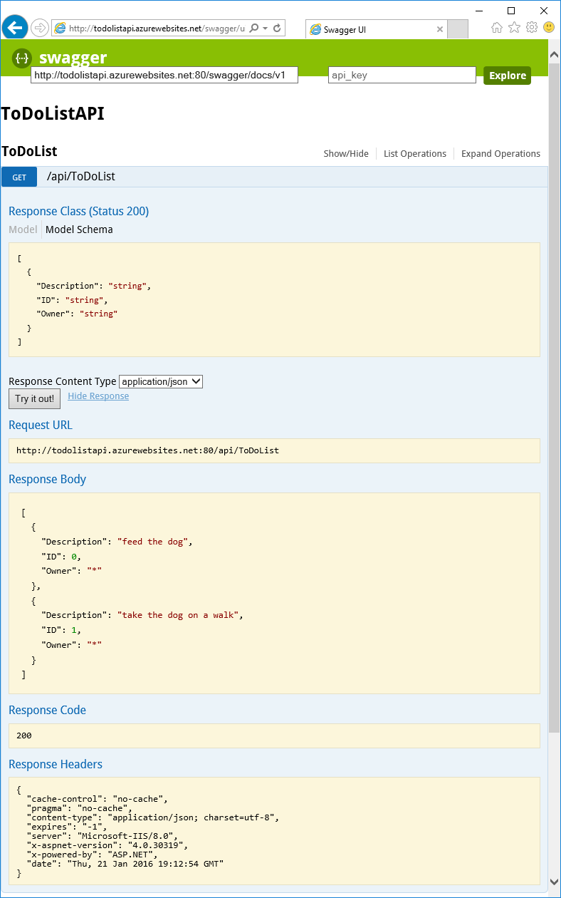

<properties
	pageTitle="应用服务中的 API 应用和 ASP.NET 入门 | Azure"
	description="了解如何使用 Visual Studio 2015 在 Azure 应用服务中创建、部署和使用 ASP.NET API 应用。"
	services="app-service\api"
	documentationCenter=".net"
	authors="tdykstra"
	manager="wpickett"
	editor=""/>

<tags
	ms.service="app-service-api"
	ms.date="05/27/2016"
	wacn.date=""/>

# Azure 应用服务中的 API 应用、ASP.NET 和 Swagger 入门

[AZURE.INCLUDE [选择器](../../includes/app-service-api-get-started-selector.md)]

本文是系列教程的第一篇，介绍如何使用 Azure 应用服务中有助于开发和托管 RESTful API 的功能。本教程介绍 Swagger 格式 API 元数据的支持。

学习内容：

* 如何通过 Visual Studio 2015 中的内置工具在 Azure 应用服务中创建和部署 [API 应用](/documentation/articles/app-service-api-apps-why-best-platform/)。
* 如何使用 Swashbuckle NuGet 包动态生成 Swagger API 元数据，以便自动进行 API 发现。
* 如何使用 Swagger API 元数据自动生成 API 应用的客户端代码。

## 示例应用程序概述

本教程使用简单的待办事项列表示例应用程序。该应用程序包含单页应用程序 (SPA) 前端、ASP.NET Web API 中间层和 ASP.NET Web API 数据层。

下面是 [AngularJS](https://angularjs.org/) 前端的屏幕截图。

Visual Studio 解决方案包含三个项目：

* **ToDoListAngular** - 前端：用于调用中间层的 AngularJS SPA。

* **ToDoListAPI** - 中间层：调用数据层，对待办事项执行 CRUD 操作的 ASP.NET Web API 项目。

* **ToDoListDataAPI** - 数据层：对待办事项执行 CRUD 操作的 ASP.NET Web API 项目。

三层体系结构是可以使用 API 应用实现的多种体系结构之一，此处仅用它来进行演示。每一层中的代码尽可能以最简单的方式来演示 API 应用功能；例如，数据层使用服务器内存而不是数据库作为持久性机制。

完成本教程后，将创建两个在云中应用服务 API 应用中启动并运行的 Web API 项目。

本系列教程的下一篇文章会将 SPA 前端部署到云中。

## 先决条件

* ASP.NET Web API - 本教程中的说明假设读者基本了解如何在 Visual Studio 中使用 ASP.NET [Web API 2](http://www.asp.net/web-api/overview/getting-started-with-aspnet-web-api/tutorial-your-first-web-api)。

* Azure 帐户 - 可以[建立免费 Azure 帐户](/pricing/1rmb-trial/?WT.mc_id=A261C142F)。

* Visual Studio 2015 和[用于 .NET 的 Azure SDK](http://go.microsoft.com/fwlink/?linkid=518003) - SDK 会自动安装 Visual Studio 2015（如果尚未安装）。

	>[AZURE.NOTE] 根据计算机上已有 SDK 依赖项数量的不同，安装 SDK 可能耗时较长，从几分钟到半小时或更长时间不等。

## 下载示例应用程序 

1. 下载 [Azure-Samples/app-service-api-dotnet-to-do-list](https://github.com/Azure-Samples/app-service-api-dotnet-todo-list) 存储库。

	可以单击“下载 ZIP”按钮，或克隆本地计算机上的存储库。

2. 在 Visual Studio 2015 或 2013 中打开 ToDoList 解决方案。

2. 生成解决方案以还原 NuGet 包。

	如果要在部署应用程序之前先查看应用程序的运行情况，可以在本地运行此应用程序。只需确保所有三个项目都是启始项目。需使用 Internet Explorer 或 Edge，因为这些浏览器允许对 `http://localhost` URL 进行跨域 JavaScript 调用。

## 使用 Swagger API 元数据和 UI

Azure 应用服务内置 [Swagger](http://swagger.io/) 2.0 API 元数据支持。每个 API 应用可以指定以 Swagger JSON 格式返回 API 元数据的 URL 终结点。从该终结点返回的元数据可用于生成客户端代码。

ASP.NET Web API 项目可以使用 [Swashbuckle](https://www.nuget.org/packages/Swashbuckle) NuGet 包动态生成 Swagger 元数据。Swashbuckle NuGet 包已安装在所下载的 ToDoListDataAPI 和 ToDoListAPI 项目中。

在教程的此部分中查看生成的 Swagger 2.0 元数据，然后尝试使用基于 Swagger 元数据的测试 UI。

2. 将 ToDoListDataAPI 项目（而**不是** ToDoListAPI 项目）设置为启动项目。
 
4. 按 F5 或单击“调试”>“开始调试”，以调试模式运行项目。

	浏览器将打开并显示“HTTP 403 错误”页。

12. 在浏览器的地址栏中，于 URL 行尾处添加 `swagger/docs/v1`，然后按回车键。（URL 为 `http://localhost:45914/swagger/docs/v1`。）

	这是 Swashbuckle 用于返回 API 的 Swagger 2.0 JSON 元数据的默认 URL。

	如果使用的是 Internet Explorer，浏览器将提示下载 *v1.json* 文件。

	

	如果使用的是 Chrome、Firefox 或 Edge，浏览器将在浏览器窗口中显示 JSON。不同的浏览器有不同的 JSON 处理方式，因此浏览器窗口看起来可能与示例不完全相同。

	

	以下示例显示了 API 的 Swagger 元数据的第一个部分（包含 Get 方法的定义）。在以下步骤中使用的 Swagger UI 由此元数据驱动，本教程稍后的部分将使用它来自动生成客户端代码。

		{
		  "swagger": "2.0",
		  "info": {
		    "version": "v1",
		    "title": "ToDoListDataAPI"
		  },
		  "host": "localhost:45914",
		  "schemes": [ "http" ],
		  "paths": {
		    "/api/ToDoList": {
		      "get": {
		        "tags": [ "ToDoList" ],
		        "operationId": "ToDoList_GetByOwner",
		        "consumes": [ ],
		        "produces": [ "application/json", "text/json", "application/xml", "text/xml" ],
		        "parameters": [
		          {
		            "name": "owner",
		            "in": "query",
		            "required": true,
		            "type": "string"
		          }
		        ],
		        "responses": {
		          "200": {
		            "description": "OK",
		            "schema": {
		              "type": "array",
		              "items": { "$ref": "#/definitions/ToDoItem" }
		            }
		          }
		        },
		        "deprecated": false
		      },

1. 关闭浏览器并停止 Visual Studio 调试。

3. 在“解决方案资源管理器”的 ToDoListDataAPI 项目中打开“App\_Start\\SwaggerConfig.cs”文件，然后向下滚动到以下代码并将其取消注释。

		/*
		    })
		.EnableSwaggerUi(c =>
		    {
		*/

	*SwaggerConfig.cs* 文件是在项目中安装 Swashbuckle 包时创建的。该文件提供配置 Swashbuckle 的多种方式。

	已取消注释的代码将启用要在以下步骤中使用的 Swagger UI。作为一种安全措施，使用 API 应用项目模板创建 Web API 项目时，默认会注释此代码。

5. 再次运行该项目。

3. 在浏览器的地址栏中，于 URL 行尾处添加 `swagger`，然后按回车键。（URL 为 `http://localhost:45914/swagger`。）

4. 当 Swagger UI 页出现时，请单击“ToDoList”查看可用方法。

	

5. 单击列表中的第一个“Get”按钮。

6. 在“参数”部分中，输入星号作为 `owner` 参数的值，然后单击“试用”。

	在后续教程中添加身份验证时，中间层将为数据层提供实际的用户 ID。现在，当应用程序在未启用身份验证的情况下运行时，所有任务都以星号作为其所有者 ID。

	

	Swagger UI 调用 ToDoList Get 方法并显示响应代码和 JSON 结果。

	

6. 单击“Post”，然后单击“模型架构”下面的框。

	单击模型架构会预先填充输入框，可以在该框中指定 Post 方法的参数值。（如果这不适用于 Internet Explorer，请使用不同的浏览器或在下一步骤中手动输入参数值。）

	

7. 按以下示例中所示，在 `todo` 参数输入框中更改 JSON，或者使用自己的描述文本替代：

		{
		  "ID": 2,
		  "Description": "buy the dog a toy",
		  "Owner": "*"
		}

10. 单击“试用”。

	ToDoList API 返回表示成功的 HTTP 204 响应码。

11. 单击第一个“Get”按钮，然后在页面的该部分中单击“试用”按钮。

	Get 方法响应现在包含新的待办事项。

12. 可选：还可以尝试使用 Put、Delete 和 Get by ID方法。

14. 关闭浏览器并停止 Visual Studio 调试。

Swashbuckle 可用于任何 ASP.NET Web API 项目。如果要将 Swagger 元数据生成添加到现有项目，只需安装 Swashbuckle 包。

**注意：**Swagger 元数据包含每个 API 操作的唯一 ID。默认情况下，Swashbuckle 可能为 Web API 控制器方法生成重复的 Swagger 操作 ID。如果控制器有重载的 HTTP 方法（例如 `Get()` 和 `Get(id)`），就会发生这种情况。有关如何处理重载的信息，请参阅 [Customize Swashbuckle-generated API definitions](/documentation/articles/app-service-api-dotnet-swashbuckle-customize/)（自定义 Swashbuckle 生成的 API 定义）。如果在 Visual Studio 中使用 Azure API 应用模板创建 Web API 项目，*SwaggerConfig.cs* 文件中会自动添加用于生成唯一操作 ID 的代码。

## 在 Azure 中创建 API 应用并向其部署代码

本部分使用已集成到 Visual Studio 的“发布 Web”向导中的 Azure 工具，在 Azure 中创建新的 API 应用。然后，将 ToDoListDataAPI 项目部署到新的 API 应用，并通过运行 Swagger UI 来调用 API。

1. 在“解决方案资源管理器”中，右键单击 ToDoListDataAPI 项目，然后单击“发布”。

	

2. 选择“导入”.

3. 如果你还没下载“发布配置文件”，请到 [Azure 门户预览](https://portal.azure.cn) 下载。如果你还没新建 web 应用，新建一个。在你的 web 应用的选项卡，点击 “... 更多”>“得到发布配置文件”。

4. 选在之前一步下载的“发布配置文件”，然后点击“确认”。

8. 单击“下一步”。

	

	下一个选项卡是“设置”选项卡（如下所示）。可以在此处更改生成配置选项卡，部署用于[远程调试](/documentation/articles/web-sites-dotnet-troubleshoot-visual-studio/#remotedebug)的调试生成。该选项卡还提供了多个“文件发布选项”：

	* 删除目标处的其他文件
	* 在发布期间预编译
	* 从 App\_Data 文件夹中排除文件

	在本教程中，不需要使用这些选项。有关这些选项的作用的说明，请参阅 [How to: Deploy a Web Project Using One-Click Publish in Visual Studio](https://msdn.microsoft.com/zh-cn/library/dd465337.aspx)（如何：在 Visual Studio 中使用一键式发布来部署 Web 项目）。

14. 单击“下一步”。

	

	接下来是“预览”选项卡（如下所示），用于查看哪些文件即将从项目复制到 API 应用。如果要将项目部署到前面已部署到的 API 应用，则只会复制已更改的文件。如果想要查看要复制的项列表，请单击“开始预览”按钮。

15. 单击“发布”。

	

	Visual Studio 随即将 ToDoListDataAPI 项目部署到新的 API 应用。“输出”窗口将记录成功的部署，在打开了 API 应用 URL 的浏览器窗口中会出现“已成功创建”页。

	

	

11. 在浏览器的地址栏中，将“swagger”添加到 URL，然后按 Enter。（URL 为 `http://{apiappname}.chinacloudsites.cn/swagger`。）

	浏览器将显示前面出现的相同 Swagger UI，但该 UI 现在在云中运行。尝试使用 Get 方法，会发现已返回到默认的 2 个待办事项。前面所做的更改已保存在本地计算机的内存中。

12. 打开 [Azure 门户](https://portal.azure.cn/)。

	Azure 门户是用于管理 Azure 资源（例如 API 应用）的 Web 界面。
 
14. 单击“浏览”>“应用程序服务”。

	

15. 在“应用程序服务”边栏选项卡中，找到并单击新的 API 应用。（在 Azure 门户中，右侧打开的窗口称为“边栏选项卡”。）

	

	将打开两个边栏选项卡。其中一个边栏选项卡包含 API 应用的概述，另一个包含可以查看和更改的一长串设置。

16. 在“设置”边栏选项卡中，找到“API”部分并单击“API 定义”。

	

	使用“API 定义”边栏选项卡可以指定以 JSON 格式返回 Swagger 2.0 元数据的 URL。当 Visual Studio 创建 API 应用时，会将 API 定义 URL 设置为前面所示的 Swashbuckle 生成的元数据默认值，即 API 应用的基 URL 加上 `/swagger/docs/v1`。

	

	选择要为其生成客户端代码的 API 应用时，Visual Studio 将从此 URL 检索元数据。

## 生成数据层的客户端代码

将 Swagger 集成到 Azure API 应用的优势之一是自动生成代码。使用生成的客户端类可以更轻松地编写调用 API 应用的代码。

ToDoListAPI 项目已有生成的客户端代码，但在以下步骤中，要先将这些代码删除再重新生成，才能了解如何生成代码。

1. 在 Visual Studio“解决方案资源管理器”的 ToDoListAPI 项目中，删除“ToDoListDataAPI”文件夹。**注意：请只删除该文件夹，而不要删除 ToDoListDataAPI 项目。**

	

	此文件夹是使用稍后即将演练的代码生成过程创建的。

2. 右键单击 ToDoListAPI 项目，然后单击“添加”>“REST API 客户端”。

	

3. 在“添加 REST API 客户端”对话框中，依次单击“选择现有的 Swagger 元数据文件”和“浏览...”。

4. 打开一个浏览器，从 `https://{your data tier API app name}.chinacloudsites.cn/swagger/docs/v1` 下载你的 Swagger 元数据文件

9. 在“添加 REST API 客户端”对话框中，选择刚刚下载的 json 文件，然后单击“确定”。

	Visual Studio 将创建以 API 应用命名的文件夹，并生成客户端类。

	

5. 在 ToDoListAPI 项目中，打开“Controllers\\ToDoListController.cs”，查看可使用生成的客户端调用 API 的代码。

	以下代码片段演示此代码如何实例化客户端对象和调用 Get 方法。

		private static ToDoListDataAPI NewDataAPIClient()
		{
		    var client = new ToDoListDataAPI(new Uri(ConfigurationManager.AppSettings["toDoListDataAPIURL"]));
		    return client;
		}
		
		public async Task<IEnumerable<ToDoItem>> Get()
		{
		    using (var client = NewDataAPIClient())
		    {
		        var results = await client.ToDoList.GetByOwnerAsync(owner);
		        return results.Select(m => new ToDoItem
		        {
		            Description = m.Description,
		            ID = (int)m.ID,
		            Owner = m.Owner
		        });
		    }
		}

	构造函数参数从 `toDoListDataAPIURL` 应用设置获取终结点 URL。在 Web.config 文件中，该值设置为 API 项目的本地 IIS Express URL，因此可在本地运行应用程序。如果省略构造函数参数，默认终结点是生成代码的 URL。

6. 将会根据 API 应用名称，以不同的名称生成客户端类；在 *Controllers\\ToDoListController.cs* 中更改代码，使类型名称与项目中生成的内容匹配。例如，如果将 API 应用命名为 ToDoListDataAPI071316，请将以下代码：

		private static ToDoListDataAPI NewDataAPIClient()
		{
		    var client = new ToDoListDataAPI(new Uri(ConfigurationManager.AppSettings["toDoListDataAPIURL"]));

更改为：

		private static ToDoListDataAPI071316 NewDataAPIClient()
		{
		    var client = new ToDoListDataAPI071316(new Uri(ConfigurationManager.AppSettings["toDoListDataAPIURL"]));

## 创建用于托管中间层的 API 应用

前面[已创建数据层 API 应用并在其中部署了代码](#createapiapp)。现在，请遵循相同的过程创建中间层 API 应用。

1. 在“解决方案资源管理器”中，右键单击中间层 ToDoListAPI 项目（而不是数据层 ToDoListDataAPI），然后单击“发布”。

	

2. 选择“导入”.

3. 如果你还没下载“发布配置文件”，请到 [Azure 门户预览](https://portal.azure.cn) 下载。如果你还没新建 web 应用，新建一个。在你的 web 应用的选项卡，点击 “... 更多”>“得到发布配置文件”。

4. 选在之前一步下载的“发布配置文件”，然后点击“确认”。

3.  在“发布 Web”向导的“连接”步骤中，单击“发布”。

	Visual Studio 会将 ToDoListAPI 项目部署到新的 API 应用，并在浏览器中打开该 API 应用的 URL。此时将显示“已成功创建”页。

## 配置用于调用数据层的中间层

如果现在调用中间层 API 应用，它会使用仍在 Web.config 文件中的 localhost URL 尝试调用数据层。在本部分中，需将数据层 API 应用 URL 输入到中间层 API 应用的环境设置中。当中间层 API 应用中的代码检索数据层 URL 设置时，环境设置将覆盖 Web.config 文件中的内容。
 
1. 转到 [Azure 门户](https://portal.azure.cn/)，然后导航到为托管 TodoListAPI（中间层）项目而创建的 API 应用的“API 应用”边栏选项卡。

2. 在 API 应用的“设置”边栏选项卡中，单击“应用程序设置”。
 
4. 在 API 应用的“应用程序设置”边栏选项卡中，向下滚动到“应用设置”部分并添加以下密钥和值：

	| **键** | toDoListDataAPIURL |
	|---|---|
	| **值** | https://{your data tier API app name}.chinacloudsites.cn |
	| **示例** | https://todolistdataapi.chinacloudsites.cn |

4. 单击“保存”。

	

	在 Azure 中运行代码时，此值将覆盖 Web.config 文件中的 localhost URL。

## 测试

11. 在浏览器窗口中，导航到刚刚为 ToDoListAPI 创建的新中间层 API 应用的 URL。单击 API 应用在门户主边栏选项卡中的 URL 即可转到该位置。

13. 在浏览器的地址栏中，将“swagger”添加到 URL，然后按 Enter。（URL 为 `http://{apiappname}.chinacloudsites.cn/swagger`。）

	浏览器将显示前面在 ToDoListDataAPI 所看到的相同 Swagger UI，但现在 `owner` 不是 Get 操作的必需字段，因为中间层 API 应用会将该值发送到数据层 API 应用。（在身份验证教程中，中间层将发送 `owner` 参数的实际用户 ID；但目前该参数只是一个硬编码的星号。）

12. 尝试使用 Get 方法和其他方法来验证中间层 API 应用是否成功调用数据层 API 应用。

	

## 故障排除

如果在学习本教程的过程中遇到问题，请参考下面列出的一些故障排除思路：

* 确保使用最新版本的[用于 .NET 的 Azure SDK](http://go.microsoft.com/fwlink/?linkid=518003)。

* 两个项目名称非常类似（ToDoListAPI、ToDoListDataAPI）。处理项目时，如果项目名称不同于说明中所述，请确保打开的是正确的项目。

* 如果在企业网络中并尝试通过防火墙部署到 Azure 应用服务，请确保已针对 Web 部署打开端口 443 和 8172。如果无法打开这些端口，可以使用其他部署方法。请参阅 [Deploy your app to Azure App Service](/documentation/articles/web-sites-deploy/)（将应用部署到 Azure 应用服务）。

* “路由名称必须唯一”错误 -- 如果不小心将错误的项目部署到 API 应用，稍后再将正确的项目部署到其中，可能会收到这些错误。若要更正此问题，请将正确的项目重新部署到 API 应用，然后在“发布 Web”向导的“设置”选项卡上选择“删除目标位置的其他文件”。

在 Azure 应用服务中运行 ASP.NET API 应用后，可能想要深入了解可简化故障排解的 Visual Studio 功能。有关日志记录、远程调试等功能的信息，请参阅 [Troubleshooting Azure App Service apps in Visual Studio](/documentation/articles/web-sites-dotnet-troubleshoot-visual-studio/)（在 Visual Studio 中对 Azure 应用服务应用进行故障排除）。

## 后续步骤

本文已介绍如何将现有 Web API 项目部署到 API 应用、生成 API 应用的客户端代码，以及从 .NET 客户端使用 API 应用。本系列教程的下一篇文章介绍如何[使用 CORS 从 JavaScript 客户端使用 API 应用](/documentation/articles/app-service-api-cors-consume-javascript/)。
 
有关生成客户端代码的详细信息，请参阅 GitHub.com 上的 [Azure/AutoRest](https://github.com/azure/autorest) 存储库。有关使用所生成客户端的问题帮助，请打开 [AutoRest 存储库中的问题](https://github.com/azure/autorest/issues)。

如果想要从头开始创建新的 API 应用项目，请使用 **Azure API 应用**模板。

**Azure API 应用**项目模板相当于选择**空的** ASP.NET 4.5.2 模板、单击复选框以添加 Web API 支持，然后安装 Swashbuckle NuGet 包。此外，该模板添加了一些 Swashbuckle 配置代码，旨在避免创建重复的 Swagger 操作 ID。创建 API 应用项目之后，可以使用本教程中所述的相同方式将它部署到 API 应用。

<!---HONumber=Mooncake_0919_2016-->