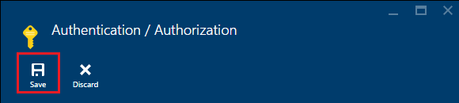
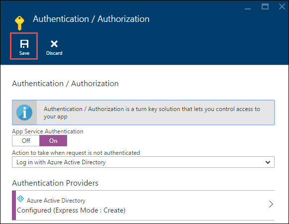

<properties
	pageTitle="Azure 应用服务中 API 应用的服务主体身份验证 | Azure"
	description="了解如何在服务到服务方案中保护 Azure 应用服务中的 API 应用。"
	services="app-service\api"
	documentationCenter=".net"
	authors="tdykstra"
	manager="wpickett"
	editor=""/>

<tags
	ms.service="app-service-api"
	ms.workload="na"
	ms.tgt_pltfrm="dotnet"
	ms.devlang="na"
	ms.topic="article"
	ms.date="06/30/2016"
	wacn.date="09/26/2016" 
	ms.author="rachelap"/>

# Azure 应用服务中 API 应用的服务主体身份验证

## 概述

本文介绍如何使用应用服务身份验证对 API 应用进行 *内部* 访问。内部访问方案是指希望 API 应用只能由自己的应用程序代码使用。在应用服务中实现这种方案的建议方法是使用 Azure AD 保护被调用的 API 应用。可以通过提供应用程序标识（服务主体）凭据，使用从 Azure AD 获取的持有者令牌调用受保护的 API 应用。有关使用 Azure AD 的替代方案，请参阅 [Azure App Service authentication overview](/documentation/articles/app-service-authentication-overview/#service-to-service-authentication)（Azure 应用服务身份验证概述）中的 **Service-to-service authentication**（服务到服务身份验证）部分。

本文内容：

* 如何使用 Azure Active Directory (Azure AD) 防止未经身份验证访问 API 应用。
* 如何使用 Azure AD 服务主体（应用标识）凭据从 API 应用、Web 应用或移动应用使用受保护的 API 应用。
* 如何确保登录的用户无法从浏览器调用受保护的 API 应用。
* 如何确保只能由特定 Azure AD 服务主体调用受保护的 API 应用。

本文包含两个部分：

* [如何在 Azure 应用服务中配置服务主体身份验证](#authconfig)部分概括介绍如何为 API 应用配置身份验证，以及如何使用受保护的 API 应用。此部分适用于应用服务支持的所有框架，包括 .NET、Node.js 和 Java。

* 本教程从[继续学习 .NET 入门教程](#tutorialstart)部分开始，指导如何针对应用服务中运行的 .NET 示例应用程序配置“内部访问”方案。

## 如何在 Azure 应用服务中配置服务主体身份验证

本部分提供适用于任何 API 应用的一般说明。有关待办事项列表 .NET 示例应用程序的特定步骤，请转到[继续学习 .NET API 应用系列教程](#tutorialstart)。

1. 在 [Azure 门户预览](https://portal.azure.cn/)中，导航到要保护的 API 应用的“设置”边栏选项卡，然后找到“功能”部分并单击“身份验证/授权”。

	

3. 在“身份验证/授权”边栏选项卡中，单击“打开”。

4. 在“请求未经身份验证时需执行的操作”下拉列表中，选择“使用 Azure Active Directory 登录”。

5. 在“身份验证提供程序”下面，选择“Azure Active Directory”。

	

6. 配置“Azure Active Directory 设置”边栏选项卡创建新的 Azure AD 应用程序；如果已有想要使用的现有 Azure AD 应用程序，请使用该应用程序。

	内部方案通常涉及到调用 API 应用的 API 应用。可为每个 API 应用使用不同的 Azure AD 应用程序，或者全都使用同一个 Azure AD 应用程序。

	有关此边栏选项卡的详细说明，请参阅 [How to configure your App Service application to use Azure Active Directory login](/documentation/articles/app-service-mobile-how-to-configure-active-directory-authentication/)（如何将应用服务应用程序配置为使用 Azure Active Directory 登录）。

7. 完成身份验证提供程序配置边栏选项卡中的操作后，单击“确定”。

7. 在“身份验证/授权”边栏选项卡中，单击“保存”。

	

完成后，应用服务只允许来自已配置 Azure AD 租户中的调用方的请求。受保护的 API 应用中不需要身份验证或授权代码。持有者令牌与 HTTP 标头中的常用声明一起传递到 API 应用，可以在代码中阅读该信息，验证请求是否来自特定的调用方（例如服务主体）。

对于应用服务支持的所有语言（包括 .NET、Node.js 和 Java），此身份验证功能的工作原理都相同。

#### 如何使用受保护的 API 应用

调用方必须在 API 调用中提供 Azure AD 持有者令牌。若要获取使用服务主体凭据的持有者令牌，调用方必须使用 Active Directory 身份验证库（用于 [.NET](https://www.nuget.org/packages/Microsoft.IdentityModel.Clients.ActiveDirectory)、[Node.js](https://github.com/AzureAD/azure-activedirectory-library-for-nodejs) 或 [Java](https://github.com/AzureAD/azure-activedirectory-library-for-java) 的 ADAL）。为了获取令牌，调用 ADAL 的代码需向 ADAL 提供以下信息：

* Azure AD 租户的名称。
* 与调用方关联的 Azure AD 应用的客户端 ID 和客户端机密（应用密钥）。
* 与受保护 API 应用关联的 Azure AD 应用程序的客户端 ID。（如果只使用一个 Azure AD 应用程序，则此 ID 与调用方的客户端 ID 相同。）

可以在 [Azure 经典管理门户](https://manage.windowsazure.cn/)的 Azure AD 页中获取这些值。

获取令牌后，调用方将它放入 HTTP 请求的 Authorization 标头中。应用服务将验证令牌，允许请求进入受保护的 API 应用。

#### 如何防止同一租户中的用户访问 API 应用

同一租户中的用户拥有的持有者令牌也对受保护的 API 应用有效。如果想要确保只有服务主体可以调用受保护的 API 应用，请在受保护的 API 应用中添加代码来验证来自令牌的以下声明：

* `appid` 应是与调用方关联的 Azure AD 应用程序的客户端 ID。
* `oid` (`objectidentifier`) 应是调用方的服务主体 ID。

应用服务还在 X-MS-CLIENT-PRINCIPAL-ID 标头中提供 `objectidentifier` 声明。

### 如何防止浏览器访问 API 应用

如果不验证受保护 API 应用的代码中的声明并为受保护的 API 应用使用不同的 Azure AD 应用程序，请确保 Azure AD 应用的回复 URL 与 API 应用的基 URL 不同。如果回复 URL 直接指向受保护的 API 应用，同一 Azure AD 租户中的用户将能够浏览到 API 应用、进行登录，并成功调用 API。

## 继续学习 .NET API 应用系列教程

如果正在遵循适用于 API 应用的 Node.js 或 Java 系列教程，请跳到[后续步骤](#next-steps)部分。

本文余下部分续接 .NET API 应用系列教程，假设已完成[用户身份验证教程](/documentation/articles/app-service-api-dotnet-user-principal-auth/)并拥有在 Azure 中运行、已启用用户身份验证的示例应用程序。

## 在 Azure 中设置身份验证

在本部分中配置应用服务，以便只有允许进入数据层 API 应用的 HTTP 请求才能拥有有效的 Azure AD 持有者令牌。

在下一部分中，将配置中间层 API 应用，将应用程序凭据发送到 Azure AD、取回持有者令牌，并将持有者令牌发送到数据层 API 应用。下图演示了此过程。

如果遵循教程指导时遇到问题，请参阅教程末尾的[故障排除](#troubleshooting)部分。

1. 在 [Azure 门户预览](https://portal.azure.cn/)中，导航到为 ToDoListDataAPI（数据层）API 应用创建的 API 应用的“设置”边栏选项卡，然后单击“设置”。

2. 在“设置”边栏选项卡中找到“功能”部分，然后单击“身份验证/授权”。

	

3. 在“身份验证/授权”边栏选项卡中，单击“打开”。

4. 在“请求未经身份验证时需执行的操作”下拉列表中，选择“使用 Azure Active Directory 登录”。

	这是能够让应用服务确保只有经过身份验证的请求能进入 API 应用的设置。对于具有有效持有者令牌的请求，应用服务会将令牌传递到 API 应用，并在 HTTP 标头中填充常用声明，让代码更轻松地获取该信息。

5. 在“身份验证提供程序”下面，单击“Azure Active Directory”。

	

6. 在“Azure Active Directory 设置”边栏选项卡中单击“快速”。

	使用“快速”选项时，Azure 可以自动在 Azure AD [租户](https://msdn.microsoft.com/zh-cn/library/azure/jj573650.aspx#BKMK_WhatIsAnAzureADTenant)中创建 AAD 应用程序。

	无需创建租户，因为每个 Azure 帐户都自动拥有一个。

7. 在“管理模式”下面，单击“创建新的 AD 应用”（如果尚未选择）。

	门户将在“创建应用”输入框中填充默认值。默认情况下，Azure AD 应用程序的名称与 API 应用相同。如果需要，也可以输入不同的名称。
	
	

	**注意**：或者，可对调用 API 应用和受保护 API 应用使用同一个 Azure AD 应用程序。如果选择后者，则此处不需要选择“创建新的 AD 应用”选项，因为前面已在用户身份验证教程中创建了 Azure AD 应用程序。在本教程中，为调用 API 应用和受保护 API 应用使用不同的 Azure AD 应用程序。

8. 记下“创建应用”输入框中的值，因为稍后要在 Azure 经典管理门户中查找此 AAD 应用程序。

7. 单击**“确定”**。

10. 在“身份验证/授权”边栏选项卡中，单击“保存”。

	

	应用服务将创建一个 Azure Active Directory 应用程序，其“登录 URL”和“回复 URL”自动设置为 API 应用的 URL。第二个值可让 AAD 租户中的用户登录和访问 API 应用。

### 验证 API 应用是否受保护

1. 在浏览器中，转到 API 应用的 URL：在 Azure 门户预览的“API 应用”边栏选项卡中，单击“URL”下面的链接。

	由于不允许未经身份验证的请求进入 API 应用，因此将重定向到登录屏幕。

	如果浏览器确实转到 Swagger UI，则表示可能已登录浏览器 - 在这种情况下，请打开 InPrivate 或 Incognito 窗口并转到 Swagger UI URL。

18. 使用 AAD 租户中用户的凭据登录。

	登录后，浏览器中会显示“已成功创建”页。

## 配置 ToDoListAPI 项目以获取和发送 Azure AD 令牌

在本部分中执行以下任务：

* 在中间层 API 应用中添加使用 Azure AD 应用程序凭据的代码用于获取令牌，然后通过 HTTP 请求将其发送到数据层 API 应用。
* 从 Azure AD 获取所需的凭据。
* 在中间层 API 应用的 Azure 应用服务运行时环境设置中输入凭据。

### 配置 ToDoListAPI 项目以获取和发送 Azure AD 令牌

在 Visual Studio 中对 ToDoListAPI 项目进行以下更改。

1. 取消注释 *ServicePrincipal.cs* 文件中的所有代码。

	这是使用用于 .NET 的 ADAL 获取 Azure AD 持有者令牌的代码。此代码使用多个配置值，稍后将在 Azure 运行时环境中设置这些值。代码如下：

		public static class ServicePrincipal
		{
		    static string authority = ConfigurationManager.AppSettings["ida:Authority"];
		    static string clientId = ConfigurationManager.AppSettings["ida:ClientId"];
		    static string clientSecret = ConfigurationManager.AppSettings["ida:ClientSecret"];
		    static string resource = ConfigurationManager.AppSettings["ida:Resource"];
		
		    public static AuthenticationResult GetS2SAccessTokenForProdMSA()
		    {
		        return GetS2SAccessToken(authority, resource, clientId, clientSecret);
		    }
		
		    static AuthenticationResult GetS2SAccessToken(string authority, string resource, string clientId, string clientSecret)
		    {
		        var clientCredential = new ClientCredential(clientId, clientSecret);
		        AuthenticationContext context = new AuthenticationContext(authority, false);
		        AuthenticationResult authenticationResult = context.AcquireToken(
		            resource,
		            clientCredential);
		        return authenticationResult;
		    }
		}

	**注意**：此代码需要项目中已安装的用于 .NET 的 ADAL NuGet 包 (Microsoft.IdentityModel.Clients.ActiveDirectory)。如果此项目是从头开始创建的，则必须安装此包。API 应用的 new-project 模板不会自动安装此包。

2. 在 *Controllers/ToDoListController* 中，取消注释 `NewDataAPIClient` 方法中用于将令牌添加到 HTTP 请求 authorization 标头的代码。

		client.HttpClient.DefaultRequestHeaders.Authorization =
		    new AuthenticationHeaderValue("Bearer", ServicePrincipal.GetS2SAccessTokenForProdMSA().AccessToken);

3. 部署 ToDoListAPI 项目。（右键单击该项目，然后单击“发布”>“发布”）。

	Visual Studio 将部署项目并在浏览器中打开 Web 应用的基 URL。此时会显示 403 错误页，这是尝试从浏览器转到 Web API 基 URL 时的正常现象。

4. 关闭浏览器。

### 获取 Azure AD 配置值

11. 在 [Azure 经典管理门户](https://manage.windowsazure.cn/)中，转到“Azure Active Directory”。

12. 在“目录”选项卡中，单击 AAD 租户。

14. 单击“应用程序”>“我公司拥有的应用程序”，然后单击复选标记。

15. 在应用程序列表中，单击为 ToDoListDataAPI（数据层）API 应用启用身份验证时 Azure 创建的应用名称。

16. 单击“配置”选项卡。

5. 复制“客户端 ID”值，并将其保存到稍后可从中获取此值的位置。

8. 在 Azure 经典管理门户中，返回“我公司拥有的应用程序”列表，然后单击为中间层 ToDoListAPI API 应用（在前一教程中创建，不是在本教程中创建）创建的 AAD 应用程序。

16. 单击“配置”选项卡。

5. 复制“客户端 ID”值，并将其保存到稍后可从中获取此值的位置。

6. 在“密钥”中，从“选择持续时间”下拉列表中选择“1 年”。

6. 单击“保存”。

	

7. 复制密钥值，并将其保存到稍后可从中获取此值的位置。

	

### 在中间层 API 应用的运行时环境中配置 Azure AD 设置

1. 转到 [Azure 门户预览](https://portal.azure.cn/)，然后导航到用于托管 TodoListAPI（中间层）项目的 API 应用的“API 应用”边栏选项卡。

2. 单击“设置”>“应用程序设置”。

3. 在“应用设置”部分中，添加以下键和值：

	| **键** | ida:Authority |
	|---|---|
	| **值** | https://login.chinacloudapi.cn/{your Azure AD tenant name} |
	| **示例** | https://login.chinacloudapi.cn/contoso.partner.onmschina.cn |

	| **键** | ida:ClientId |
	|---|---|
	| **值** | 调用方应用程序（中间层 - ToDoListAPI）的客户端 ID |
	| **示例** | 960adec2-b74a-484a-960adec2-b74a-484a |

	| **键** | ida:ClientSecret |
	|---|---|
	| **值** | 调用方应用程序（中间层 - ToDoListAPI）的应用密钥 |
	| **示例** | e65e8fc9-5f6b-48e8-e65e8fc9-5f6b-48e8 |

	| **键** | ida:Resource |
	|---|---|
	| **值** | 被调用应用程序（数据层 - ToDoListDataAPI）的客户端 ID |
	| **示例** | e65e8fc9-5f6b-48e8-e65e8fc9-5f6b-48e8 |

	**注意**：对于 `ida:Resource`，请确保使用被调用应用程序的**客户端 ID**，而不是其**应用 ID URI**。

	在本教程中，`ida:ClientId` 和 `ida:Resource` 是不同的值，因为对中间层和数据层使用的 Azure AD 应用程序不同。如果为调用方 API 应用和受保护 API 应用使用同一个 Azure AD 应用程序，请在 `ida:ClientId` 和 `ida:Resource` 中使用相同的值。

	代码使用 ConfigurationManager 获取这些值，因此这些值可以存储在项目的 Web.config 文件或 Azure 运行时环境中。当 ASP.NET 应用程序在 Azure 应用服务中运行时，环境设置将自动覆盖 Web.config 的设置。一般而言，环境设置是[比 Web.config 文件更安全的敏感信息存储方式](http://www.asp.net/identity/overview/features-api/best-practices-for-deploying-passwords-and-other-sensitive-data-to-aspnet-and-azure)。

6. 单击“保存”。

	

### 测试应用程序

1. 在浏览器中，转到 AngularJS 前端 Web 应用的 HTTPS URL。

2. 单击“待办事项列表”选项卡，然后使用 Azure AD 租户中用户的凭据登录。

4. 添加待办事项，验证应用程序是否正常工作。

	

	如果应用程序未按预期工作，请仔细检查在 Azure 门户预览中输入的所有设置。如果所有设置看起来都没问题，请参阅本教程稍后的[故障排除](#troubleshooting)部分。

## 防止浏览器访问 API 应用

在本教程中，为 ToDoListDataAPI（数据层）API 应用单独创建了一个 Azure AD 应用程序。可以看到，当应用服务在创建 AAD 应用程序时，会将 AAD 应用程序配置为允许用户在浏览器中转到 API 应用的 URL 来登录。这意味着不只是服务主体，连 Azure AD 租户中的最终用户都可能有权访问 API。

如果想要防止浏览器访问但不要在受保护的 API 应用中编写任何代码，可以更改 AAD 应用程序中的“回复 URL”，使其不同于 API 应用的基 URL。

### 禁用浏览器访问

1. 在经典管理门户的“配置”选项卡中，针对为 TodoListService 创建的 AAD 应用程序更改“回复 URL”字段中的值，使它属于有效 URL 但不是 API 应用的 URL。
 
2. 单击“保存”。

### 验证浏览器访问是否不再可行

前面已验证过，可以从浏览器使用个人用户的凭据登录，以此转到 API 应用的 URL。本部分将验证这种操作是否不再可行。

1. 在新浏览器窗口中，再次转到 API 应用的 URL。

2. 根据提示登录。

3. 登录成功，但出现错误页。

	已配置 AAD 应用，使 AAD 租户中的用户无法从浏览器登录和访问 API。仍可使用服务主体令牌访问 API 应用，若要验证这一点，请转到 Web 应用的 URL，并添加更多待办事项。

## 限制对特定服务主体的访问  

现在，Azure AD 租户中可以获使用户令牌或服务主体令牌的任何调用方都可以调用 TodoListDataAPI（数据层）API 应用。也许需要确保数据层 API 应用只接受 TodoListAPI（中间层）API 应用的调用，以及特定服务主体的调用。

可以通过添加代码验证传入调用中的 `appid` 和 `objectidentifier` 声明，来添加这些限制。

对于本教程，请将用于验证应用 ID 和服务主体 ID 的代码直接放在控制器操作中。或者，也可以使用自定义 `Authorize` 属性，或在启动序列（例如 OWIN 中间件）中执行此验证。有关后者的示例，请参阅[此示例应用程序](https://github.com/mohitsriv/EasyAuthMultiTierSample/blob/master/MyDashDataAPI/Startup.cs)。

对 TodoListDataAPI 项目进行以下更改。

2. 打开 *Controllers/TodoListController.cs* 文件。

3. 取消注释用于设置 `trustedCallerClientId` 和 `trustedCallerServicePrincipalId` 的代码行。

		private static string trustedCallerClientId = ConfigurationManager.AppSettings["todo:TrustedCallerClientId"];
		private static string trustedCallerServicePrincipalId = ConfigurationManager.AppSettings["todo:TrustedCallerServicePrincipalId"];

4. 取消注释 CheckCallerId 方法中的代码。开始执行控制器中的每个操作方法时将调用此方法。

		private static void CheckCallerId()
		{
		    string currentCallerClientId = ClaimsPrincipal.Current.FindFirst("appid").Value;
		    string currentCallerServicePrincipalId = ClaimsPrincipal.Current.FindFirst("http://schemas.microsoft.com/identity/claims/objectidentifier").Value;
		    if (currentCallerClientId != trustedCallerClientId || currentCallerServicePrincipalId != trustedCallerServicePrincipalId)
		    {
		        throw new HttpResponseException(new HttpResponseMessage { StatusCode = HttpStatusCode.Unauthorized, ReasonPhrase = "The appID or service principal ID is not the expected value." });
		    }
		}

5. 将 ToDoListDataAPI 项目重新部署到 Azure 应用服务。

6. 在浏览器中，转到 AngularJS 前端 Web 应用的 HTTPS URL，然后在主页中单击“待办事项列表”选项卡。

	对后端的调用失败，因此应用程序并未正常工作。新代码正在检查实际 appid 和 objectidentifier，但尚未获得正确值用于对这两项进行检查。浏览器开发人员工具控制台报告服务器返回 HTTP 401 错误。

	

	在以下步骤中配置预期值。

8. 使用 Azure AD PowerShell 为针对 TodoListWebApp 项目创建的 Azure AD 应用程序获取服务主体值。

	a.有关如何安装 Azure PowerShell 和连接到订阅的说明，请参阅 [Using Azure PowerShell with Azure Resource Manager](/documentation/articles/powershell-azure-resource-manager/)（将 Azure PowerShell 与 Azure Resource Manager 配合使用）。

	b.若要获取服务主体列表，请依次执行 `Login-AzureRmAccount` 命令和 `Get-AzureRmADServicePrincipal` 命令。

	c.查找 TodoListAPI 应用程序服务主体的 objectid，并将它保存在稍后可从中复制此值的位置。

7. 在 Azure 门户预览中，导航到部署 ToDoListDataAPI 项目的 API 应用的“API 应用”边栏选项卡。

9. 单击“设置”>“应用程序设置”。

3. 在“应用设置”部分中，添加以下键和值：

	| **键** | todo:TrustedCallerServicePrincipalId |
	|---|---|
	| **值** | 调用方应用程序的服务主体 ID |
	| **示例** | 4f4a94a4-6f0d-4072-4f4a94a4-6f0d-4072 |

	| **键** | todo:TrustedCallerClientId |
	|---|---|
	| **值** | 调用方应用程序的客户端 ID - 从 TodoListAPI Azure AD 应用程序复制 |
	| **示例** | 960adec2-b74a-484a-960adec2-b74a-484a |

6. 单击“保存”。

	

6. 在浏览器中，返回 Web 应用的 URL，然后在主页中单击“待办事项列表”选项卡。

	受信任调用方应用 ID 和服务主体 ID 均为预期值，因此应用程序这次会按预期工作。

	

## 从头开始生成项目

两个 Web API 项目是通过使用 **Azure API 应用**项目模板并将默认“值”控制器替换为 ToDoList 控制器创建的。为了在 ToDoListAPI 项目中获取 Azure AD 服务主体令牌，我们已安装[用于 .NET 的 Active Directory 身份验证库 (ADAL)](https://www.nuget.org/packages/Microsoft.IdentityModel.Clients.ActiveDirectory/) NuGet 包。
 
有关如何使用 ToDoListAngular 之类的 Web API 后端创建 AngularJS 单页应用程序的信息，请参阅 [Hands On Lab: Build a Single Page Application (SPA) with ASP.NET Web API and Angular.js](http://www.asp.net/web-api/overview/getting-started-with-aspnet-web-api/build-a-single-page-application-spa-with-aspnet-web-api-and-angularjs)（动手实验：使用 ASP.NET Web API 和 Angular.js 构建单页应用程序 (SPA)）。有关如何添加 Azure AD 身份验证代码的信息，请参阅 [Securing AngularJS Single Page Apps with Azure AD](/documentation/articles/active-directory-devquickstarts-angular/)（使用 Azure AD 保护 AngularJS 单页应用程序）。

## 故障排除

[AZURE.INCLUDE [故障排除](../../includes/app-service-api-auth-troubleshooting.md)]

* 请务必不要混淆 ToDoListAPI（中间层）和 ToDoListDataAPI（数据层）。例如，在本教程中，将身份验证添加到了数据层 API 应用，**但应用密钥必须来自为中间层 API 应用创建的 Azure AD 应用程序**。

## 后续步骤

这是 API 应用系列中的最后一部教程。

有关 Azure Active Directory 的详细信息，请参阅以下资源。

* [Azure AD developers' guide](/documentation/articles/active-directory-developers-guide/)（Azure AD 开发人员指南）
* [Azure AD scenarios](/documentation/articles/active-directory-authentication-scenarios/)（Azure AD 方案）
* [Azure AD 示例](https://github.com/azure-samples?query=active-directory)

	[WebApp-WebAPI-OAuth2-AppIdentity-DotNet](http://github.com/AzureADSamples/WebApp-WebAPI-OAuth2-AppIdentity-DotNet) 示例类似于本教程中所示的示例，但未使用应用服务身份验证。

有关通过 Visual Studio 或通过[源代码管理系统](http://www.asp.net/aspnet/overview/developing-apps-with-windows-azure/building-real-world-cloud-apps-with-windows-azure/source-control)的[自动部署](http://www.asp.net/aspnet/overview/developing-apps-with-windows-azure/building-real-world-cloud-apps-with-windows-azure/continuous-integration-and-continuous-delivery)功能以其他方式将 Visual Studio 项目部署到 API 应用的信息，请参阅 [How to deploy an Azure App Service app](/documentation/articles/web-sites-deploy/)（如何部署 Azure 应用服务应用）。

<!---HONumber=Mooncake_0919_2016-->