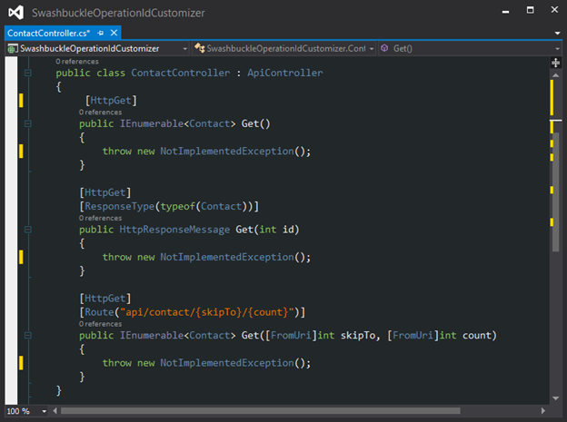

<properties 
	pageTitle="自定义 Swashbuckle 生成的 API 定义" 
	description="了解如何自定义 Swashbuckle 针对 Azure 应用服务中的 API 应用生成的 Swagger API 定义。" 
	services="app-service\api" 
	documentationCenter=".net" 
	authors="bradygaster" 
	manager="wpickett" 
	editor="jimbe"/>

<tags 
	ms.service="app-service-api" 
	ms.workload="web" 
	ms.tgt_pltfrm="dotnet" 
	ms.devlang="na" 
	ms.topic="article" 
	ms.date="08/29/2016" 
	wacn.date="02/21/2017" 
	ms.author="rachelap"/>

# 自定义 Swashbuckle 生成的 API 定义 

[AZURE.INCLUDE [azure-sdk-developer-differences](../../includes/azure-sdk-developer-differences.md)]

## 概述

本文说明如何自定义 Swashbuckle，以应对想要改变默认行为的常见情况：

* Swashbuckle 针对控制器方法的重载生成重复操作标识符
* Swashbuckle 假设方法的唯一有效响应是 HTTP 200 (OK)
 
## 自定义操作标识符生成

Swashbuckle 通过连接控制器名称与方法名称来生成 Swagger 操作标识符。当一个方法有多个重载时，这种模式会产生问题：Swashbuckle 生成重复的操作 ID，这是无效的 Swagger JSON。

例如，以下控制器代码导致 Swashbuckle 生成三个 Contact\_Get 操作 ID。

可以通过提供唯一的方法名称（如下所示）手动解决该问题：

* Get
* GetById
* GetPage

也可以扩展 Swashbuckle，使其自动生成唯一的操作 ID。

以下步骤说明如何使用 Visual Studio API 应用预览项目模板包含在项目中的文件 *SwaggerConfig.cs* 来自定义 Swashbuckle。也可以在为部署配置的用作 API 应用的 Web API 项目中自定义 Swashbuckle。

[AZURE.INCLUDE [azure-sdk-developer-differences](../../includes/azure-visual-studio-login-guide.md)]

1. 创建自定义 `IOperationFilter` 实现

	`IOperationFilter` 接口为想要自定义 Swagger 元数据进程各个层面的 Swashbuckle 用户提供了扩展点。以下代码演示了一种更改操作 ID 生成行为的方法。该代码将参数名称追加到操作 ID 名称。

		using Swashbuckle.Swagger;
		using System.Web.Http.Description;
		
		namespace ContactsList
		{
		    public class MultipleOperationsWithSameVerbFilter : IOperationFilter
		    {
		        public void Apply(
		            Operation operation,
		            SchemaRegistry schemaRegistry,
		            ApiDescription apiDescription)
		        {
		            if (operation.parameters != null)
		            {
		                operation.operationId += "By";
		                foreach (var parm in operation.parameters)
		                {
		                    operation.operationId += string.Format("{0}",parm.name);
		                }
		            }
		        }
		    }
		}

2. 在 *App\_Start\\SwaggerConfig.cs* 文件中调用 `OperationFilter` 方法，让 Swashbuckle 使用新的 `IOperationFilter` 实现。

		c.OperationFilter<MultipleOperationsWithSameVerbFilter>();

	

	Swashbuckle NuGet 包放入的 *SwaggerConfig.cs* 文件包含许多已注释掉的扩展点示例。此处未显示其他注释。

	进行此项更改后，将使用 `IOperationFilter` 实现并生成唯一的操作 ID。
 
	

	
## 允许 200 以外的响应代码

默认情况下，Swashbuckle 假设 Web API 方法的 *唯一* 合法响应是 HTTP 200 (OK)。在某些情况下，可能需要在不导致客户端引发异常的情况下返回其他响应代码。例如，以下 Web API 代码演示了想要客户端接受 200 或 404 作为有效响应的方案。

	[ResponseType(typeof(Contact))]
    public HttpResponseMessage Get(int id)
    {
        var contacts = GetContacts();

        var requestedContact = contacts.FirstOrDefault(x => x.Id == id);

        if (requestedContact == null)
        {
            return Request.CreateResponse(HttpStatusCode.NotFound);
        }
        else
        {
            return Request.CreateResponse<Contact>(HttpStatusCode.OK, requestedContact);
        }
    }

在此方案中，Swashbuckle 默认生成的 Swagger 仅指定了一个合法的 HTTP 状态代码 (HTTP 200)。

由于 Visual Studio 使用 Swagger API 定义来为客户端生成代码，因此为任何 HTTP 200 以外的响应所创建的客户端代码将引发异常。以下代码来自针对本示例 Web API 方法生成的 C# 客户端。

	if (statusCode != HttpStatusCode.OK)
    {
        HttpOperationException<object> ex = new HttpOperationException<object>();
        ex.Request = httpRequest;
        ex.Response = httpResponse;
        ex.Body = null;
        if (shouldTrace)
        {
            ServiceClientTracing.Error(invocationId, ex);
        }
        throw ex;
    } 

Swashbuckle 提供两种方法自定义它生成的预期 HTTP 响应代码列表：使用 XML 注释或 `SwaggerResponse` 属性。使用属性更方便，但只能在 Swashbuckle 5.1.5 或更高版本中使用。Visual Studio 2013 中的 API 应用预览版 new-project 模板包含 Swashbuckle 5.0.0 版，因此若要使用模板而不想更新 Swashbuckle，唯一的选项是使用 XML 注释。

### 使用 XML 注释自定义预期的响应代码

如果 Swashbuckle 版本低于 5.1.5，请使用此方法指定响应代码。

1. 首先，将 XML 文档注释添加到想指定 HTTP 响应代码的方法中。采用上述示例 Web API 操作并向其应用 XML 文档，使其生成如下所示的代码。

		/// 

		/// Returns the specified contact.
		/// 

		/// <param name="id">The ID of the contact.</param>
		/// <returns>A contact record with an HTTP 200, or null with an HTTP 404.</returns>
		/// <response code="200">OK</response>
		/// <response code="404">Not Found</response>
		[ResponseType(typeof(Contact))]
		public HttpResponseMessage Get(int id)
		{
		    var contacts = GetContacts();
		
		    var requestedContact = contacts.FirstOrDefault(x => x.Id == id);
		
		    if (requestedContact == null)
		    {
		        return Request.CreateResponse(HttpStatusCode.NotFound);
		    }
		    else
		    {
		        return Request.CreateResponse<Contact>(HttpStatusCode.OK, requestedContact);
		    }
		}

1. 在 *SwaggerConfig.cs* 文件中添加说明，指示 Swashbuckle 使用 XML 文档文件。

	* 打开 *SwaggerConfig.cs*，在 *SwaggerConfig* 类中创建一个方法用于指定 XML 文档文件的路径。

			private static string GetXmlCommentsPath()
			{
			    return string.Format(@"{0}\XmlComments.xml", 
			        System.AppDomain.CurrentDomain.BaseDirectory);
			}

	* 在 *SwaggerConfig.cs* 文件中向下滚动，直到看到以下屏幕截图所示的已注释掉的代码行。

		
	
	* 取消注释该行可在 Swagger 生成期间中启用 XML 注释处理。
	
		
	
1. 若要生成 XML 文档文件，请进入项目的属性，然后启用 XML 文档文件，如以下屏幕截图所示。

	

执行这些步骤后，Swashbuckle 生成的 Swagger JSON 将反映 XML 注释中指定的 HTTP 响应代码。以下屏幕截图演示了这个新的 JSON 有效负载。

使用 Visual Studio 为 REST API 重新生成客户端代码时，C# 代码同时接受 HTTP OK 和 Not Found 状态代码，并且不会引发异常，让用户使用代码来决定如何处理返回 null Contact 记录。

		if (statusCode != HttpStatusCode.OK && statusCode != HttpStatusCode.NotFound)
		{
		    HttpOperationException<object> ex = new HttpOperationException<object>();
		    ex.Request = httpRequest;
		    ex.Response = httpResponse;
		    ex.Body = null;
		    if (shouldTrace)
		    {
		        ServiceClientTracing.Error(invocationId, ex);
		    }
        	    throw ex;
		}

本演示的代码可以在[此 GitHub 存储库](https://github.com/Azure-Samples/app-service-api-dotnet-swashbuckle-swaggerresponse)中找到。标有 XML 文档注释的 Web API 项目随附了一个控制台应用程序项目，其包含针对此 API 生成的客户端。

### 使用 SwaggerResponse 属性自定义预期响应代码

[SwaggerResponse](https://github.com/domaindrivendev/Swashbuckle/blob/master/Swashbuckle.Core/Swagger/Annotations/SwaggerResponseAttribute.cs) 属性在 Swashbuckle 5.1.5 和更高版本中提供。为了避免在项目中使用旧版本，本部分首先会说明如何更新 Swashbuckle NuGet 包，以便可以使用此属性。

1. 在“解决方案资源管理器”中右键单击 Web API 项目，然后单击“管理 NuGet 包”。

	

1. 单击 *Swashbuckle* NuGet 包旁边的“更新”。

	

1. 将 *SwaggerResponse* 属性添加到要为其指定有效 HTTP 响应代码的 Web API 操作方法中。

		[SwaggerResponse(HttpStatusCode.OK)]
		[SwaggerResponse(HttpStatusCode.NotFound)]
		[ResponseType(typeof(Contact))]
		public HttpResponseMessage Get(int id)
		{
		    var contacts = GetContacts();

		    var requestedContact = contacts.FirstOrDefault(x => x.Id == id);
		    if (requestedContact == null)
		    {
		        return Request.CreateResponse(HttpStatusCode.NotFound);
		    }
		    else
		    {
		        return Request.CreateResponse<Contact>(HttpStatusCode.OK, requestedContact);
		    }
		}

2. 为属性的命名空间添加 `using` 语句：

		using Swashbuckle.Swagger.Annotations;
		
1. 浏览到项目的 */swagger/docs/v1* URL，Swagger JSON 中会显示各种 HTTP 响应代码。

	

本演示的代码可以在[此 GitHub 存储库](https://github.com/Azure-Samples/API-Apps-DotNet-Swashbuckle-Customization-MultipleResponseCodes-With-Attributes)中找到。带有 *SwaggerResponse* 属性装饰的 Web API 项目随附了一个控制台应用程序项目，其包含针对此 API 生成的客户端。

## 后续步骤

本文说明了如何自定义 Swashbuckle 生成操作 ID 和有效响应代码。有关详细信息，请参阅 [GitHub 上的 Swashbuckle](https://github.com/domaindrivendev/Swashbuckle)。
 

<!---HONumber=Mooncake_0919_2016-->