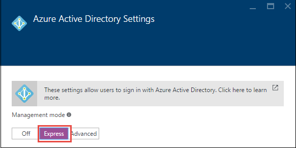
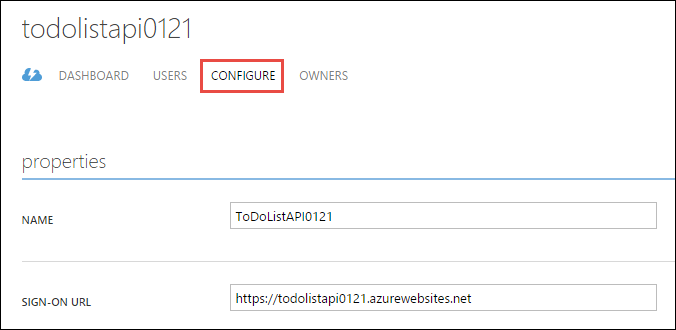
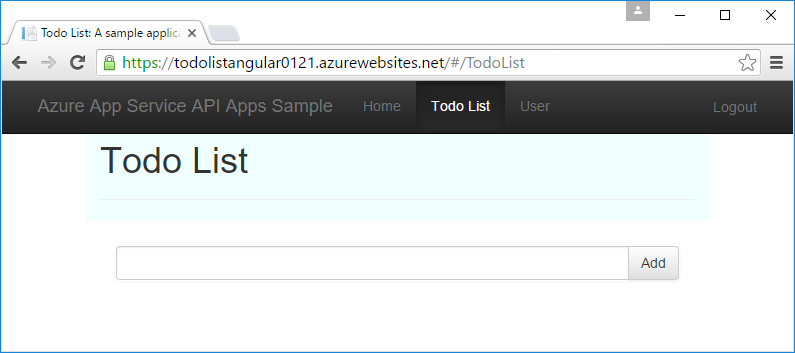
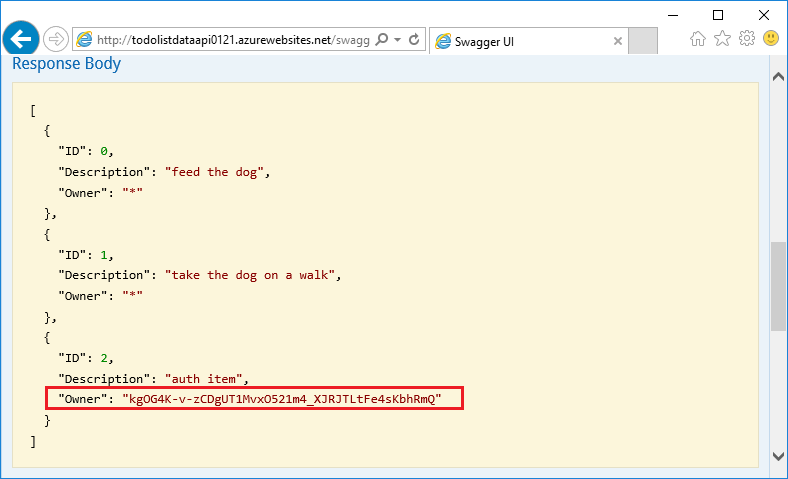

<properties
	pageTitle="Azure 应用服务中 API 应用的用户身份验证 | Azure"
	description="了解如何通过将访问权限只授予经过身份验证的用户，来保护 Azure 应用服务中的 API 应用。"
	services="app-service\api"
	documentationCenter=".net"
	authors="tdykstra"
	manager="wpickett"
	editor=""/>

<tags
	ms.service="app-service-api"
	ms.date="06/30/2016"
	wacn.date=""/>

# Azure 应用服务中 API 应用的用户身份验证

## 概述

本文说明如何保护 Azure API 应用，以便只有经过身份验证的用户可以调用它。本文假设读者已阅读 [Azure App Service authentication overview](/documentation/articles/app-service-authentication-overview/)（Azure 应用服务身份验证概述）。

学习内容：

* 如何使用 Azure Active Directory (Azure AD) 的详细信息配置身份验证提供程序。
* 如何借助[适用于 JavaScript 的 Active Directory 身份验证库 (ADAL)](https://github.com/AzureAD/azure-activedirectory-library-for-js) 使用受保护的 API 应用。

本文包含两个部分：

* [如何在 Azure 应用服务中配置用户身份验证](#authconfig)部分概括说明如何为 API 应用配置用户身份验证，这些内容同样适用于应用服务支持的所有框架，包括 .NET、Node.js 和 Java。

* 从[继续学习 .NET API 应用教程](#tutorialstart)部分开始，本文逐步说明如何使用 .NET 后端和 AngularJS 前端配置示例应用程序，使其使用 Azure Active Directory 进行用户身份验证。

## 如何在 Azure 应用服务中配置用户身份验证

本部分提供适用于任何 API 应用的一般说明。有关待办事项列表 .NET 示例应用程序的特定步骤，请转到[继续学习 .NET 入门教程](#tutorialstart)。

1. 在 [Azure 门户](https://portal.azure.cn/)中，导航到要保护的 API 应用的“设置”边栏选项卡，找到“功能”部分，然后单击“身份验证/授权”。

	

3. 在“身份验证/授权”边栏选项卡中，单击“打开”。

4. 在“请求未经身份验证时需执行的操作”下拉列表中选择一个选项。

	* 如果只想让经过身份验证的调用进入 API 应用，请选择一个“登录方式...”选项。使用此选项可以保护 API 应用，却无需编写任何在应用中运行的代码。

	* 如果要让所有调用进入 API 应用，请选择“允许请求(无操作)”。可以使用此选项将未经身份验证的调用方定向到所选的身份验证提供程序。若要使用此选项，必须编写代码来处理授权。

	有关详细信息，请参阅 [Authentication and authorization for API Apps in Azure App Service](/documentation/articles/app-service-api-authentication/#multiple-protection-options)（Azure 应用服务中 API 应用的身份验证和授权）。

5. 选择一个或多个**身份验证提供程序**。

	下图显示要求所有调用方必须经过 Azure AD 身份验证的选项。
 
	

	选择身份验证提供程序后，门户将显示该提供程序的配置边栏选项卡。

	有关如何配置身份验证提供程序配置边栏选项卡的详细说明，请参阅 [How to configure your App Service application to use Azure Active Directory login](/documentation/articles/app-service-mobile-how-to-configure-active-directory-authentication/)（如何将应用服务应用程序配置为使用 Azure Active Directory 登录）。（单击该链接会转到有关 Azure AD 的文章，但该文章本身包含指向其他身份验证提供程序文章的选项卡。）

7. 完成身份验证提供程序配置边栏选项卡中的操作后，单击“确定”。

7. 在“身份验证/授权”边栏选项卡中，单击“保存”。

完成此操作后，应用服务将在 API 调用进入 API 应用之前对其进行身份验证。对于应用服务支持的所有语言（包括 .NET、Node.js 和 Java），身份验证服务的工作原理都相同。

为了使 API 调用经过身份验证，调用方将在 HTTP 请求的 Authorization 标头中包含身份验证提供程序的 OAuth 2.0 持有者令牌。使用身份验证提供程序的 SDK 可以获取该令牌。

## 继续学习 .NET API 应用教程

如果要遵循适用于 API 应用的 Node.js 或 Java 教程，请跳到下一篇文章：[service principal authentication for API apps](/documentation/articles/app-service-api-dotnet-service-principal-auth/)（API 应用的服务主体身份验证）。

如果要遵循适用于 API 应用的 .NET 系列教程，并已根据[第一篇](/documentation/articles/app-service-api-dotnet-get-started/)和[第二篇](/documentation/articles/app-service-api-cors-consume-javascript/)教程中的说明部署示例应用程序，请跳到[在应用服务和 Azure AD 中设置身份验证](#azureauth)部分。

如果想要遵循本教程，但又不想完成第一篇和第二篇教程，请执行以下步骤，其中说明了如何开始使用自动化过程部署示例应用程序。

>[AZURE.NOTE] 执行以下步骤可以建立学习起点，就好像已完成前两篇教程一样，但只有一点例外：Visual Studio 不知道每个项目已部署到哪些 Web 应用或 API 应用。这意味着，无法在本教程中获得有关如何部署到正确目标的确切说明。如果不太了解自行部署的步骤，最好遵循系列教程中的[第一篇教程](/documentation/articles/app-service-api-dotnet-get-started/)，而不要从此自动化部署过程开始。

1. 确保满足[第一篇教程](/documentation/articles/app-service-api-dotnet-get-started/)中所列的所有先决条件。除了所列的先决条件以外，这些身份验证教程还假设读者在 Visual Studio 和 Azure 门户中用过应用服务 Web 应用和 API 应用。

2. 在[待办事项列表示例存储库自述文件](https://github.com/azure-samples/app-service-api-dotnet-todo-list/blob/master/readme.md)中单击“部署到 Azure”按钮，部署 API 应用和 Web 应用。记下创建的 Azure 资源组，因为稍后可以用它来查找 Web 应用和 API 应用名称。
 
3. 下载或克隆[待办事项示例存储库](https://github.com/Azure-Samples/app-service-api-dotnet-todo-list)，获取要在 Visual Studio 中本地使用的代码。

## 在应用服务和 Azure AD 中设置身份验证

现在，有一个应用程序在 Azure 应用服务中运行且不要求对用户进行身份验证。在本部分中，通过执行以下任务来添加身份验证：

* 配置应用服务，要求在调用中间层 API 应用时进行 Azure Active Directory (Azure AD) 身份验证。
* 创建 Azure AD 应用程序。
* 配置 Azure AD 应用程序，使其在登录后将持有者令牌发送到 AngularJS 前端。

如果遵循教程指导时遇到问题，请参阅教程末尾的[故障排除](#troubleshooting)部分。
 
### 为中间层 API 应用配置身份验证

1. 在 [Azure 门户](https://portal.azure.cn/)中，导航到要为 ToDoListAPI 项目创建的 API 应用的“设置”边栏选项卡，找到“功能”部分，然后单击“身份验证/授权”。

	

3. 在“身份验证/授权”边栏选项卡中，单击“打开”。

4. 在“请求未经身份验证时需执行的操作”下拉列表中，选择“使用 Azure Active Directory 登录”。

	此选项可确保未经身份验证的请求无法进入 API 应用。

5. 在“身份验证提供程序”下面，单击“Azure Active Directory”。

	

6. 在“Azure Active Directory 设置”边栏选项卡中单击“快速”。

	

	使用“快速”选项时，应用服务可以自动在 Azure AD [租户](https://msdn.microsoft.com/zh-cn/library/azure/jj573650.aspx#BKMK_WhatIsAnAzureADTenant)中创建 Azure AD 应用程序。

	无需创建租户，因为每个 Azure 帐户都自动拥有一个。

7. 在“管理模式”下，单击“创建新的 AD 应用”（如果尚未选择），并记下“创建应用”文本框中的值；稍后将在 Azure 经典管理门户中查找此 AAD 应用程序。

	

	Azure 将自动在 Azure AD 租户中创建使用指定名称的 Azure AD 应用程序。默认情况下，Azure AD 应用程序的名称与 API 应用相同。如果需要，也可以输入不同的名称。
 
7. 单击**“确定”**。

7. 在“身份验证/授权”边栏选项卡中，单击“保存”。

	

现在，只有 Azure AD 租户中的用户可以调用 API 应用。

### 可选：测试 API 应用

1. 在浏览器中，转到 API 应用的 URL：在 Azure 门户的“API 应用”边栏选项卡中，单击“URL”下面的链接。

	由于不允许未经身份验证的请求进入 API 应用，因此将重定向到登录屏幕。

	如果浏览器转到“已成功创建”页，则表示浏览器可能已登录 - 在这种情况下，请打开 InPrivate 或 Incognito 窗口并转到 API 应用的 URL。

2. 在 Azure AD 租户中使用用户凭据登录。

	登录后，浏览器中会显示“已成功创建”页。

9. 关闭浏览器。

### 配置 Azure AD 应用程序

配置 Azure AD 身份验证时，应用服务已创建 Azure AD 应用程序。默认情况下，新 Azure AD 应用程序配置为将持有者令牌提供给 API 应用的 URL。在本部分，将 Azure AD 应用程序配置为向 AngularJS 前端提供持有者令牌，而不是直接提供给中间层 API 应用。AngularJS 前端在调用 API 应用时，会将令牌发送到 API 应用。

>[AZURE.NOTE] 为了尽可能简化过程，本教程为前端和中间层 API 应用使用单个 Azure AD 应用程序。另一种做法是使用两个 Azure AD 应用程序。在此情况下，必须授予前端 Azure AD 应用程序调用中间层 Azure AD 应用程序的权限。使用这种多重应用程序方法可以更精细地控制每层的权限。

11. 在 [Azure 经典管理门户](https://manage.windowsazure.cn/)中，转到“Azure Active Directory”。

	必须使用经典管理门户，因为当前 Azure 门户尚未提供需要访问的特定 Azure Active Directory 设置。

12. 在“目录”选项卡中，单击 AAD 租户。

	

14. 单击“应用程序”>“我公司拥有的应用程序”，然后单击复选标记。

	可能还需要刷新页面才能看到新应用程序。

15. 在应用程序列表中，单击为 API 应用启用身份验证时 Azure 创建的应用名称。

	

16. 单击**“配置”**。

	

17. 将“登录 URL”设置为 AngularJS Web 应用的 URL，末尾不要添加斜杠。

	例如：https://todolistangular.chinacloudsites.cn

	

17. 将“回复 URL”设置为 Web 应用的 URL，末尾不要添加斜杠。

	例如：https://todolistsangular.chinacloudsites.cn

16. 单击“保存”。

	

15. 在页面底部单击“管理清单”>“下载清单”。

	

17. 将文件下载到可从中编辑文件的位置。

16. 在下载的清单文件中，搜索 `oauth2AllowImplicitFlow` 属性。将此属性的值从 `false` 更改为 `true`，然后保存文件。

	必须要有此设置才能从 JavaScript 单页应用程序访问。使用此设置可在 URL 片段中返回 Oauth 2.0 持有者令牌。

16. 单击“管理清单”>“上载清单”，然后上载在上一步骤中更新的文件。

	

17. 复制“客户端 ID”值，并将其保存到稍后可从中获取此值的某个位置。

## 将 ToDoListAngular 项目配置为使用身份验证

在本部分更改 AngularJS 前端，以便它使用适用于 JS 的 Active Directory 身份验证库(ADAL) 从 Azure AD 获取登录用户的持有者令牌。代码会将令牌包含在发送到中间层的 HTTP 请求中，如下图所示。

对 ToDoListAngular 项目中的文件进行以下更改。

1. 打开 *index.html* 文件。

2. 取消注释引用适用于 JS 的 Active Directory 身份验证库 (ADAL) 脚本的代码行。

		
		

1. 打开 *app/scripts/app.js* 文件。

2. 注释掉标记为“无需身份验证”的代码块，并取消注释标记为“需要身份验证”的代码块。

	此项更改将引用 ADAL JS 身份验证提供程序并为其提供配置值。在后续步骤中，将设置 API 应用和 Azure AD 应用程序的配置值。

8. 在设置 `endpoints` 变量的代码中，将 API URL 设置为针对 ToDoListAPI 项目创建的 API 应用的 URL，将 Azure AD 应用程序 ID 设置为从 Azure 经典管理门户复制的客户端 ID。

	现在，代码类似于以下示例。

		var endpoints = {
		    "https://todolistapi0121.chinacloudsites.cn/": "1cf55bc9-9ed8-4df31cf55bc9-9ed8-4df3"
		};

9. 在 `adalProvider.init` 的调用中，将 `tenant` 设置为租户名称，将 `clientId` 设置为上一步骤使用的相同值。

	现在，代码类似于以下示例。

		adalProvider.init(
		    {
		        instance: 'https://login.chinacloudapi.cn/', 
		        tenant: 'contoso.partner.onmschina.cn',
		        clientId: '1cf55bc9-9ed8-4df31cf55bc9-9ed8-4df3',
		        extraQueryParameter: 'nux=1',
		        endpoints: endpoints
		    },
		    $httpProvider
		    );

	对 `app.js` 所做的这些更改指定调用方代码和被调用 API 应位于同一个 Azure AD 应用程序中。

1. 打开 *app/scripts/homeCtrl.js* 文件。

2. 注释掉标记为“无需身份验证”的代码块，并取消注释标记为“需要身份验证”的代码块。

1. 打开 *app/scripts/indexCtrl.js* 文件。

2. 注释掉标记为“无需身份验证”的代码块，并取消注释标记为“需要身份验证”的代码块。

### 将 ToDoListAngular 项目部署到 Azure

8. 在“解决方案资源管理器”中，右键单击 ToDoListAngular 项目，然后单击“发布”。

9. 单击“发布”。

	Visual Studio 将部署项目并在浏览器中打开 Web 应用的基 URL。此时会显示 403 错误页，这是尝试从浏览器转到 Web API 基 URL 时的正常现象。

	还需要更改中间层 API 应用才能测试应用程序。

10. 关闭浏览器。

## 将 ToDoListAPI 项目配置为使用身份验证

目前，ToDoListAPI 项目将“*”作为 `owner` 值发送到 ToDoListDataAPI。本部分的步骤将更改用于发送登录用户 ID 的代码。

在 ToDoListAPI 项目中进行以下更改。

1. 打开 *Controllers/ToDoListController.cs* 文件，取消注释每个操作方法中用于将 `owner` 设置为 Azure AD `NameIdentifier` 声明值的代码行。例如：

		owner = ((ClaimsIdentity)User.Identity).FindFirst(ClaimTypes.NameIdentifier).Value;

	**重要说明**：不要取消注释 `ToDoListDataAPI` 方法中的代码；稍后要在服务主体身份验证教程中执行这些代码。

### 将 ToDoListAPI 项目部署到 Azure

8. 在“解决方案资源管理器”中，右键单击 ToDoListAPI 项目，然后单击“发布”。

9. 单击“发布”。

	Visual Studio 将部署项目并在浏览器中打开 API 应用的基 URL。

10. 关闭浏览器。

### 测试应用程序

9. **使用 HTTPS 而不是 HTTP** 转到 Web 应用的 URL。

8. 单击“待办事项列表”选项卡。

	系统会提示登录。

9. 使用 AAD 租户中用户的凭据登录。

10. 此时将显示“待办事项列表”页。

	

	暂时未显示任何待办事项，因为这些事项到目前为止全部属于所有者“*”。现在，中间层正在请求登录用户的项，但目前尚未创建任何项。

11. 添加新的待办事项，验证应用程序是否正常工作。

12. 在另一个浏览器窗口中，转到 ToDoListDataAPI API 应用的 Swagger UI URL，然后单击“ToDoList”>“Get”。输入星号代表 `owner` 参数，然后单击“试用”。

	响应显示新待办事项在 Owner 属性中拥有实际的 Azure AD 用户 ID。

	

## 从头开始生成项目

两个 Web API 项目是通过使用 **Azure API 应用**项目模板并将默认“值”控制器替换为 ToDoList 控制器创建的。

有关如何使用 Web API 2 后端创建 AngularJS 单页应用程序的信息，请参阅 [Hands On Lab: Build a Single Page Application (SPA) with ASP.NET Web API and Angular.js](http://www.asp.net/web-api/overview/getting-started-with-aspnet-web-api/build-a-single-page-application-spa-with-aspnet-web-api-and-angularjs)（动手实验：使用 ASP.NET Web API 和 Angular.js 构建单页应用程序 (SPA)）。有关如何添加 Azure AD 身份验证代码的信息，请参阅以下资源：

* [Securing AngularJS Single Page Apps with Azure AD](/documentation/articles/active-directory-devquickstarts-angular/)（使用 Azure AD 保护 AngularJS 单页应用程序）。
* [Introducing ADAL JS v1](http://www.cloudidentity.com/blog/2015/02/19/introducing-adal-js-v1/)（ADAL JS v1 简介）

## 故障排除

[AZURE.INCLUDE [故障排除](../../includes/app-service-api-auth-troubleshooting.md)]

* 请务必不要混淆 ToDoListAPI（中间层）和 ToDoListDataAPI（数据层）。例如，验证是否将身份验证添加到了中间层 API 应用而不是数据层。
* 确保 AngularJS 源代码引用了中间层 API 应用 URL（ToDoListAPI 而不是 ToDoListDataAPI）和正确的 Azure AD 客户端 ID。

## 后续步骤

本教程介绍了如何对 API 应用使用应用服务身份验证，以及如何使用 ADAL JS 库调用 API 应用。下一篇教程介绍如何[在服务到服务方案中保护对 API 应用的访问](/documentation/articles/app-service-api-dotnet-service-principal-auth/)。

<!---HONumber=Mooncake_0919_2016-->