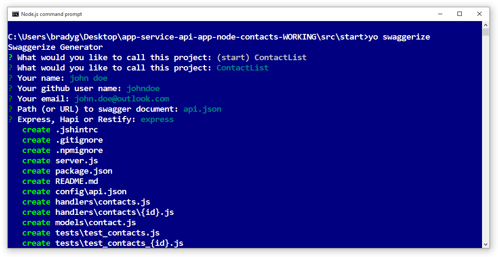
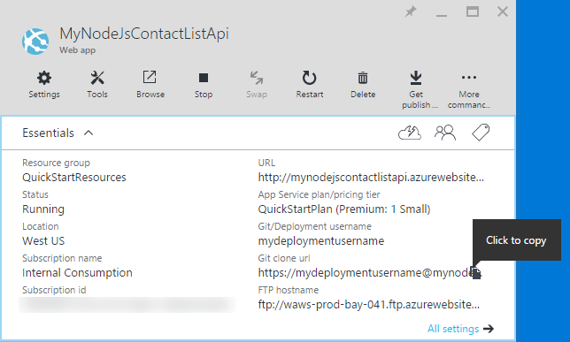
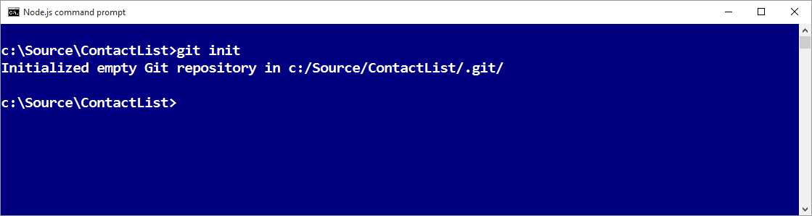

<properties
    pageTitle="Azure 应用服务中的 Node.js API 应用 | Azure"
    description="了解如何创建 Node.js RESTful API 并将其部署到 Azure 应用服务中的 API 应用。"
    services="app-service\api"
    documentationcenter="node"
    author="bradygaster"
    manager="wpickett"
    editor="" />
<tags
    ms.assetid="a820e400-06af-4852-8627-12b3db4a8e70"
    ms.service="app-service-api"
    ms.workload="web"
    ms.tgt_pltfrm="na"
    ms.devlang="node"
    ms.topic="get-started-article"
    ms.date="05/26/2016"
    wacn.date="03/24/2017"
    ms.author="rachelap" />

# 构建 Node.js RESTful API 并将它部署到 Azure 中的 API 应用
[AZURE.INCLUDE [app-service-api-get-started-selector](../../includes/app-service-api-get-started-selector.md)]

[AZURE.INCLUDE [azure-sdk-developer-differences](../../includes/azure-sdk-developer-differences.md)]

本教程说明如何创建一个简单的 [Node.js](http://nodejs.org) API，并使用 [Git](http://git-scm.com) 将其部署到 [Azure 应用服务](/documentation/articles/app-service-value-prop-what-is/)中的 [API 应用](/documentation/articles/app-service-api-apps-why-best-platform/)。可以使用任何能够运行 Node.js 的操作系统，使用 cmd.exe 或 bash 等命令行工具执行所有任务。

## 先决条件
1. Azure 帐户（[在此处建立试用帐户](/pricing/1rmb-trial/)）
2. 已安装 [Node.js](http://nodejs.org)（本示例假设使用 Node.js 4.2.2 版）
3. 已安装 [Git](https://git-scm.com/)
4. [GitHub](https://github.com/) 帐户

尽管应用服务支持多种将代码部署到 API 应用的方法，但本教程只演示 Git 方法，并假设读者具备使用 Git 的基础知识。有关其他部署方法的相关信息，请参阅 [Deploy your app to Azure App Service](/documentation/articles/web-sites-deploy/)（将应用部署到 Azure 应用服务）。

## 获取示例代码
1. 打开可以运行 Node.js 和 Git 命令的命令行接口。
2. 导航到可供本地 Git 存储库使用的文件夹，然后克隆[包含示例代码的 GitHub 存储库](https://github.com/Azure-Samples/app-service-api-node-contact-list)。
   
        git clone https://github.com/Azure-Samples/app-service-api-node-contact-list.git
   
    示例 API 提供两个终结点：针对 `/contacts` 的 Get 请求返回包含名称和电子邮件地址的 JSON 格式列表，`/contacts/{id}` 只返回所选的联系人。

## 根据 Swagger 元数据创建（自动生成）Node.js 代码基架
[Swagger](http://swagger.io/) 是描述 RESTful API 的元数据的文件格式。Azure 应用服务提供 [Swagger 元数据的内置支持](/documentation/articles/app-service-api-metadata/)。本教程部分为 API 开发工作流建模，将在其中先创建 Swagger 元数据，然后以此创建（自动生成）API 服务器代码基架。

> [AZURE.NOTE]
如果不想要了解如何从 Swagger 元数据文件创建 Node.js 代码基架，可以跳过本部分。如果只想将示例代码部署到新 API 应用，请直接转到[在 Azure 中创建 API 应用](#createapiapp)部分。
> 
> 

### 安装并执行 Swaggerize
1. 执行以下命令，全局安装 **yo** 和 **generator-swaggerize** NPM 模块。
   
        npm install -g yo
        npm install -g generator-swaggerize
   
    Swaggerize 是一款工具，可生成 Swagger 元数据文件描述的 API 服务器代码。要使用的 Swagger 文件名为 *api.json*，它位于克隆的存储库的 *start* 文件夹中。
2. 导航到 *start* 文件夹，然后执行 `yo swaggerize` 命令。Swaggerize 将询问一系列问题。请在“what to call this project”（此项目叫什么）中输入“ContactList”，在“path to swagger document”（swagger 文档的路径）中输入“api.json”，在“Express, Hapi, or Restify”（Express、Hapi 或 Restify）中输入“express”。
   
        yo swaggerize
   
      
   
    **注意**：如果在此步骤中遇到错误，下一步骤将解释如何进行修复。
   
    Swaggerize 将创建应用程序文件夹、创建处理程序和配置文件的基架，并生成 **package.json** 文件。快速视图引擎用于生成 Swagger 帮助页。
3. 如果 `swaggerize` 命令失败并出现“意外的令牌”或“无效的转义序列”错误，请通过编辑所生成的 *package.json* 文件来解决错误原因。在 `scripts` 下面的 `regenerate` 行中，将 *api.json* 前面的反斜杠更改为正斜杠，使该行如以下示例所示：
   
         "regenerate": "yo swaggerize --only=handlers,models,tests --framework express --apiPath config/api.json"
4. 导航到包含基架代码的文件夹（在本例中为 */start/ContactList* 子文件夹）。
5. 运行 `npm install`。
   
        npm install
6. 安装 **jsonpath** NPM 模块。
   
        npm install --save jsonpath
   
    
7. 安装 **swaggerize-ui** NPM 模块。
   
        npm install --save swaggerize-ui
   
    

### 自定义基架代码
1. 将 **lib** 文件夹从 **start** 文件夹复制到基架创建的 **ContactList** 文件夹中。
2. 将 **handlers/contacts.js** 文件中的代码替换为以下代码。
   
    此代码使用 **lib/contactRepository.js** 提供的 **lib/contacts.json** 文件中存储的 JSON 数据。新 contacts.js 代码将响应 HTTP 请求，获取所有联系人并将其以 JSON 有效负载的形式返回。
   
        'use strict';
   
        var repository = require('../lib/contactRepository');
   
        module.exports = {
            get: function contacts_get(req, res) {
                res.json(repository.all())
            }
        };
3. 将 **handlers/contacts/{id}.js** 文件中的代码替换为以下代码。
   
        'use strict';
   
        var repository = require('../../lib/contactRepository');
   
        module.exports = {
            get: function contacts_get(req, res) {
                res.json(repository.get(req.params['id']));
            }    
        };
4. 将 **server.js** 中的代码替换为以下代码。
   
    对 server.js 文件进行的更改都带有注释，方便查看所做的更改。
   
        'use strict';
   
        var port = process.env.PORT || 8000; // first change
   
        var http = require('http');
        var express = require('express');
        var bodyParser = require('body-parser');
        var swaggerize = require('swaggerize-express');
        var swaggerUi = require('swaggerize-ui'); // second change
        var path = require('path');
   
        var app = express();
   
        var server = http.createServer(app);
   
        app.use(bodyParser.json());
   
        app.use(swaggerize({
            api: path.resolve('./config/swagger.json'), // third change
            handlers: path.resolve('./handlers'),
            docspath: '/swagger' // fourth change
        }));
   
        // change four
        app.use('/docs', swaggerUi({
          docs: '/swagger'  
        }));
   
        server.listen(port, function () { // fifth and final change
        });

### 使用本地运行的 API 测试
1. 使用 Node.js 命令行可执行文件激活服务器。
   
        node server.js
2. 浏览到 **http://localhost:8000/contacts** 时，可以看到联系人列表的 JSON 输出（或者系统会提示下载，具体取决于所用的浏览器）。
   
    
3. 浏览到 **http://localhost:8000/contacts/2** 时，可以看到该 ID 值表示的联系人。
   
    
4. Swagger JSON 数据通过 **/swagger** 终结点提供：
   
    
5. Swagger UI 通过 **/docs** 终结点提供。在 Swagger UI 中，可以使用丰富的 HTML 客户端功能测试 API。
   
    

## 创建新的 API 应用
本部分介绍如何使用 Azure 门户在 Azure 中创建新的 API 应用。此 API 应用代表 Azure 提供的、用于运行代码的计算资源。后续部分会将代码部署到新 API 应用。

1. 浏览到 [Azure 门户](https://portal.azure.cn/)。
2. 单击“新建”>“Web + 移动”>“API 应用”。
   
    
3. 输入在 *chinacloudsites.cn* 域中唯一的**应用名称**，例如，在 NodejsAPIApp 后面加上一个编号即可使其保持唯一。
   
    例如，如果名称为 `NodejsAPIApp`，则 URL 为 `nodejsapiapp.chinacloudsites.cn`。
   
    如果输入的名称已被使用，右侧会出现红色感叹号。
4. 在“资源组”下拉列表中单击“新建”，然后在“新建资源组名称”中输入“NodejsAPIAppGroup”或其他喜好的名称。
   
    [资源组](/documentation/articles/resource-group-overview/)是 Azure 资源的集合，例如 API 应用、数据库和 VM。在本教程中，最好创建新的资源组，因为这样可以通过一个步骤轻松删除针对本教程创建的所有 Azure 资源。
5. 单击“应用服务计划/位置”，然后单击“新建”。
   
    
   
    在以下步骤中，你将为新资源组创建 App Service 计划。应用服务计划指定 API 应用运行所在的计算资源。例如，如果你选择免费层，则 API 应用程序将在共享 VM 上运行；如果你选择某些付费层，则它在专用 VM 上运行。有关应用服务计划的信息，请参阅 [App Service plans overview](/documentation/articles/azure-web-sites-web-hosting-plans-in-depth-overview/)（应用服务计划概述）。
6. 在“应用服务计划”边栏选项卡中输入“NodejsAPIAppPlan”或其他喜好的名称。
7. 在“位置”下拉列表中，选择最靠近的位置。
   
    此设置指定你的应用将在哪个 Azure 数据中心运行。就本教程来说，你可以选择任何区域，不会有明显差异。但是，对于生产应用，则需让服务器尽可能靠近访问该应用的客户端，以最大程度地减少[延迟](http://www.bing.com/search?q=web%20latency%20introduction&qs=n&form=QBRE&pq=web%20latency%20introduction&sc=1-24&sp=-1&sk=&cvid=eefff99dfc864d25a75a83740f1e0090)。
8. 单击“定价层”>“全部查看”>“F1 免费”。
   
    对于本教程，免费定价层即可提供足够的性能。
   
    
9. 在“应用服务计划”边栏选项卡中，单击“确定”。
10. 在“API 应用”边栏选项卡中，单击“创建”。

## 为 Git 部署设置新的 API 应用
通过将提交内容推送到 Azure 应用服务中的 Git 存储库，将代码部署到 API 应用。在本教程部分，将在 Azure 中创建用于部署的凭据与 Git 存储库。

1. 登录到 [Azure 经典管理门户](https://manage.windowsazure.cn/)，找到你的应用，然后单击“速览”下的“仪表板”>“重置部署凭据”，为应用设置部署凭据。
1. 单击“从源代码管理设置部署”，选择“本地 Git 存储库”，然后单击“确定”以设置 Git 存储库。
1. 返回到 [Azure 门户](https://portal.azure.cn)。复制 Git 存储库 URL。为此，请导航到新 API 应用的边栏选项卡并查看边栏选项卡的“概要”部分。请注意“概要”部分中的“Git 克隆 URL”。将鼠标悬停在此 URL 上时，右侧会显示一个图标用于将此 URL 复制到剪贴板。单击此图标复制该 URL。
   
    
   
    **注意**：下一部分需要用到 Git 克隆 URL，因此，请务必暂时将它保存在某个位置。

现在，API 应用已有一个用于备份的 Git 存储库，接下来可以将代码推送到该存储库，以便将代码部署到 API 应用。

## 将 API 代码部署到 Azure
在本部分，将创建包含 API 服务器代码的本地 Git 存储库，然后从该存储库将代码推送到前面在 Azure 中创建的存储库。

1. 将 `ContactList` 文件夹复制到可用于新本地 Git 存储库的位置。如果已完成本教程的第一部分，请从 `start` 文件夹复制 `ContactList`；否则请从 `end` 文件夹复制 `ContactList`。
2. 在命令行工具中导航到新文件夹，然后执行以下命令创建新的本地 Git 存储库。
   
        git init
   
       

3. 如果已完成本教程的第一部分并复制了 `ContactList` 文件夹，副本可能已包含 `node_modules` 文件夹。不需要在源代码管理中包含 `node_modules` 文件夹，因为在部署过程中，系统会通过 `package.json` 文件和 `npm install` 创建该文件夹。因此，请运行以下命令，在项目的根目录中添加 `.gitignore` 文件。

         touch .gitignore
      
    打开 .gitignore 文件，并将 `node_modules` 添加到该文件的第一行。如果运行 `git status` 后列表中未出现该目录，则可以确认源代码管理忽略了 `node_modules` 文件夹。如果想要添加更多规则，可以使用一个 (GitHub 项目)[https://github.com/github/gitignore/blob/master/Node.gitignore] 在 NodeJS 项目中忽略建议的文件。
 
4. 执行以下命令添加 API 应用存储库的 Git 远程设置。
   
        git remote add azure YOUR_GIT_CLONE_URL_HERE
   
    **注意**：请将“YOUR\_GIT\_CLONE\_URL\_HERE”字符串替换为前面复制的 Git 克隆 URL。
5. 执行以下命令创建包含所有代码的提交内容。
   
        git add .
        git commit -m "initial revision"
   
    
6. 运行以下命令将代码推送到 Azure。当系统提示输入密码时，请输入前面在 Azure 门户中创建的密码。
   
        git push azure master
   
    这会触发 API 应用的部署。
7. 在浏览器中，转到“[Azure 经典管理门户](https://manage.windowsazure.cn)”，然后导航到应用的“部署”页。可看到部署正在进行.
   
    同时，命令行接口将显示当前的部署状态。
   
      

   
    完成部署后，“部署”页会显示已在 API 应用中成功部署代码更改。

## 使用 Azure 中运行的 API 测试
1. 复制“API 应用”边栏选项卡的“概要”部分中的“URL”。
   
    
2. 使用 Postman 或 Fiddler 等 REST API 客户端（或 Web 浏览器）提供联系人API 调用的 URL，即 API 应用的 `/contacts` 终结点。该 URL 为 `https://{your API app name}.chinacloudsites.cn/contacts`
   
    对此终结点发出 GET 请求时，可获取 API 应用的 JSON 输出。
   
    
3. 在浏览器中转到 `/docs` 终结点，尝试在 Azure 中运行 Swagger UI。

现已构造好连续传递，接下来可以进行代码更改，然后通过将提交内容推送到 Azure Git 存储库来部署更改。

## 后续步骤
现已成功创建 API 应用并在其中部署 Node.js API 代码。下一篇教程介绍如何[借助 CORS 从 JavaScript 客户端使用 API 应用](/documentation/articles/app-service-api-cors-consume-javascript/)。

<!---HONumber=Mooncake_0320_2017-->
<!--Update_Description: update steps for resetting git credential, and adding .gitignore configuration-->