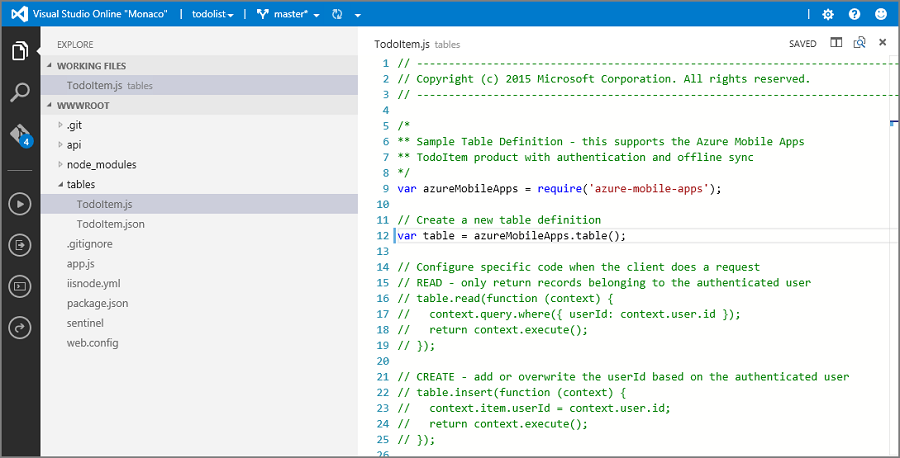

<properties
	pageTitle="如何使用适用于移动应用的 Node.js 后端服务器 SDK | Azure 应用服务"
	description="了解如何使用适用于 Azure 应用服务移动应用的 Node.js 后端服务器 SDK。"
	services="app-service\mobile"
	documentationCenter=""
	authors="adrianhall"
	manager="erikre"
	editor=""/>

<tags
	ms.service="app-service-mobile"
	ms.date="08/02/2016"
	wacn.date="09/26/2016"/>

# 如何使用 Azure 移动应用 Node.js SDK

[AZURE.INCLUDE [app-service-mobile-selector-server-sdk](../../includes/app-service-mobile-selector-server-sdk.md)]

本文提供详细的信息和示例，说明如何在 Azure 应用服务移动应用中使用 Node.js 后端。

## 介绍

使用 Azure 应用服务移动应用可将移动优化的数据访问 Web API 添加到 Web 应用程序。提供的 Azure 应用服务移动应用 SDK 适用于 ASP.NET 和 Node.js Web 应用程序。此 SDK 提供以下操作：

- 数据访问的表操作（读取、插入、更新、删除）
- 自定义 API 操作

这两种操作都可用于 Azure 应用服务所允许的所有标识提供者（包括 Microsoft 以及用于企业标识的 Azure Active Directory）之间的身份验证。

可以[在 GitHub 上的示例目录]中找到每种用例的示例。

### 如何使用命令行创建基本 Node.js 后端

每个 Azure 应用服务移动应用 Node.js 后端都以 ExpressJS 应用程序的形式启动。在适用于 Node.js 的 Web 服务框架中，ExpressJS 最广为使用。可按以下方式创建基本的 [Express] 应用程序：

1. 在命令窗口或 PowerShell 窗口中，为项目创建新目录。

        mkdir basicapp

2. 运行 npm init 初始化包结构。

        cd basicapp
        npm init

    Npm init 命令将提出一系列问题以初始化项目。查看以下示例输出

    ![npm init 输出][0]

3. 从 npm 存储库安装 express 和 azure-mobile-apps 库。

        npm install --save express azure-mobile-apps

4. 创建 app.js 文件，实现基本移动服务器。

		var express = require('express'),
			azureMobileApps = require('azure-mobile-apps');

		var app = express(),
			mobile = azureMobileApps();

		// Define a TodoItem table
		mobile.tables.add('TodoItem');

		// Add the mobile API so it is accessible as a Web API
		app.use(mobile);

		// Start listening on HTTP
		app.listen(process.env.PORT || 3000);

此应用程序创建简单且具有单个终结点 (`/tables/TodoItem`) 的移动优化 WebAPI，让用户使用动态架构访问基础 SQL 数据存储，而无需经过身份验证。它适用于以下客户端库快速入门：

- [Android 客户端快速入门]
- [Apache Cordova 客户端快速入门]
- [iOS 客户端快速入门]
- [Windows 应用商店客户端快速入门]
- [Xamarin.iOS 客户端快速入门]
- [Xamarin.Android 客户端快速入门]
- [Xamarin.Forms 客户端快速入门]

可以在 [GitHub 上的 basicapp 示例]中找到此基本应用程序的代码。

### 如何使用 Visual Studio 2015 创建 Node 后端

Visual Studio 2015 需要使用一个扩展在 IDE 中开发 Node.js 应用程序。首先，请下载并安装[用于 Visual Studio 的 Node.js 工具 1.1]。安装用于 Visual Studio 的 Node.js 工具后，请创建 Express 4.x 应用程序：

1. 打开“新建项目”对话框（从“文件”>“添加”>“项目...”）。

2. 展开“模板”>“JavaScript”>“Node.js”。

3. 选择“基本 Azure Node.js Express 4 应用程序”。

4. 填写项目名称。单击“确定”。

	![Visual Studio 2015 中的“新建项目”][1]

5. 右键单击“npm”节点，然后选择“安装新的 npm 包...”。

6. 创建第一个 Node.js 应用程序时，可能需要刷新 npm 目录。如果需要，系统会出现提示 - 请单击“刷新”。

7. 在搜索框中输入 _azure-mobile-apps_。单击“azure-mobile-apps 2.0.0”包，然后单击“安装包”。

	![安装新的 npm 包][2]

8. 单击“关闭”。

9. 打开 _app.js_ 文件，添加对 Azure 移动应用 SDK 的支持。在库 require 语句底部的第 6 行，添加以下代码：

        var bodyParser = require('body-parser');
        var azureMobileApps = require('azure-mobile-apps');

    在其他 app.use 语句之后大约第 27 行，添加以下代码：

        app.use('/users', users);

        // Azure Mobile Apps Initialization
        var mobile = azureMobileApps();
        mobile.tables.add('TodoItem');
        app.use(mobile);

    保存文件。

10. 在本地运行应用程序（API 将在 http://localhost:3000 上提供），或发布到 Azure。

### 如何使用 Azure 门户创建 Node.js 后端

可以在 [Azure 门户预览]中直接创建新的移动应用后端。

可以遵循以下步骤或者根据 [Create a mobile app](/documentation/articles/app-service-mobile-ios-get-started/)（创建移动应用）教程，同时创建新的客户端和服务器。本教程包含以下说明的简化版本，最适合用于概念认证项目。

[AZURE.INCLUDE [app-service-mobile-dotnet-backend-create-new-service-classic](../../includes/app-service-mobile-dotnet-backend-create-new-service-classic.md)]

返回“开始使用”边栏选项卡，在“创建表 API”下面，选择“Node.js”作为“后端语言”。选中“我已了解此操作会覆盖所有站点内容”框，然后单击“创建 TodoItem 表”。

### 如何：使用 Git 下载 Node.js 后端快速入门代码项目

使用门户的“快速启动”边栏选项卡创建新的 Node.js 移动应用后端时，系统将创建新的 Node.js 项目并将其部署到站点。可以在门户中添加表和 API，以及编辑 Node.js 后端的代码文件。还可以使用多种部署工具的一种来下载后端项目，以便添加或修改表和 API，然后重新发布项目。有关详细信息，请参阅 [Azure App Service Deployment Guide]（Azure 应用服务部署指南）。以下过程使用 Git 存储库下载快速入门项目代码。

1. 安装 Git（如果尚未安装）。安装 Git 所需的步骤因操作系统的不同而异。有关操作系统特定的分发和安装指南，请参阅[安装 Git](http://git-scm.com/book/zh/v2/%E8%B5%B7%E6%AD%A5-%E5%AE%89%E8%A3%85-Git)。

2. 根据 [Enable the App Service app repository](/documentation/articles/web-sites-deploy-local-git/#Step3)（启用应用服务应用存储库）中的步骤为后端站点启用 Git 存储库，并记下部署用户名和密码。

3. 在移动应用后端的边栏选项卡中，记下“Git 克隆 URL”设置。

4.  在识别 Git 的命令行工具中使用 Git 克隆 URL 执行 `git clone` 命令，并根据需要输入密码，如以下示例所示：

		$ git clone https://username@todolist.scm.chinacloudsites.cn:443/todolist.git

5. 浏览到本地目录（在上述示例中为 /todolist），可以看到项目文件已下载。/tables 子文件夹中有一个 todoitem.json 文件（定义对表的权限）和一个 todoitem.js 文件（定义表的 CRUD 操作脚本）。

6. 更改项目文件之后，请执行以下命令添加、提交更改，然后将更改上载到站点：

		$ git commit -m "updated the table script"
		$ git push origin master

	将新文件添加到项目时，必须先执行 `git add .` 命令。

每次将一组新的提交内容推送到站点时，将重新发布站点。

### 如何将 Node.js 后端发布到 Azure

Azure 提供了许多将 Azure 应用服务移动应用 Node.js 后端发布到 Azure 服务的机制。其中包括利用集成到 Visual Studio 的部署工具、命令行工具，以及基于源代码管理的连续部署选项。有关此主题的详细信息，请参阅 [Azure App Service Deployment Guide]（Azure 应用服务部署指南）。

Azure 应用服务提供有关 Node.js 应用程序的具体建议，请在部署之前查看：

- 如何[指定 Node 版本]
- 如何[使用 Node 模块]

### 如何启用应用程序的主页

许多应用程序是 Web 和移动应用的组合，ExpressJS 框架允许组合两个方面。但有时，我们可能只想要实现移动接口。移动接口用于提供登录页，确保应用服务已启动并在运行。可以提供自己的主页，或启用临时主页。若要启用临时主页，请对移动应用构造函数做出以下调整：

    var mobile = azureMobileApps({ homePage: true });

如果想要让此选项仅在本地开发时可供使用，可以将此设置添加到 `azureMobile.js` 文件。

## 表操作 

azure-mobile-apps Node.js Server SDK 提供将存储在 Azure SQL 数据库中的表公开为 WebAPI 的机制。提供的操作有五种。

| 操作 | 说明 |
| --------- | ----------- |
| GET /tables/_tablename_ | 获取表中的所有记录 |
| GET /tables/_tablename_/:id | 获取表中的特定记录 |
| POST /tables/_tablename_ | 在表中创建新记录 |
| PATCH /tables/_tablename_/:id | 更新表中的现有记录 |
| DELETE /tables/_tablename_/:id | 删除表中的记录 |

此 WebAPI 支持 [OData]，并扩展表架构以支持[脱机数据同步]。

### 如何使用动态架构定义表

表必须先经过定义才能使用。表可用静态架构来定义（开发人员在架构中定义列），或以动态方式定义（SDK 根据传入的请求控制架构）。此外，开发人员可将 Javascript 代码添加到定义，控制 WebAPI 的特定层面。

根据最佳实践，应在表目录中的 Javascript 文件内定义每个表，然后使用 tables.import() 方法导入表。扩展基本应用后，调整 app.js 文件：

    var express = require('express'),
        azureMobileApps = require('azure-mobile-apps');

    var app = express(),
	    mobile = azureMobileApps();

    // Define the database schema that is exposed
    mobile.tables.import('./tables');

    // Provide initialization of any tables that are statically defined
    mobile.tables.initialize().then(function () {
        // Add the mobile API so it is accessible as a Web API
        app.use(mobile);

        // Start listening on HTTP
        app.listen(process.env.PORT || 3000);
    });

在 ./tables/TodoItem.js 中定义表：

    var azureMobileApps = require('azure-mobile-apps');

    var table = azureMobileApps.table();

    // Additional configuration for the table goes here

    module.exports = table;

表默认使用动态架构。若要全局关闭动态架构，请在 Azure 门户中将应用设置 **MS\_DynamicSchema** 设置为 false。

可以在 [GitHub 上的待办事项示例]中找到完整示例。

### 如何使用静态架构定义表

可以将列显式定义为通过 WebAPI 公开。azure-mobile-apps Node.js SDK 自动将脱机数据同步所需的任何其他列添加到所提供的列表。例如，快速入门客户端应用程序需要包含两个列的表：text（字符串）和 complete（布尔值）。这可以在表定义 JavaScript 文件中（位于表目录中）定义，如下所示：

    var azureMobileApps = require('azure-mobile-apps');

    var table = azureMobileApps.table();

    // Define the columns within the table
    table.columns = {
        "text": "string",
        "complete": "boolean"
    };

    // Turn off dynamic schema
    table.dynamicSchema = false;

    module.exports = table;

如果以静态方式定义表，则还必须调用 tables.initialize() 方法，在启动时创建数据库架构。tables.initialize() 方法返回 [Promise] - 用于确保 Web 服务不会在数据库初始化之前处理请求。

### 如何使用 SQL Express 作为本地计算机上的开发数据存储

Azure 移动应用：Azure 移动应用 Node SDK 提供三种现成可用的数据提供选项：

- 使用**内存**驱动程序提供非持久性示例存储
- 使用 **mssql** 驱动程序提供可供开发使用的 SQL Express 数据存储
- 使用 **mssql** 驱动程序提供可供生产使用的 Azure SQL 数据库数据存储

Azure 移动应用 Node.js SDK 利用 [mssql Node.js 包]来建立和使用 SQL Express 与 SQL 数据库的连接。若要使用此包，需要在 SQL Express 实例上启用 TCP 连接。

> [AZURE.TIP] 内存驱动程序不提供完整的测试工具集。若要在本地测试后端，建议使用 SQL Express 数据存储和 mssql 驱动程序。

1. 下载并安装 [Microsoft SQL Server 2014 Express]。请务必安装 SQL Server 2014 Express with Tools 版。除非确实需要 64 位支持，否则请使用 32 位版本，因为它在运行时消耗的内存更少。

2. 运行 SQL Server 2014 配置管理器。

  1. 在左侧的树菜单中，展开“SQL Server 网络配置”节点。
  2. 单击“SQLEXPRESS 的协议”。
  3. 右键单击“TCP/IP”，然后选择“启用”。在弹出对话框中单击“确定”。
  4. 右键单击“TCP/IP”，然后选择“属性”。
  5. 单击“IP 地址”选项卡。
  6. 找到“IPAll”节点。在“TCP 端口”字段中输入 **1433**。

	 	 ![Configure SQL Express for TCP/IP][3]
  7. 单击“确定”。在弹出对话框中单击“确定”。
  8. 在左侧的树菜单中，单击“SQL Server 服务”。
  9. 右键单击“SQL Server (SQLEXPRESS)”，然后选择“重新启动”
  10. 关闭 SQL Server 2014 配置管理器。

3. 运行 SQL Server 2014 Management Studio 并连接到本地 SQL Express 实例

  1. 在对象资源管理器中右键单击实例，然后选择“属性”
  2. 选择“安全性”页。
  3. 确保已选择“SQL Server 和 Windows 身份验证模式”
  4. 单击“确定”

  		![Configure SQL Express Authentication][4]

  5. 在对象资源管理器中展开“安全性”>“登录”。
  6. 右键单击“登录”，然后选择“新建登录名...”。
  7. 输入登录名。选择“SQL Server 身份验证”。输入密码，然后在“确认密码”中输入相同的密码。请注意，密码必须符合 Windows 复杂性要求。
  8. 单击“确定”

  		![Add a new user to SQL Express][5]

  9. 右键单击新登录名并选择“属性”
  10. 选择“服务器角色”页
  11. 选中 **dbcreator** 服务器角色旁边的框
  12. 单击“确定”
  13. 关闭 SQL Server 2015 Management Studio

请务必记下选择的用户名和密码。可能需要根据特定的数据库要求分配其他服务器角色或权限。

Node.js 应用程序将读取 **SQLCONNSTR\_MS\_TableConnectionString** 环境变量，以读取此数据库的连接字符串。可以在环境中设置此变量。例如，可以使用 PowerShell 设置此环境变量：

    $env:SQLCONNSTR_MS_TableConnectionString = "Server=127.0.0.1; Database=mytestdatabase; User Id=azuremobile; Password=T3stPa55word;"

请注意，必须通过 TCP/IP 连接访问数据库，并提供连接的用户名和密码。

### 如何配置项目以进行本地开发

Azure 移动应用从本地文件系统读取名为 _azureMobile.js_ 的 JavaScript 文件。不应使用此文件在生产环境中配置 Azure 移动应用 SDK，请改用 [Azure 门户预览]中的“应用设置”。_azureMobile.js_ 文件应导出配置对象。最常见的设置如下：

- 数据库设置
- 诊断日志记录设置
- 备用 CORS 设置

下面是实现上述数据库设置的 _azureMobile.js_ 文件示例：

    module.exports = {
        cors: {
            origins: [ 'localhost' ]
        },
        data: {
            provider: 'mssql',
            server: '127.0.0.1',
            database: 'mytestdatabase',
            user: 'azuremobile',
            password: 'T3stPa55word'
        },
        logging: {
            level: 'verbose'
        }
    };

建议将 _azureMobile.js_ 添加到 _.gitignore_ 文件（或其他源代码管理 ignore 文件），防止将密码存储在云中。请始终在 [Azure 门户预览]中的“应用设置”内配置生产设置。

### 如何配置移动应用的应用设置

_azureMobile.js_ 文件中的大多数设置在 [Azure 门户预览]中都有对等的应用设置。请使用以下列表在“应用设置”中配置应用：

| 应用设置 | _azureMobile.js_ 设置 | 说明 | 有效值 |
| :-------------------------- | :------------------------ | :---------------------------------------- | :------------------------------------------ |
| **MS\_MobileAppName** | 名称 | 应用的名称 | 字符串 |
| **MS\_MobileLoggingLevel** | logging.level | 要记录的消息的最小日志级别 | error、warning、info、verbose、debug、silly |
| **MS\_DebugMode** | debug | 启用或禁用调试模式 | true、false |
| **MS\_TableSchema** | data.schema | SQL 表的默认架构名称 | 字符串（默认值：dbo） |
| **MS\_DynamicSchema** | data.dynamicSchema | 启用或禁用调试模式 | true、false |
| **MS\_DisableVersionHeader** | 版本（设置为 undefined）| 禁用 X-ZUMO-Server-Version 标头 | true、false |
| **MS\_SkipVersionCheck** | skipversioncheck | 禁用客户端 API 版本检查 | true、false |

若要指定某项应用设置，请执行以下操作：

1. 登录到 [Azure 门户预览]。
2. 选择“所有资源”或“应用服务”，然后单击移动应用的名称。
3. 默认情况下会打开“设置”边栏选项卡 - 如果没有打开，请单击“设置”。
4. 在“常规”菜单中单击“应用程序设置”。
5. 滚动到“应用设置”部分。
6. 如果该应用设置已存在，请单击其值进行编辑。
7. 如果该应用设置不存在，请在“键”框中输入“应用设置”，在“值”框中输入值。
8. 完成后，单击“保存”。

更改大多数应用设置后都需要重新启动服务。

### 如何使用 SQL 数据库作为生产数据存储

<!--- ALTERNATE INCLUDE - we can't use ../includes/app-service-mobile-dotnet-backend-create-new-service.md - slightly different semantics -->

无论使用哪种 Azure 应用服务应用程序类型，将 SQL 数据库用作数据存储的过程都是相同的。如果尚未这样做，请根据以下步骤创建新的移动应用后端。

1. 登录到 [Azure 门户预览]。

2. 在窗口左上方，单击“+新建”按钮 >“Web + 移动”>“移动应用”，然后为移动应用后端名称。

3. 在“资源组”框中，输入与应用相同的名称。

4. 系统将选择默认应用服务计划。如果想要更改应用服务计划，请单击“应用服务计划”>“+ 新建”。为新应用服务计划命名并选择适当的位置。单击“定价层”并选择适当的服务定价层。选择“全部查看”以查看其他定价选项，例如“免费”和“共享”。选择定价层后，单击“选择”按钮。返回“应用服务计划”边栏选项卡，然后单击“确定”。

5. 单击“创建”。此时会创建一个移动应用后端，稍后要在其中部署服务器项目。预配移动应用后端可能需要几分钟时间。预配移动应用后端后，门户将打开移动应用后端的“设置”边栏选项卡。

创建移动应用后端后，可以选择将现有的 SQL 数据库连接到移动应用后端，或创建新的 SQL 数据库。在本部分中，我们将创建新的 SQL 数据库。

> [AZURE.NOTE] 如果在与新移动应用后端相同的位置已有一个数据库，则可以选择“使用现有数据库”，然后选择该数据库。由于额外的带宽成本和更高的延迟，不建议使用位于不同位置的数据库。

6. 在新移动应用后端中，单击“设置”>“移动应用”>“数据”>“+添加”。

7. 在“添加数据连接”边栏选项卡中，单击“SQL 数据库 - 配置所需的设置”>“创建新数据库”。在“名称”字段中输入新数据库的名称。

8. 单击“服务器”。在“添加服务器”边栏选项卡中的“服务器名称”字段内输入唯一的服务器名称，然后提供合适的“服务器管理员登录名”和“密码”。务必选中“允许 Azure 服务访问服务器”。单击“确定”。

	![创建 Azure SQL 数据库][6]

9. 在“新建数据库”边栏选项卡中，单击“确定”。

10. 返回“添加数据连接”边栏选项卡，选择“连接字符串”，然后输入创建数据库时提供的登录名与密码。如果使用现有数据库，请提供该数据库的登录凭据。输入完成后，单击“确定”。

11. 再次返回“添加数据连接”边栏选项卡，单击“确定”创建数据库。

<!--- END OF ALTERNATE INCLUDE -->

创建数据库可能需要几分钟时间。在“通知”区域中监视部署进度。在数据库成功部署之前，请不要继续操作。成功部署后，将在移动后端的“应用设置”中创建 SQL 数据库实例的连接字符串。可以在“设置”>“应用程序设置”>“连接字符串”中查看此应用设置。

### 如何要求在访问表时进行身份验证

如果想要对表终结点使用应用服务身份验证，必须先在 [Azure 门户预览]中配置应用服务身份验证。有关在 Azure 应用服务中配置身份验证的详细信息，请参阅要使用的标识提供者所提供的配置指南：

- [How to configure Azure Active Directory Authentication]（如何配置 Azure Active Directory 身份验证）
- [How to configure Microsoft Authentication]（如何配置 Microsoft 身份验证）

每个表都有一个访问属性用于控制对表的访问。以下示例显示了以静态方式定义的、要求身份验证的表。

    var azureMobileApps = require('azure-mobile-apps');

    var table = azureMobileApps.table();

    // Define the columns within the table
    table.columns = {
        "text": "string",
        "complete": "boolean"
    };

    // Turn off dynamic schema
    table.dynamicSchema = false;

    // Require authentication to access the table
    table.access = 'authenticated';

    module.exports = table;

访问属性可接受三个值中的一个

  - *anonymous* 表示允许客户端应用程序未经身份验证即可读取数据
  - *authenticated* 表示客户端应用程序必须随请求发送有效的身份验证令牌
  - *disabled* 表示此表当前已禁用

如果未定义访问属性，则允许未经身份验证的访问。

### 如何对表使用身份验证声明

可以设置一些声明，在设置身份验证时将请求这些声明。这些声明通常无法通过 `context.user` 对象获取。但是，它们可以使用 `context.user.getIdentity()` 方法来检索。`getIdentity()` 方法返回可解析成某个对象的 Promise。该对象由身份验证方法（microsoftaccount 或 aad）进行键控。

例如，如果设置 Microsoft 帐户身份验证并请求电子邮件地址声明，可以使用以下代码将电子邮件地址添加到记录：

    var azureMobileApps = require('azure-mobile-apps');

    // Create a new table definition
    var table = azureMobileApps.table();

    table.columns = {
        "emailAddress": "string",
        "text": "string",
        "complete": "boolean"
    };
    table.dynamicSchema = false;
    table.access = 'authenticated';

    /**
    * Limit the context query to those records with the authenticated user email address
    * @param {Context} context the operation context
    * @returns {Promise} context execution Promise
    */
    function queryContextForEmail(context) {
        return context.user.getIdentity().then((data) => {
            context.query.where({ emailAddress: data.microsoftaccount.claims.emailaddress });
            return context.execute();
        });
    }

    /**
    * Adds the email address from the claims to the context item - used for
    * insert operations
    * @param {Context} context the operation context
    * @returns {Promise} context execution Promise
    */
    function addEmailToContext(context) {
        return context.user.getIdentity().then((data) => {
            context.item.emailAddress = data.microsoftaccount.claims.emailaddress;
            return context.execute();
        });
    }

    // Configure specific code when the client does a request
    // READ - only return records belonging to the authenticated user
    table.read(queryContextForEmail);

    // CREATE - add or overwrite the userId based on the authenticated user
    table.insert(addEmailToContext);

    // UPDATE - only allow updating of record belong to the authenticated user
    table.update(queryContextForEmail);

    // DELETE - only allow deletion of records belong to the authenticated uer
    table.delete(queryContextForEmail);

    module.exports = table;

若要查看哪些声明可用，请使用 Web 浏览器查看站点的 `/.auth/me` 终结点。

### 如何禁用对特定表操作的访问

除了出现在表上以外，访问属性还可用于控制单个操作。共有四项操作：

  - *read* 是对表运行的 RESTful GET 操作
  - *insert* 是对表运行的 RESTful POST 操作
  - *update* 是对表运行的 RESTful PATCH 操作
  - *delete* 是对表运行的 RESTful DELETE 操作

例如，可能想要提供未经身份验证的只读表。为此可以使用以下表定义：

    var azureMobileApps = require('azure-mobile-apps');

    var table = azureMobileApps.table();

    // Read-Only table - only allow READ operations
    table.read.access = 'anonymous';
    table.insert.access = 'disabled';
    table.update.access = 'disabled';
    table.delete.access = 'disabled';

    module.exports = table;

### 如何调整与表操作配合使用的查询

表操作的常见要求是提供受限制的数据视图。例如，可以提供标有已身份验证的用户 ID 的表，而只允许用户读取或更新其自己的记录。以下表定义将提供此功能：

    var azureMobileApps = require('azure-mobile-apps');

    var table = azureMobileApps.table();

    // Define a static schema for the table
    table.columns = {
        "userId": "string",
        "text": "string",
        "complete": "boolean"
    };
    table.dynamicSchema = false;

    // Require authentication for this table
    table.access = 'authenticated';

    // Ensure that only records for the authenticated user are retrieved
    table.read(function (context) {
		context.query.where({ userId: context.user.id });
		return context.execute();
	});

    // When adding records, add or overwrite the userId with the authenticated user
    table.insert(function (context) {
	    context.item.userId = context.user.id;
	    return context.execute();
    });

    module.exports = table;

正常执行查询的操作有可使用 Where 子句来调整的查询属性。查询属性是一种 [QueryJS] 对象，用于将 OData 查询转换成数据后端可以处理的某种形式。在简单的相等性比较方案中（如上例），可以使用映射。此外，添加特定的 SQL 子句相对简单：

    context.query.where('myfield eq ?', 'value');

### 如何在表中配置软删除

软删除并不实际删除记录。它将已删除的列设置为 true，将记录标记为已在数据库中删除。Azure 移动应用 SDK 自动从结果中删除已软删除的记录，除非 Mobile Client SDK 使用 IncludeDeleted()。若要为表配置软删除，请在表定义文件中设置 softDelete 属性。可能的示例如下：

    var azureMobileApps = require('azure-mobile-apps');

    var table = azureMobileApps.table();

    // Define the columns within the table
    table.columns = {
        "text": "string",
		"complete": "boolean"
	};

	// Turn off dynamic schema
	table.dynamicSchema = false;

	// Turn on Soft Delete
	table.softDelete = true;

	// Require authentication to access the table
	table.access = 'authenticated';

	module.exports = table;

需要建立记录清除机制 - 从客户端应用程序、通过 Web 作业或通过自定义机制。

### 如何在数据库中植入数据

在创建新应用程序时，可能需要在表中植入数据。这可以在表定义 JavaScript 文件中实现，如下所示：

	var azureMobileApps = require('azure-mobile-apps');

	var table = azureMobileApps.table();

	// Define the columns within the table
	table.columns = {
		"text": "string",
		"complete": "boolean"
	};
	table.seed = [
		{ text: 'Example 1', complete: false },
		{ text: 'Example 2', complete: true }
	];

	// Turn off dynamic schema
	table.dynamicSchema = false;

	// Require authentication to access the table
	table.access = 'authenticated';

	module.exports = table;

请务必注意，仅当表是由 Azure 移动应用 SDK 所创建时，才能植入数据。如果表已在数据库中，则不会在表中插入任何数据。如果打开了动态架构，将从植入的数据推断架构。

建议显式调用 initialize() 方法，在服务开始运行时创建表。

### 如何启用 Swagger 支持

Azure 应用服务移动应用随附内置的 [Swagger] 支持。若要启用 Swagger 支持，请先安装 swagger-ui 作为依赖项：

    npm install --save swagger-ui

安装后，可以在 Azure 移动应用构造函数中启用 Swagger 支持：

    var mobile = azureMobileApps({ swagger: true });

可能只想要在开发版本中启用 Swagger 支持。为此，可以利用 `NODE_ENV` 应用设置：

    var mobile = azureMobileApps({ swagger: process.env.NODE_ENV !== 'production' });

Swagger 终结点将位于 http://_yoursite_.chinacloudsites.cn/swagger。可以通过 `/swagger/ui` 终结点访问 Swagger UI。请注意，如果选择要求在整个应用程序中进行身份验证，Swagger 将生成 / 终结点错误。为获得最佳效果，请在“Azure 应用服务身份验证/授权”设置中选择允许未经身份验证的请求通过，然后使用 `table.access` 属性控制身份验证。

如果希望只在本地进行开发时才使用 Swagger 支持，则也可以将 Swagger 选项添加到 `azureMobile.js` 文件中。

## <a name="push">推送通知

移动应用与 Azure 通知中心集成，允许跨所有主要平台向数百万台设备发送有针对性的推送通知。使用通知中心可将推送通知发送到 iOS、Android 和 Windows 设备。若要详细了解通知中心的所有功能，请参阅 [Notification Hubs Overview](/documentation/articles/notification-hubs-push-notification-overview/)（通知中心概述）。

### </a>如何发送推送通知

以下代码演示如何使用推送对象向已注册的 iOS 设备发送广播推送通知：

	// Create an APNS payload.
    var payload = '{"aps": {"alert": "This is an APNS payload."}}';

    // Only do the push if configured
    if (context.push) {
	    // Send a push notification using APNS.
        context.push.apns.send(null, payload, function (error) {
            if (error) {
                // Do something or log the error.
	        }
        });
    }

通过从客户端创建模板推送注册，可以改为向所有受支持平台上的设备发送模板推送消息。以下代码演示如何发送模板通知：

	// Define the template payload.
	var payload = '{"messageParam": "This is a template payload."}';

    // Only do the push if configured
    if (context.push) {
		// Send a template notification.
        context.push.send(null, payload, function (error) {
            if (error) {
                // Do something or log the error.
            }
        });
    }

###如何使用标记将推送通知发送到经过身份验证的用户

当经过身份验证的用户注册推送通知时，用户 ID 标记将自动添加到注册中。使用此标记可以向特定用户注册的所有设备发送推送通知。以下代码获取发出请求的用户的 SID，并将模板推送通知发送到该用户的每个设备注册：

    // Only do the push if configured
    if (context.push) {
		// Send a notification to the current user.
        context.push.send(context.user.id, payload, function (error) {
            if (error) {
                // Do something or log the error.
            }
        });
    }

在注册来自经过身份验证客户端的推送通知时，请确保在尝试注册之前身份验证已完成。

## 自定义 API

###  如何定义简单的自定义 API

除了通过 /tables 终结点的数据访问 API 以外，Azure 移动应用还可提供自定义 API 覆盖范围。自定义 API 以类似于表定义的方法定义，可访问所有相同的功能，包括身份验证。

如果想要将应用服务身份验证与自定义 API 配合使用，必须先在 [Azure 门户预览]中配置应用服务身份验证。有关在 Azure 应用服务中配置身份验证的详细信息，请参阅要使用的标识提供者所提供的配置指南：

- [How to configure Azure Active Directory Authentication]（如何配置 Azure Active Directory 身份验证）
- [How to configure Microsoft Authentication]（如何配置 Microsoft 身份验证）

定义自定义 API 的方法与表 API 大致相同。

1. 创建 **api** 目录。
2. 在 **api** 目录中创建 API 定义 JavaScript 文件。
3. 使用 import 方法导入 **api** 目录。

下面是根据前面使用的基本应用示例所做的原型 api 定义。

	var express = require('express'),
		azureMobileApps = require('azure-mobile-apps');

	var app = express(),
		mobile = azureMobileApps();

	// Import the Custom API
	mobile.api.import('./api');

	// Add the mobile API so it is accessible as a Web API
	app.use(mobile);

	// Start listening on HTTP
	app.listen(process.env.PORT || 3000);

让我们使用一个通过 _Date.now()_ 方法返回服务器日期的简单 API。下面是 api/date.js 文件：

	var api = {
		get: function (req, res, next) {
			var date = { currentTime: Date.now() };
			res.status(200).type('application/json').send(date);
		});
	};

	module.exports = api;

每个参数是标准的 RESTful 谓词之一 - GET、POST、PATCH 或 DELETE。此方法是发送所需输出的标准 [ExpressJS 中间件]函数。

### 如何要求在访问自定义 API 时进行身份验证

Azure 移动应用 SDK 对表终结点和自定义 API 使用相同的方式实现身份验证。若要在前一部分开发的 API 中添加身份验证，请添加 **access** 属性：

	var api = {
		get: function (req, res, next) {
			var date = { currentTime: Date.now() };
			res.status(200).type('application/json').send(date);
		});
	};
	// All methods must be authenticated.
	api.access = 'authenticated';

	module.exports = api;

也可以指定对特定操作的身份验证：

	var api = {
		get: function (req, res, next) {
			var date = { currentTime: Date.now() };
			res.status(200).type('application/json').send(date);
		}
	};
	// The GET methods must be authenticated.
	api.get.access = 'authenticated';

	module.exports = api;

对于要求身份验证的自定义 API，必须使用与表终结点相同的令牌。

### 如何处理大型文件上载

Azure 移动应用 SDK 使用[正文分析器中间件](https://github.com/expressjs/body-parser)来接受和解码提交件的正文内容。可以将正文分析器预先配置为接受大型文件上载：

	var express = require('express'),
        bodyParser = require('body-parser'),
		azureMobileApps = require('azure-mobile-apps');

	var app = express(),
		mobile = azureMobileApps();

    // Set up large body content handling
    app.use(bodyParser.json({ limit: '50mb' }));
    app.use(bodyParser.urlencoded({ limit: '50mb', extended: true }));

	// Import the Custom API
	mobile.api.import('./api');

	// Add the mobile API so it is accessible as a Web API
	app.use(mobile);

	// Start listening on HTTP
	app.listen(process.env.PORT || 3000);

可以调整上面所示的 50Mb 限制。请注意，文件在传输之前采用 base-64 编码，这增大了实际上载大小。

### 如何执行自定义 SQL 语句

Azure 移动应用 SDK 允许通过请求对象访问整个上下文，使用户能够轻松针对定义的数据提供程序执行参数化的 SQL 语句：

    var api = {
        get: function (request, response, next) {
            // Check for parameters - if not there, pass on to a later API call
            if (typeof request.params.completed === 'undefined')
                return next();

            // Define the query - anything that can be handled by the mssql
            // driver is allowed.
            var query = {
                sql: 'UPDATE TodoItem SET complete=@completed',
                parameters: [{
                    completed: request.params.completed
                }]
            };

            // Execute the query.  The context for Azure Mobile Apps is available through
            // request.azureMobile - the data object contains the configured data provider.
            request.azureMobile.data.execute(query)
            .then(function (results) {
                response.json(results);
            });
        }
    };

    api.get.access = 'authenticated';
    module.exports = api;

## 调试、简易表和简易 API

### 如何对 Azure 移动应用进行调试、诊断和故障排除

Azure 应用服务提供多种适用于 Node.js 应用程序的调试和故障排除方法。若要开始针对 Node.js 移动后端进行故障排除，请参阅以下文章：

- [Monitoring an Azure App Service]（监视 Azure 应用服务）
- [Enable Diagnostic Logging in Azure App Service]（在 Azure 应用服务中启用诊断记录）
- [Troubleshoot an Azure App Service in Visual Studio]（在 Visual Studio 中对 Azure 应用服务进行故障排除）

Node.js 应用程序可访问各种诊断日志工具。在内部，Azure 移动应用 Node.js SDK 使用 [Winston] 进行诊断日志记录。启用调试模式，或者在 [Azure 门户预览]中将 **MS\_DebugMode** 应用设置指定为 true，即可自动启用此功能。生成的日志显示在 [Azure 门户预览]上的“诊断日志”中。

### 如何在 Azure 门户中使用简易表

使用门户中的简易表可以直接在门户中创建和使用表。甚至可以使用应用服务编辑器来编辑表操作。

在后端站点设置中单击“简易表”时，可以添加新表，或者修改或删除现有表。还可以查看表中的数据。

表的命令栏中提供了以下命令：

+ **更改权限** - 修改在表中读取、插入、更新和删除操作的权限。选项包括允许匿名访问、要求身份验证，或禁用对操作的所有访问。这会修改 table.json 项目代码文件。
+ **编辑脚本** - 在应用服务编辑器中打开表的脚本文件。
+ **管理架构** - 添加或删除列，或者更改表索引。
+ **清除表** - 截断现有表可能会删除所有行，但架构保持不变。
+ **删除行** - 删除单个数据行。
+ **查看流式处理日志** - 连接到站点的流式处理日志服务。

###如何在 Azure 门户中使用简易 API

使用门户中的简易 API 可以直接在门户中创建和使用自定义 API。甚至可以使用应用服务编辑器来编辑 API 脚本。

在后端站点设置中单击“简易 API”时，可以添加新的自定义 API 终结点，或者修改或删除现有 API 终结点。

在门户中，可以更改给定 HTTP 操作的访问权限限、在应用服务编辑器中编辑 API 脚本文件，或查看流式处理日志。

###如何在应用服务编辑器中编辑代码

Azure 门户允许在应用服务编辑器中编辑 Node.js 后端脚本文件，而无需将项目下载到本地计算机。若要在在线编辑器中编辑脚本文件，请执行以下操作：

1. 在移动应用后端边栏选项卡中，单击“所有设置”>“简易表”或“简易 API”，单击表或 API，然后单击“编辑脚本”。脚本文件将在应用服务编辑器中打开。

	

2. 在在线编辑器中更改代码文件。键入内容时，更改会自动保存。

<!-- Images -->
[0]: ./media/app-service-mobile-node-backend-how-to-use-server-sdk/npm-init.png
[1]: ./media/app-service-mobile-node-backend-how-to-use-server-sdk/vs2015-new-project.png
[2]: ./media/app-service-mobile-node-backend-how-to-use-server-sdk/vs2015-install-npm.png
[3]: ./media/app-service-mobile-node-backend-how-to-use-server-sdk/sqlexpress-config.png
[4]: ./media/app-service-mobile-node-backend-how-to-use-server-sdk/sqlexpress-authconfig.png
[5]: ./media/app-service-mobile-node-backend-how-to-use-server-sdk/sqlexpress-newuser-1.png
[6]: ./media/app-service-mobile-node-backend-how-to-use-server-sdk/dotnet-backend-create-db.png

<!-- URLs -->
[Android 客户端快速入门]: /documentation/articles/app-service-mobile-android-get-started/
[Apache Cordova 客户端快速入门]: /documentation/articles/app-service-mobile-cordova-get-started/
[iOS 客户端快速入门]: /documentation/articles/app-service-mobile-ios-get-started/
[Xamarin.iOS 客户端快速入门]: /documentation/articles/app-service-mobile-xamarin-ios-get-started/
[Xamarin.Android 客户端快速入门]: /documentation/articles/app-service-mobile-xamarin-android-get-started/
[Xamarin.Forms 客户端快速入门]: /documentation/articles/app-service-mobile-xamarin-forms-get-started/
[Windows 应用商店客户端快速入门]: /documentation/articles/app-service-mobile-windows-store-dotnet-get-started/
[HTML/Javascript Client QuickStart]: /documentation/articles/app-service-html-get-started/
[脱机数据同步]: /documentation/articles/app-service-mobile-offline-data-sync/
[How to configure Azure Active Directory Authentication]: /documentation/articles/app-mobile-how-to-configure-active-directory-authentication/
[How to configure Microsoft Authentication]: /documentation/articles/app-service-mobile-how-to-configure-microsoft-authentication/
[Azure App Service Deployment Guide]: /documentation/articles/web-sites-deploy/
[Monitoring an Azure App Service]: /documentation/articles/web-sites-monitor/
[Enable Diagnostic Logging in Azure App Service]: /documentation/articles/web-sites-enable-diagnostic-log/
[Troubleshoot an Azure App Service in Visual Studio]: /documentation/articles/web-sites-dotnet-troubleshoot-visual-studio/
[指定 Node 版本]: /documentation/articles/nodejs-specify-node-version-azure-apps/
[使用 Node 模块]: /documentation/articles/nodejs-use-node-modules-azure-apps/
[Create a new Azure App Service]: /documentation/articles/app-service-web/
[azure-mobile-apps]: https://www.npmjs.com/package/azure-mobile-apps
[Express]: http://expressjs.com/
[Swagger]: http://swagger.io/

[Azure 门户预览]: https://portal.azure.cn/
[OData]: http://www.odata.org
[Promise]: https://developer.mozilla.org/docs/Web/JavaScript/Reference/Global_Objects/Promise
[GitHub 上的 basicapp 示例]: https://github.com/azure/azure-mobile-apps-node/tree/master/samples/basic-app
[GitHub 上的待办事项示例]: https://github.com/azure/azure-mobile-apps-node/tree/master/samples/todo
[在 GitHub 上的示例目录]: https://github.com/azure/azure-mobile-apps-node/tree/master/samples
[static-schema sample on GitHub]: https://github.com/azure/azure-mobile-apps-node/tree/master/samples/static-schema
[QueryJS]: https://github.com/Azure/queryjs
[用于 Visual Studio 的 Node.js 工具 1.1]: https://github.com/Microsoft/nodejstools/releases/tag/v1.1-RC.2.1
[mssql Node.js 包]: https://www.npmjs.com/package/mssql
[Microsoft SQL Server 2014 Express]: http://www.microsoft.com/server-cloud/Products/sql-server-editions/sql-server-express.aspx
[ExpressJS 中间件]: http://expressjs.com/guide/using-middleware.html
[Winston]: https://github.com/winstonjs/winston

<!---HONumber=Mooncake_0919_2016-->